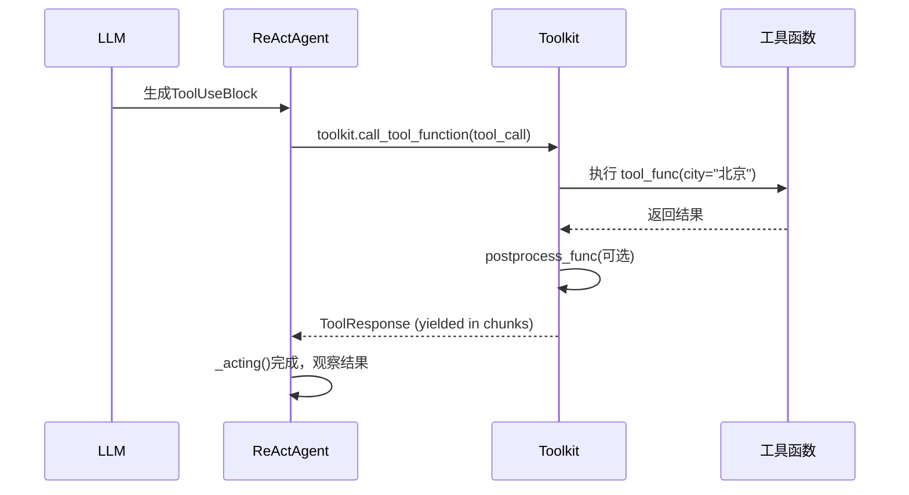

# 第10章 Toolkit工具系统

> **目标**：深入理解AgentScope的Toolkit如何扩展Agent能力

---

## 🎯 学习目标

学完之后，你能：
- 说出Toolkit在AgentScope架构中的定位
- 使用Toolkit注册和管理工具函数
- 为AgentScope贡献新的工具

---

## 🔍 背景问题

**为什么需要Toolkit？**

AgentScope的设计哲学：
- **工具应该是可插拔的**：像USB接口一样，插上就能用
- **Agent不需要知道工具的具体实现**：只管调用
- **框架负责工具的注册、发现、调用**

---

## 📦 架构定位

### 源码入口

| 项目 | 值 |
|------|-----|
| **文件路径** | `src/agentscope/tool/_toolkit.py` |
| **类名** | `Toolkit` |
| **关键方法** | `register_tool_function()`, `call_tool_function()`, `get_json_schemas()` |

### Toolkit在整体架构中的位置

```mermaid
classDiagram
    class ReActAgent {
        +toolkit: Toolkit
    }
    class Toolkit {
        +tools: dict
        +register_tool_function()
        +call_tool_function()
        +get_json_schemas()
    }
    class Toolkit$RegisteredToolFunction {
        +func: Callable
        +schema: dict
    }
    
    ReActAgent --> Toolkit : uses
    Toolkit --> RegisteredToolFunction : manages
```

---

## 🔬 核心源码分析

### 10.1 register_tool_function()

**文件**: `src/agentscope/tool/_toolkit.py:274-303`

```python showLineNumbers
def register_tool_function(
    self,
    tool_func: ToolFunction,
    group_name: str | Literal["basic"] = "basic",
    preset_kwargs: dict[str, JSONSerializableObject] | None = None,
    func_name: str | None = None,
    func_description: str | None = None,
    json_schema: dict | None = None,
    include_long_description: bool = True,
    include_var_positional: bool = False,
    include_var_keyword: bool = False,
    postprocess_func: (
        Callable[[ToolUseBlock, ToolResponse], ToolResponse | None]
        | Callable[[ToolUseBlock, ToolResponse], Awaitable[ToolResponse | None]]
    ) | None = None,
    namesake_strategy: Literal["override", "skip", "raise", "rename"] = "raise",
    async_execution: bool = False,
) -> None:
    """Register a tool function to the toolkit.

    Args:
        tool_func: 工具函数（普通函数或async函数）
        group_name: 工具分组（类似命名空间）
        preset_kwargs: 预设参数（每次调用都注入）
        func_name: 自定义工具名称（默认用函数名）
        func_description: 自定义描述
        json_schema: 自定义参数schema
        include_long_description: 是否包含长描述
        include_var_positional: 是否包含*args参数
        include_var_keyword: 是否包含**kwargs参数
        postprocess_func: 结果后处理函数
        namesake_strategy: 同名冲突策略
        async_execution: 是否异步执行
    """
```

### 10.2 call_tool_function() 方法

**文件**: `src/agentscope/tool/_toolkit.py:853-1033`

```python showLineNumbers
async def call_tool_function(
    self,
    tool_call: ToolUseBlock,
) -> AsyncGenerator[ToolResponse, None]:
    """Execute the tool function by the ToolUseBlock.

    Args:
        tool_call: A tool call block containing name, id, and input

    Yields:
        ToolResponse: 工具响应（流式返回）
    """
    # 1. 查找工具
    if tool_call["name"] not in self.tools:
        return _object_wrapper(ToolResponse(
            content=[TextBlock(type="text",
                text=f"FunctionNotFoundError: {tool_call['name']}")]
        ), None)

    tool_func = self.tools[tool_call["name"]]

    # 2. 检查工具组是否激活
    if tool_func.group != "basic" and not self.groups[tool_func.group].active:
        return _object_wrapper(ToolResponse(
            content=[TextBlock(type="text",
                text=f"FunctionInactiveError: {tool_call['name']}")]
        ), None)

    # 3. 准备参数（合并 preset_kwargs 和调用参数）
    kwargs = {
        **tool_func.preset_kwargs,
        **(tool_call.get("input", {}) or {}),
    }

    # 4. 执行工具（支持同步/异步/生成器）
    # ... (完整实现见源码 970-1033 行)
```

**关键点**：
- 方法签名是 `call_tool_function(self, tool_call: ToolUseBlock)`，不是 `call()`
- 参数是 `ToolUseBlock`（包含 name, id, input），不是独立的 `tool_name` 和 `arguments`
- 返回值是 `AsyncGenerator[ToolResponse, None]`（异步生成器，流式响应）
- ReActAgent 内部调用示例：

```python
# ReActAgent._acting() 中的调用
msg_reasoning = await self._reasoning(tool_choice)
for tool_call in msg_reasoning.get_content_blocks("tool_use"):
    tool_res = await self.toolkit.call_tool_function(tool_call)
```

### 10.3 工具调用流程图



---

## 🚀 先跑起来

### 注册工具函数

```python showLineNumbers
from agentscope.tool import Toolkit, ToolResponse
from agentscope.message import TextBlock

# 创建Toolkit
toolkit = Toolkit()

# 注册工具函数
def get_weather(city: str) -> str:
    """获取城市天气
    
    Args:
        city: 城市名称，如"北京"、"上海"
    
    Returns:
        天气信息字符串
    """
    weather_db = {
        "北京": "晴，25°C",
        "上海": "多云，28°C",
    }
    return weather_db.get(city, "暂不支持该城市")

toolkit.register_tool_function(
    get_weather,
    group_name="weather",
    func_description="获取指定城市的天气信息"
)

# 使用
agent = ReActAgent(name="助手", toolkit=toolkit, ...)
```

### 获取工具Schema（供LLM使用）

```python showLineNumbers
# 获取所有工具的schema（用于告诉LLM有哪些工具可用）
schemas = toolkit.get_tool_schemas()

# 返回格式类似：
# [{
#     "name": "get_weather",
#     "description": "获取城市天气",
#     "parameters": {
#         "type": "object",
#         "properties": {
#             "city": {"type": "string"}
#         }
#     }
# }]
```

---

## ⚠️ 工程经验与坑

### ⚠️ 工具函数的参数必须可序列化

```python
# ❌ 错误：返回不可序列化的对象
def bad_tool():
    return {"data": some_custom_object}

# ✅ 正确：返回可序列化的值
def good_tool():
    return "字符串结果"
    # 或
    return {"status": "ok", "data": "value"}
```

### ⚠️ 异步工具需要设置async_execution=True

```python
# 异步工具
async def async_weather(city: str) -> str:
    result = await external_api.get_weather(city)
    return result

toolkit.register_tool_function(
    async_weather,
    group_name="weather",
    async_execution=True  # 必须设置为True
)
```

---

## 🔧 Contributor指南

### 适合新手修改的文件

| 文件 | 原因 |
|------|------|
| `src/agentscope/tool/_toolkit.py` | 核心实现 |
| `src/agentscope/tool/_response.py` | ToolResponse定义 |

### 危险的修改区域

**⚠️ 警告**：

1. **`call()`方法的工具查找逻辑**（第274-303行）
   - 错误修改可能导致工具调用失败
   - 注意处理工具不存在的情况

2. **`get_tool_schemas()`的schema生成**（第304+行）
   - LLM依赖这个schema来决定调用哪个工具
   - schema格式错误会导致LLM无法正确调用

---

## 💡 Java开发者注意

| Python Toolkit | Java | 说明 |
|---------------|------|------|
| `register_tool_function()` | `@Bean` + `ApplicationContext` | 注册组件 |
| `toolkit.call_tool_function(tool_call)` | `bean.method(args)` | 方法调用 |
| `group_name` | `@Qualifier` | 区分同名Bean |
| `async_execution` | `CompletableFuture` | 异步执行 |

**Java的SPI机制更复杂**，Python的register更直接：
```java
// Java SPI
ServiceLoader.load(MyInterface.class)
    .forEach(provider -> registry.register(provider));
```

---

## 🎯 思考题

<details>
<summary>1. 为什么工具函数的docstring很重要？</summary>

**答案**：
- **LLM靠它理解何时调用**：description会传给LLM
- **参数描述帮助LLM正确传参**：docstring中的Args会生成schema
- **源码位置**（`_toolkit.py:304+`）：docstring被解析为工具描述

```python
def get_weather(city: str) -> str:
    """获取城市天气  # ← 这个会作为工具描述
    
    Args:
        city: 城市名称  # ← 这个帮助LLM理解参数
    """
```
</details>

<details>
<summary>2. group_name有什么用？</summary>

**答案**：
- **工具分组**：类似命名空间，避免命名冲突
- **动态启用/禁用**：可以通过`reset_equipped_tools`控制
- **组织结构**：大型项目中很有用

```python
toolkit.register_tool_function(search_tool, group_name="search")
toolkit.register_tool_function(weather_tool, group_name="weather")

# 重置为只有search组
toolkit.reset_equipped_tools(["search"])
```
</details>

<details>
<summary>3. preset_kwargs和普通参数有什么区别？</summary>

**答案**：
- **preset_kwargs**：每次调用都自动注入，不需要LLM提供
- **普通参数**：LLM需要在调用时提供

```python
# preset_kwargs示例：用户ID自动注入
def send_message(to: str, content: str) -> str:
    return f"发送给{to}: {content}"

toolkit.register_tool_function(
    send_message,
    preset_kwargs={"from": "system"}  # 自动注入，LLM不需要知道
)
# 调用时只需提供 to 和 content
```
</details>

---

★ **Insight** ─────────────────────────────────────
- **Toolkit = 工具注册中心**，通过register_tool_function()注册
- **工具函数 = Agent的能力扩展**，像USB接口一样可插拔
- **group_name = 工具分组**，避免命名冲突
- **schema = LLM的"工具说明书"**，告诉LLM有哪些工具可用
─────────────────────────────────────────────────
