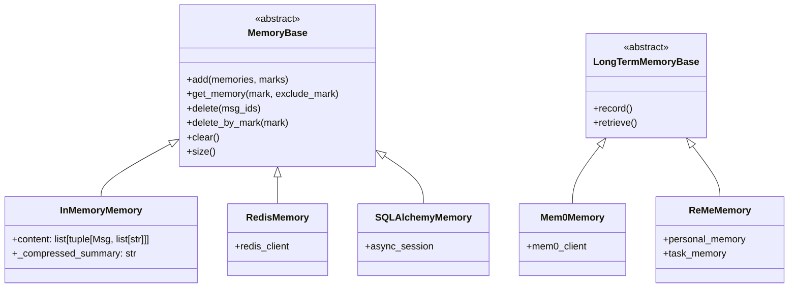
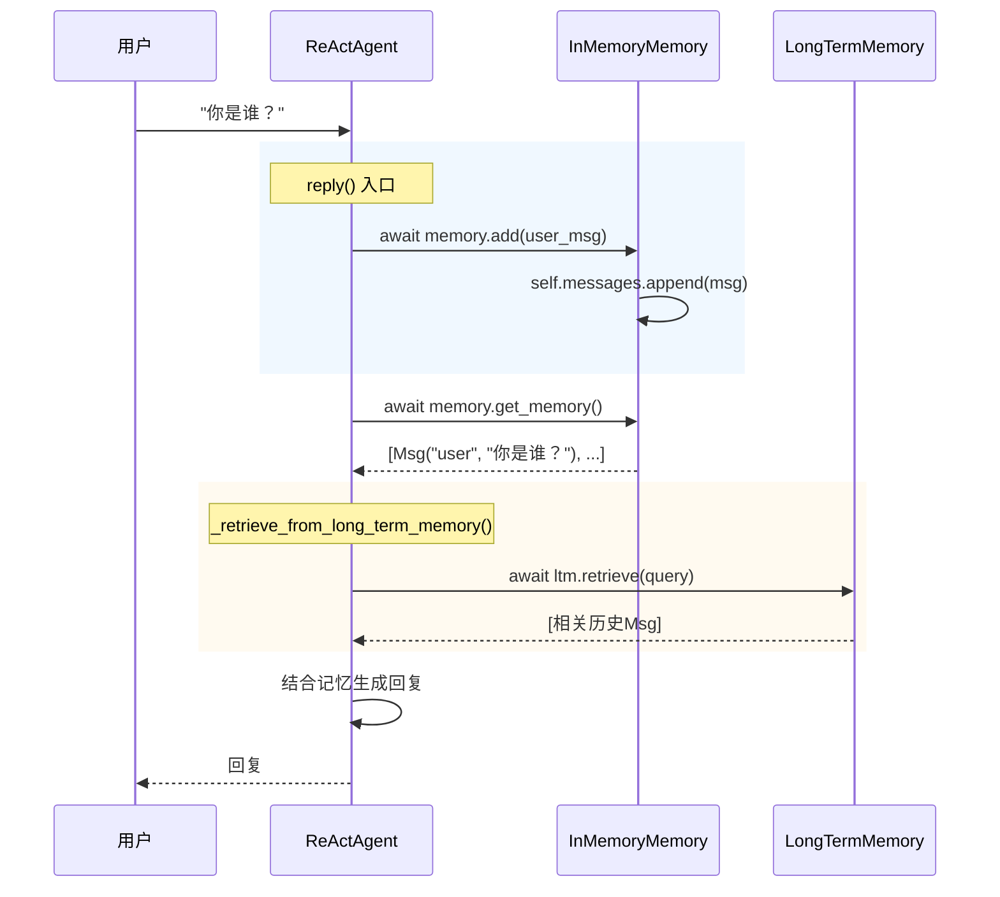

# 第11章 Memory记忆系统

> **目标**：深入理解AgentScope的Memory如何为Agent提供持久化上下文

---

## 🎯 学习目标

学完之后，你能：
- 说出Memory在AgentScope架构中的定位
- 使用不同Memory实现（InMemory、Redis、SQL）
- 理解长期记忆（LongTermMemory）和RAG机制

---

## 🔍 背景问题

**为什么需要Memory？**

AgentScope的ReActAgent是无状态的——每次调用`agent.reply()`都是独立的。如果要实现多轮对话，Agent需要：

1. **记住之前的对话内容** → Memory存储
2. **从大量历史中检索相关信息** → LongTermMemory + RAG

---

## 📦 架构定位

### 源码入口

| 项目 | 值 |
|------|-----|
| **Memory基类** | `src/agentscope/memory/_working_memory/_base.py` |
| **InMemoryMemory** | `src/agentscope/memory/_working_memory/_in_memory_memory.py` |
| **LongTermMemory** | `src/agentscope/memory/_long_term_memory/` |

### Memory类型结构



---

## 🔬 核心源码分析

### 11.1 MemoryBase接口

**文件**: `src/agentscope/memory/_working_memory/_base.py`

```python showLineNumbers
class MemoryBase(ABC):
    """The base class for working memory in AgentScope."""

    @abstractmethod
    async def add(
        self,
        msg: Msg | list[Msg] | None,
        marks: tuple | None = None,
    ) -> None:
        """Add message(s) to memory."""
        raise NotImplementedError

    @abstractmethod
    async def get_memory(
        self,
        recent_n: int | None = None,
        filter_mark: str | None = None,
    ) -> list[Msg]:
        """Get memory messages."""
        raise NotImplementedError

    @abstractmethod
    async def retrieve(
        self,
        query: str,
        top_k: int = 5,
    ) -> list[Msg]:
        """Retrieve relevant messages."""
        raise NotImplementedError
```

### 11.2 InMemoryMemory

**文件**: `src/agentscope/memory/_working_memory/_in_memory_memory.py`

```python showLineNumbers
class InMemoryMemory(MemoryBase):
    """In-memory list based working memory."""

    def __init__(self) -> None:
        self.messages: list[Msg] = []

    async def add(
        self,
        msg: Msg | list[Msg] | None = None,
        marks: tuple | None = None,
    ) -> None:
        if msg is None:
            return
        if not isinstance(msg, list):
            msg = [msg]
        self.messages.extend(msg)

    async def get_memory(
        self,
        recent_n: int | None = None,
        filter_mark: str | None = None,
    ) -> list[Msg]:
        result = self.messages
        if recent_n is not None:
            result = result[-recent_n:]
        return result

    async def retrieve(
        self,
        query: str,
        top_k: int = 5,
    ) -> list[Msg]:
        # 简单实现：基于关键词匹配
        return [msg for msg in self.messages if query.lower() in str(msg.content).lower()][:top_k]
```

### 11.3 Memory工作流程



---

## 🚀 先跑起来

### 基本使用

```python showLineNumbers
from agentscope.memory import InMemoryMemory
from agentscope.message import Msg

# 创建记忆
memory = InMemoryMemory()

# 添加消息（add是async方法，需要await）
await memory.add(Msg(name="user", content="我叫张三", role="user"))
await memory.add(Msg(name="assistant", content="你好，张三！", role="assistant"))

# 查询全部记忆
all_memory = await memory.get_memory()

# 检索相关记忆
relevant = await memory.retrieve("名字")
```

### 配合Agent使用

```python showLineNumbers
from agentscope.agent import ReActAgent
from agentscope.memory import InMemoryMemory
from agentscope.message import Msg

# 创建带记忆的Agent
memory = InMemoryMemory()
agent = ReActAgent(
    name="助手",
    memory=memory,  # 传入memory
    ...
)

# 多轮对话（需要传入Msg对象）
await agent(Msg(name="user", content="我叫张三", role="user"))  # 第一轮
await agent(Msg(name="user", content="我叫什么？", role="user"))  # 第二轮 - Agent记得"张三"
```

---

## ⚠️ 工程经验与坑

### ⚠️ Memory和LongTermMemory的区别

| 类型 | 用途 | 时效性 |
|------|------|--------|
| **Memory（工作记忆）** | 当前对话上下文 | 短期 |
| **LongTermMemory（长期记忆）** | 夸对话持久化 | 长期 |

### ⚠️ retrieve()的实现差异

```python
# InMemoryMemory的retrieve：简单关键词匹配
# LongTermMemory的retrieve：可能用向量相似度
relevant = await long_term_memory.retrieve("张三")
```

---

## 🔧 Contributor指南

### 适合新手修改的文件

| 文件 | 原因 |
|------|------|
| `src/agentscope/memory/_working_memory/_in_memory_memory.py` | 实现简单 |
| `src/agentscope/memory/_working_memory/_base.py` | 基类接口清晰 |

### 危险的修改区域

**⚠️ 警告**：

1. **Memory的消息顺序**：`add()`顺序决定`get_memory()`返回顺序
   - 错误修改可能导致对话历史错乱

2. **InMemoryMemory不是线程安全的**
   - 多线程环境下可能需要加锁

---

## 💡 Java开发者注意

| Python Memory | Java | 说明 |
|---------------|------|------|
| `memory.add(msg)` | `session.setAttribute()` | 存储 |
| `memory.get_memory()` | `session.getAttribute()` | 获取 |
| `memory.retrieve(query)` | 无直接对应 | 搜索 |

**Java更笨重**，Python的Memory设计更贴近LLM的工作方式。

---

## 🎯 思考题

<details>
<summary>1. 为什么InMemoryMemory的retrieve是简单关键词匹配？</summary>

**答案**：
- **InMemoryMemory是基础实现**，用于简单场景
- **复杂的语义检索**由LongTermMemory提供
- 如果需要向量检索，使用`Mem0Memory`或`ReMeMemory`

**源码位置**：`src/agentscope/memory/_working_memory/_in_memory_memory.py`
</details>

<details>
<summary>2. LongTermMemory和普通Memory有什么区别？</summary>

**答案**：
- **普通Memory**：存储当前对话的消息列表
- **LongTermMemory**：夸对话、夸会话的持久化存储
- **RAG机制**：LongTermMemory通常基于向量数据库实现语义检索

```python
# 普通Memory - 当前对话
agent = ReActAgent(memory=InMemoryMemory(), ...)

# LongTermMemory - 持久化 + 检索
agent = ReActAgent(
    memory=InMemoryMemory(),
    long_term_memory=Mem0Memory(),  # 额外配置
    ...
)
```
</details>

<details>
<summary>3. Memory在ReActAgent中是怎么被使用的？</summary>

**答案**：
- **reply()入口**（第396行）：`await self.memory.add(msg)`
- **Formatter.format()**（第437行）：`prompt = await self.formatter.format(memory=self.memory, ...)`
- **LongTermMemory检索**：第400行

```python
# ReActAgent.reply()源码流程
async def reply(self, msg, ...):
    await self.memory.add(msg)  # 存储用户消息
    await self._retrieve_from_long_term_memory(msg)  # 检索长期记忆
    # ...
    msg_reasoning = await self._reasoning(tool_choice)  # _reasoning内部用formatter.format(memory=...)
```
</details>

---

★ **Insight** ─────────────────────────────────────
- **Memory = 工作记忆**，存储当前对话上下文
- **LongTermMemory = 长期记忆**，跨对话持久化
- **Memory.add()**存储，**get_memory()**读取，**retrieve()**检索
- **ReActAgent.reply()**中，memory.add() → formatter.format() → LLM调用
─────────────────────────────────────────────────
