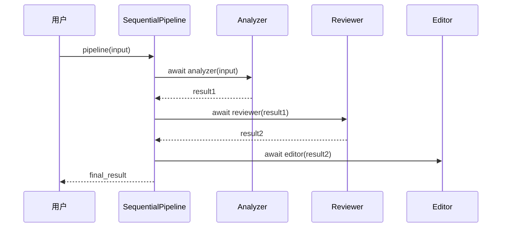
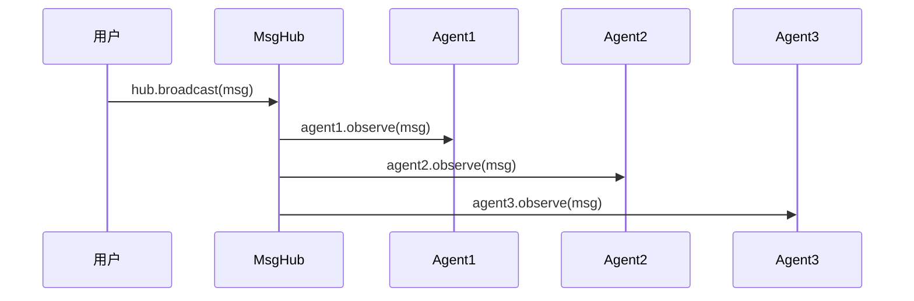

# 第12章 多Agent协作模式

> **目标**：深入理解多Agent系统设计和编排机制

---

## 🎯 学习目标

学完之后，你能：
- 说出多Agent在AgentScope架构中的定位
- 设计多Agent系统架构
- 使用Pipeline和MsgHub编排Agent

---

## 🔍 背景问题

**为什么需要多Agent协作？**

单Agent的局限性：
- **专业化不足**：一个Agent难以精通所有领域
- **可扩展性差**：复杂任务难以分解
- **并发受限**：无法并行处理

多Agent的优势：
- **专业分工**：每个Agent专注特定任务
- **横向扩展**：增加Agent即可处理更多任务
- **并发处理**：多个Agent可以并行工作

---

## 📦 架构定位

### 源码入口

| 项目 | 值 |
|------|-----|
| **Pipeline** | `src/agentscope/pipeline/_class.py` |
| **MsgHub** | `src/agentscope/pipeline/_msghub.py` |

### 多Agent协作模式

| 模式 | 适用场景 | 源码实现 |
|------|----------|----------|
| 流水线 | 有依赖的任务链 | `SequentialPipeline` |
| 广播 | 独立并行任务 | `MsgHub` |
| 分层 | 先路由再分发合并 | `SequentialPipeline`+`FanoutPipeline` |

---

## 🔬 核心协作模式

### 12.1 流水线模式



### 12.2 广播模式



---

## 🚀 先跑起来

### 流水线模式

```python showLineNumbers
from agentscope.pipeline import SequentialPipeline
from agentscope.agent import ReActAgent
from agentscope.message import Msg

# 创建专业化Agent
analyzer = ReActAgent(name="Analyzer", ...)
reviewer = ReActAgent(name="Reviewer", ...)
editor = ReActAgent(name="Editor", ...)

# 流水线：分析→审核→编辑
pipeline = SequentialPipeline([
    analyzer,
    reviewer,
    editor
])

result = await pipeline(Msg(name="user", content="写一篇文章", role="user"))
```

### 广播模式

```python showLineNumbers
from agentscope.pipeline import MsgHub
from agentscope.message import Msg

# 多个Agent参与同一个话题
async with MsgHub(participants=[agent1, agent2, agent3]) as hub:
    # 广播消息
    await hub.broadcast(Msg(
        name="System",
        content="请各位发表意见",
        role="system"
    ))

    # 每个Agent独立回复（如果enable_auto_broadcast=True）
    # 需要传入Msg对象，不能只传字符串
    r1 = await agent1(Msg(name="user", content="支持观点A", role="user"))
    r2 = await agent2(Msg(name="user", content="支持观点B", role="user"))
```

---

## ⚠️ 工程经验

### ⚠️ 模式选择

| 场景 | 推荐模式 |
|------|----------|
| A的输出是B的输入 | SequentialPipeline |
| 多个Agent同时处理同一任务 | MsgHub |
| 先分类再处理 | FanoutPipeline + SequentialPipeline |

### ⚠️ 组合使用

```python
# 复杂场景：先广播分发，再流水线处理
async with MsgHub(participants=[a1, a2]) as hub:
    await hub.broadcast(topic)
    
# 或嵌套Pipeline
complex = SequentialPipeline([
    FanoutPipeline(agents=[a1, a2]),
    aggregator
])
```

---

## 🔧 Contributor指南

### 适合新手修改的文件

| 文件 | 原因 |
|------|------|
| `src/agentscope/pipeline/_class.py` | Pipeline实现简单 |
| `src/agentscope/pipeline/_msghub.py` | MsgHub逻辑清晰 |

### 危险的修改区域

**⚠️ 警告**：

1. **MsgHub的auto_broadcast**（`_msghub.py:89-93`）
   - 开启时可能导致消息风暴
   - 复杂场景建议关闭

2. **Pipeline的消息传递顺序**（`_class.py`）
   - 每个Agent的输出作为下一个Agent的输入
   - 类型不匹配会出错

---

## 💡 Java开发者注意

| Python AgentScope | Java | 说明 |
|-------------------|------|------|
| `SequentialPipeline` | `Stream.reduce()` | 顺序处理 |
| `FanoutPipeline` | `ExecutorService.invokeAll()` | 并行分发 |
| `MsgHub` | Akka ActorSystem | 广播消息 |
| `hub.broadcast()` | `actor.tell()` | 发送消息 |

**关键区别**：
- Python是async/await，Java是Future/CompletableFuture
- Python基于协程，Java基于线程

---

## 🎯 思考题

<details>
<summary>1. 什么时候用SequentialPipeline而不是MsgHub？</summary>

**答案**：
- **有依赖关系时**：A的输出是B的输入
- **顺序执行**：任务必须按步骤执行
- **结果聚合**：需要逐步处理得到最终结果

**示例**：写作流水线（起草→审核→修改→发布）
</details>

<details>
<summary>2. MsgHub的enable_auto_broadcast=True可能导致什么问题？</summary>

**答案**：
- **消息风暴**：每个Agent回复都广播给其他所有Agent
- **无限循环**：Agent可能基于收到的消息再次回复
- **复杂度爆炸**：N个Agent，消息数O(N²)

**建议**：复杂场景用`enable_auto_broadcast=False`，手动控制何时广播
</details>

<details>
<summary>3. 多Agent系统如何调试？</summary>

**答案**：
- **开启日志**：`logging_level="DEBUG"`
- **使用Tracing**：`from agentscope.tracing import trace`
- **分步执行**：先单独测试每个Agent
- **检查消息**：在broadcast前后打印消息内容

```python
import logging
logging.basicConfig(level=logging.DEBUG)

# 或使用agentscope内置
agentscope.init(logging_level="DEBUG")
```
</details>

---

★ **Insight** ─────────────────────────────────────
- **SequentialPipeline** = 有序依赖，上一个输出是下一个输入
- **FanoutPipeline** = 并行分发，相同输入给多个Agent
- **MsgHub** = 广播消息，松耦合通信
- **模式可以组合**：复杂系统需要多种模式配合
─────────────────────────────────────────────────
