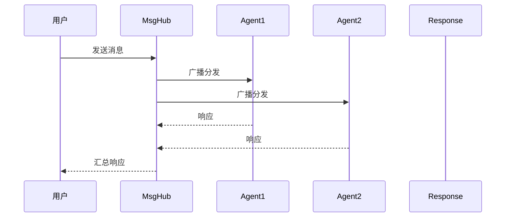

# 第13章 消息追踪与调试

> **目标**：掌握多Agent系统的调试技巧

---

## 🎯 学习目标

学完之后，你能：
- 追踪消息在系统中的流动
- 可视化Agent交互
- 调试多Agent问题
- 性能分析与优化

---

## 🔍 追踪工具

### 消息流追踪

```python showLineNumbers
from agentscope.tracing import trace

# 追踪整个流程
async with trace("multi_agent_process"):
    result = await multi_agent_pipeline(input)
    # 打印完整的消息流
```

### 可视化



---

## 💡 Java开发者注意

追踪类似Java的日志框架：

```python
# Python trace
async with trace("process"):
    result = await agent(msg)
```

```java
// Java logging
try (Tracer tracer = Tracer.start("process")) {
    Object result = agent.process(msg);
}
```

---

## 🎯 思考题

<details>
<summary>点击查看答案</summary>

1. **什么情况下需要追踪？**
   - 多Agent交互复杂时
   - 消息丢失或顺序错乱
   - 性能问题排查

2. **trace和print有什么区别？**
   - trace记录结构化数据，可查询
   - print只能看文本
   - trace可记录时间、调用栈

</details>

★ **Insight** ─────────────────────────────────────
- **追踪** = 看清消息在系统中的完整旅程
- **trace** = 记录每个节点的输入输出
- **可视化** = 更容易发现瓶颈和问题
─────────────────────────────────────────────────
