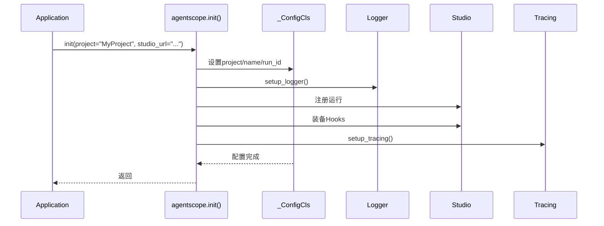

# 第14章 初始化与配置

> **目标**：理解AgentScope的初始化机制和配置管理

---

## 🎯 学习目标

学完之后，你能：
- 理解`agentscope.init()`的作用
- 配置项目名称和运行ID
- 设置日志和追踪
- 连接AgentScope Studio

---

## 🔍 背景问题

**为什么需要初始化？**

AgentScope使用全局配置管理：
- **统一的项目标识**：让Studio能识别同一个项目的多次运行
- **日志配置**：统一管理日志输出
- **追踪集成**：连接OpenTelemetry追踪后端
- **Studio连接**：与AgentScope Studio配合使用

---

## 📦 架构定位

### 源码入口

| 项目 | 值 |
|------|-----|
| **初始化函数** | `src/agentscope/__init__.py:55-113` |
| **配置类** | `src/agentscope/_run_config.py` |
| **全局配置** | `_config`变量 |

### 核心配置项

```python
# 源码：src/agentscope/__init__.py:55-113
def init(
    project: str | None = None,      # 项目名称
    name: str | None = None,         # 运行名称
    run_id: str | None = None,       # 运行ID
    logging_path: str | None = None,  # 日志文件路径
    logging_level: str = "INFO",      # 日志级别
    studio_url: str | None = None,   # Studio地址
    tracing_url: str | None = None,  # 追踪后端地址
) -> None:
```

---

## 🔬 核心源码分析

### 14.1 _ConfigCls 配置类

**文件**: `src/agentscope/_run_config.py`

```python showLineNumbers
class _ConfigCls:
    """Global configuration for AgentScope."""

    def __init__(
        self,
        run_id: ContextVar[str],
        project: ContextVar[str],
        name: ContextVar[str],
        created_at: ContextVar[str],
        trace_enabled: ContextVar[bool],
    ) -> None:
        self.run_id = run_id
        self.project = project
        self.name = name
        self.created_at = created_at
        self.trace_enabled = trace_enabled
```

**关键点**：使用`ContextVar`实现线程/协程安全的全局配置

### 14.2 init() 函数

**文件**: `src/agentscope/__init__.py:55-113`

```python showLineNumbers
def init(
    project: str | None = None,
    name: str | None = None,
    run_id: str | None = None,
    logging_path: str | None = None,
    logging_level: str = "INFO",
    studio_url: str | None = None,
    tracing_url: str | None = None,
) -> None:
    """Initialize the agentscope library."""
    # 1. 设置项目配置
    if project:
        _config.project = project

    if name:
        _config.name = name

    if run_id:
        _config.run_id = run_id

    # 2. 设置日志
    setup_logger(logging_level, logging_path)

    # 3. 连接Studio（如需要）
    if studio_url:
        # 注册到Studio
        data = {
            "id": _config.run_id,
            "project": _config.project,
            "name": _config.name,
            ...
        }
        requests.post(f"{studio_url}/trpc/registerRun", json=data)

        # 装备Studio hooks
        _equip_as_studio_hooks(studio_url)

    # 4. 设置追踪（如需要）
    if tracing_url:
        from .tracing import setup_tracing
        setup_tracing(endpoint=tracing_url)
        _config.trace_enabled = True
```

### 14.3 配置流程图



---

## 🚀 先跑起来

### 基本初始化

```python showLineNumbers
import agentscope

# 最简初始化
agentscope.init()

# 完整初始化
agentscope.init(
    project="我的聊天机器人",
    name="测试运行",
    run_id="run-001",
    logging_level="DEBUG",
    logging_path="./logs/agent.log"
)
```

### 连接Studio

```python showLineNumbers
import agentscope

agentscope.init(
    project="生产环境",
    studio_url="http://studio.example.com:5000",
    logging_level="INFO"
)
```

### 设置追踪

```python showLineNumbers
import agentscope

agentscope.init(
    project="我的项目",
    # 追踪到Langfuse
    tracing_url="https://cloud.langfuse.com/public/...",
    # 或追踪到Arize-Phoenix
    # tracing_url="http://phoenix:6006/v1/traces"
)
```

---

## ⚠️ 工程经验与坑

### ⚠️ ContextVar的线程安全

```python
# _config使用ContextVar，线程/协程安全
# 但不能跨线程/协程传递（每个线程有独立值）

async def task():
    # 这个run_id只在这个协程内可见
    _config.run_id = "task-1"
    await agent()
```

### ⚠️ init()只能调用一次

```python
# ❌ 错误：多次调用init()
agentscope.init(project="A")
agentscope.init(project="B")  # 可能覆盖之前的配置

# ✅ 正确：只初始化一次
agentscope.init(project="MyProject")
# 后续代码直接使用_config
```

---

## 🔧 Contributor指南

### 适合新手修改的文件

| 文件 | 原因 |
|------|------|
| `src/agentscope/_run_config.py` | 配置类简单 |
| `src/agentscope/_logging.py` | 日志设置清晰 |

### 危险的修改区域

**⚠️ 警告**：

1. **ContextVar的正确使用**
   - `_config`的每个字段都是`ContextVar`
   - 赋值要用`_config.project.set(value)`而不是`_config.project = value`

2. **`init()`的副作用**
   - 设置全局日志
   - 注册Studio钩子
   - 启动追踪

---

## 💡 Java开发者注意

| Python AgentScope | Java | 说明 |
|-------------------|------|------|
| `agentscope.init()` | `ApplicationContext` | 初始化 |
| `_config` (ContextVar) | `ThreadLocal<>` | 线程安全配置 |
| `studio_url` | Actuator端点 | 监控管理 |
| `tracing_url` | OpenTelemetry | 链路追踪 |

**ContextVar vs ThreadLocal**：
- ContextVar是Python 3.7+的协程安全变量
- 每个协程可以有不同的值
- 比ThreadLocal更适合async代码

---

## 🎯 思考题

<details>
<summary>1. 为什么AgentScope使用ContextVar而不是普通全局变量？</summary>

**答案**：
- **协程安全**：ContextVar在async代码中可以有不同的值
- **线程安全**：每个线程/协程独立
- **嵌套调用**：嵌套的协程可以覆盖配置而不影响外层

```python
async def outer():
    _config.project = "outer"  # 只在这个协程内有效
    await inner()

async def inner():
    _config.project = "inner"  # 独立的值
    print(_config.project)  # "inner"
```

**源码位置**：`src/agentscope/_run_config.py`
</details>

<details>
<summary>2. init()和直接创建Agent有什么区别？</summary>

**答案**：
- **init()**：设置全局配置（日志、追踪、Studio）
- **创建Agent**：创建具体的Agent实例
- init()可以不调用，但日志和追踪不会自动配置

```python
# 没有init() - 使用默认配置
agent = ReActAgent(...)  # 可以工作，但没有日志文件

# 有init() - 配置日志和追踪
agentscope.init(logging_path="./app.log", tracing_url="...")
agent = ReActAgent(...)  # 日志会写入文件，追踪会发送
```
</details>

<details>
<summary>3. Studio和Tracing有什么区别？</summary>

**答案**：
- **Studio**：Web界面，实时查看运行状态，调试交互
- **Tracing**：链路追踪，分析性能瓶颈，离线查看
- 两者可以同时启用

| 功能 | Studio | Tracing |
|------|--------|---------|
| 实时监控 | ✓ | ✗ |
| 链路追踪 | ✗ | ✓ |
| Web界面 | ✓ | ✗ |
| 离线分析 | ✗ | ✓ |
</details>

---

★ **Insight** ─────────────────────────────────────
- **`agentscope.init()` = 全局初始化**，配置日志、追踪、Studio
- **`_ConfigCls` = ContextVar配置**，协程安全的全局状态
- **ContextVar > 普通全局变量**，在async环境中不会串值
- **init()设置全局Logger和Tracing**，后续Agent自动使用
─────────────────────────────────────────────────
