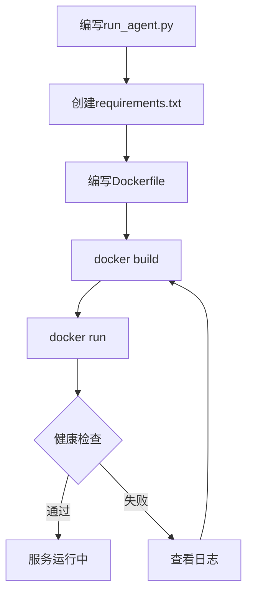

# 第15章 Docker部署

> **目标**：掌握AgentScope服务的容器化部署

---

## 🎯 学习目标

学完之后，你能：
- 创建Agent服务的Docker镜像
- 编写docker-compose配置
- 管理环境变量和敏感信息
- 实现健康检查

---

## 🔍 背景问题

**为什么需要Docker部署？**

直接运行Python脚本的局限性：
- **环境依赖**：需要手动安装Python和依赖
- **跨平台问题**：Windows/Linux/macOS行为可能不同
- **扩展困难**：难以水平扩展

Docker解决的问题：
- **环境一致**：镜像包含所有依赖
- **跨平台运行**：任何有Docker的系统都能跑
- **易于扩展**：容器编排平台轻松管理

---

## 📦 架构定位

### AgentScope部署架构

```
┌─────────────────────────────────────────────────────────────┐
│                      Docker Host                           │
│                                                             │
│   ┌─────────────────────────────────────────────────┐    │
│   │              Docker Container                    │    │
│   │                                                  │    │
│   │   ┌─────────────────────────────────────────┐  │    │
│   │   │         Quart HTTP Server               │  │    │
│   │   │                                          │  │    │
│   │   │   @app.route("/chat")                   │  │    │
│   │   │   async def chat():                      │  │    │
│   │   │       await agent(...)                  │  │    │
│   │   └─────────────────────────────────────────┘  │    │
│   │                                                  │    │
│   └─────────────────────────────────────────────────┘    │
│                                                             │
└─────────────────────────────────────────────────────────────┘
```

### 源码入口

| 项目 | 说明 |
|------|------|
| **Quart框架** | HTTP服务框架（不是AgentScope自带的） |
| **部署示例** | `examples/agent/react_agent/` |

---

## 🔬 核心组件

### 15.1 Quart HTTP服务

AgentScope本身不包含HTTP服务器，但推荐使用Quart（async版本的Flask）：

```python showLineNumbers
# run_agent.py
from quart import Quart, request
from agentscope.agent import ReActAgent
from agentscope.model import OpenAIChatModel

app = Quart(__name__)

# 创建Agent
agent = ReActAgent(
    name="Assistant",
    model=OpenAIChatModel(api_key="...", model="gpt-4"),
    sys_prompt="你是一个友好的助手。"
)

@app.route("/chat", methods=["POST"])
async def chat():
    data = await request.get_json()
    user_input = data.get("user_input", "")
    response = await agent(user_input)
    return {"content": response.content}

if __name__ == "__main__":
    app.run(host="0.0.0.0", port=5000)
```

### 15.2 Dockerfile

```dockerfile showLineNumbers
# Dockerfile
FROM python:3.10-slim

WORKDIR /app

# 安装依赖（Quart是async web框架）
COPY requirements.txt .
RUN pip install -r requirements.txt

# 复制应用代码
COPY run_agent.py .

# 使用gunicorn运行（生产环境推荐）
RUN pip install gunicorn
CMD ["gunicorn", "-k", "uvicorn.workers.UvicornWorker", "-b", "0.0.0.0:5000", "run_agent:app"]
```

### 15.3 部署流程图



---

## 🚀 先跑起来

### 项目结构

```
my-agent/
├── run_agent.py        # 应用代码
├── requirements.txt    # Python依赖
└── Dockerfile          # Docker配置
```

### requirements.txt

```
agentscope[full]
quart
gunicorn
uvicorn
```

### 完整Dockerfile

```dockerfile showLineNumbers
FROM python:3.10-slim

WORKDIR /app

# 安装系统依赖
RUN apt-get update && apt-get install -y --no-install-recommends \
    curl \
    && rm -rf /var/lib/apt/lists/*

# 复制依赖文件
COPY requirements.txt .

# 安装Python依赖
RUN pip install --no-cache-dir -r requirements.txt

# 复制应用代码
COPY . .

# 健康检查
HEALTHCHECK --interval=30s --timeout=10s --start-period=5s --retries=3 \
    CMD curl -f http://localhost:5000/health || exit 1

# 启动命令（使用gunicorn生产服务器）
CMD ["gunicorn", "-k", "uvicorn.workers.UvicornWorker", "-b", "0.0.0.0:5000", "run_agent:app"]
```

### docker-compose

```yaml showLineNumbers
version: '3.8'

services:
  agentscope:
    build: .
    ports:
      - "5000:5000"
    environment:
      - OPENAI_API_KEY=${OPENAI_API_KEY}
      - LOGGING_LEVEL=INFO
    restart: unless-stopped
    healthcheck:
      test: ["CMD", "curl", "-f", "http://localhost:5000/health"]
      interval: 30s
      timeout: 10s
      retries: 3
```

### 添加健康检查端点

```python showLineNumbers
# run_agent.py 中添加
@app.route("/health", methods=["GET"])
async def health():
    return {"status": "healthy"}
```

### 构建和运行

```bash showLineNumbers
# 构建镜像
docker build -t my-agent:latest .

# 运行容器
docker run -d \
    -p 5000:5000 \
    -e OPENAI_API_KEY="sk-xxx" \
    --name my-agent \
    my-agent:latest

# 查看日志
docker logs -f my-agent

# 测试
curl -X POST http://localhost:5000/chat \
    -H "Content-Type: application/json" \
    -d '{"user_input": "你好"}'
```

---

## ⚠️ 工程经验与坑

### ⚠️ API密钥管理

```bash
# ❌ 错误：密钥写在docker-compose中
environment:
  - OPENAI_API_KEY="sk-xxx"  # 暴露！

# ✅ 正确：使用.env文件或密钥管理服务
# .env文件（不要提交到git！）
OPENAI_API_KEY=sk-xxx

# docker-compose.yml
env_file:
  - .env
```

### ⚠️ 生产环境用gunicorn

```bash
# ❌ 开发环境：直接运行
python run_agent.py

# ✅ 生产环境：使用gunicorn
gunicorn -k uvicorn.workers.UvicornWorker -b 0.0.0.0:5000 run_agent:app
```

### ⚠️ 多阶段构建减小镜像

```dockerfile showLineNumbers
# 多阶段构建
FROM python:3.10-slim AS builder

WORKDIR /app
COPY requirements.txt .
RUN pip install --user -r requirements.txt

# 运行时阶段
FROM python:3.10-slim

WORKDIR /app
COPY --from=builder /root/.local /root/.local
COPY . .

ENV PATH=/root/.local:$PATH

CMD ["gunicorn", "-k", "uvicorn.workers.UvicornWorker", "-b", "0.0.0.0:5000", "run_agent:app"]
```

---

## 🔧 Contributor指南

### 适合新手参考的示例

| 示例 | 说明 |
|------|------|
| `examples/agent/react_agent/` | Agent部署基础示例 |
| Quart官方文档 | async HTTP服务 |

### Docker调试技巧

```bash
# 进入容器调试
docker exec -it my-agent /bin/bash

# 查看环境变量
docker exec my-agent env

# 复制文件出来
docker cp my-agent:/app/logs ./local_logs
```

---

## 💡 Java开发者注意

| Docker概念 | Java对应 | 说明 |
|-----------|----------|------|
| Dockerfile | Maven/Gradle | 构建配置 |
| Image | JAR/WAR | 打包产物 |
| Container | JVM进程 | 运行实例 |
| docker-compose | Spring profiles | 多环境配置 |
| ENV变量 | System.getenv() | 运行时配置 |
| HEALTHCHECK | Actuator health | 健康检查 |

**类比总结**：
- Dockerfile = pom.xml + 基础镜像配置
- `docker build` = `mvn package`
- `docker run` = `java -jar app.jar`
- docker-compose = Spring profiles + docker-compose

---

## 🎯 思考题

<details>
<summary>1. 为什么生产环境用gunicorn而不是直接运行Python？</summary>

**答案**：
- **多worker**：gunicorn可以启动多个worker处理并发请求
- **进程管理**：自动管理worker进程，崩溃时重启
- **性能优化**：更好的worker管理，比直接`app.run()`更稳定

```bash
# 单进程（开发用）
python run_agent.py

# 多worker（生产用）
gunicorn -w 4 -k uvicorn.workers.UvicornWorker run_agent:app
# -w 4 = 4个worker进程
```
</details>

<details>
<summary>2. 为什么API密钥不应该写在docker-compose.yml中？</summary>

**答案**：
- **安全问题**：代码可能提交到git仓库，密钥泄露
- **不同环境**：测试环境和生产环境密钥不同
- **密钥轮换**：需要能独立更新密钥而不重新构建镜像

**正确做法**：
```bash
# .env文件（不在git中）
OPENAI_API_KEY=sk-xxx

# docker-compose.yml
env_file:
  - .env
```
</details>

<details>
<summary>3. Docker和虚拟机的区别是什么？</summary>

**答案**：
- **启动速度**：容器秒级，虚拟机分钟级
- **资源占用**：容器共享内核更轻量，虚拟机完整OS
- **隔离性**：虚拟机更强，容器共享宿主机内核

| 特性 | Docker容器 | 虚拟机 |
|------|-----------|--------|
| 启动速度 | 秒级 | 分钟级 |
| 资源占用 | 几十MB | 完整OS |
| 隔离性 | 进程级 | 完整硬件 |
| 性能开销 | ~2-3% | ~5-10% |
</details>

---

★ **Insight** ─────────────────────────────────────
- **Quart + AgentScope = HTTP服务化Agent**，让Agent可以被HTTP调用
- **Docker = 标准化部署**，一处构建到处运行
- **gunicorn = 生产级进程管理**，多worker并发
- **env_file = 密钥管理最佳实践**，不把密钥写进代码
─────────────────────────────────────────────────
