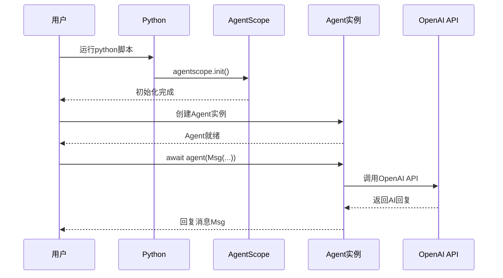

# 1-1 环境搭建 so easy

> **目标**：20分钟内完成所有环境准备，跑起你的第一个Agent

---

## 学习目标

学完之后，你能：
- 安装Python和pip
- 安装AgentScope库
- 配置好IDE（VSCode/PyCharm）
- 运行第一个简单的Agent代码

---

## 背景问题

**为什么需要环境搭建？**

开发Agent需要：
1. Python运行时（执行代码）
2. AgentScope库（框架）
3. IDE（编写代码）
4. API Key（调用LLM）

**与Java对比**:
| 步骤 | Python | Java |
|------|--------|------|
| 安装运行时 | Python | JDK |
| 包管理 | pip | Maven/Gradle |
| 依赖声明 | `pip install` | pom.xml/build.gradle |
| IDE | VSCode/PyCharm | IntelliJ IDEA |

---

## 源码入口

**项目结构**:
```
agentscope/
├── src/agentscope/     # 核心源码
├── examples/            # 示例代码
├── tests/              # 测试用例
├── docs/               # 文档
└── teaching/           # 教程
```

**关键入口文件**:
- `src/agentscope/__init__.py` - 包初始化
- `src/agentscope/agent/__init__.py` - Agent入口
- `src/agentscope/message/__init__.py` - Msg入口

---

## 架构定位

### AgentScope在AI开发中的位置

```
┌─────────────────────────────────────────────────────────────┐
│                    AI应用开发层级                              │
│                                                             │
│  ┌─────────────────────────────────────────────────────┐  │
│  │              应用层 (你的业务代码)                     │  │
│  │         agent = ReActAgent(...)                     │  │
│  └─────────────────────────────────────────────────────┘  │
│                          │                                 │
│  ┌─────────────────────────────────────────────────────┐  │
│  │         AgentScope框架层 (协调、路由、记忆)           │  │
│  │    Pipeline / MsgHub / Memory / Formatter           │  │
│  └─────────────────────────────────────────────────────┘  │
│                          │                                 │
│  ┌─────────────────────────────────────────────────────┐  │
│  │              模型层 (OpenAI/Claude/...)             │  │
│  │           ChatModel / RealtimeModel                 │  │
│  └─────────────────────────────────────────────────────┘  │
└─────────────────────────────────────────────────────────────┘
```

### 环境搭建的作用

环境搭建是Level 2"能运行项目"的基础：

| Level | 目标 | 本章内容 |
|-------|------|---------|
| Level 1 | 知道项目干什么 | 看README/文档 |
| Level 2 | 能运行项目 | **环境搭建** ← 本文 |
| Level 3 | 理解模块边界 | 后续章节 |
| Level 4 | 理解数据流 | 后续章节 |

### 安装后的目录结构

```
your_project/
├── 01_hello_agent.py      # 你的第一个Agent
├── .env                   # API密钥（不要提交！）
└── venv/                 # Python虚拟环境（可选）

site-packages/agentscope/
├── __init__.py           # agentscope.init()
├── agent/                # ReActAgent, UserAgent
├── message/              # Msg, TextBlock
├── model/                # OpenAIChatModel
├── pipeline/             # Pipeline, MsgHub
└── memory/              # Memory实现
```

---

## 核心源码分析

### agentscope.init() 的作用

```python
# src/agentscope/__init__.py:150-180 (简化)

def init(
    project: str = "DefaultProject",
    name: str = "DefaultAgent",
    **kwargs,
) -> None:
    """初始化AgentScope全局配置"""
    # 1. 设置项目名称（用于AgentScope Studio追踪）
    global _config
    _config.project_name = project
    _config.agent_name = name
    
    # 2. 初始化日志系统
    _init_logging(project)
    
    # 3. 初始化追踪系统（如果配置了）
    if _config.enable_tracing:
        _init_tracing(project)
```

**关键点**：
- `init()`是**全局单次初始化**，类似Spring Boot的`ApplicationRunner`
- 项目名称用于AgentScope Studio区分不同项目
- 不调用`init()`也可以运行，但追踪和日志会使用默认值

### 第一个Agent的创建流程

```python
# ReActAgent创建过程中的关键调用

class ReActAgent(AgentBase):
    def __init__(
        self,
        name: str,
        model: ChatModelBase,
        sys_prompt: str = "You are a helpful assistant.",
        **kwargs,
    ):
        # 1. 调用父类初始化
        super().__init__(name=name, sys_prompt=sys_prompt)
        
        # 2. 保存模型引用
        self.model = model
        
        # 3. 创建默认的Formatter（如果没提供）
        if "formatter" not in kwargs:
            self.formatter = self._create_default_formatter()
        
        # 4. 创建内存管理器
        self.memory = self._create_default_memory()
```

### async/await 异步调用链

```python
# 异步调用的完整链

async def main():
    # 用户调用
    response = await agent(Msg(...))
    #          ↑
    #          │
    #          agent.__call__(msg)
    #          │
    #          ├── agent.reply()
    #          │       ├── memory.get_history()
    #          │       ├── formatter.format()
    #          │       ├── model.invoke()
    #          │       └── memory.add(response)
    #          │
    #          └── return response

asyncio.run(main())
```

---

## 安装步骤

### Step 1：安装Python

**Windows用户**：
1. 打开 https://www.python.org/downloads/
2. 下载Python 3.10或更高版本
3. 运行安装程序
4. **记得勾选** "Add Python to PATH"

**macOS用户**：
```bash
brew install python3
```

**Linux用户**：
```bash
# Ubuntu/Debian
sudo apt update
sudo apt install python3 python3-pip
```

**验证安装**：
```bash
python3 --version
# 应该显示 Python 3.10.x 或更高
```

### Step 2：安装AgentScope

```bash
# 标准安装
pip install agentscope

# 国内镜像（更快）
pip install agentscope -i https://mirrors.aliyun.com/pypi/simple/
```

**验证安装**：
```python
import agentscope
print(agentscope.__version__)
```

### Step 3：配置IDE

**推荐VSCode**（免费轻量）：
1. 下载 https://code.visualstudio.com/
2. 安装Python扩展：
   - 按 `Ctrl+P`（Mac: `Cmd+P`）
   - 输入 `ext install python`
   - 安装Microsoft的Python扩展

**推荐PyCharm**（功能强大）：
1. 下载 https://www.jetbrains.com/pycharm/
2. Community版免费足够用
3. 新建项目时选择Python解释器

### Step 4：你的第一个Agent

```python showLineNumbers
# 01_hello_agent.py
import agentscope
from agentscope.agent import ReActAgent
from agentscope.message import Msg
from agentscope.model import OpenAIChatModel

# 1. 初始化 - 就像Spring的@PostConstruct
agentscope.init(
    project="HelloAgent",
    name="MyFirstAgent"
)

# 2. 创建Agent
agent = ReActAgent(
    name="Alice",
    model=OpenAIChatModel(
        api_key="your-api-key",
        model="gpt-4"
    ),
    sys_prompt="你是一个友好的AI助手。"
)

# 3. 运行Agent
import asyncio

async def main():
    response = await agent(Msg(
        name="user",
        content="你好！请介绍一下你自己。",
        role="user"
    ))
    print(f"Agent回复: {response.content}")

asyncio.run(main())
```

---

## 可视化结构

### 代码执行流程



### Java开发者对比

| Python | Java | 说明 |
|--------|------|------|
| `pip install` | Maven/Gradle | 依赖管理 |
| `import agentscope` | `import com.xxx` | 导入包 |
| `agentscope.init()` | `@PostConstruct` | 初始化 |
| `await agent()` | `CompletableFuture` | 异步调用 |
| `api_key="..."` | `@Value("${api.key}")` | 配置注入 |

---

## 工程经验

### pip安装失败的常见问题

**问题1：pip不是内部或外部命令**
```
原因：Python没加入PATH环境变量
解决：重新安装Python，勾选"Add Python to PATH"
```

**问题2：安装慢（国内）**
```bash
# 使用国内镜像
pip install agentscope -i https://mirrors.aliyun.com/pypi/simple/

# 永久配置
pip config set global.index-url https://mirrors.aliyun.com/pypi/simple/
```

**问题3：SSL证书错误**
```bash
# 方案1：配置国内镜像
# 方案2：安装证书
# 方案3：临时跳过验证（不推荐）
pip install --trusted-host pypi.org agentscope
```

### API Key安全配置

**原则**：
- 代码中不要硬编码API Key
- 使用环境变量
- 生产环境用密钥管理服务

```python
# ✅ 正确：从环境变量读取
import os
api_key = os.environ.get("OPENAI_API_KEY")
model = OpenAIChatModel(api_key=api_key, model="gpt-4")

# ❌ 错误：硬编码
model = OpenAIChatModel(api_key="sk-xxxx", model="gpt-4")
```

**生产环境建议**：
```bash
# .env 文件（不要提交到git！）
OPENAI_API_KEY=sk-xxxx
```

```python
# 代码中
from dotenv import load_dotenv
load_dotenv()  # 加载.env文件
api_key = os.environ.get("OPENAI_API_KEY")
```

### Python版本兼容性

**AgentScope要求**：Python 3.10+

```bash
# 检查版本
python3 --version

# 如果版本过低
# macOS: brew install python3
# Windows: 下载新版本安装
# Ubuntu: sudo apt update && sudo apt upgrade python3
```

---

## Contributor指南

### 适合新手修改的文件

| 文件 | 原因 |
|------|------|
| `examples/agent/` | 示例代码，学习如何创建Agent |
| `tests/basic_test.py` | 基础测试，理解测试结构 |
| `README.md` | 文档改进 |

### 环境问题排查

**常见问题速查**：

| 问题 | 解决方案 |
|------|----------|
| `pip: command not found` | 使用`python3 -m pip` |
| `SSL certificate verify failed` | 配置国内镜像或安装证书 |
| `ModuleNotFoundError` | `pip install`对应包 |
| `Permission denied` | 使用`--user`或`sudo` |

**验证安装**：
```bash
python3 -c "
import agentscope
print('Version:', agentscope.__version__)
from agentscope.agent import ReActAgent
print('ReActAgent imported successfully')
"
```

### IDE配置建议

**VSCode推荐配置**（`.vscode/settings.json`）：
```json
{
    "python.linting.enabled": true,
    "python.linting.pylintEnabled": true,
    "python.formatting.provider": "black",
    "python.analysis.typeCheckingMode": "basic"
}
```

**PyCharm推荐配置**：
1. Settings → Project → Python Interpreter → 确保是3.10+
2. Settings → Editor → Code Style → Python → 设置4空格缩进
3. 安装Python插件

---

## 思考题

<details>
<summary>点击查看答案</summary>

1. **为什么需要`agentscope.init()`？**
   - 它初始化了全局配置、日志系统、追踪系统
   - 类似于Spring的`ApplicationRunner`或`@PostConstruct`
   - 确保在使用Agent之前，所有基础设施都已就绪

2. **`await`和Java的`CompletableFuture`有什么相似？**
   - `await agent()` 等待异步结果，类似 `future.get()`
   - 但`await`是语法糖，更简洁；`get()`会阻塞线程
   - Python的`asyncio`类似Java的`CompletableFuture`

3. **为什么API Key要放在环境变量而不是代码里？**
   - 安全：代码可能被提交到Git，Key泄露
   - 环境隔离：开发环境、测试环境、生产环境用不同的Key
   - 配置管理：不需要改代码就能切换环境

</details>
