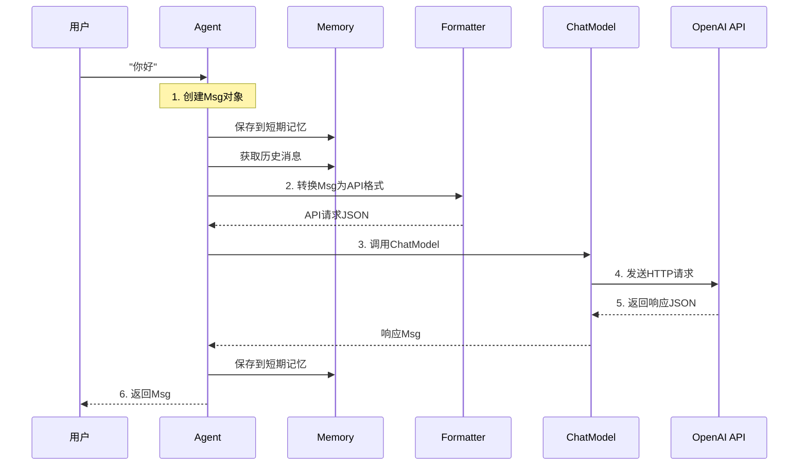

# 1-2 追踪"你好"的旅程

> **目标**：理解从用户输入"你好"到Agent回复的完整流程

---

## 学习目标

学完之后，你能：
- 画出Agent处理请求的完整流程图
- 理解Agent/Model/Formatter/Memory的关系
- 说出每一步数据是怎么传递的
- 理解async/await在Agent调用中的作用

---

## 背景问题

**为什么需要追踪"你好"的旅程？**

理解完整调用链才能：
- 调试问题（知道在哪一步出错）
- 优化性能（知道哪一步最慢）
- 扩展功能（知道在哪插入自定义逻辑）

**核心组件协作**：
```
用户 ──► Msg ──► Agent ──► Formatter ──► Model ──► API
                │                              │
                └──► Memory（存储历史）◄────────┘
```

---

## 源码入口

**涉及的核心模块**：

| 模块 | 文件路径 | 职责 |
|------|---------|------|
| `Msg` | `src/agentscope/message/_message_base.py` | 消息载体 |
| `Agent` | `src/agentscope/agent/_react_agent.py` | Agent实现 |
| `Formatter` | `src/agentscope/formatter/` | 格式转换 |
| `Model` | `src/agentscope/model/_openai_model.py` | OpenAI模型 |
| `Memory` | `src/agentscope/memory/` | 记忆存储 |

**关键类和方法**：
```python
# Agent调用入口
await agent(msg: Msg) -> Msg

# Model调用
await model(prompt: list[Msg]) -> Msg

# Formatter转换
formatter.format(messages: list[Msg]) -> dict
```

---

## 架构定位

### Agent在系统中的位置

```
┌─────────────────────────────────────────────────────────────┐
│                      用户层                                  │
│                  "你好" → Msg                              │
└──────────────────────────┬──────────────────────────────────┘
                           ▼
┌─────────────────────────────────────────────────────────────┐
│                    Agent层（协调者）                        │
│  ┌────────────────────────────────────────────────────┐  │
│  │  1. 接收Msg  2. 保存Memory  3. 调用Formatter       │  │
│  │  4. 调用Model  5. 返回Msg                          │  │
│  └────────────────────────────────────────────────────┘  │
└──────────────────────────┬──────────────────────────────────┘
                           ▼
┌─────────────────────────────────────────────────────────────┐
│                    Formatter层                             │
│              Msg → API格式 → Model调用                    │
└──────────────────────────┬──────────────────────────────────┘
                           ▼
┌─────────────────────────────────────────────────────────────┐
│                     Model层                                │
│              API格式 → HTTP请求 → API响应                 │
└──────────────────────────┬──────────────────────────────────┘
                           ▼
┌─────────────────────────────────────────────────────────────┐
│                    远程LLM API                              │
└─────────────────────────────────────────────────────────────┘
```

### Agent的协作关系

| 组件 | 与Agent的关系 | 数据流向 |
|------|-------------|---------|
| Memory | Agent的记忆库 | Agent写入/读取 |
| Formatter | Agent的翻译器 | Agent → Formatter → Model |
| Model | Agent的大脑 | Formatter → Model → Formatter |
| MsgHub | Agent的广播站 | Agent → MsgHub → 其他Agent |

### Agent的生命周期

```
创建Agent → 设置model/memory/formatter → 运行agent(msg) → 循环处理
                                              ↑
                                         reply()方法
                                         ├── Memory.get()      获取历史
                                         ├── Formatter.format()  格式化
                                         ├── Model.invoke()     调用LLM
                                         ├── Formatter.parse()   解析响应
                                         └── Memory.add()       保存记忆
```

### 为什么需要这些组件协同？

```
用户: "计算 2+2"
    │
    ▼
Agent收到Msg
    │
    ├── 需要知道"之前聊过什么" → Memory.get_history()
    ├── 需要把Msg转成API格式 → Formatter.format()
    ├── 需要调用LLM得到回复 → Model.invoke()
    └── 需要保存这次对话   → Memory.add()

所有组件缺一不可，共同完成一次完整的Agent调用。
```

---

## 核心源码分析

### 调用链1: Agent的__call__方法

```python
# 源码位置: src/agentscope/agent/_react_agent.py

async def __call__(self, msg: Msg | None) -> Msg:
    # 1. 如果有输入，保存到记忆
    if msg is not None:
        self.memory.add(msg)

    # 2. 获取历史消息
    history = self.memory.get()

    # 3. 调用model
    response = await self.model(
        prompt=history,  # 注意：这里是history，不是msg
        ...
    )

    # 4. 保存回复到记忆
    self.memory.add(response)

    return response
```

### 调用链2: Formatter转换

```python
# 源码位置: src/agentscope/formatter/_openai.py

class OpenAIChatFormatter:
    def format(self, messages: list[Msg]) -> dict:
        """将Msg列表转换为OpenAI API格式"""
        return {
            "model": self.model_name,
            "messages": [
                {"role": msg.role, "content": msg.content}
                for msg in messages
            ]
        }
```

### 调用链3: Model调用

```python
# 源码位置: src/agentscope/model/_openai_model.py (推测)

class OpenAIChatModel:
    async def __call__(self, prompt: list[Msg], **kwargs) -> Msg:
        # 1. 格式化
        formatted = self.formatter.format(prompt)

        # 2. 调用API
        response = await self._call_api(formatted)

        # 3. 解析响应
        return self.formatter.parse(response)
```

---

## 可视化结构

### 完整调用时序图



### 组件关系图

```
┌─────────────────────────────────────────────────────────────┐
│                        用户输入                             │
│                         "你好"                              │
└──────────────────────────┬──────────────────────────────────┘
                           ▼
┌─────────────────────────────────────────────────────────────┐
│                      Agent（协调者）                         │
│  ┌──────────────────────────────────────────────────────┐  │
│  │ 1. 创建Msg  2. 保存Memory  3. 调用Model  4. 返回Msg   │  │
│  └──────────────────────────────────────────────────────┘  │
└──────────────────────────┬──────────────────────────────────┘
                           ▼
┌─────────────────────────────────────────────────────────────┐
│                    Formatter（格式转换）                     │
│         Msg ───────────────────────────► API JSON          │
└──────────────────────────┬──────────────────────────────────┘
                           ▼
┌─────────────────────────────────────────────────────────────┐
│                    ChatModel（模型接口）                     │
│         API JSON ───────────────────────────► 响应JSON     │
└──────────────────────────┬──────────────────────────────────┘
                           ▼
┌─────────────────────────────────────────────────────────────┐
│                   OpenAI API（远程服务）                     │
└──────────────────────────┬──────────────────────────────────┘
                           ▼
                     返回回复给用户
```

### Java开发者对比

| AgentScope | Java | 说明 |
|------------|------|------|
| Agent | Controller | 接收请求，协调处理 |
| Formatter | ObjectMapper | 格式转换 |
| ChatModel | HTTP Client | 远程调用 |
| Memory | Session/Redis | 存储状态 |
| Msg | POJO/DTO | 数据传输对象 |

---

## 工程经验

### 设计原因

**为什么Msg需要name/content/role？**

- `name`：标识发送者
- `content`：消息内容
- `role`：区分用户/助手/系统，模型需要知道谁说什么

**为什么Formatter在Model内部？**

不同API（OpenAI/Claude）格式不同。Formatter封装在Model内部，外部调用方式保持一致。

**为什么Memory是必须的？**

多轮对话需要历史消息。Agent每次调用都获取完整历史，确保理解上下文。

### API调用失败的处理

```python
# 常见错误
# openai.AuthenticationError: Incorrect API key provided
# httpx.ConnectTimeout: Connection timeout
# openai.RateLimitError: You exceeded your quota

async def call_with_retry(agent, msg, max_retries=3):
    for i in range(max_retries):
        try:
            return await agent(msg)
        except Exception as e:
            if i == max_retries - 1:
                raise
            print(f"尝试 {i+1} 失败: {e}")
            await asyncio.sleep(2 ** i)  # 指数退避
```

### 异步代码的常见陷阱

```python
# ❌ 错误：忘记await
async def main():
    response = agent(Msg(...))  # 没有await！
    print(response.content)  # 不会打印

# ✅ 正确：使用await
async def main():
    response = await agent(Msg(...))
    print(response.content)
```

---

## Contributor指南

### 适合新手修改的文件

| 文件 | 原因 |
|------|------|
| `src/agentscope/agent/__init__.py` | Agent导出，了解Agent类型 |
| `src/agentscope/message/__init__.py` | Msg定义，理解消息结构 |
| `examples/agent/` | 示例代码，学习Agent用法 |

### 追踪调试方法

**1. 开启调试日志**：
```python
import logging
logging.basicConfig(level=logging.DEBUG)
```

**2. 查看源码调用链**：
```python
# 在关键位置加打印
async def main():
    print(">>> 调用agent前")
    response = await agent(msg)
    print("<<< agent返回:", response.content)
```

**3. 追踪Formatter转换**：
```python
class DebugFormatter(OpenAIChatFormatter):
    def format(self, messages):
        print(">>> Format输入:", messages)
        result = super().format(messages)
        print("<<< Format输出:", result)
        return result
```

### 扩展练习

**练习1：添加日志**：
```python
import logging
logging.basicConfig(level=logging.INFO)
```

**练习2：修改Formatter**：
```python
# 位置：src/agentscope/formatter/formatting.py
```

**练习3：添加新组件**：
```python
# 参考 src/agentscope/agent/_react_agent.py 中的组件集成方式
```

---

## 思考题

<details>
<summary>点击查看答案</summary>

1. **为什么需要Formatter而不是直接发Msg？**
   - 不同API（OpenAI/Claude）接受的格式不同
   - Formatter像适配器，屏蔽底层差异
   - 让Agent代码不用改，就能切换模型

2. **如果API返回错误，Agent会怎么处理？**
   - ChatModel会抛出异常
   - Agent的try-catch会捕获
   - 可能重试，或者返回错误信息给用户

3. **Memory在这里起什么作用？**
   - 保存对话历史（短期记忆）
   - 让Agent知道之前聊过什么
   - 类比Java的HttpSession

</details>
