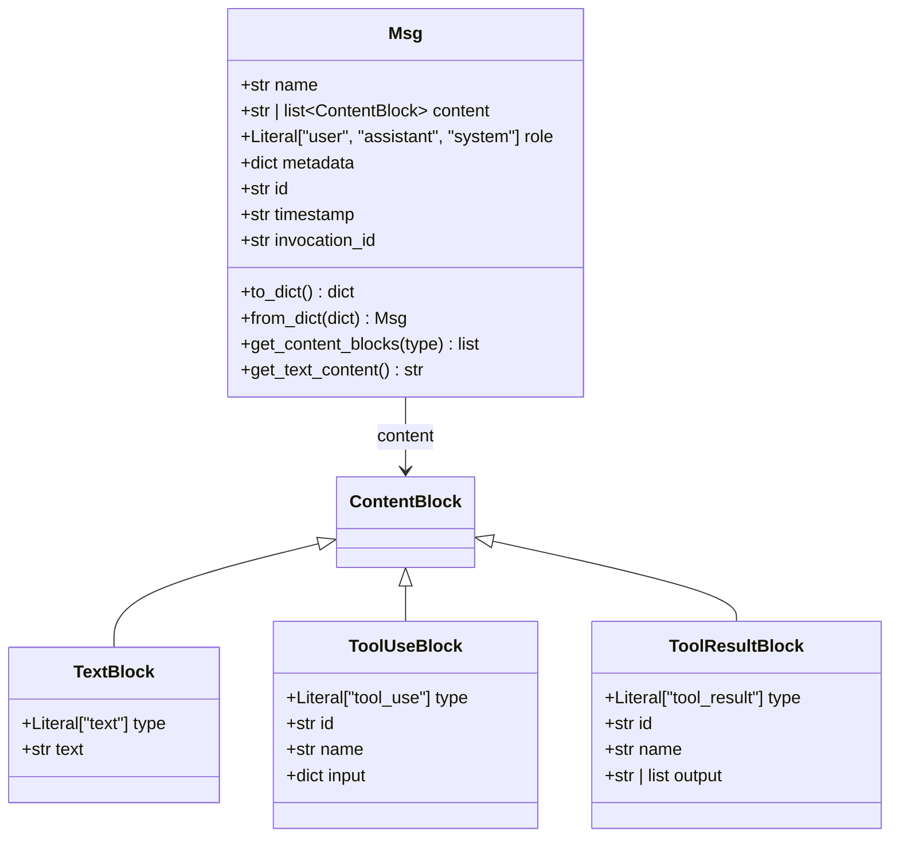
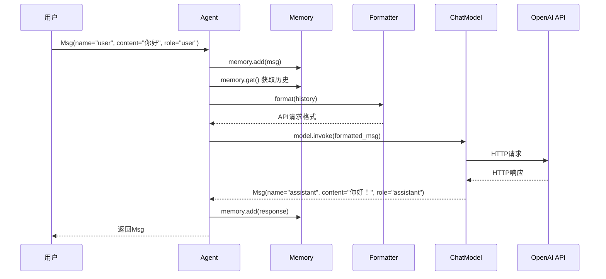

# 2-1 Msg是什么

> **目标**：理解AgentScope中消息的核心数据结构Msg

---

## 学习目标

学完之后，你能：
- 理解Msg的三个核心属性（name/content/role）
- 创建Msg对象并进行序列化/反序列化
- 使用TextBlock等ContentBlock构建复杂消息
- 说出Msg在AgentScope中的地位

---

## 背景问题

**为什么需要Msg？**

在AgentScope中，Agent、Model、Formatter、Toolkit、Memory这些组件需要互相通信。如果每个组件都用自己的格式，数据转换会非常复杂。

Msg就是AgentScope的"通用货币"——所有组件之间用它交流。就像HTTP请求/响应对象在Java Web中的地位，Msg是AgentScope的数据载体。

---

## 源码入口

**文件路径**: `src/agentscope/message/_message_base.py`

**核心类**: `Msg`

**构造方法签名**:
```python
class Msg:
    def __init__(
        self,
        name: str,
        content: str | Sequence[ContentBlock],
        role: Literal["user", "assistant", "system"],
        metadata: dict[str, JSONSerializableObject] | None = None,
        timestamp: str | None = None,
        invocation_id: str | None = None,
    ) -> None:
```

**导出路径**: `src/agentscope/message/__init__.py`
```python
from ._message_base import Msg
__all__ = [..., "Msg"]
```

**使用入口**:
```python
from agentscope.message import Msg
msg = Msg(name="user", content="你好", role="user")
```

---

## 架构定位

**模块职责**: Msg是AgentScope的数据载体，所有组件之间用它交流。

**生命周期**:
1. 用户输入时创建（role="user"）
2. 在Agent中流转
3. Model调用时转换格式
4. Model返回时创建新Msg（role="assistant"）
5. 最终返回给用户

**与其他模块的关系**:
```
用户 ──► Msg ──► Agent ──► Formatter ──► Model ──► API
                  │                              │
                  └──► Memory（存储历史Msg）◄────┘
```

---

## 核心源码分析

### 调用链1: Msg创建到传递

```python
# 用户创建Msg
msg = Msg(name="user", content="你好", role="user")

# Agent接收并保存到Memory
# 源码位置: src/agentscope/agent/_react_agent.py
async def __call__(self, msg: Msg | None) -> Msg:
    # 1. 保存到记忆
    if msg is not None:
        self.memory.add(msg)
    # 2. 获取历史
    history = self.memory.get()
    # 3. 调用model
    response = await self.model(...)
    return response
```

### 调用链2: Msg序列化与反序列化

```python
# 源码位置: src/agentscope/message/_message_base.py

def to_dict(self) -> dict:
    """Convert the message into JSON dict data."""
    return {
        "id": self.id,
        "name": self.name,
        "role": self.role,
        "content": self.content,
        "metadata": self.metadata,
        "timestamp": self.timestamp,
    }

@classmethod
def from_dict(cls, json_data: dict) -> "Msg":
    """Load a message object from the given JSON data."""
    new_obj = cls(
        name=json_data["name"],
        content=json_data["content"],
        role=json_data["role"],
        metadata=json_data.get("metadata", None),
        timestamp=json_data.get("timestamp", None),
        invocation_id=json_data.get("invocation_id", None),
    )
    new_obj.id = json_data.get("id", new_obj.id)
    return new_obj
```

### 调用链3: ContentBlock提取

```python
# 源码位置: src/agentscope/message/_message_base.py

def get_content_blocks(
    self,
    block_type: ContentBlockTypes | List[ContentBlockTypes] | None = None,
) -> Sequence[ContentBlock]:
    """Get the content in block format."""
    blocks = []
    if isinstance(self.content, str):
        blocks.append(TextBlock(type="text", text=self.content))
    else:
        blocks = self.content or []

    if isinstance(block_type, str):
        blocks = [_ for _ in blocks if _["type"] == block_type]
    elif isinstance(block_type, list):
        blocks = [_ for _ in blocks if _["type"] in block_type]

    return blocks
```

### 调用链4: TextBlock定义

```python
# 源码位置: src/agentscope/message/_message_block.py

class TextBlock(TypedDict, total=False):
    """The text block."""
    type: Required[Literal["text"]]
    text: str

class ToolUseBlock(TypedDict, total=False):
    """The tool use block."""
    type: Required[Literal["tool_use"]]
    id: Required[str]
    name: Required[str]
    input: Required[dict[str, object]]

class ToolResultBlock(TypedDict, total=False):
    """The tool result block."""
    type: Required[Literal["tool_result"]]
    id: Required[str]
    output: Required[str | List[TextBlock | ImageBlock | AudioBlock | VideoBlock]]
    name: Required[str]
```

---

## 可视化结构

### Msg数据结构



### Msg生命周期



---

## 工程经验

### 设计原因

**为什么Msg使用TypedDict而不是class？**

TypedDict的优势：
- 运行时类型检查（可用于API响应验证）
- 与JSON Schema天然对应
- 灵活性高，可以轻松添加新字段

**为什么role必须是"user"/"assistant"/"system"？**

这是LLM API的标准格式。OpenAI、Anthropic、Claude等都使用这个role体系。如果自定义role，模型可能无法正确理解。

### 替代方案

**如果需要自定义消息格式**:
```python
# 可以在metadata中添加自定义字段
msg = Msg(
    name="user",
    content="你好",
    role="user",
    metadata={"custom_field": "value"}
)
```

**如果需要支持新ContentBlock类型**:
```python
# 在_message_block.py中添加新类型
class CustomBlock(TypedDict):
    type: Required[Literal["custom"]]
    data: Required[dict]
```

### 可能出现的问题

**问题1: content不能是None**
```python
# ❌ 错误
msg = Msg(name="user", content=None, role="user")

# ✅ 正确：空字符串
msg = Msg(name="user", content="", role="user")

# ✅ 正确：空列表
msg = Msg(name="user", content=[], role="user")
```

**问题2: role值必须正确**
```python
# ❌ 可能不被模型支持
msg = Msg(name="admin", content="命令", role="admin")

# ✅ 正确
msg = Msg(name="user", content="命令", role="user")
```

**问题3: timestamp自动生成**
```python
# 如果不提供timestamp，会自动生成当前时间
msg = Msg(name="user", content="hi", role="user")
print(msg.timestamp)  # 自动生成，如 "2024-01-01 12:00:00.000"
```

---

## Contributor指南

### 适合新手修改的文件

| 文件 | 原因 |
|------|------|
| `src/agentscope/message/_message_base.py` | Msg类定义，结构清晰 |
| `src/agentscope/message/_message_block.py` | ContentBlock类型定义 |

### 危险区域

**Msg的序列化/反序列化逻辑**（`_message_base.py:to_dict/from_dict`）
- 影响网络传输和持久化
- 错误可能导致消息丢失或格式错误

**ContentBlock类型处理**
- 添加新类型需要同步修改Formatter
- 多模态内容的类型判断逻辑复杂

### 调试方法

**打印Msg内容**:
```python
print(f"Msg: name={msg.name}, content={msg.content[:50]}...")
print(repr(msg))  # 完整打印
```

**检查Msg类型**:
```python
print(isinstance(msg.content, str))  # 简单文本？
print(isinstance(msg.content, list))  # ContentBlock列表？
```

**追踪消息流**:
```python
# 在Agent中添加日志
async def __call__(self, msg):
    print(f">>> Agent收到: {msg}")
    result = await self._call_model(msg)
    print(f"<<< Agent返回: {result}")
    return result
```

### 添加新ContentBlock类型的步骤

1. 在`_message_block.py`中定义新类型:
```python
class VideoBlock(TypedDict, total=False):
    type: Required[Literal["video"]]
    source: Required[Base64Source | URLSource]
```

2. 更新`ContentBlock`联合类型

3. 在Formatter中添加处理逻辑

4. 添加测试用例

---

## 思考题

<details>
<summary>点击查看答案</summary>

1. **Msg的三个属性分别代表什么？**
   - name：谁发的
   - content：发什么
   - role：是什么角色

2. **为什么需要role属性？**
   - 区分用户和AI的对话
   - 帮助模型理解上下文
   - 类比戏剧中的不同角色扮演

3. **Msg在系统中的什么地方被创建？**
   - 用户输入时（用户发送第一条消息）
   - Agent回复时（创建assistant的Msg）
   - 初始系统消息（system Msg）

</details>
