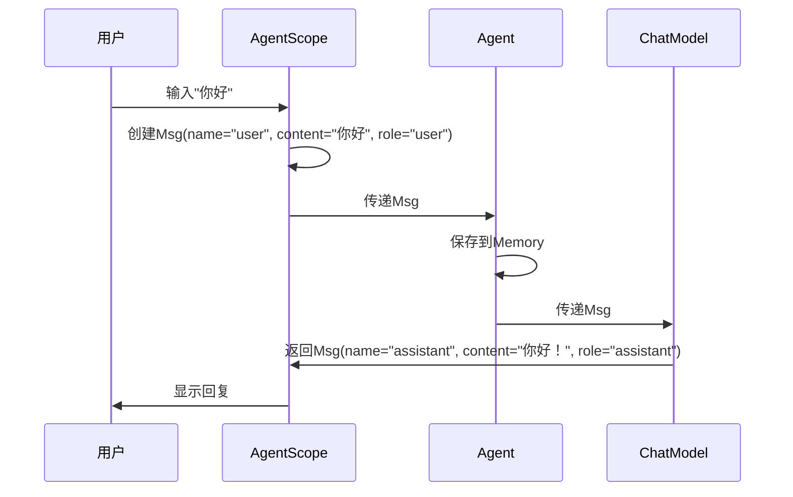

# 2-1 Msg是什么

> **目标**：理解AgentScope中消息的核心数据结构Msg

---

## 🎯 这一章的目标

学完之后，你能：
- 理解Msg的三个核心属性（name/content/role）
- 创建Msg对象
- 说出Msg在AgentScope中的地位

---

## 🚀 先跑起来

```python showLineNumbers
from agentscope.message import Msg

# 创建用户消息
user_msg = Msg(
    name="user",
    content="你好",
    role="user"
)

# 创建助手消息
assistant_msg = Msg(
    name="assistant", 
    content="你好！有什么可以帮助你的吗？",
    role="assistant"
)

# 创建系统消息
system_msg = Msg(
    name="system",
    content="你是一个友好的AI助手",
    role="system"
)

print(user_msg)
# Msg(name='user', content='你好', role='user')
```

---

## 🔍 Msg的三个核心属性

```
┌─────────────────────────────────────────────────────────────┐
│                         Msg                                │
│                                                             │
│  ┌─────────┐  ┌───────────────┐  ┌─────────┐           │
│  │  name   │  │    content    │  │  role   │           │
│  └─────────┘  └───────────────┘  └─────────┘           │
│       │              │                  │                  │
│       ▼              ▼                  ▼                  │
│   "user"       "你好"             "user"                 │
│   "assistant"  "有什么..."        "assistant"             │
│   "system"     "你是..."         "system"               │
└─────────────────────────────────────────────────────────────┘
```

### name - 消息发送者的名字

| name值 | 含义 | 示例 |
|--------|------|------|
| `"user"` | 用户发送的消息 | name="张三" |
| `"assistant"` | AI助手发送的消息 | name="Alice" |
| `"system"` | 系统消息 | name="system" |

### content - 消息内容

```python
# 普通文本
msg1 = Msg(name="user", content="你好")

# 复杂内容 - 可以是结构化的
from agentscope.message import TextBlock
msg2 = Msg(name="user", content=[
    TextBlock(text="这是文本内容"),
])
```

### role - 角色（类似Java的type）

| role值 | 含义 | Java类比 |
|--------|------|----------|
| `"user"` | 用户角色 | 客户端发起请求 |
| `"assistant"` | 助手角色 | 服务端响应 |
| `"system"` | 系统角色 | 配置/元信息 |

---

## 🔍 追踪Msg的流动



---

## 💡 Java开发者注意

Msg就像Java的一个**POJO**：

```python
# Python Msg
Msg(name="user", content="你好", role="user")
```

```java
// Java 等价
public class Msg {
    private String name;
    private String content;
    private String role;
    
    public Msg(String name, String content, String role) {
        this.name = name;
        this.content = content;
        this.role = role;
    }
    
    // getters and setters
}

// 使用
new Msg("user", "你好", "user");
```

---

## 📊 Msg在AgentScope中的地位

```
┌─────────────────────────────────────────────────────────────┐
│                    AgentScope架构                           │
│                                                             │
│    用户 ──► Msg ──► Agent ──► Model ──► API               │
│                     │                                       │
│                     └──► Msg ──► 用户                       │
│                                                             │
│    Msg是数据的载体，在整个系统中流动                           │
└─────────────────────────────────────────────────────────────┘
```

---

## 🎯 思考题

<details>
<summary>点击查看答案</summary>

1. **Msg的三个属性分别代表什么？**
   - name：谁发的
   - content：发什么
   - role：是什么角色

2. **为什么需要role属性？**
   - 区分用户和AI的对话
   - 帮助模型理解上下文
   - 类比戏剧中的不同角色扮演

3. **Msg在系统中的什么地方被创建？**
   - 用户输入时（用户发送第一条消息）
   - Agent回复时（创建assistant的Msg）
   - 初始系统消息（system Msg）

</details>

---

★ **Insight** ─────────────────────────────────────
- **Msg是AgentScope的"通用货币"**，所有组件之间用它交流
- **name**说"谁在说"，**content**说"说什么"，**role**说"是什么角色"
- Msg贯穿整个请求生命周期：创建→传递→处理→返回
─────────────────────────────────────────────────
