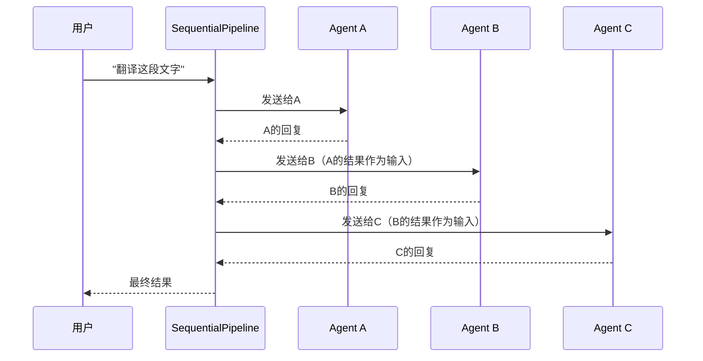
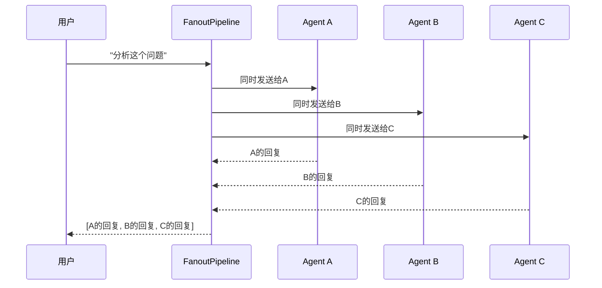

# 2-2 Pipeline是什么

> **目标**：理解Pipeline如何组织和协调多个Agent的工作

---

## 🎯 这一章的目标

学完之后，你能：
- 理解Pipeline的两种模式（Sequential/Fanout）
- 使用SequentialPipeline编排顺序任务
- 使用FanoutPipeline编排并行任务

---

## 🚀 先跑起来

```python showLineNumbers
import agentscope
from agentscope.agent import ReActAgent
from agentscope.pipeline import SequentialPipeline, FanoutPipeline
from agentscope.model import OpenAIChatModel

# 初始化
agentscope.init(project="PipelineDemo")

# 创建多个Agent
preprocessor = ReActAgent(name="Preprocessor", model=..., sys_prompt="...")
analyzer = ReActAgent(name="Analyzer", model=..., sys_prompt="...")
summarizer = ReActAgent(name="Summarizer", model=..., sys_prompt="...")

# SequentialPipeline - 顺序执行
pipeline1 = SequentialPipeline([
    preprocessor,
    analyzer,
    summarizer
])

# FanoutPipeline - 并行执行
pipeline2 = FanoutPipeline([
    preprocessor,
    analyzer,
    summarizer
])
```

---

## 🔍 Pipeline的两种模式

### SequentialPipeline - 流水线（顺序）

```
┌─────────────────────────────────────────────────────────────┐
│                  SequentialPipeline                          │
│                                                             │
│  输入 ──► Agent A ──► Agent B ──► Agent C ──► 输出       │
│                                                             │
│  一个接一个，按顺序执行                                       │
└─────────────────────────────────────────────────────────────┘
```

**适用场景**：
- 预处理 → 分析 → 后处理
- 数据清洗 → 转换 → 存储
- 理解 → 推理 → 回答

**代码示例**：
```python showLineNumbers
# 例子：翻译工作流
pipeline = SequentialPipeline([
    translator,    # 第一步：翻译
    reviewer,     # 第二步：校对
    formatter     # 第三步：格式化
])

result = await pipeline("Hello world")
# translator处理 → reviewer处理 → formatter处理 → 返回
```

### FanoutPipeline - 扇出（并行）

```
┌─────────────────────────────────────────────────────────────┐
│                   FanoutPipeline                            │
│                                                             │
│                    ┌─► Agent B                             │
│  输入 ─────────────┤                                         │
│                    ├─► Agent C                             │
│                    └─► Agent D                             │
│                                                             │
│  一个输入，同时发给多个Agent处理                              │
└─────────────────────────────────────────────────────────────┘
```

**适用场景**：
- 同时问多个专家意见
- 多角度分析问题
- 头脑风暴

**代码示例**：
```python showLineNumbers
# 例子：多专家会诊
pipeline = FanoutPipeline([
    economist,    # 经济专家
    lawyer,      # 法律专家
    tech_expert  # 技术专家
])

result = await pipeline("这个项目值得投资吗？")
# 同时问三个专家，收集所有回复
```

---

## 🔍 追踪Pipeline的执行

### SequentialPipeline执行流程



### FanoutPipeline执行流程



---

## 🔬 关键代码段解析

### 代码段1：Pipeline创建 —— 为什么用列表？

```python showLineNumbers
# 这是第32-37行
pipeline1 = SequentialPipeline([
    preprocessor,   # 第一步Agent
    analyzer,        # 第二步Agent
    summarizer       # 第三步Agent
])
```

**思路说明**：

| 问题 | 答案 |
|------|------|
| 为什么要用列表？ | 把多个Agent组织成一组，按顺序/并行执行 |
| 为什么叫"Pipeline"？ | 类似工厂流水线，原材料进去，产品出来 |
| Agent的顺序重要吗？ | SequentialPipeline重要，FanoutPipeline不重要 |

**💡 设计思想**：Pipeline把多个Agent组织起来工作。就像Java的`Stream`链式调用，数据依次流过每个处理环节。

---

### 代码段2：数据如何传递？

```python showLineNumbers
# SequentialPipeline 的数据流
result = await pipeline("Hello world")

# 内部发生了什么：
# 1. "Hello world" → preprocessor → 输出A
# 2. 输出A → analyzer → 输出B
# 3. 输出B → summarizer → 最终输出
```

**思路说明**：

```
┌─────────────────────────────────────────────────────────────┐
│           SequentialPipeline 数据流动                        │
│                                                             │
│  输入         Agent A        Agent B        Agent C        │
│  ─────►  输出A ─────────►  输出B  ─────────►  最终输出    │
│              │                              │               │
│              ▼                              ▼               │
│         "原文翻译"                    "总结"               │
│                                                             │
│  每一步的输出，成为下一步的输入                               │
└─────────────────────────────────────────────────────────────┘
```

**💡 设计思想**：Agent之间通过数据传递协作。SequentialPipeline保证数据按顺序流过每个Agent，就像工厂流水线。

---

### 代码段3：Fanout的输出是什么？

```python showLineNumbers
# FanoutPipeline 的输出
results = await pipeline2("分析这个问题")

# results 是这样的：
# [
#     "经济专家：值得投资，因为...",
#     "法律专家：需要关注合同条款...",
#     "技术专家：技术方案可行..."
# ]
```

**思路说明**：

```
┌─────────────────────────────────────────────────────────────┐
│            FanoutPipeline 数据流动                          │
│                                                             │
│                         输入                                │
│                     "分析这个问题"                            │
│                    ┌────┴────┐                            │
│                    ▼         ▼         ▼                   │
│               Agent A    Agent B    Agent C                │
│                    │         │         │                   │
│                    ▼         ▼         ▼                   │
│               ["专家A",  "专家B",  "专家C"]                  │
│                    │         │         │                   │
│                    └─────────┴─────────┘                   │
│                             │                               │
│                             ▼                               │
│                        [结果列表]                           │
└─────────────────────────────────────────────────────────────┘
```

**💡 设计思想**：FanoutPipeline收集所有Agent的回复，返回一个列表。需要自己决定如何汇总这些结果。

---

## 💡 Java开发者注意

### Pipeline vs Java Stream

```python
# Python Pipeline
pipeline = SequentialPipeline([a, b, c])
result = await pipeline(input)

# Java Stream - 类似的链式调用
result = list.stream()
    .filter(a)
    .map(b)
    .collect(c);
```

### Pipeline vs 责任链模式

```java
// Java责任链
public interface Handler {
    Response handle(Request request);
}

public class ChainHandler extends Handler {
    private Handler next;
    
    public Response handle(Request request) {
        if (next != null) {
            return next.handle(process(request));
        }
        return process(request);
    }
}
```

---

## 🎯 思考题

<details>
<summary>点击查看答案</summary>

1. **什么时候用SequentialPipeline，什么时候用FanoutPipeline？**
   - Sequential：任务有依赖，必须一步一步来
   - Fanout：任务独立，可以同时处理

2. **SequentialPipeline中，Agent B收到的是什么？**
   - 是Agent A的输出结果
   - 不是原始输入，是处理过的

3. **FanoutPipeline的输出是什么格式？**
   - 是一个列表 [A的回复, B的回复, C的回复]
   - 需要后续处理来汇总

</details>

---

★ **Insight** ─────────────────────────────────────
- **SequentialPipeline** = 流水线 = 一个接一个，上一步输出是下一步输入
- **FanoutPipeline** = 广播 = 一个输入同时发给多个，返回列表
- 选择哪个取决于任务是否有依赖关系
─────────────────────────────────────────────────
