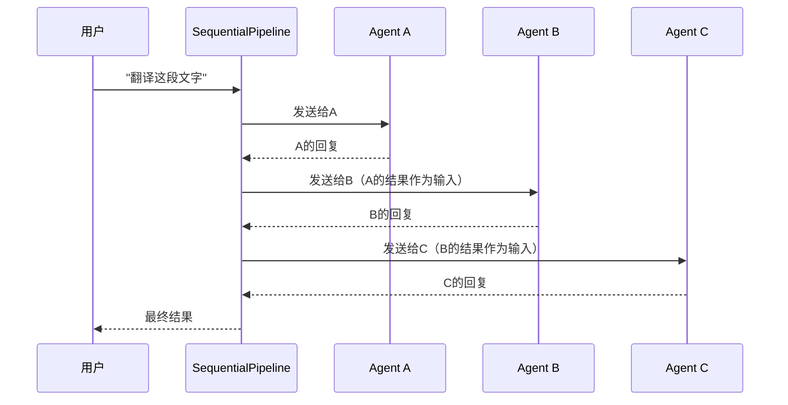
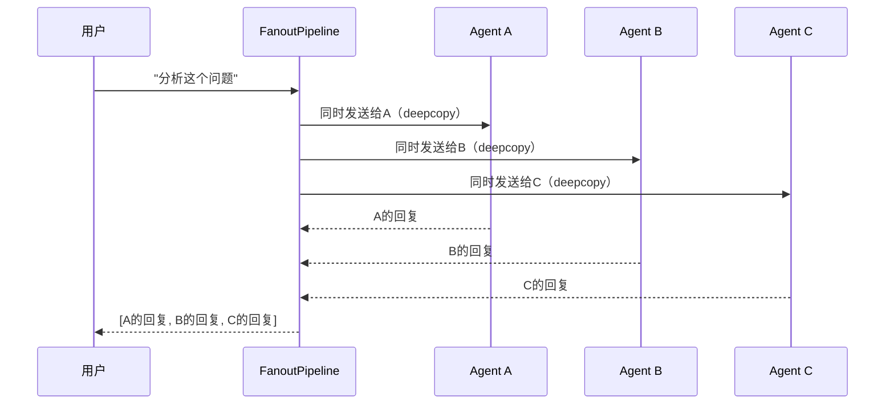
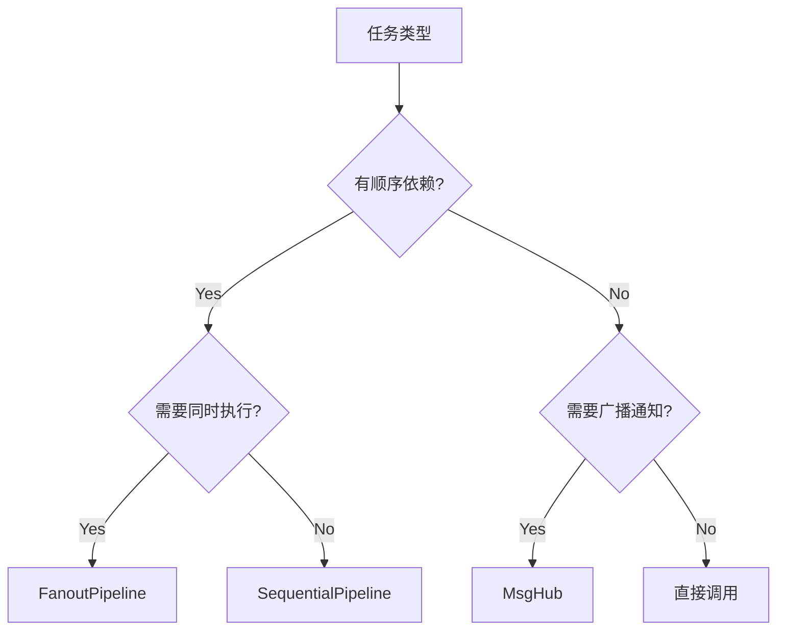

# 2-2 Pipeline是什么

> **目标**：理解Pipeline如何组织和协调多个Agent的工作

---

## 学习目标

学完之后，你能：
- 理解Pipeline的两种模式（Sequential/Fanout）
- 使用SequentialPipeline编排顺序任务
- 使用FanoutPipeline编排并行任务
- 理解Pipeline的数据传递机制

---

## 背景问题

**为什么需要Pipeline？**

当有多个Agent需要协作时，如果手动一个个调用并传递结果，代码会变得复杂且难以维护。Pipeline把多个Agent组织成一个工作流，自动处理数据传递。

**Pipeline vs 直接调用**:
```python
# 直接调用（繁琐）
result_a = await agent_a(input)
result_b = await agent_b(result_a)
result_c = await agent_c(result_b)

# Pipeline（简洁）
pipeline = SequentialPipeline([agent_a, agent_b, agent_c])
result = await pipeline(input)
```

---

## 源码入口

**文件路径**: `src/agentscope/pipeline/_class.py` 和 `src/agentscope/pipeline/_functional.py`

**核心类**:
- `SequentialPipeline` - 顺序执行管道
- `FanoutPipeline` - 并行执行管道

**导出路径**: `src/agentscope/pipeline/__init__.py`
```python
from ._class import SequentialPipeline, FanoutPipeline
from ._functional import sequential_pipeline, fanout_pipeline

__all__ = [
    "SequentialPipeline",
    "sequential_pipeline",
    "FanoutPipeline",
    "fanout_pipeline",
    ...
]
```

**使用入口**:
```python
from agentscope.pipeline import SequentialPipeline, FanoutPipeline
```

---

## 架构定位

**模块职责**: Pipeline编排多个Agent的执行顺序和数据传递。

**两种模式的对比**:

| 特性 | SequentialPipeline | FanoutPipeline |
|------|-------------------|----------------|
| 执行方式 | 顺序 | 并行 |
| 数据传递 | 上一Agent输出是下一Agent输入 | 同一输入发给所有Agent |
| 输出格式 | 单个Msg | Msg列表 |
| 适用场景 | 有依赖的顺序任务 | 独立的并行任务 |

**与其他模块的关系**:
```
用户输入
    │
    ▼
Pipeline ──► Agent A ──► Agent B ──► Agent C  (Sequential)
    │
    └──► Agent A ──► Agent B ──► Agent C     (Fanout, 并行)
    │
    ▼
汇总结果
```

---

## 核心源码分析

### 调用链1: SequentialPipeline执行流程

```python
# 源码位置: src/agentscope/pipeline/_class.py

class SequentialPipeline:
    def __init__(self, agents: list[AgentBase]) -> None:
        self.agents = agents

    async def __call__(self, msg: Msg | list[Msg] | None = None) -> Msg | list[Msg] | None:
        return await sequential_pipeline(agents=self.agents, msg=msg)

# 源码位置: src/agentscope/pipeline/_functional.py

async def sequential_pipeline(
    agents: list[AgentBase],
    msg: Msg | list[Msg] | None = None,
) -> Msg | list[Msg] | None:
    """顺序执行: 上一Agent输出是下一Agent输入"""
    for agent in agents:
        msg = await agent(msg)  # 注意: msg被覆盖
    return msg
```

### 调用链2: FanoutPipeline执行流程

```python
# 源码位置: src/agentscope/pipeline/_class.py

class FanoutPipeline:
    def __init__(self, agents: list[AgentBase], enable_gather: bool = True) -> None:
        self.agents = agents
        self.enable_gather = enable_gather

    async def __call__(self, msg: Msg | list[Msg] | None = None, **kwargs: Any) -> list[Msg]:
        return await fanout_pipeline(
            agents=self.agents,
            msg=msg,
            enable_gather=self.enable_gather,
            **kwargs,
        )

# 源码位置: src/agentscope/pipeline/_functional.py

async def fanout_pipeline(
    agents: list[AgentBase],
    msg: Msg | list[Msg] | None = None,
    enable_gather: bool = True,
    **kwargs: Any,
) -> list[Msg]:
    """并行执行: 同一输入发给所有Agent"""
    if enable_gather:
        # 并发执行
        tasks = [asyncio.create_task(agent(deepcopy(msg), **kwargs)) for agent in agents]
        return await asyncio.gather(*tasks)
    else:
        # 顺序执行
        return [await agent(deepcopy(msg), **kwargs) for agent in agents]
```

### 调用链3: deep copy在Fanout中的作用

```python
# 源码位置: src/agentscope/pipeline/_functional.py

from copy import deepcopy

# FanoutPipeline中使用deepcopy避免消息共享
tasks = [
    asyncio.create_task(agent(deepcopy(msg), **kwargs))  # 深度拷贝
    for agent in agents
]
```

---

## 可视化结构

### SequentialPipeline数据流



### FanoutPipeline数据流



### Pipeline选择决策树



---

## 工程经验

### 设计原因

**为什么SequentialPipeline用列表顺序决定执行顺序？**

列表是有序的，直接用`for agent in agents`遍历确保顺序执行。如果需要调整顺序，只需改变列表中的元素顺序。

**为什么FanoutPipeline需要deepcopy？**

并行执行时，如果多个Agent共享同一个Msg对象引用，一个Agent修改msg会影响其他Agent。deepcopy创建独立副本，避免竞态条件。

**为什么FanoutPipeline返回列表而SequentialPipeline返回单个Msg？**

- Sequential: 数据经过每个Agent处理，结果是最终输出
- Fanout: 多个Agent并行处理，返回所有结果的集合

### 替代方案

**如果需要更复杂的数据汇聚逻辑**:
```python
# FanoutPipeline返回列表，自己实现汇聚
results = await fanout_pipeline(agents, msg)
# 自己决定如何汇总
summary = await summarizer_agent(Msg(content=str(results), role="system"))
```

**如果需要条件执行**:
```python
# 自己控制执行流程，不使用Pipeline
if condition:
    result = await agent_a(msg)
else:
    result = await agent_b(msg)
```

### 可能出现的问题

**问题1: SequentialPipeline的错误传播**
```python
# 如果某个Agent抛出异常，后续Agent不会执行
for agent in self.agents:
    msg = await agent(msg)  # 这里出错，后续不会执行
```
建议：在Agent内部做好错误处理

**问题2: FanoutPipeline的enable_gather=False**
```python
# 顺序执行但返回列表
results = await fanout_pipeline(agents, msg, enable_gather=False)
# 仍然是 [result_a, result_b, result_c]
```

**问题3: Msg对象的浅拷贝风险**
```python
# 如果content是复杂对象，deepcopy可能不够
# 需要时可自定义深拷贝逻辑
from copy import deepcopy

def custom_deepcopy(msg):
    return Msg.from_dict(deepcopy(msg.to_dict()))
```

---

## Contributor指南

### 适合新手修改的文件

| 文件 | 原因 |
|------|------|
| `src/agentscope/pipeline/_class.py` | Pipeline核心类，结构清晰 |
| `src/agentscope/pipeline/_functional.py` | 函数式实现，包含核心逻辑 |

### 危险区域

**SequentialPipeline的顺序执行逻辑**（`_functional.py:sequential_pipeline`）
- 错误修改可能导致消息传递顺序错乱
- 影响Agent间的数据流

**FanoutPipeline的deepcopy逻辑**（`_functional.py:fanout_pipeline`）
- 并行执行需要处理竞态条件
- 错误可能导致结果丢失或重复

### 调试方法

**打印Pipeline执行过程**:
```python
# 在sequential_pipeline中添加日志
async def sequential_pipeline(agents, msg):
    for i, agent in enumerate(agents):
        print(f">>> 调用Agent {i}: {agent}")
        msg = await agent(msg)
        print(f"<<< Agent {i}返回: {msg}")
    return msg
```

**检查FanoutPipeline的并行执行**:
```python
import asyncio

# 使用asyncio.gather的返回顺序是确定的
results = await fanout_pipeline(agents, msg)
# results[0] 对应 agents[0] 的返回值
```

### 扩展Pipeline的步骤

1. 在`_class.py`中添加新Pipeline类
2. 在`_functional.py`中实现核心逻辑
3. 在`__init__.py`中导出新类
4. 添加测试用例

---

## 思考题

<details>
<summary>点击查看答案</summary>

1. **什么时候用SequentialPipeline，什么时候用FanoutPipeline？**
   - Sequential：任务有依赖，必须一步一步来
   - Fanout：任务独立，可以同时处理

2. **SequentialPipeline中，Agent B收到的是什么？**
   - 是Agent A的输出结果
   - 不是原始输入，是处理过的

3. **FanoutPipeline的输出是什么格式？**
   - 是一个列表 [A的回复, B的回复, C的回复]
   - 需要后续处理来汇总

4. **为什么FanoutPipeline需要deepcopy？**
   - 避免并行执行的Agent共享同一个Msg引用
   - 防止一个Agent修改影响其他Agent

</details>
