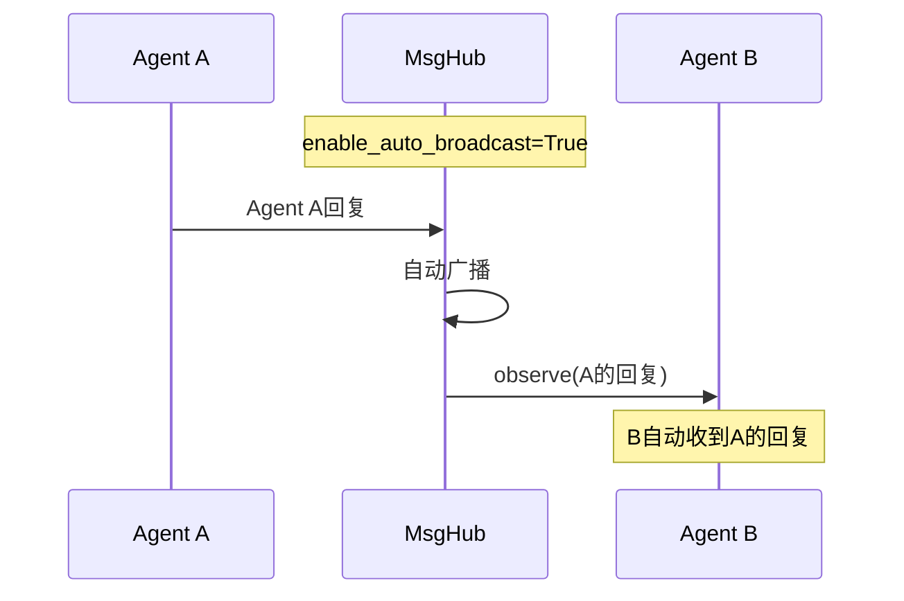
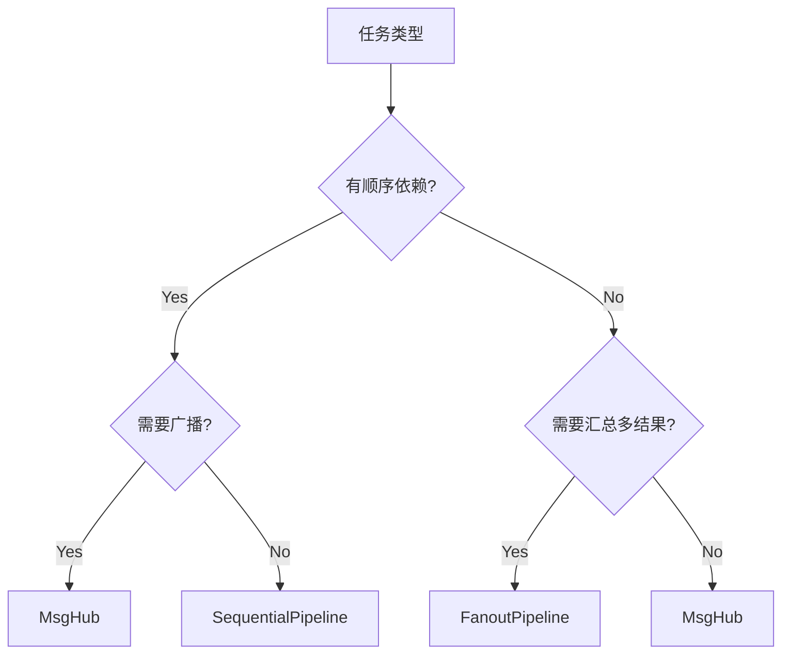

# 2-3 MsgHub是什么

> **目标**：理解MsgHub的发布-订阅模式和消息广播机制

---

## 学习目标

学完之后，你能：
- 理解发布-订阅模式的核心概念
- 使用MsgHub进行消息广播
- 区分MsgHub和Pipeline的使用场景
- 理解auto_broadcast的机制和风险

---

## 背景问题

**为什么需要MsgHub？**

当多个Agent需要协作时，有时候不是简单的顺序或并行关系，而是"一个Agent说了什么，其他Agent都需要知道"的需求。

MsgHub就是解决这个问题的——它是一个消息中心，发布者只管发，订阅者自动收。

**MsgHub vs Pipeline**:
- Pipeline: 数据按顺序流过每个Agent，上一输出是下一输入
- MsgHub: 消息广播给所有订阅者，无顺序依赖

---

## 源码入口

**文件路径**: `src/agentscope/pipeline/_msghub.py`

**核心类**: `MsgHub`

**构造方法签名**:
```python
class MsgHub:
    def __init__(
        self,
        participants: Sequence[AgentBase],
        announcement: list[Msg] | Msg | None = None,
        enable_auto_broadcast: bool = True,
        name: str | None = None,
    ) -> None:
```

**导出路径**: `src/agentscope/pipeline/__init__.py`
```python
from ._msghub import MsgHub
__all__ = ["MsgHub", ...]
```

**使用入口**:
```python
from agentscope.pipeline import MsgHub
```

---

## 架构定位

**模块职责**: MsgHub是消息广播中心，管理发布-订阅关系。

**生命周期**:
1. `async with MsgHub(participants=[...])` 进入时：自动订阅所有参与者
2. 运行时：通过`broadcast()`广播消息，或开启auto_broadcast自动广播
3. 退出with块时：自动取消订阅

**与其他模块的关系**:
```
发布者 ──► MsgHub ──► Agent A (observe)
              │
              ├──► Agent B (observe)
              │
              └──► Agent C (observe)

Pipeline ──► Agent ──► MsgHub ──► 多个订阅者
```

---

## 核心源码分析

### 调用链1: MsgHub初始化与订阅

```python
# 源码位置: src/agentscope/pipeline/_msghub.py

async def __aenter__(self) -> "MsgHub":
    """Will be called when entering the MsgHub."""
    self._reset_subscriber()

    # broadcast the input message to all participants
    if self.announcement is not None:
        await self.broadcast(msg=self.announcement)

    return self

def _reset_subscriber(self) -> None:
    """Reset the subscriber for agent in `self.participant`"""
    if self.enable_auto_broadcast:
        for agent in self.participants:
            agent.reset_subscribers(self.name, self.participants)
```

### 调用链2: MsgHub广播消息

```python
# 源码位置: src/agentscope/pipeline/_msghub.py

async def broadcast(self, msg: list[Msg] | Msg) -> None:
    """Broadcast the message to all participants.

    Args:
        msg (`list[Msg] | Msg`):
            Message(s) to be broadcast among all participants.
    """
    for agent in self.participants:
        await agent.observe(msg)
```

### 调用链3: 动态添加/删除参与者

```python
# 源码位置: src/agentscope/pipeline/_msghub.py

def add(self, new_participant: list[AgentBase] | AgentBase) -> None:
    """Add new participant into this hub"""
    if isinstance(new_participant, AgentBase):
        new_participant = [new_participant]

    for agent in new_participant:
        if agent not in self.participants:
            self.participants.append(agent)

    self._reset_subscriber()

def delete(self, participant: list[AgentBase] | AgentBase) -> None:
    """Delete agents from participant."""
    if isinstance(participant, AgentBase):
        participant = [participant]

    for agent in participant:
        if agent in self.participants:
            self.participants.pop(self.participants.index(agent))

    self._reset_subscriber()
```

### 调用链4: Agent的observe机制

```python
# 源码位置: src/agentscope/agent/_agent_base.py

# AgentBase中的订阅机制
def observe(self, msg: Msg | list[Msg]) -> None:
    """接收消息并保存到观察者队列"""
    if isinstance(msg, list):
        self._observed_messages.extend(msg)
    else:
        self._observed_messages.append(msg)

def reset_subscribers(self, hub_name: str, participants: list[AgentBase]) -> None:
    """设置订阅关系"""
    self._subscribers[hub_name] = participants
```

---

## 可视化结构

### MsgHub发布-订阅模式

```mermaid
sequenceDiagram
    participant P as Publisher
    participant Hub as MsgHub
    participant A as Agent A
    participant B as Agent B
    participant C as Agent C

    Note over A,B,C: 进入MsgHub时自动订阅
    P->>Hub: async with MsgHub(participants=[A, B, C])
    Hub->>A: _reset_subscriber() 设置订阅关系
    Hub->>B: _reset_subscriber() 设置订阅关系
    Hub->>C: _reset_subscriber() 设置订阅关系

    P->>Hub: broadcast(Msg)
    Hub->>A: observe(Msg) 推送消息
    Hub->>B: observe(Msg) 推送消息
    Hub->>C: observe(Msg) 推送消息
```

### auto_broadcast机制



### 组件选择决策树



---

## 工程经验

### 设计原因

**为什么使用async with语法？**

`async with`确保订阅和取消订阅成对出现，避免资源泄漏。类似文件操作的`with`语法。

**为什么enable_auto_broadcast默认开启？**

为了让常见的"一个Agent回复，其他Agent都需要知道"场景开箱即用。但这也带来了消息风暴的风险。

**为什么broadcast使用for循环而不是gather？**

因为broadcast是"fire and forget"模式，不需要等待所有Agent处理完成。使用for循环立即返回，适合广播场景。

### 替代方案

**如果需要有序广播**:
```python
# 手动控制广播顺序
async with MsgHub(participants=[a, b, c]) as hub:
    await a.observe(msg)  # 先发给a
    await b.observe(msg)  # 再发给b
    await c.observe(msg)  # 最后发给c
```

**如果需要等待所有订阅者处理完成**:
```python
# 自己实现等待逻辑
async with MsgHub(participants=[a, b, c]) as hub:
    await hub.broadcast(msg)
    # 等待某个条件
    while not all_done():
        await asyncio.sleep(0.1)
```

### 可能出现的问题

**问题1: auto_broadcast导致消息风暴**
```python
# 风险：Agent互相回复，形成无限循环
async with MsgHub(participants=[agent1, agent2]) as hub:
    # agent1回复 -> auto_broadcast -> agent2收到 -> agent2回复
    # -> auto_broadcast -> agent1收到 -> agent1回复 -> ...
```
建议：复杂场景建议禁用auto_broadcast

**问题2: 广播顺序不确定**
```python
# 不保证订阅者收到消息的顺序
await hub.broadcast(msg)
# Agent A可能在Agent B之前或之后收到
```

**问题3: 退出with后订阅关系保留**
```python
# 正确做法
async with MsgHub(participants=[a, b]) as hub:
    await hub.broadcast(msg)
# 退出后自动取消订阅

# 错误做法
hub = MsgHub(participants=[a, b])
await hub.broadcast(msg)  # 没有用with，不会自动取消订阅
```

---

## Contributor指南

### 适合新手修改的文件

| 文件 | 原因 |
|------|------|
| `src/agentscope/pipeline/_msghub.py` | MsgHub核心类，逻辑清晰 |
| `src/agentscope/agent/_class.py` | Agent的observe和订阅机制 |

### 危险区域

**_reset_subscriber()的订阅关系逻辑**（`_msghub.py`）
- 控制auto_broadcast的核心逻辑
- 错误修改可能导致消息丢失或重复

**broadcast()的遍历顺序**（`_msghub.py:130`）
- 如果包含正在执行中的Agent，可能有竞态条件

### 调试方法

**检查订阅关系**:
```python
# 查看Agent的订阅者
print(agent._subscribers)
```

**追踪广播消息**:
```python
# 在broadcast中添加日志
original_broadcast = MsgHub.broadcast

async def debug_broadcast(self, msg):
    print(f">>> 广播消息: {msg}")
    await original_broadcast(self, msg)

MsgHub.broadcast = debug_broadcast
```

**检查auto_broadcast状态**:
```python
print(f"auto_broadcast: {hub.enable_auto_broadcast}")
```

### 扩展MsgHub的步骤

1. 在`_msghub.py`中添加新方法
2. 确保线程安全（如果涉及并发）
3. 在`__aenter__`和`__aexit__`中正确管理资源
4. 添加测试用例

---

## 思考题

<details>
<summary>点击查看答案</summary>

1. **MsgHub和Pipeline的核心区别是什么？**
   - Pipeline：硬编码顺序，上一节点的输出是下一节点的输入
   - MsgHub：动态订阅，所有订阅者收到相同消息

2. **什么场景下用MsgHub比Pipeline更好？**
   - 需要通知多个Agent但不知道具体是哪些
   - 需要动态添加/移除订阅者
   - 类似"广播"或"事件通知"场景

3. **MsgHub的消息会保存吗？**
   - 默认不保存，只广播给当前订阅者
   - 需要持久化可以用session或额外存储

4. **auto_broadcast可能导致什么问题？**
   - Agent互相回复形成无限循环
   - 消息数量可能指数增长

</details>
