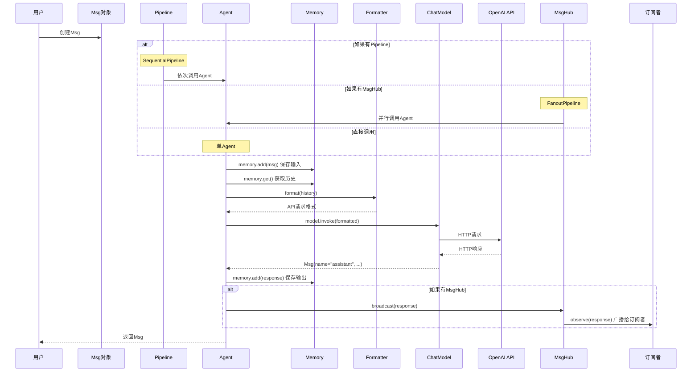
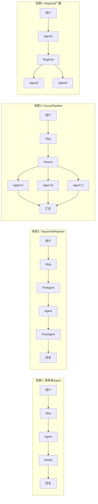
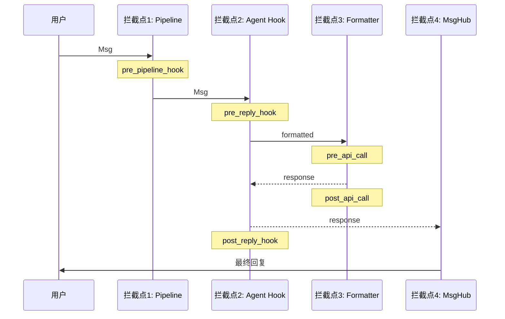

# 2-4 追踪消息的完整旅程

> **目标**：理解消息从用户输入到Agent回复的完整流动过程

---

## 学习目标

学完之后，你能：
- 画出消息在AgentScope中的完整流动图
- 理解每一步发生了什么
- 知道在哪里可以拦截/处理消息
- 区分不同场景下的消息流差异

---

## 背景问题

**为什么需要理解完整消息流？**

当调试问题时，需要知道消息在哪个环节出了问题。理解完整流程才能快速定位Bug。

**消息流中的关键节点**:
1. 用户输入创建Msg
2. Pipeline路由（如果有）
3. Agent处理
4. Model调用
5. MsgHub广播（如果有）

---

## 源码入口

**涉及的核心模块**:

| 模块 | 文件路径 | 职责 |
|------|---------|------|
| Msg | `src/agentscope/message/_message_base.py` | 消息载体 |
| Pipeline | `src/agentscope/pipeline/_class.py` | 顺序/并行编排 |
| MsgHub | `src/agentscope/pipeline/_msghub.py` | 消息广播 |
| Agent | `src/agentscope/agent/_react_agent.py` | Agent处理逻辑 |
| Model | `src/agentscope/model/_openai_model.py` | LLM调用 |

**消息流经的调用链**:
```
用户输入
    │
    ▼
Msg(name="user", content="...", role="user")
    │
    ├──► Pipeline ──► Agent A ──► Agent B ──► ...
    │
    ▼
Agent.observe(msg) / Agent(msg)
    │
    ├──► Memory.add(msg)  保存历史
    ├──► Memory.get()    获取历史
    ├──► Formatter.format()  格式转换
    ├──► Model.invoke()     调用LLM
    │
    ▼
Msg(name="assistant", content="...", role="assistant")
    │
    ├──► Memory.add(response)
    ├──► MsgHub.broadcast()  广播（如果启用）
    │
    ▼
返回用户
```

---

## 架构定位

### 消息系统的层次结构

```
┌─────────────────────────────────────────────────────────────┐
│                      用户层                                  │
│              Msg(name="user", content="...")               │
└──────────────────────────┬──────────────────────────────────┘
                           ▼
┌─────────────────────────────────────────────────────────────┐
│                    Pipeline层                               │
│         负责消息的路由和编排（顺序/并行/广播）              │
└──────────────────────────┬──────────────────────────────────┘
                           ▼
┌─────────────────────────────────────────────────────────────┐
│                     Agent层                                 │
│     observe()接收消息 → reply()生成回复 → broadcast()广播   │
└──────────────────────────┬──────────────────────────────────┘
                           ▼
┌─────────────────────────────────────────────────────────────┐
│                    Formatter层                              │
│              Msg对象 → API格式 → Model调用                 │
└──────────────────────────┬──────────────────────────────────┘
                           ▼
┌─────────────────────────────────────────────────────────────┐
│                     Model层                                 │
│              远程LLM API调用（OpenAI/Claude等）            │
└─────────────────────────────────────────────────────────────┘
```

### 各层的职责边界

| 层级 | 职责 | 不负责 |
|------|------|--------|
| 用户层 | 创建初始Msg | 不处理逻辑 |
| Pipeline层 | 消息路由和分发 | 不修改消息内容 |
| Agent层 | 消息处理、业务逻辑 | 不做格式转换 |
| Formatter层 | 格式转换（Msg↔API JSON） | 不调用API |
| Model层 | 发送请求、接收响应 | 不处理消息路由 |

### 消息流的数据变换

```
用户输入文本
    │
    ▼
Msg对象 {name, content, role}
    │
    ▼  (Pipeline路由，可选)
PipelineOutput
    │
    ▼  (Agent处理)
Agent内部: Memory + Formatter + Model
    │
    ▼
ChatResponse {content, role}
    │
    ▼
Msg对象 {name="assistant", content, role="assistant"}
    │
    ▼  (广播，可选)
MsgHub → 其他Agent的observe()
```

### 与其他组件的关系

- **MsgHub订阅**: Agent通过`observe()`订阅消息，`reply()`生成回复后通过MsgHub广播
- **Memory依赖**: Agent的`reply()`调用`Memory.get_history()`获取对话历史
- **Model调用**: Agent的`reply()`通过Formatter转换后调用Model

---

## 核心源码分析

### 调用链1: 用户输入到Agent处理

```python
# 用户创建Msg
user_msg = Msg(name="user", content="你好", role="user")

# Agent的__call__方法处理
# 源码位置: src/agentscope/agent/_react_agent.py
async def __call__(self, msg: Msg | None) -> Msg:
    # 1. 如果有输入，保存到记忆
    if msg is not None:
        self.memory.add(msg)

    # 2. 获取历史消息
    history = self.memory.get()

    # 3. 调用model（内部会格式化和调用API）
    response = await self.model(
        prompt=history,  # 注意：这里是history，不是msg
        ...
    )

    # 4. 保存回复到记忆
    self.memory.add(response)

    return response
```

### 调用链2: Model调用与Formatter转换

```python
# 源码位置: src/agentscope/model/_openai_model.py (推测)

class OpenAIChatModel:
    async def __call__(self, prompt: list[Msg], **kwargs) -> Msg:
        # 1. 格式化消息为API格式
        formatted = self.formatter.format(prompt)

        # 2. 调用OpenAI API
        response = await self._call_api(formatted)

        # 3. 解析响应
        return self.formatter.parse(response)
```

### 调用链3: Pipeline中的消息传递

```python
# 源码位置: src/agentscope/pipeline/_functional.py

async def sequential_pipeline(agents, msg):
    """顺序执行: 每一步的输出是下一步的输入"""
    for agent in agents:
        msg = await agent(msg)  # msg被覆盖
    return msg

async def fanout_pipeline(agents, msg, enable_gather=True):
    """并行执行: 同一输入发给所有Agent"""
    if enable_gather:
        tasks = [asyncio.create_task(agent(deepcopy(msg))) for agent in agents]
        return await asyncio.gather(*tasks)
```

### 调用链4: MsgHub广播

```python
# 源码位置: src/agentscope/pipeline/_msghub.py

async def broadcast(self, msg: list[Msg] | Msg) -> None:
    """广播消息给所有订阅者"""
    for agent in self.participants:
        await agent.observe(msg)

# Agent接收广播
# 源码位置: src/agentscope/agent/_class.py (推测)
def observe(self, msg: Msg | list[Msg]) -> None:
    """接收消息"""
    if isinstance(msg, list):
        self._observed_messages.extend(msg)
    else:
        self._observed_messages.append(msg)
```

---

## 可视化结构

### 完整消息流时序图



### 四种典型场景的消息流



### 消息拦截点



---

## 工程经验

### 设计原因

**为什么消息要先存Memory再获取？**

这样Agent每次调用都能看到完整的对话历史，而不是只有当前消息。这对于多轮对话至关重要。

**为什么Pipeline返回单个Msg而Fanout返回列表？**

- Sequential: 数据经过处理链，最终只有一个结果
- Fanout: 多个Agent并行处理，返回多个结果的集合

**为什么Formatter在Model内部而不是外部？**

因为不同的Model（OpenAI、Claude）需要不同的格式化逻辑。封装在Model内部简化外部使用。

### 替代方案

**如果需要自定义消息流**:
```python
# 不使用Pipeline，直接控制流程
msg = user_input()
for step in steps:
    msg = await step.process(msg)
```

**如果需要消息持久化**:
```python
# 在Agent调用后手动保存
response = await agent(msg)
await db.save({"msg": response, "timestamp": time.time()})
```

### 可能出现的问题

**问题1: 消息流中的性能瓶颈**
```
用户 → Agent → Model → 回复
              ↑
           最慢（网络IO）
```
优化：减少不必要的Pipeline步骤，使用缓存

**问题2: Pipeline中消息丢失**
```python
# 如果Agent出错，消息不会传递到下一个Agent
try:
    result = await agent(result)
except Exception as e:
    result = Msg(name="error", content=str(e), role="system")
```

**问题3: MsgHub广播顺序不确定**
```python
# 不保证订阅者收到顺序
await hub.broadcast(msg)
```

---

## Contributor指南

### 适合新手修改的文件

| 文件 | 原因 |
|------|------|
| `src/agentscope/agent/_react_agent.py` | Agent处理逻辑 |
| `src/agentscope/pipeline/_functional.py` | Pipeline执行逻辑 |
| `src/agentscope/message/_message_base.py` | Msg定义 |

### 危险区域

**Pipeline的消息传递逻辑**
- 修改可能导致消息丢失或顺序错误

**Agent的Memory操作**
- 错误可能导致历史消息丢失

**MsgHub的广播逻辑**
- 修改可能导致订阅者收不到消息

### 调试方法

**方法1: 打印消息内容**
```python
print(f"Msg: name={msg.name}, content={msg.content[:50]}...")
```

**方法2: 使用Hook拦截**
```python
# 注册pre_reply_hook
def log_pre_reply(agent, message):
    print(f"pre_reply: {message.content[:50]}...")
    return message

agent.register_instance_hook("pre_reply", "log", log_pre_reply)
```

**方法3: 检查Memory**
```python
history = agent.memory.get()
for msg in history:
    print(f"{msg.name}: {msg.content[:50]}...")
```

**方法4: 追踪Pipeline执行**
```python
# 在sequential_pipeline中添加日志
async def debug_sequential_pipeline(agents, msg):
    for i, agent in enumerate(agents):
        print(f"调用Agent {i}: {agent.name}")
        msg = await agent(msg)
        print(f"Agent {i}返回: {msg.content[:50]}...")
    return msg
```

### 扩展练习

1. **添加自定义拦截器**: 在Pipeline中添加日志或验证
2. **修改消息格式**: 在Formatter中添加自定义字段
3. **实现消息持久化**: 在Memory中保存到数据库

---

## 思考题

<details>
<summary>点击查看答案</summary>

1. **消息在Pipeline中是怎么传递的？**
   - 每个Agent处理完，产生新的Msg
   - 新Msg传递给下一个Agent
   - 最终的Msg作为Pipeline的输出

2. **MsgHub和Pipeline可以一起用吗？**
   - 可以！常见模式：
   - Pipeline处理完，通过MsgHub广播给订阅者
   - 实现"处理+通知"的分离

3. **在哪里可以拦截/修改消息？**
   - Pipeline：每个Agent都可以处理
   - Agent：Hook可以拦截（pre_reply/post_reply）
   - MsgHub：发布前可以拦截

4. **为什么Model调用是最慢的一步？**
   - 因为涉及网络请求
   - 需要等待远程API响应

</details>
