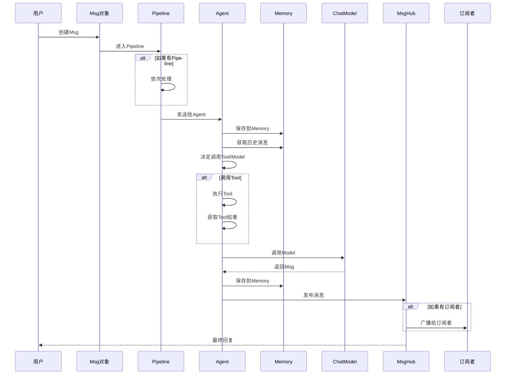

# 2-4 追踪消息的完整旅程

> **目标**：理解消息从用户输入到Agent回复的完整流动过程

---

## 🎯 这一章的目标

学完之后，你能：
- 画出消息在AgentScope中的完整流动图
- 理解每一步发生了什么
- 知道在哪里可以拦截/处理消息

---

## 🚀 消息的完整旅程

### 第一步：用户输入

```
┌─────────────────────────────────────────────────────────────┐
│  用户输入: "你好，请帮我查一下天气"                      │
└─────────────────────────────────────────────────────┘
                              │
                              ▼
```

### 第二步：创建Msg

```
┌─────────────────────────────────────────────────────────────┐
│  Msg对象创建                                              │
│                                                             │
│  Msg(                                                    │
│      name="user",                                         │
│      content="你好，请帮我查一下天气",                     │
│      role="user"                                          │
│  )                                                        │
└─────────────────────────────────────────────────────────────┘
                              │
                              ▼
```

### 第三步：Pipeline路由（如果有）

```
┌─────────────────────────────────────────────────────────────┐
│  Pipeline处理                                             │
│                                                             │
│  ┌─────────────────────────────────────────────────────┐  │
│  │ SequentialPipeline([preprocessor, analyzer, agent])  │  │
│  └─────────────────────────────────────────────────────┘  │
│                                                             │
│  Msg经过Pipeline的每个Agent处理，传递下去                   │
└─────────────────────────────────────────────────────────────┘
                              │
                              ▼
```

### 第四步：Agent处理

```
┌─────────────────────────────────────────────────────────────┐
│  Agent处理流程                                            │
│                                                             │
│  1. 接收Msg                                               │
│  2. 保存到Memory（短期记忆）                              │
│  3. 获取历史消息                                          │
│  4. 调用Model获取回复                                     │
│  5. 返回新的Msg                                           │
└─────────────────────────────────────────────────────────────┘
                              │
                              ▼
```

### 第五步：MsgHub广播（如果有）

```
┌─────────────────────────────────────────────────────────────┐
│  MsgHub广播                                                │
│                                                             │
│  await hub.broadcast(Msg(name="assistant", content="北京今天..."))   │
│                                                             │
│         ├──► Subscriber A 收到
│         ├──► Subscriber B 收到
│         └──► Subscriber C 收到
└─────────────────────────────────────────────────────────────┘
                              │
                              ▼
```

---

## 📊 完整流程图



---

## 🔍 不同场景的消息流

### 场景1：简单单Agent

```
用户 → Msg → Agent → Model → 回复 → 用户
```

### 场景2：带Pipeline的顺序处理

```
用户 → Msg → Pipeline[Pre → Agent → Post] → 回复 → 用户
```

### 场景3：多Agent协作（MsgHub）

```
用户 → Agent1 → MsgHub.publish()
                    ↓
              Agent2（订阅）
              Agent3（订阅）
                    ↓
              用户收到多个回复
```

### 场景4：完整混合

```
用户 → MsgHub → Agent1 ──► Pipeline[Agent2 → Agent3] ──► 用户
                ↓
              Agent4（订阅）
```

---

## 💡 Java开发者注意

消息流类似Java的**请求-响应链路**：

```java
// Java Servlet Filter Chain
request 
    → Filter1 
    → Filter2 
    → Controller 
    → Service 
    → Repository 
    → response;

response ← Filter2 ← Filter1 ←
```

| AgentScope | Java | 说明 |
|------------|------|------|
| Msg | Request/Response | 数据载体 |
| Pipeline | Filter Chain | 顺序处理链 |
| Agent | Controller/Service | 业务处理 |
| Memory | HttpSession/Cache | 状态存储 |
| MsgHub | EventBus/MessageBroker | 消息广播 |

---

## 🎯 思考题

<details>
<summary>点击查看答案</summary>

1. **消息在Pipeline中是怎么传递的？**
   - 每个Agent处理完，产生新的Msg
   - 新Msg传递给下一个Agent
   - 最终的Msg作为Pipeline的输出

2. **MsgHub和Pipeline可以一起用吗？**
   - 可以！常见模式：
   - Pipeline处理完，通过MsgHub广播给订阅者
   - 实现"处理+通知"的分离

3. **在哪里可以拦截/修改消息？**
   - Pipeline：每个Agent都可以处理
   - Agent：Hook可以拦截（pre_reply/post_reply）
   - MsgHub：发布前可以拦截

</details>

---

★ **Insight** ─────────────────────────────────────
- 消息从用户输入开始，**流经Pipeline和Agent**，最后返回用户
- **Pipeline处理顺序**，**MsgHub处理广播**
- Hook可以在处理流程中**植入拦截逻辑**
─────────────────────────────────────────────────
