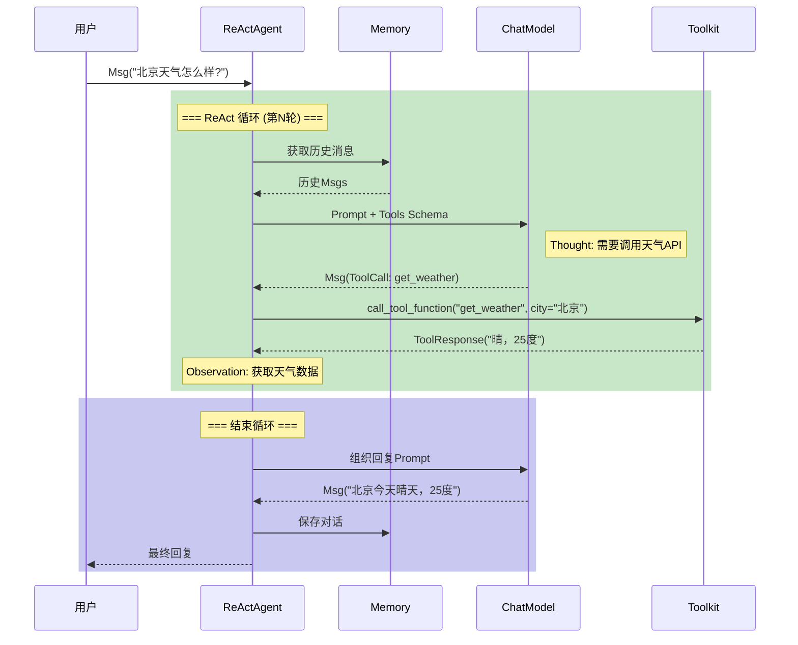
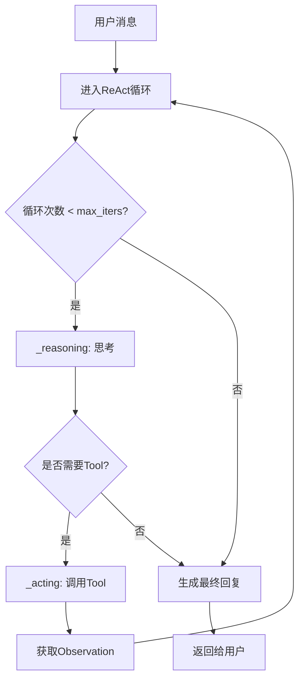
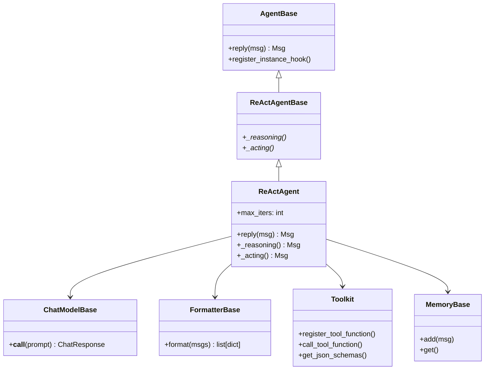

# 3-1 ReActAgent工作原理

> **目标**：理解ReActAgent的Thought-Action-Observation循环机制

---

## 学习目标

学完本章后，你能：
- 理解ReAct的三个核心步骤（Thought、Action、Observation）
- 画出Agent思考的循环图
- 说明Agent在什么情况下会调用Tool
- 配置ReActAgent并运行基本任务

---

## 背景问题

### 为什么需要ReAct循环？

普通LLM只能基于训练数据回复，无法获取实时信息。当用户问"今天北京天气如何"时，LLM只能回答"我不知道实时天气"。

**问题本质**：LLM是"知识库"，不是"行动者"。

**解决方案**：给LLM配上工具（Tools），让它能查天气、搜信息、算数——这就是ReAct的核心思想。

```
普通LLM的问题：
┌─────────────────────────────────────────────────────────────┐
│  用户: "北京今天天气怎么样？"                               │
│                                                             │
│  LLM: "抱歉，我不知道实时天气信息..."                       │
│                                                             │
│  问题：LLM无法获取外部信息                                  │
└─────────────────────────────────────────────────────────────┘

ReActAgent的解决方案：
┌─────────────────────────────────────────────────────────────┐
│  用户: "北京今天天气怎么样？"                               │
│                                                             │
│  Agent: (调用天气API) → 获取实时天气 → 回复用户             │
│                                                             │
│  "北京今天晴，25度，适合外出"                              │
└─────────────────────────────────────────────────────────────┘
```

### ReAct = Reason + Act

ReAct是一种让LLM"既能思考又能行动"的推理框架：
- **Reason（思考）**：让模型分析问题，决定是否需要调用工具
- **Act（行动）**：执行工具调用，获取外部信息
- **Observation（观察）**：将结果反馈给模型，继续思考

---

## 源码入口

### 核心文件

| 文件路径 | 类/方法 | 说明 |
|---------|--------|------|
| `src/agentscope/agent/_react_agent.py` | `ReActAgent` | ReActAgent主类 |
| `src/agentscope/agent/_react_agent_base.py` | `ReActAgentBase` | ReActAgent基类，定义`_reasoning()`和`_acting()`抽象方法 |
| `src/agentscope/agent/_agent_base.py` | `AgentBase` | Agent基类，`reply()`方法定义 |

### 类继承关系

```
AgentBase (abstract)
└── ReActAgentBase (abstract)
    └── ReActAgent (concrete)
```

### 关键方法

| 方法 | 位置 | 作用 |
|------|------|------|
| `__call__(msg: Msg)` | `AgentBase` | Agent入口，接收消息返回响应 |
| `reply(msg: Msg)` | `ReActAgent` | 核心循环，处理Thought-Action-Observation |
| `_reasoning()` | `ReActAgentBase` | 抽象方法，推理逻辑 |
| `_acting()` | `ReActAgentBase` | 抽象方法，行动逻辑 |

### 调用入口

```python
# 用户调用Agent的入口
response = await agent(Msg(name="user", content="北京天气怎么样?", role="user"))

# 内部调用链：
# agent(Msg) → AgentBase.__call__() → self.reply() → ReActAgent.reply()
```

---

## 架构定位

### 模块职责

ReActAgent是AgentScope中的**核心执行单元**，负责：
1. 接收用户消息
2. 管理对话记忆（Memory）
3. 执行ReAct循环（思考→行动→观察）
4. 调用工具获取外部信息
5. 生成最终回复

### 生命周期

```
┌─────────────────────────────────────────────────────────────┐
│                    ReActAgent 生命周期                      │
│                                                             │
│  1. __init__()                                             │
│     ├── 初始化model、formatter、toolkit、memory             │
│     └── 设置max_iters、sys_prompt等配置                     │
│                                                             │
│  2. __call__(msg)  ← 每次用户消息触发                       │
│     ├── reply(msg)                                          │
│     │   ├── _reasoning()  ← Thought阶段                     │
│     │   └── _acting()    ← Action + Observation阶段         │
│     └── 返回最终Msg                                          │
│                                                             │
│  3. 循环直到：                                              │
│     ├── 模型判断"信息足够回答了"                            │
│     └── 或达到max_iters上限（防止死循环）                   │
└─────────────────────────────────────────────────────────────┘
```

### 与其他模块的关系

```
ReActAgent
    │
    ├── model: ChatModelBase ← 核心推理引擎（LLM调用）
    │
    ├── formatter: FormatterBase ← 消息格式转换
    │
    ├── toolkit: Toolkit ← 工具注册与调用
    │
    ├── memory: MemoryBase ← 对话历史管理
    │
    └── hooks: Hook系统 ← 各阶段拦截处理
```

---

## 核心源码分析

### 1. ReActAgent的创建

**源码**：`src/agentscope/agent/_react_agent.py:177-200`

```python
def __init__(
    self,
    name: str,
    sys_prompt: str,
    model: ChatModelBase,
    formatter: FormatterBase,
    toolkit: Toolkit | None = None,
    memory: MemoryBase | None = None,
    # ...
    max_iters: int = 10,
    # ...
) -> None:
```

**关键参数**：
- `model`：LLM推理引擎，负责思考决策
- `toolkit`：工具容器，通过`register_tool_function()`注册工具
- `max_iters`：最大循环次数，默认10，防止无限循环
- `formatter`：消息格式转换器

**工具注册**：

```python
toolkit = Toolkit()
toolkit.register_tool_function(get_weather)  # 注册天气查询
toolkit.register_tool_function(calculate)    # 注册计算

agent = ReActAgent(
    name="Assistant",
    model=OpenAIChatModel(...),
    toolkit=toolkit,  # 传入toolkit，不是tools列表
    ...
)
```

### 2. reply()核心循环

**源码**：`src/agentscope/agent/_react_agent.py:376-537`

```python
async def reply(
    self,
    msg: Msg,
    # ...
) -> Msg:
    # ...
    for _ in range(self.max_iters):  # 防止无限循环
        # Step 1: Reasoning - 让模型思考
        msg_reasoning = await self._reasoning()

        # Step 2: Acting - 根据思考结果决定行动
        msg_acting = await self._acting(msg_reasoning)

        # 检查是否应该结束循环
        if self._is_terminated(msg_acting):
            break

    # 超出max_iters，生成兜底回复
    return await self._summarizing()
```

**循环控制**：
- `_reasoning()`：让LLM分析问题，生成Thought
- `_acting()`：执行Tool调用或生成回复
- `_is_terminated()`：判断是否应该结束循环
- `max_iters`：防止死循环的安全阀

### 3. _reasoning()推理方法

**源码**：`src/agentscope/agent/_react_agent.py:540+`

```python
async def _reasoning(self, *args: Any, **kwargs: Any) -> Msg:
    # 构建提示词，包含sys_prompt和历史消息
    prompt = self._build_reasoning_prompt()

    # 调用Model生成Thought
    response = await self.model(
        prompt,
        tools=self.toolkit.get_json_schemas() if self.toolkit else None,
        tool_choice=self.tool_choice,
    )

    return response  # 包含Thought的Msg
```

**关键点**：
- 构建提示词时，会将历史消息、system prompt组织成完整上下文
- 传入`tools`参数，让LLM知道有哪些工具可用
- LLM自行决定是否调用工具、调用哪个工具

### 4. _acting()行动方法

**源码**：`src/agentscope/agent/_react_agent.py:600+`

```python
async def _acting(self, msg_reasoning: Msg) -> Msg:
    # 解析Reasoning结果，判断是否有ToolCall
    if self._has_tool_call(msg_reasoning):
        # 执行Tool调用
        tool_result = await self._call_tool(msg_reasoning)
        # 将结果作为Observation，继续循环
        return tool_result
    else:
        # 无ToolCall，生成最终回复
        return msg_reasoning
```

### 5. 工具调用

**源码**：`src/agentscope/agent/_react_agent.py:650+`

```python
async def _call_tool(self, tool_call: ToolCall) -> Msg:
    try:
        # 调用toolkit执行工具
        tool_res = await self.toolkit.call_tool_function(tool_call)

        # 构建ToolResultBlock
        tool_res_msg = Msg(
            name="system",
            content=[ToolResultBlock(...)],
            role="system"
        )

        # 存入memory，继续循环
        await self.memory.add(tool_res_msg)
        return tool_res_msg

    except Exception as e:
        # 工具执行失败，记录错误但继续循环
        tool_res_msg = Msg(
            name="system",
            content=[ToolResultBlock(content=f"Error: {e}")],
            role="system"
        )
        await self.memory.add(tool_res_msg)
        return tool_res_msg
```

---

## 可视化结构

### ReAct循环时序图



### ReAct循环流程图



### 模块依赖图



---

## 工程经验

### 设计原因

1. **为什么用循环而不是递归？**
   - 循环更可控，能通过`max_iters`防止无限执行
   - 每次循环后可以检查状态，决定是否继续

2. **为什么Tool返回结果要加入Memory？**
   - 让LLM在下一轮思考时能看到之前的观察结果
   - 保持对话上下文的完整性

3. **为什么max_iters默认值是10？**
   - 大部分任务在10轮内能完成
   - 复杂任务（如多步推理）可能需要更大值

### 替代方案

| 方案 | 优点 | 缺点 |
|------|------|------|
| 无限循环 | 适合复杂任务 | 可能卡死 |
| 固定次数 | 简单可控 | 可能提前终止 |
| LLM自己决定 | 灵活 | 不够可靠 |

### 常见问题

#### 问题1：Agent不断调用工具但不停止

**原因**：LLM判断逻辑有问题，或工具返回信息不够

**表现**：
```
Thought: 需要更多信息
Action: 调用 search_weather
Observation: 返回结果
Thought: 需要更多信息  ← 又调用同一工具
Action: 调用 search_weather
...（循环）
```

**解决**：
```python
# 增大max_iters，或使用更智能的模型
agent = ReActAgent(
    name="Researcher",
    max_iters=30,  # 复杂任务增大此值
    ...
)
```

#### 问题2：Tool返回错误导致Agent行为异常

**源码依据**（`_react_agent.py:650-680`）：
```python
try:
    tool_res = await self.toolkit.call_tool_function(tool_call)
except Exception as e:
    # 错误信息仍会存入Memory
    tool_res_msg = Msg("system", [ToolResultBlock(...)], "system")
    await self.memory.add(tool_res_msg)
```

**表现**：错误信息会被放入`ToolResultBlock`，模型可能基于错误信息继续推理

**解决**：
```python
# 在Tool中做好错误处理
def get_weather(city: str) -> ToolResponse:
    try:
        data = call_weather_api(city)
        return ToolResponse(content=[TextBlock(...)])
    except APIError as e:
        return ToolResponse(content=[TextBlock(text=f"获取天气失败: {e}")])
```

#### 问题3：Memory无限增长

**原因**：每次Tool调用的结果都存入Memory，复杂任务会导致Token超出限制

**表现**：
```
Error: maximum context length is 128000 tokens
```

**解决**：
```python
# 使用带窗口的Memory
agent = ReActAgent(
    name="SafeAgent",
    memory=InMemoryMemory(window=20),  # 只保留最近20条
    ...
)
```

---

## Contributor指南

### 适合新手修改的文件

| 文件 | 原因 |
|------|------|
| `src/agentscope/agent/_react_agent.py` | 核心逻辑清晰，结构相对简单 |
| `src/agentscope/agent/_react_agent_base.py` | Hook系统实现，逻辑清晰 |

### 危险修改区域

**警告**：以下区域的修改需要非常小心：

1. **`reply()`方法的循环退出条件**（`_react_agent.py:376-537`）
   - 错误修改可能导致无限循环或Agent过早退出
   - 测试建议：创建需要多轮Tool调用的场景，验证循环正确性

2. **`_reasoning()`中的tool_choice参数**（`_react_agent.py:540`）
   - 影响LLM是否生成工具调用
   - 错误修改可能导致Agent行为异常

3. **`_is_terminated()`判断逻辑**
   - 决定何时结束循环
   - 错误可能导致无法正常回复

### 调试方法

**方法1：开启DEBUG日志**

```python
import logging

logging.basicConfig(level=logging.DEBUG)

# 或在初始化时
agentscope.init(
    project="DebugAgent",
    logging_level="DEBUG",
)
```

**方法2：打印Memory内容**

```python
history = agent.memory.get()
for msg in history:
    print(f"[{msg.name}] {msg.content[:100]}...")
```

**方法3：使用Hook拦截**

```python
def log_reasoning(agent, kwargs, output):
    print(f"=== Reasoning输出 ===")
    print(output)
    return output

def log_acting(agent, kwargs, output):
    print(f"=== Acting输出 ===")
    print(output)
    return output

ReActAgent.register_class_hook("post_reasoning", "log", log_reasoning)
ReActAgent.register_class_hook("post_acting", "log", log_acting)
```

### 添加新Hook类型

**步骤1**：在`supported_hook_types`中添加新类型（`_react_agent_base.py`）

**步骤2**：在`_call_hooks()`中实现调用逻辑

**步骤3**：在合适的时机触发Hook

---

★ **Insight** ─────────────────────────────────────
- **ReAct = Thought + Action + Observation**，模仿人类问题解决方式
- Agent通过**循环**实现自我判断何时停止
- **max_iters是安全阀**，防止无限循环
- Tool是Agent的"手脚"，让LLM能获取外部信息
─────────────────────────────────────────────────
