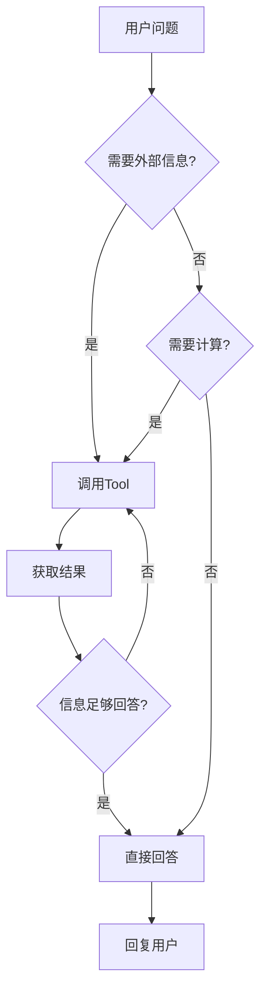

# 3-1 ReActAgent是怎么工作的

> **目标**：理解ReActAgent的Thought-Action-Observation循环

---

## 🎯 这一章的目标

学完之后，你能：
- 理解ReAct的三个步骤
- 画出Agent思考的循环图
- 说出什么时候Agent会调用Tool

---

## 🚀 先跑起来

```python showLineNumbers
import agentscope
from agentscope.agent import ReActAgent
from agentscope.message import Msg
from agentscope.model import OpenAIChatModel
from agentscope.formatter import OpenAIChatFormatter
from agentscope.tool import Toolkit

# 初始化
agentscope.init(project="ReActDemo")

# 定义工具函数
def get_weather(city: str) -> str:
    """获取城市天气"""
    weather_data = {"北京": "晴，25°C", "上海": "阴，22°C"}
    return weather_data.get(city, "未知城市")

def calculate(a: float, b: float) -> str:
    """计算两个数的乘积"""
    return str(a * b)

# 创建Toolkit并注册工具
toolkit = Toolkit()
toolkit.register_tool_function(get_weather)
toolkit.register_tool_function(calculate)

# 创建ReActAgent
agent = ReActAgent(
    name="Assistant",
    model=OpenAIChatModel(api_key="...", model="gpt-4"),
    sys_prompt="你是一个有帮助的AI助手，可以使用工具来完成任务。",
    formatter=OpenAIChatFormatter(),
    toolkit=toolkit,  # 使用toolkit参数，不是tools列表
)

# 运行 - Agent会自动决定是否调用工具
import asyncio

async def main():
    response = await agent(Msg(
        name="user",
        content="北京今天天气怎么样？",
        role="user"
    ))
    print(response)

asyncio.run(main())
```

---

## 🔍 ReAct工作原理

### ReAct = **Re**ason + **Act**

```
┌─────────────────────────────────────────────────────────────┐
│                    ReAct 循环                              │
│                                                             │
│         ┌─────────────────────────────────────────┐       │
│         │                                         │       │
│         │    ┌─────────┐                         │       │
│         │    │ Thought │ 思考：我需要查天气         │       │
│         │    └────┬────┘                         │       │
│         │         │                               │       │
│         │         ▼                               │       │
│         │    ┌─────────┐                         │       │
│         │    │ Action  │ 行动：调用天气API        │       │
│         │    └────┬────┘                         │       │
│         │         │                               │       │
│         │         ▼                               │       │
│         │    ┌─────────┐                         │       │
│         │    │Observation│ 观察：API返回"晴，25度"│       │
│         │    └────┬────┘                         │       │
│         │         │                               │       │
│         │         └───────────┬───────────────────┘       │
│         │                     │                           │
│         │              继续循环？                          │
│         │                     │                           │
│         │              Yes ───┴──── No                    │
│         │                     │                           │
│         │                     ▼                           │
│         │               ┌─────────┐                       │
│         │               │ 回复用户 │                       │
│         └──────────────┴─────────┴───────────────────────┘│
└─────────────────────────────────────────────────────────────┘
```

### 具体例子

**用户问**："北京今天天气怎么样？"

```
Thought（思考）
───────────────────────────────────────────────────────────
Agent: "用户问天气，我需要调用天气API来获取信息。
       我还没有北京天气的数据，所以我应该调用天气工具。"

Action（行动）
───────────────────────────────────────────────────────────
Agent: 调用 search_weather(city="北京")

Observation（观察）
───────────────────────────────────────────────────────────
API返回: {"city": "北京", "weather": "晴", "temperature": 25}

Thought（再次思考）
───────────────────────────────────────────────────────────
Agent: "我得到了天气信息：北京今天是晴天，温度25度。
       这足够回答用户的问题了，不需要再调用其他工具。"

回复用户
───────────────────────────────────────────────────────────
Agent: "北京今天天气晴朗，温度25度，非常适合外出！"
```

---

## 🔍 什么时候调用Tool



**Agent决定调用Tool的场景**：
1. 需要获取实时信息（天气、股票、新闻）
2. 需要执行计算（数学计算、代码执行）
3. 需要访问外部服务（搜索、数据库）

---

## 🔬 关键代码段解析

### 代码段1：ReActAgent的创建 —— 为什么需要toolkit参数？

```python showLineNumbers
# 创建Toolkit并注册工具
toolkit = Toolkit()
toolkit.register_tool_function(get_weather)
toolkit.register_tool_function(calculate)

# 这是第33-40行
agent = ReActAgent(
    name="Assistant",
    model=OpenAIChatModel(api_key="...", model="gpt-4"),
    sys_prompt="你是一个有帮助的AI助手，可以使用工具来完成任务。",
    formatter=OpenAIChatFormatter(),
    toolkit=toolkit,  # 关键：传入toolkit对象
)
```

**思路说明**：

| 问题 | 答案 |
|------|------|
| 为什么要传`toolkit`？ | 告诉Agent它可以使用哪些工具 |
| 不传会怎样？ | Agent只能回复知识，无法获取实时信息或执行操作 |
| `Toolkit`是什么？ | 是一个工具容器，通过register_tool_function()注册工具函数 |

**工具 = Agent的手和脚**：

```
┌─────────────────────────────────────────────────────────────┐
│                      ReActAgent                             │
│                                                             │
│  ┌─────────────────────────────────────────────────────┐  │
│  │                    大脑（Model）                      │  │
│  │   思考：用户要什么？我需要调用什么工具？              │  │
│  └─────────────────────────────────────────────────────┘  │
│                           │                                │
│                           ▼                                │
│  ┌─────────────────────────────────────────────────────┐  │
│  │                    手脚（Tools）                      │  │
│  │   搜索、计算、访问数据库...                           │  │
│  └─────────────────────────────────────────────────────┘  │
│                                                             │
│  没有工具的Agent = 只有大脑，没有手脚的残疾人               │
└─────────────────────────────────────────────────────────────┘
```

**💡 设计思想**：ReActAgent的设计理念是"思考+行动"。Model负责思考（Reasoning），Tools负责行动（Acting）。两者结合，让Agent能真正"做事"而不是只"说话"。

---

### 代码段2：ReAct循环的内部逻辑

```python showLineNumbers
# 伪代码：ReActAgent的思考循环
async def __call__(self, user_input: str) -> Msg:
    # 1. 创建用户消息
    msg = Msg(name="user", content=user_input, role="user")

    # 2. 进入ReAct循环
    while True:
        # Step 1: Thought - 让模型思考下一步做什么
        thought_result = await self.model(<think prompt>)
        if "调用工具" in thought_result:
            # Step 2: Action - 调用工具
            tool_name, tool_args = parse_tool_call(thought_result)
            tool_result = await self.tools[tool_name](**tool_args)
            # Step 3: Observation - 把结果告诉模型
            continue  # 继续循环
        else:
            # 模型认为可以回答了
            return Msg(name="assistant", content=thought_result, role="assistant")
```

**思路说明**：

```
┌─────────────────────────────────────────────────────────────┐
│              ReAct循环的三个步骤                           │
│                                                             │
│   ① Thought（思考）                                        │
│   ┌─────────────────────────────────────────────────────┐ │
│   │ "用户要查天气，我需要调用search_weather工具"         │ │
│   └─────────────────────────────────────────────────────┘ │
│                          │                                │
│                          ▼                                │
│   ② Action（行动）                                        │
│   ┌─────────────────────────────────────────────────────┐ │
│   │ 调用 search_weather(city="北京")                    │ │
│   └─────────────────────────────────────────────────────┘ │
│                          │                                │
│                          ▼                                │
│   ③ Observation（观察）                                   │
│   ┌─────────────────────────────────────────────────────┐ │
│   │ 返回：{"weather": "晴", "temperature": 25}        │ │
│   └─────────────────────────────────────────────────────┘ │
│                          │                                │
│                          ▼                                │
│                    回到①继续思考                          │
│                                                             │
│   循环直到：模型认为"信息足够回答了"                       │
└─────────────────────────────────────────────────────────────┘
```

| 循环次数 | 操作 | 目的 |
|----------|------|------|
| 第1次 | Thought | 决定是否需要工具 |
| 第1次 | Action | 调用search_weather |
| 第1次 | Observation | 获取天气数据 |
| 第2次 | Thought | 判断是否还有需要 |
| 第2次 | Action（无） | 直接回答 |

**💡 设计思想**：ReAct循环的关键是**模型自我判断**何时停止。模型会根据已获取的信息，判断是否足够回答用户问题。这个判断由LLM自动完成，而不是硬编码。

---

### 代码段3：为什么ReAct比普通LLM更强大？

```python showLineNumbers
# 普通LLM调用
response = await model(Msg(name="user", content="北京天气怎么样？", role="user"))
# 只能回复："抱歉，我不知道当前天气..."

# ReActAgent调用
response = await agent(Msg(name="user", content="北京天气怎么样？", role="user"))
# 回复："北京今天晴天，25度..."
```

**思路说明**：

| 对比维度 | 普通LLM | ReActAgent |
|----------|---------|------------|
| 知识 | 训练数据 | 训练数据 + 实时工具 |
| 能力 | 只能回复 | 能查天气/搜信息/算数 |
| 局限 | 不知道实时信息 | 需要工具支持 |
| 适用 | 通用问题 | 需要行动的任务 |

```
┌─────────────────────────────────────────────────────────────┐
│              普通LLM vs ReActAgent                         │
│                                                             │
│   普通LLM：                                                │
│   ┌─────────┐                                              │
│   │ 输入    │ → ┌─────────┐ → ┌─────────┐                  │
│   │"天气？" │   │  LLM   │   │ 回复    │                  │
│   └─────────┘   └─────────┘   └─────────┘                  │
│                        │                                    │
│                        ▼                                    │
│                   "我不知道"（因为是旧的）                   │
│                                                             │
│   ReActAgent：                                              │
│   ┌─────────┐    ┌─────────┐    ┌─────────┐    ┌─────────┐│
│   │ 输入    │ → │ 思考    │ → │ 行动    │ → │ 回复    ││
│   │"天气？" │    │(调用工具)│    │(查API) │    │"晴天25°"││
│   └─────────┘    └─────────┘    └─────────┘    └─────────┘│
│                                                             │
│                   能获取实时信息！                          │
└─────────────────────────────────────────────────────────────┘
```

**💡 设计思想**：ReAct的核心洞察是"光靠脑子不够，还需要手脚"。LLM是聪明的大脑，但只有给它配上工具（手脚），它才能真正帮助用户完成需要外部信息的任务。

---

## 💡 Java开发者注意

ReAct循环类似Java的**状态机**或**命令模式**：

```java
// Java 状态机
public Response handle(Request request) {
    while (true) {
        State currentState = analyze(request);

        if (currentState == State.THINK) {
            Thought thought = think(request);
            request.setThought(thought);
        } else if (currentState == State.ACT) {
            ActionResult result = act(request);
            request.setObservation(result);
        } else if (currentState == State.DONE) {
            return respond(request);
        }
    }
}
```

| ReAct概念 | Java对照 | 说明 |
|-----------|----------|------|
| Thought | 分析 | 决定下一步做什么 |
| Action | 执行 | 调用工具/方法 |
| Observation | 结果 | 获取执行结果 |
| 循环 | while/switch | 直到完成 |

---

## 🎯 思考题

<details>
<summary>点击查看答案</summary>

1. **Agent什么时候会停止ReAct循环？**
   - 模型判断"信息足够回答问题了"
   - 或者达到最大循环次数（防止死循环）

2. **如果Tool返回错误会怎样？**
   - Agent会收到错误信息
   - 可能在Thought中决定重试
   - 或者告诉用户无法完成

3. **ReAct和普通LLM调用的区别？**
   - 普通LLM：直接返回回复
   - ReAct：思考→行动→观察→回复，更像人类解决问题的方式

</details>

---

★ **Insight** ─────────────────────────────────────
- **ReAct = Thought + Action + Observation**，模仿人类的思考方式
- Agent会**循环思考直到有足够信息**回答问题
- Tool是Agent的**手脚**，让它能获取外部信息
─────────────────────────────────────────────────
