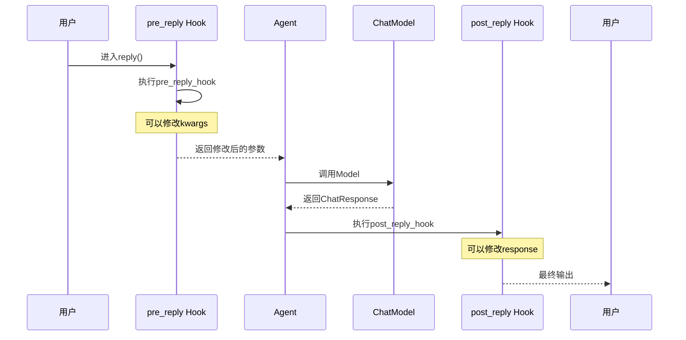
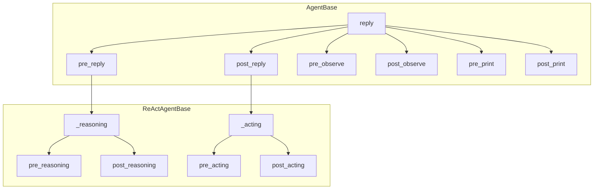

# 3-2 Hook机制详解

> **目标**：理解Hook拦截器模式以及如何自定义Hook来监控和修改Agent行为

---

## 学习目标

学完本章后，你能：
- 理解Hook的10种类型（AgentBase的6种 + ReActAgentBase的4种）
- 创建自定义Hook函数
- 注册和使用Hook（实例级和类级别）
- 使用Hook做日志、监控、内容过滤

---

## 背景问题

### 为什么需要Hook？

在Agent执行过程中，有时需要：
- **监控**：记录每次调用的情况
- **拦截**：在处理前修改输入或输出
- **过滤**：过滤敏感内容
- **统计**：收集性能指标

**问题**：如果直接在Agent代码中写这些逻辑，会：
- 污染核心代码
- 难以复用
- 难以移除

**解决方案**：Hook——不改变核心逻辑的情况下，插入额外处理。

```
┌─────────────────────────────────────────────────────────────┐
│                    Hook 拦截原理                            │
│                                                             │
│   用户请求                                                  │
│       │                                                    │
│       ▼                                                    │
│   ┌─────────────────────────────────────────────────────┐  │
│   │  pre_reply Hook                                     │  │
│   │  - 可以修改消息                                     │  │
│   │  - 可以记录日志                                     │  │
│   │  - 返回修改后的消息                                 │  │
│   └─────────────────────────────────────────────────────┘  │
│       │                                                    │
│       ▼                                                    │
│   ┌─────────────────────────────────────────────────────┐  │
│   │  Agent 核心逻辑（不改变）                            │  │
│   └─────────────────────────────────────────────────────┘  │
│       │                                                    │
│       ▼                                                    │
│   ┌─────────────────────────────────────────────────────┐  │
│   │  post_reply Hook                                    │  │
│   │  - 可以记录响应                                     │  │
│   │  - 可以监控性能                                     │  │
│   │  - 可以修改返回（可选）                             │  │
│   └─────────────────────────────────────────────────────┘  │
│       │                                                    │
│       ▼                                                    │
│   返回给用户                                              │
└─────────────────────────────────────────────────────────────┘
```

---

## 源码入口

### 核心文件

| 文件路径 | 类/方法 | 说明 |
|---------|--------|------|
| `src/agentscope/agent/_agent_base.py` | `AgentBase` | Agent基类，Hook注册和调用逻辑 |
| `src/agentscope/agent/_react_agent_base.py` | `ReActAgentBase` | ReActAgent基类，额外的Hook类型 |
| `src/agentscope/types/_hook.py` | `Hook类型定义` | Hook相关类型定义 |

### 类继承关系

```
AgentBase
├── supported_hook_types: list[str]  # 支持的Hook类型
├── _instance_hooks: OrderedDict     # 实例级Hook
├── _class_hooks: dict              # 类级别Hook
├── register_instance_hook()        # 注册实例Hook
└── register_class_hook()           # 注册类Hook

ReActAgentBase(AgentBase)
├── supported_hook_types: list[str]  # 新增4种Hook
├── _reasoning()                    # 抽象方法
└── _acting()                       # 抽象方法
```

### 关键方法

| 方法 | 位置 | 作用 |
|------|------|------|
| `register_instance_hook(hook_type, name, func)` | `_agent_base.py` | 注册实例级Hook |
| `register_class_hook(hook_type, name, func)` | `_agent_base.py` | 注册类级别Hook |
| `_call_hooks(hook_type, phase, kwargs, output)` | `_agent_base.py` | 调用Hook链 |
| `_instance_pre_reasoning_hooks` | `_react_agent_base.py` | 推理前Hook |
| `_instance_post_reasoning_hooks` | `_react_agent_base.py` | 推理后Hook |

---

## 架构定位

### Hook类型总览

**AgentBase的6种Hook类型**：

| Hook类型 | 触发时机 | 典型用途 |
|----------|----------|----------|
| `pre_reply` | `reply()`前 | 日志、修改消息、访问控制 |
| `post_reply` | `reply()`后 | 监控、统计、修改响应 |
| `pre_observe` | `observe()`前 | 过滤结果 |
| `post_observe` | `observe()`后 | 记录日志 |
| `pre_print` | `print()`前 | 格式化输出 |
| `post_print` | `print()`后 | 记录日志 |

**ReActAgentBase额外增加的4种Hook类型**（共10种）：

| Hook类型 | 触发时机 | 典型用途 |
|----------|----------|----------|
| `pre_reasoning` | `_reasoning()`前 | 记录输入、修改提示词 |
| `post_reasoning` | `_reasoning()`后 | 记录思考过程 |
| `pre_acting` | `_acting()`前 | 记录工具调用意图 |
| `post_acting` | `_acting()`后 | 记录工具结果 |

### Hook执行顺序

```
┌─────────────────────────────────────────────────────────────┐
│                    Hook执行顺序                              │
│                                                             │
│   pre_reply Hook1 ──► pre_reply Hook2 ──► Agent ──►       │
│       │                                                    │
│       ▼                                                    │
│   post_reply Hook1 ◄── post_reply Hook2 ◄──             │
│                                                             │
│   按注册顺序执行（先进先出）                              │
└─────────────────────────────────────────────────────────────┘
```

### 与其他模块的关系

```
Hook系统
    │
    ├── 与Agent的关系：拦截Agent执行流程
    │
    ├── 与Model的关系：通过Hook可以修改传给Model的输入
    │
    └── 与Memory的关系：Hook可以访问和修改Memory内容
```

---

## 核心源码分析

### 1. Hook的数据结构

**源码**：`src/agentscope/agent/_react_agent_base.py:20-80`

```python
# 类级别Hook（所有实例共享）
_class_pre_reasoning_hooks: dict[
    str,  # hook_name
    Callable[
        ["ReActAgentBase", dict[str, Any]],  # (self, kwargs)
        dict[str, Any] | None,  # 返回修改后的kwargs
    ],
] = OrderedDict()

_class_post_reasoning_hooks: dict[
    str,
    Callable[
        ["ReActAgentBase", dict[str, Any], Any],  # (self, kwargs, output)
        Msg | None,  # 返回修改后的output
    ],
] = OrderedDict()

# 实例级别Hook（仅当前实例）
_instance_pre_reasoning_hooks: OrderedDict() = OrderedDict()
_instance_post_reasoning_hooks: OrderedDict() = OrderedDict()
```

**设计思想**：
- 使用`OrderedDict`保持插入顺序
- 类级别Hook所有实例共享
- 实例级别Hook只影响当前实例

### 2. 注册Hook

**源码**：`src/agentscope/agent/_agent_base.py:533`

```python
def register_instance_hook(
    self,
    hook_type: str,
    hook_name: str,
    hook_func: Callable,
) -> None:
    """注册实例级Hook

    Args:
        hook_type: Hook类型（如"pre_reply"）
        hook_name: Hook名称（唯一标识）
        hook_func: Hook回调函数
    """
    if hook_type not in self.supported_hook_types:
        raise ValueError(f"Unsupported hook type: {hook_type}")

    # 存储到实例字典
    hook_dict = getattr(self, f"_instance_{hook_type}_hooks")
    hook_dict[hook_name] = hook_func
```

### 3. Hook回调函数签名

**pre_* Hook的签名**：
```python
def pre_reply_hook(
    self,          # Agent实例
    kwargs: dict,  # 传给reply()的参数，如{"msg": Msg(...)}
) -> dict | None:
    """返回修改后的kwargs，或返回None跳过后续处理"""
    return kwargs
```

**post_* Hook的签名**：
```python
def post_reply_hook(
    self,          # Agent实例
    kwargs: dict,  # 原始参数
    response: Msg, # reply()的返回值
) -> Msg | None:
    """返回修改后的response，或返回None使用原值"""
    return response
```

### 4. 调用Hook链

**源码**：`src/agentscope/agent/_agent_base.py:560+`

```python
def _call_hooks(
    self,
    hook_type: str,
    phase: str,  # "pre" 或 "post"
    kwargs: dict,
    output: Any = None,
) -> tuple[dict, Any]:
    """调用Hook链，返回修改后的kwargs和output"""

    # 1. 先调用类级别Hook
    class_hooks = getattr(self, f"_class_{hook_type}_hooks", {})
    for name, func in class_hooks.items():
        if phase == "pre":
            result = func(self, kwargs)
            if result is not None:
                kwargs = result
        else:  # post
            result = func(self, kwargs, output)
            if result is not None:
                output = result

    # 2. 再调用实例级别Hook（实例级优先，可以覆盖类级）
    instance_hooks = getattr(self, f"_instance_{hook_type}_hooks", {})
    for name, func in instance_hooks.items():
        if phase == "pre":
            result = func(self, kwargs)
            if result is not None:
                kwargs = result
        else:
            result = func(self, kwargs, output)
            if result is not None:
                output = result

    return kwargs, output
```

### 5. 典型Hook实现

**日志Hook**：
```python
def logging_post_reply(agent, kwargs, response):
    logger.info(f"{agent.name} 回复: {response.content[:100]}")
    return response
```

**敏感词过滤Hook**：
```python
def content_filter_pre_reply(agent, kwargs):
    msg = kwargs.get("msg")
    msg.content = filter_sensitive_words(msg.content)
    kwargs["msg"] = msg
    return kwargs
```

**性能监控Hook**：
```python
def metrics_post_reply(agent, kwargs, response):
    elapsed = time.time() - agent._hook_start_time
    metrics.record(f"{agent.name}.latency", elapsed)
    return response
```

---

## 可视化结构

### Hook执行时序图



### Hook类型位置图



---

## 工程经验

### 设计原因

1. **为什么用字典存储Hook？**
   - 支持同名Hook覆盖（实例级覆盖类级）
   - 便于按名称移除Hook

2. **为什么Hook返回None有特殊含义？**
   - `pre` Hook返回None：跳过后续处理
   - `post` Hook返回None：使用原值不修改

3. **为什么区分实例级和类级别？**
   - 类级别：所有实例共享，用于框架级拦截
   - 实例级别：单个实例自定义，用于应用级拦截

### 常见问题

#### 问题1：Hook返回None导致消息消失

**原因**：`pre_reply`返回None会跳过后续处理

```python
# 错误示例
def bad_hook(agent, kwargs):
    if is_invalid(kwargs["msg"]):
        return None  # 消息被丢弃了！
    return kwargs
```

**正确做法**：
```python
def good_hook(agent, kwargs):
    if is_invalid(kwargs["msg"]):
        # 替换为错误消息，而不是返回None
        kwargs["msg"] = Msg(name="system", content="无效输入", role="system")
    return kwargs
```

#### 问题2：类级别Hook影响所有实例

**场景**：注册了一个类级别Hook，发现所有Agent实例都被影响了

**解决**：
```python
# 使用实例级别Hook，只影响当前实例
agent.register_instance_hook("pre_reply", "my_hook", my_hook)

# 或者在Hook内部判断实例
def class_hook(agent, kwargs):
    if agent.name == "SpecificAgent":  # 只处理特定实例
        # 处理逻辑
        pass
    return kwargs
```

#### 问题3：Hook中不能使用async函数

**原因**：Hook调用链是同步的，不支持async

```python
# 错误示例
async def async_hook(agent, kwargs):
    result = await some_async_call()  # 不支持！
    return kwargs

# 正确做法：在Hook中用线程池
def sync_hook(agent, kwargs):
    result = thread_pool.submit(sync_call)  # 同步方式调用
    return kwargs
```

---

## Contributor指南

### 适合新手修改的文件

| 文件 | 原因 |
|------|------|
| `src/agentscope/agent/_agent_base.py` | Hook注册和调用逻辑，结构清晰 |
| `src/agentscope/agent/_react_agent_base.py` | ReActAgent额外Hook实现 |

### 危险修改区域

**警告**：

1. **`_call_hooks()`方法**（`_agent_base.py:560`）
   - 决定了Hook的执行顺序
   - 错误修改可能导致Hook不执行或重复执行

2. **Hook返回值处理**
   - `None`返回值有特殊含义
   - 错误处理可能导致消息丢失或异常

### 添加新Hook类型

**步骤1**：在`supported_hook_types`中添加新类型

```python
# src/agentscope/agent/_agent_base.py 或 _react_agent_base.py
supported_hook_types: list[str] = [
    # ... 现有类型 ...
    "new_hook_type",  # 新增
]
```

**步骤2**：添加新的Hook存储属性

```python
# 在__init__中
self._instance_new_hook_type_hooks = OrderedDict()
self._class_new_hook_type_hooks = {}
```

**步骤3**：在`_call_hooks()`中添加调用逻辑

### 调试Hook

**打印Hook注册情况**：
```python
print(f"实例Hook: {agent._instance_pre_reply_hooks}")
print(f"类Hook: {ReActAgent._class_pre_reply_hooks}")
```

**临时禁用Hook**：
```python
# 备份
original_hooks = agent._instance_pre_reply_hooks.copy()
# 清空
agent._instance_pre_reply_hooks.clear()
# 恢复
agent._instance_pre_reply_hooks = original_hooks
```

---

★ **Insight** ─────────────────────────────────────
- **Hook是拦截器**：在不改变核心逻辑的情况下，增加处理
- **10种类型**覆盖了Agent处理的各个阶段
- Hook是**普通函数**，不是类
- 类似Java的AOP拦截器或Servlet Filter
- 实例级Hook会覆盖同名的类级别Hook
─────────────────────────────────────────────────
