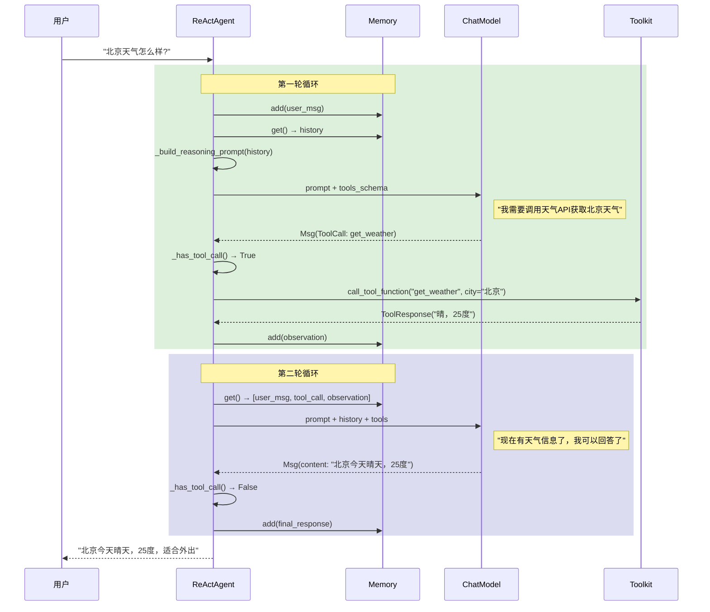
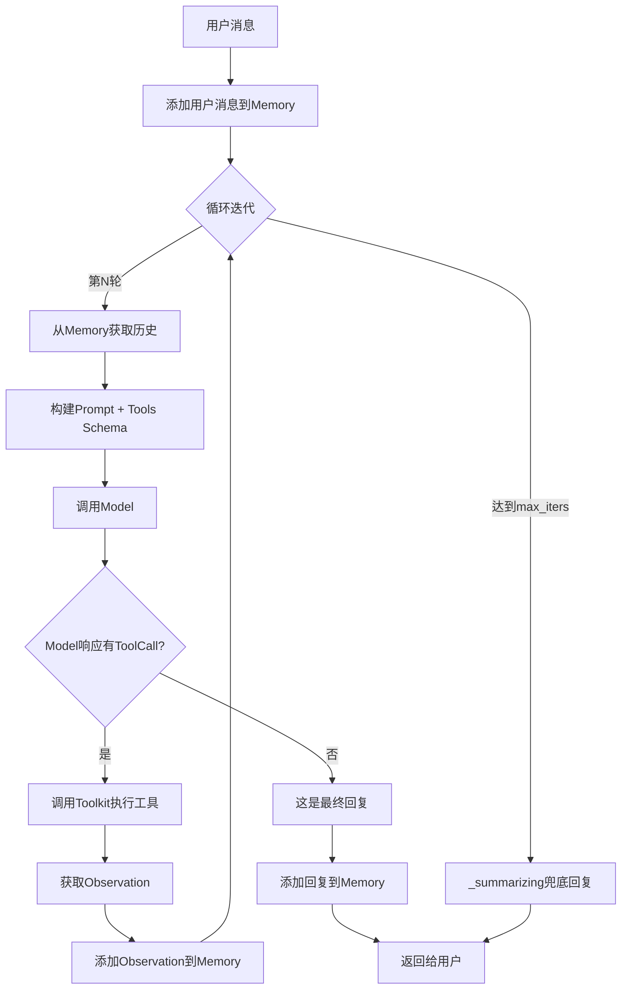

# 3-3 追踪Agent思考过程

> **目标**：通过具体案例，理解Agent内部思考循环的完整执行流程

---

## 学习目标

学完本章后，你能：
- 理解Agent思考的内部完整过程
- 画出完整的问题解决流程图
- 调试Agent的思考逻辑
- 识别和解决Agent循环问题

---

## 背景问题

### 为什么需要理解思考过程？

当Agent行为不符合预期时（如：
- 不调用应该调用的工具
- 无限循环调用同一工具
- 回复内容不相关

），需要追踪内部执行过程来定位问题。

### 思考过程的本质

Agent的"思考"实际上是一个**结构化输出+工具调用解析**的过程：

```
┌─────────────────────────────────────────────────────────────┐
│  Agent思考的本质                                            │
│                                                             │
│  1. 构建Prompt                                            │
│     system_prompt + 历史消息 + 可用工具 + 用户问题          │
│                                                             │
│  2. 发送给LLM                                              │
│     LLM分析后返回结构化响应                                │
│                                                             │
│  3. 解析LLM响应                                            │
│     判断是否有tool_call                                     │
│     - 有：执行工具，进入下一轮                             │
│     - 无：生成回复，结束                                   │
└─────────────────────────────────────────────────────────────┘
```

---

## 源码入口

### 核心文件

| 文件路径 | 类/方法 | 说明 |
|---------|--------|------|
| `src/agentscope/agent/_react_agent.py` | `ReActAgent.reply()` | 核心循环入口 |
| `src/agentscope/agent/_react_agent.py` | `_reasoning()` | 推理实现 |
| `src/agentscope/agent/_react_agent.py` | `_acting()` | 行动实现 |
| `src/agentscope/agent/_react_agent_base.py` | `ReActAgentBase` | 基类定义 |
| `src/agentscope/agent/_agent_base.py` | `AgentBase.reply()` | Agent入口 |

### 调用链

```
用户调用 agent(Msg)
    │
    └── AgentBase.__call__(msg)
            │
            └── ReActAgent.reply(msg)
                    │
                    ├── 循环 (for _ in range(max_iters))
                    │       │
                    │       ├── _reasoning() → LLM思考
                    │       │
                    │       ├── _acting() → 执行工具或生成回复
                    │       │
                    │       └── _is_terminated() → 判断是否结束
                    │
                    └── 返回最终Msg
```

---

## 架构定位

### 模块职责

追踪思考过程涉及以下组件：

1. **Memory**：保存对话历史和观察结果
2. **Model**：执行LLM推理
3. **Toolkit**：管理可用工具和执行
4. **Formatter**：格式化输入输出

### 执行流程

```
┌─────────────────────────────────────────────────────────────┐
│              Agent思考循环完整流程                         │
│                                                             │
│  ┌─────────────────────────────────────────────────────┐  │
│  │ 第一轮循环                                          │  │
│  │                                                     │  │
│  │ _reasoning():                                       │  │
│  │   1. 从Memory获取历史                              │  │
│  │   2. 构建Prompt（sys_prompt + history + tools）   │  │
│  │   3. 调用model(prompt, tools=schemas)             │  │
│  │   4. 返回包含Thought的Msg                          │  │
│  │                                                     │  │
│  │ _acting():                                          │  │
│  │   1. 检查Msg是否有ToolCall                        │  │
│  │   2. 有ToolCall → 调用Toolkit → 返回Observation     │  │
│  │   3. 无ToolCall → 这是最终回复                     │  │
│  └─────────────────────────────────────────────────────┘  │
│                          │                                 │
│                          ▼                                 │
│  ┌─────────────────────────────────────────────────────┐  │
│  │ 第二轮循环（如果需要）                              │  │
│  │                                                     │  │
│  │ 这次调用model时，Prompt包含：                      │  │
│  │ - sys_prompt                                       │  │
│  │ - 用户原始问题                                      │  │
│  │ - 第一轮的ToolCall                                 │  │
│  │ - 第一轮的Observation                              │  │
│  │                                                     │  │
│  │ LLM现在知道第一轮的结果，继续推理                  │  │
│  └─────────────────────────────────────────────────────┘  │
│                                                             │
│  循环直到：                                                │
│  - LLM判断"信息足够回答"                                  │
│  - 或达到max_iters上限                                    │
└─────────────────────────────────────────────────────────────┘
```

---

## 核心源码分析

### 1. reply()主循环

**源码**：`src/agentscope/agent/_react_agent.py:376-450`

```python
async def reply(
    self,
    msg: Msg,
    # ...
) -> Msg:
    """ReActAgent的核心循环"""
    # 添加用户消息到Memory
    await self.memory.add(msg)

    # 进入ReAct循环
    for iteration in range(self.max_iters):
        # 1. 推理：让LLM思考
        msg_reasoning = await self._reasoning()

        # 2. 行动：执行工具或生成回复
        msg_acting = await self._acting(msg_reasoning)

        # 3. 检查是否应该结束
        if self._is_terminated(msg_reasoning, msg_acting):
            # 保存LLM回复到Memory
            await self.memory.add(msg_acting)
            return msg_acting

        # 4. 工具调用结果存入Memory，继续循环
        await self.memory.add(msg_acting)

    # 超出max_iters，生成兜底回复
    return await self._summarizing()
```

### 2. _reasoning()推理

**源码**：`src/agentscope/agent/_react_agent.py:540-580`

```python
async def _reasoning(self, *args: Any, **kwargs: Any) -> Msg:
    """让LLM进行推理"""

    # 1. 获取历史消息
    history = await self.memory.get()

    # 2. 构建Prompt
    prompt = self._build_reasoning_prompt(history)

    # 3. 调用Model
    #    关键：传入tools参数，让LLM知道有哪些工具可用
    response = await self.model(
        prompt,
        tools=self.toolkit.get_json_schemas() if self.toolkit else None,
        tool_choice=self.tool_choice,
    )

    return response
```

**关键点**：
- `self.toolkit.get_json_schemas()` 返回工具定义列表
- LLM根据这些定义决定是否调用工具、调用哪个
- `tool_choice`参数控制LLM的工具调用行为（"auto", "none", "required"）

### 3. _acting()行动

**源码**：`src/agentscope/agent/_react_agent.py:600-650`

```python
async def _acting(self, msg_reasoning: Msg) -> Msg:
    """执行行动或返回最终回复"""

    # 检查是否有ToolCall
    if self._has_tool_call(msg_reasoning):
        # 执行工具调用
        return await self._call_tool(msg_reasoning)
    else:
        # 没有ToolCall，这是最终回复
        return msg_reasoning
```

### 4. _call_tool()工具调用

**源码**：`src/agentscope/agent/_react_agent.py:650-700`

```python
async def _call_tool(self, msg_reasoning: Msg) -> Msg:
    """调用工具并返回Observation"""

    # 1. 解析ToolCall
    tool_calls = self._parse_tool_calls(msg_reasoning)

    # 2. 调用工具
    for tool_call in tool_calls:
        try:
            tool_res = await self.toolkit.call_tool_function(tool_call)
        except Exception as e:
            # 工具执行失败，记录错误
            tool_res = ToolResponse(
                content=[TextBlock(text=f"Error: {e}")]
            )

    # 3. 构建Observation消息
    tool_res_msg = Msg(
        name="system",
        content=[ToolResultBlock(content=tool_res)],
        role="system"
    )

    return tool_res_msg
```

### 5. _is_terminated()判断结束

**源码**：`src/agentscope/agent/_react_agent.py:530`

```python
def _is_terminated(self, msg_reasoning: Msg, msg_acting: Msg) -> bool:
    """判断是否应该结束循环"""

    # 如果msg_acting没有ToolCall，说明LLM决定直接回复
    if not self._has_tool_call(msg_acting):
        return True

    # 如果达到最大循环次数，也结束
    return False
```

---

## 可视化结构

### 完整时序图



### 思考过程流程图



---

## 工程经验

### 设计原因

1. **为什么每次循环都要调用Memory.get()？**
   - LLM需要完整上下文才能正确推理
   - 每次循环都要重新构建Prompt

2. **为什么Tool结果要存入Memory？**
   - 作为下一轮循环的上下文
   - 让LLM能看到之前的观察结果

3. **为什么用max_iters限制？**
   - 防止LLM判断逻辑有问题时无限循环
   - 兜底机制确保Agent不会卡死

### 调试方法

#### 方法1：开启verbose模式

```python
agent = ReActAgent(
    name="DebugAgent",
    model=model,
    verbose=True  # 打印思考过程
)
```

#### 方法2：手动打印Memory

```python
# 打印完整对话历史
history = agent.memory.get()
for i, msg in enumerate(history):
    print(f"[{i}] {msg.name}: {msg.content[:100]}...")
```

#### 方法3：使用Hook拦截

```python
def log_reasoning(agent, kwargs, output):
    print("=" * 50)
    print(f"=== Reasoning输出 ===")
    print(f"内容: {output.content[:200]}")
    if hasattr(output, 'tool_calls'):
        print(f"工具调用: {output.tool_calls}")
    print("=" * 50)
    return output

agent.register_instance_hook("post_reasoning", "log", log_reasoning)
```

#### 方法4：分析LLM原始响应

```python
# 在_reasoning()中，打印原始LLM响应
async def _reasoning(self, *args, **kwargs):
    response = await self.model(...)
    print(f"LLM原始响应: {response}")
    return response
```

### 常见问题

#### 问题1：Agent无限循环调用同一工具

**原因**：
- 工具返回信息不够完整
- LLM判断逻辑有问题

**诊断**：
```python
# 检查工具返回
result = await toolkit.call_tool_function(...)
print(f"工具返回: {result}")

# 检查LLM在想什么
print(f"Model思考: {reasoning_output}")
```

**解决**：
```python
# 方案1：增大max_iters
agent = ReActAgent(max_iters=30, ...)

# 方案2：改进工具返回内容
def better_tool(...):
    # 返回更完整的信息
    return ToolResponse(content=[TextBlock(text=f"详细结果: {result}")])

# 方案3：调整system prompt
sys_prompt = "你是一个有帮助的助手。如果已经获取足够信息，请直接回复用户，不要继续调用工具。"
```

#### 问题2：Agent过早结束，不调用应该调用的工具

**原因**：
- LLM判断"不需要工具"但实际需要
- system prompt引导不够清晰

**诊断**：
```python
# 检查LLM的原始响应
print(f"LLM响应: {reasoning_output}")
# 如果直接回复，说明LLM认为不需要工具
```

**解决**：
```python
# 方案1：使用tool_choice="required"强制工具调用
agent = ReActAgent(tool_choice="required", ...)

# 方案2：改进system prompt
sys_prompt = "当你需要获取外部信息时（如天气、新闻、计算结果），必须调用相应工具。"
```

#### 问题3：Token超出限制

**原因**：Memory中积累太多消息

**诊断**：
```python
# 检查Memory大小
history = agent.memory.get()
total_tokens = sum(len(str(m)) for m in history)
print(f"Memory总Token数: {total_tokens}")
```

**解决**：
```python
# 使用滑动窗口Memory
agent = ReActAgent(
    memory=InMemoryMemory(window=10),  # 只保留最近10条
    ...
)
```

---

## Contributor指南

### 适合新手修改的文件

| 文件 | 原因 |
|------|------|
| `src/agentscope/agent/_react_agent.py` | 核心循环逻辑清晰 |
| `src/agentscope/agent/_react_agent_base.py` | 基类定义明了 |

### 危险修改区域

**警告**：

1. **`reply()`循环逻辑**（`_react_agent.py:376`）
   - 核心循环，修改需谨慎
   - 测试建议：创建多轮Tool调用场景验证

2. **`_is_terminated()`判断**（`_react_agent.py:530`）
   - 决定何时结束循环
   - 错误可能导致无法正常回复

### 调试工具

**打印调用链**：
```python
import logging
logging.basicConfig(level=logging.DEBUG)
```

**Hook追踪**：
```python
def trace_hook(agent, kwargs, output):
    print(f"Hook触发: {kwargs}")
    return output

ReActAgent.register_class_hook("post_reasoning", "trace", trace_hook)
ReActAgent.register_class_hook("post_acting", "trace", trace_hook)
```

---

★ **Insight** ─────────────────────────────────────
- Agent思考本质是**结构化Prompt + LLM调用 + 工具调用解析**
- 每次循环都会**重新构建Prompt**包含完整上下文
- **Memory是上下文的核心**，保存历史消息和观察结果
- 调试时要**追踪LLM原始输出**，看它在想什么
─────────────────────────────────────────────────
