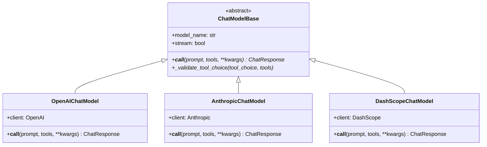
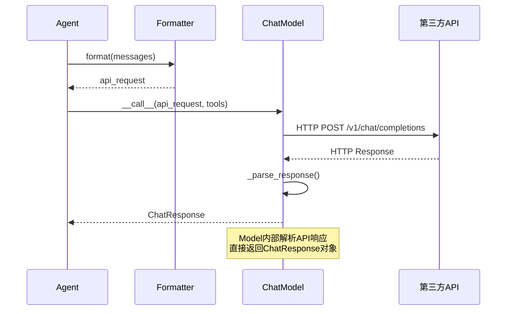

# 4-1 统一接口：ChatModelBase

> **目标**：理解ChatModelBase如何统一不同LLM模型的调用方式

---

## 学习目标

学完本章后，你能：
- 理解ChatModelBase抽象接口的设计
- 使用统一代码调用不同模型（OpenAI、Claude、DashScope等）
- 理解依赖倒置原则在架构中的应用
- 添加新的模型支持

---

## 背景问题

### 问题：每个模型的API都不同

```
OpenAI API:
{
  "model": "gpt-4",
  "messages": [{"role": "user", "content": "..."}]
}

Claude API:
{
  "model": "claude-3-opus",
  "prompt": "user: ...\nassistant:",
  "max_tokens": 1024
}

DashScope API:
{
  "model": "qwen-max",
  "input": {"messages": [...]},
  "parameters": {...}
}
```

**如果应用直接依赖这些API会怎样？**
- 换模型需要改大量代码
- 测试困难（无法Mock）
- 难以同时支持多个模型

### 解决方案：适配器模式

```
┌─────────────────────────────────────────────────────────────┐
│                     应用层                                  │
│                                                             │
│  Agent 只调用 model(prompt)                                │
│                      │                                      │
│                      ▼                                      │
│              ┌─────────────────┐                           │
│              │  ChatModelBase   │ ← 统一接口               │
│              │  (抽象)           │                          │
│              └────────┬────────┘                           │
│                       │                                      │
│         ┌─────────────┼─────────────┐                       │
│         ▼             ▼             ▼                       │
│  ┌───────────┐ ┌───────────┐ ┌───────────┐                 │
│  │  OpenAI  │ │  Claude  │ │ DashScope │                 │
│  │   Model  │ │   Model  │ │   Model   │                 │
│  └───────────┘ └───────────┘ └───────────┘                 │
│                                                             │
│  每个Model只需实现统一的__call__接口                        │
└─────────────────────────────────────────────────────────────┘
```

---

## 源码入口

### 核心文件

| 文件路径 | 类 | 说明 |
|---------|-----|------|
| `src/agentscope/model/_model_base.py` | `ChatModelBase` | 抽象基类 |
| `src/agentscope/model/_openai_model.py` | `OpenAIChatModel` | OpenAI实现 |
| `src/agentscope/model/_anthropic_model.py` | `AnthropicChatModel` | Claude实现 |
| `src/agentscope/model/_dashscope_model.py` | `DashScopeChatModel` | 通义实现 |
| `src/agentscope/model/_gemini_model.py` | `GeminiChatModel` | Gemini实现 |
| `src/agentscope/model/_ollama_model.py` | `OllamaChatModel` | Ollama实现 |

### 类继承关系

```
ChatModelBase (abstract)
├── OpenAIChatModel
├── AnthropicChatModel
├── DashScopeChatModel
├── GeminiChatModel
└── OllamaChatModel
```

### 关键接口

```python
# src/agentscope/model/_model_base.py
class ChatModelBase:
    """Base class for all chat models."""

    model_name: str
    stream: bool

    @abstractmethod
    async def __call__(
        self,
        *args: Any,
        **kwargs: Any,
    ) -> ChatResponse | AsyncGenerator[ChatResponse, None]:
        """统一的调用接口"""
        pass
```

---

## 架构定位

### 模块职责

ChatModelBase是AgentScope的**模型适配层**，负责：
1. 封装不同LLM API的调用细节
2. 提供统一的异步调用接口
3. 处理响应解析和错误转换
4. 支持流式输出

### 生命周期

```
┌─────────────────────────────────────────────────────────────┐
│              ChatModel生命周期                              │
│                                                             │
│  1. __init__(model_name, api_key, stream, ...)           │
│     └── 初始化特定模型的客户端                             │
│                                                             │
│  2. __call__(messages, tools, **kwargs)                   │
│     └── 格式化请求 → 调用API → 解析响应                    │
│                                                             │
│  3. 返回ChatResponse或AsyncGenerator                       │
└─────────────────────────────────────────────────────────────┘
```

### 与其他模块的关系

```
Agent
    │
    └── model: ChatModelBase ← 被调用执行LLM推理
            │
            ├── 接收: formatter.format()的输出
            │
            └── 返回: ChatResponse（内部解析为Msg）
```

---

## 核心源码分析

### 1. ChatModelBase抽象基类

**源码**：`src/agentscope/model/_model_base.py`

```python
class ChatModelBase:
    """Base class for chat models."""

    model_name: str
    """模型名称"""

    stream: bool
    """是否流式输出"""

    def __init__(
        self,
        model_name: str,
        stream: bool,
    ) -> None:
        self.model_name = model_name
        self.stream = stream

    @abstractmethod
    async def __call__(
        self,
        *args: Any,
        **kwargs: Any,
    ) -> ChatResponse | AsyncGenerator[ChatResponse, None]:
        """统一的调用接口，子类必须实现"""
        pass

    def _validate_tool_choice(
        self,
        tool_choice: str,
        tools: list[dict] | None,
    ) -> None:
        """验证tool_choice参数"""
        if tool_choice in _TOOL_CHOICE_MODES:
            return
        # 验证是否是有效的函数名
        available_functions = [tool["function"]["name"] for tool in tools]
        if tool_choice not in available_functions:
            raise ValueError(...)
```

### 2. OpenAIChatModel实现

**源码**：`src/agentscope/model/_openai_model.py:71-200`

```python
class OpenAIChatModel(ChatModelBase):
    """OpenAI chat model implementation."""

    def __init__(
        self,
        model_name: str,
        api_key: str | None = None,
        stream: bool = True,
        client_type: Literal["openai", "azure"] = "openai",
        client_kwargs: dict | None = None,
        generate_kwargs: dict | None = None,
        # ...
    ) -> None:
        super().__init__(model_name, stream)

        # 初始化OpenAI客户端
        import openai
        self.client = openai.OpenAI(api_key=api_key, ...)

    async def __call__(
        self,
        prompt: list[dict],  # 来自Formatter的格式化结果
        **kwargs: Any,
    ) -> ChatResponse:
        """调用OpenAI API"""

        # 1. 提取参数
        messages = prompt
        tools = kwargs.get("tools")
        tool_choice = kwargs.get("tool_choice", "auto")

        # 2. 调用API
        if self.stream:
            response = await self.client.chat.completions.create(
                model=self.model_name,
                messages=messages,
                tools=tools,
                tool_choice=tool_choice,
                stream=True,
                **self.generate_kwargs,
            )
            return self._handle_streaming(response)
        else:
            response = await self.client.chat.completions.create(
                model=self.model_name,
                messages=messages,
                tools=tools,
                tool_choice=tool_choice,
                stream=False,
                **self.generate_kwargs,
            )
            return self._parse_response(response)
```

### 3. 模型调用示例

```python
# 创建不同模型的实例（调用方式一样）
openai_model = OpenAIChatModel(api_key="sk-xxx", model="gpt-4")
claude_model = AnthropicChatModel(api_key="sk-ant-xxx", model="claude-3-opus")
dashscope_model = DashScopeChatModel(api_key="sk-xxx", model="qwen-max")

# 传给Agent时，类型都是ChatModelBase
agent = ReActAgent(
    model=openai_model,  # 可以换成claude_model或dashscope_model
    ...
)

# 调用方式完全一样
response = await agent(Msg(name="user", content="你好", role="user"))
```

---

## 可视化结构

### 类图



### 调用时序图



---

## 工程经验

### 设计原因

1. **为什么用抽象基类而不是接口？**
   - Python没有interface关键字，用ABC模拟
   - 抽象方法强制子类实现统一接口

2. **为什么__call__是异步的？**
   - 网络调用需要等待IO
   - 异步设计提高并发性能

3. **为什么返回ChatResponse而不是dict？**
   - 类型安全，便于IDE提示
   - 统一格式，调用方不需要关心具体API响应结构

### 常见问题

#### 问题1：切换模型时Formatter也需要更换

**原因**：不同模型的API格式不同

```python
# OpenAI需要
{"messages": [{"role": "user", "content": "..."}]}

# Claude需要
{"prompt": "user: ...\nassistant:", "max_tokens": ...}
```

**解决**：
```python
# 切换模型时，Formatter也要一起换
agent = ReActAgent(
    model=AnthropicChatModel(...),
    formatter=AnthropicChatFormatter(),  # 必须换！
    ...
)
```

#### 问题2：模型调用是异步的

**错误**：
```python
# 错误：没有await
response = model(prompt)  # 返回协程对象，不是结果
```

**正确**：
```python
# 正确：需要await
response = await model(prompt)
```

#### 问题3：tool_choice参数无效

**原因**：tool_choice必须与tools参数配合使用

```python
# 错误：只有tool_choice没有tools
response = await model(prompt, tool_choice="required")

# 正确：同时提供tools
response = await model(
    prompt,
    tools=toolkit.get_json_schemas(),
    tool_choice="required"
)
```

### 添加新模型

**步骤1**：创建模型文件

```python
# src/agentscope/model/_new_model.py
class NewModelChatModel(ChatModelBase):
    def __init__(self, model_name: str, api_key: str, ...):
        super().__init__(model_name, stream=False)
        # 初始化客户端
        self.client = NewModelClient(api_key=api_key, ...)

    async def __call__(self, prompt, **kwargs) -> ChatResponse:
        # 1. 调用API
        response = await self.client.chat(...)
        # 2. 解析响应
        return self._parse_response(response)
```

**步骤2**：导出到__init__.py

```python
# src/agentscope/model/__init__.py
from ._new_model import NewModelChatModel
```

**步骤3**：创建对应的Formatter

```python
# src/agentscope/formatter/_new_formatter.py
class NewModelFormatter(FormatterBase):
    async def format(self, msgs: list[Msg]) -> dict:
        # 转换为NewModel API格式
        ...
```

---

## Contributor指南

### 适合新手修改的文件

| 文件 | 原因 |
|------|------|
| `src/agentscope/model/_openai_model.py` | 结构清晰，注释详细 |
| `src/agentscope/model/_model_base.py` | 基类简单明了 |

### 危险修改区域

**警告**：

1. **ChatModelBase的`__call__`签名**
   - 这是所有模型的统一接口
   - 修改签名会影响所有模型实现

2. **响应解析逻辑**
   - 错误可能导致返回格式不一致
   - 影响上层Agent的处理

### 调试方法

**打印API调用**：
```python
# 开启HTTP日志
import httpx
httpx_log = logging.getLogger("httpx")
httpx_log.setLevel(logging.DEBUG)
```

**检查响应结构**：
```python
response = await model(prompt)
print(f"响应类型: {type(response)}")
print(f"响应内容: {response}")
```

---

★ **Insight** ─────────────────────────────────────
- **ChatModelBase是适配器模式**：统一不同模型的调用方式
- **切换模型只需改一行**：提高可维护性
- **依赖倒置原则**：Agent依赖抽象(ChatModelBase)，不依赖具体实现
- **Formatter负责格式转换**：Model只关心API调用
─────────────────────────────────────────────────
