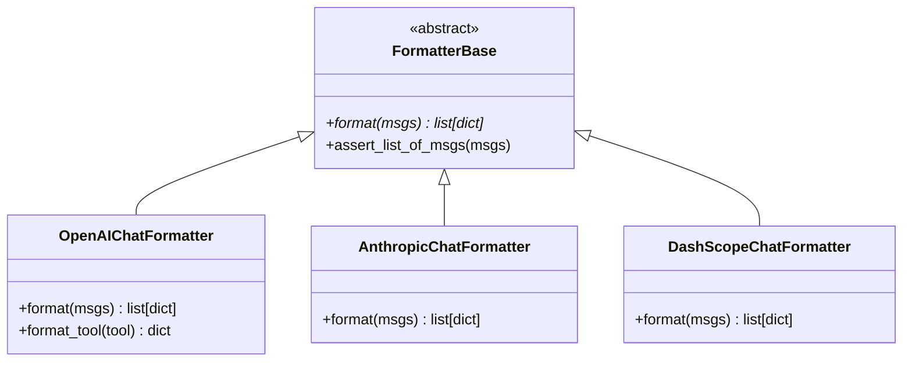

# 4-2 Formatter消息格式化

> **目标**：理解Formatter如何将统一消息格式转换为各API专用格式

---

## 学习目标

学完本章后，你能：
- 理解Formatter的转换作用
- 使用FormatterBase创建自定义格式化器
- 理解不同API需要不同Formatter的原因
- 调试Formatter相关问题

---

## 背景问题

### 问题：Msg统一格式 vs API专用格式

AgentScope内部使用`Msg`作为统一消息格式：

```python
# AgentScope内部格式
msg = Msg(
    name="user",
    content="你好",
    role="user"
)
```

但每个模型的API接受不同格式：

```
Msg (统一格式)
{name="user", content="你好", role="user"}
        │
        ▼
┌─────────────────────────────────────────────────────────────┐
│                    Formatter转换                            │
└─────────────────────────────────────────────────────────────┘
        │
        ├──► OpenAI格式
        │    {"messages": [{"role": "user", "content": [{"type": "text", "text": "你好"}]}]}
        │
        ├──► Claude格式
        │    {"prompt": "user: 你好\nassistant:"}
        │
        └──► DashScope格式
             {"input": {"messages": [...]}, "parameters": {...}}
```

### 解决方案：Formatter

```
┌─────────────────────────────────────────────────────────────┐
│              Formatter = 翻译官                             │
│                                                             │
│   Agent（用Msg思考）                                        │
│        │                                                   │
│        ▼ format()                                          │
│   API请求格式（JSON）                                       │
│        │                                                   │
│        ▼ API调用                                           │
│   API响应（JSON）                                          │
│        │                                                   │
│        ▼ Model内部解析                                      │
│   ChatResponse → Agent（继续用Msg思考）                      │
│                                                             │
│   Formatter让Agent和Model能用统一格式(Msg)交流              │
└─────────────────────────────────────────────────────────────┘
```

---

## 源码入口

### 核心文件

| 文件路径 | 类 | 说明 |
|---------|-----|------|
| `src/agentscope/formatter/_formatter_base.py` | `FormatterBase` | 抽象基类 |
| `src/agentscope/formatter/_openai_formatter.py` | `OpenAIChatFormatter` | OpenAI格式化器 |
| `src/agentscope/formatter/_anthropic_formatter.py` | `AnthropicChatFormatter` | Claude格式化器 |
| `src/agentscope/formatter/_dashscope_formatter.py` | `DashScopeChatFormatter` | 通义格式化器 |
| `src/agentscope/formatter/__init__.py` | 导出 | 公共API |

### 类继承关系

```
FormatterBase (abstract)
├── OpenAIChatFormatter
├── AnthropicChatFormatter
├── DashScopeChatFormatter
├── GeminiChatFormatter
└── OllamaChatFormatter
```

### 关键接口

```python
# src/agentscope/formatter/_formatter_base.py
class FormatterBase(ABC):
    """Base class for formatters."""

    @abstractmethod
    async def format(self, *args: Any, **kwargs: Any) -> list[dict[str, Any]]:
        """将Msg列表转换为API请求格式（异步方法）"""
        pass
```

---

## 架构定位

### 模块职责

Formatter是AgentScope的**格式转换层**，负责：
1. 将Msg列表转换为API请求格式
2. 处理多模态内容（文本、图片、音频等）
3. 提取工具Schema供LLM使用

### 生命周期

```
┌─────────────────────────────────────────────────────────────┐
│              Formatter在Agent调用中的位置                   │
│                                                             │
│  Agent                                                      │
│  ┌─────────────────────────────────────────────────────┐   │
│  │                                                     │   │
│  │   user_input ──► Msg ──► format() ──► API请求    │   │
│  │                            │                        │   │
│  │                            ▼                        │   │
│  │                        Formatter                   │   │
│  │                                                     │   │
│  │   response ◄────────── Msg ◄─── Model返回        │   │
│  │                            ▲                        │   │
│  │                            │                        │   │
│  │                        Formatter                   │   │
│  │                                                     │   │
│  └─────────────────────────────────────────────────────┘   │
│                                                             │
│  Formatter = Agent ↔ Model 的翻译官                        │
└─────────────────────────────────────────────────────────────┘
```

### 与其他模块的关系

```
Agent
    │
    ├── formatter: FormatterBase
    │       │
    │       └── format(messages) → list[dict] (API格式)
    │
    └── model: ChatModelBase
            │
            └── 接收format()的输出，调用API
```

---

## 核心源码分析

### 1. FormatterBase抽象基类

**源码**：`src/agentscope/formatter/_formatter_base.py`

```python
class FormatterBase(ABC):
    """The base class for formatters."""

    @abstractmethod
    async def format(self, *args: Any, **kwargs: Any) -> list[dict[str, Any]]:
        """Format the Msg objects to a list of dictionaries that satisfy the
        API requirements.

        Returns:
            list[dict[str, Any]]: 格式化后的请求列表
        """
        pass

    @staticmethod
    def assert_list_of_msgs(msgs: list[Msg]) -> None:
        """验证输入是Msg列表"""
        if not isinstance(msgs, list):
            raise TypeError("Input must be a list of Msg objects.")
        for msg in msgs:
            if not isinstance(msg, Msg):
                raise TypeError(f"Expected Msg, got {type(msg)}")
```

### 2. OpenAIChatFormatter实现

**源码**：`src/agentscope/formatter/_openai_formatter.py`

```python
class OpenAIChatFormatter(FormatterBase):
    """OpenAI format converter."""

    async def format(self, messages: list[Msg]) -> list[dict[str, Any]]:
        """将Msg列表转换为OpenAI API格式"""
        formatted = []

        for msg in messages:
            # 处理消息内容（支持多模态）
            content = []
            for block in msg.get_content_blocks():
                if block.get("type") == "text":
                    content.append({
                        "type": "text",
                        "text": block.get("text", "")
                    })
                elif block.get("type") == "image":
                    content.append({
                        "type": "image_url",
                        "image_url": block.get("url")
                    })

            formatted.append({
                "role": msg.role,
                "name": msg.name,
                "content": content
            })

        return formatted
```

**转换示例**：

```
输入: Msg(name="user", content="你好", role="user")

输出: [{
    "role": "user",
    "name": "user",
    "content": [{"type": "text", "text": "你好"}]
}]
```

### 3. 工具Schema格式化

**源码**：`src/agentscope/formatter/_openai_formatter.py`

```python
def format_tool(self, tool: Callable) -> dict:
    """将Python函数转换为OpenAI工具Schema"""
    return {
        "type": "function",
        "function": {
            "name": tool.__name__,
            "description": tool.__doc__ or "",
            "parameters": {
                "type": "object",
                "properties": {
                    # 从函数签名提取参数
                }
            }
        }
    }
```

### 4. 响应反序列化（由Model内部处理）

**注意**：Formatter不负责解析响应，响应由ChatModel内部解析后直接返回Msg。

```
响应处理分工：
┌─────────────────────────────────────────────────────────────┐
│  Formatter.format()     → 请求格式化（Formatter负责）      │
│  Model.__call__()       → API调用 + 响应解析（Model负责）  │
│  Agent直接使用Msg        → 无需额外转换                     │
└─────────────────────────────────────────────────────────────┘
```

---

## 可视化结构

### 转换流程图

```mermaid
flowchart LR
    subgraph Agent内部
        A1[Msg列表] --> B1[Formatter.format()]
    end

    subgraph 外部API
        C1[API请求JSON]
    end

    subgraph 外部API
        C2[API响应JSON]
    end

    subgraph Agent内部
        D1[Msg列表] --> B1
    end

    B1 --> C1
    C2 --> D1

    style B1 fill:#f9f,color:#000
    note over B1: 异步方法<br/>Msg → API JSON
```

### 类图



---

## 工程经验

### 设计原因

1. **为什么format()是异步方法？**
   - 可能需要从外部获取额外信息（如动态Schema）
   - 保持与Model.__call__()接口一致

2. **为什么响应解析由Model负责而不是Formatter？**
   - 减少一次转换步骤
   - Model内部已有响应解析逻辑

3. **为什么用Msg.get_content_blocks()而不是直接访问content？**
   - 支持多模态内容（文本、图片、音频）
   - 统一接口处理不同类型内容

### 常见问题

#### 问题1：format()忘记await

**错误**：
```python
# 错误：没有await
formatted = formatter.format(messages)  # 返回协程对象！
```

**正确**：
```python
# 正确：需要await
formatted = await formatter.format(messages)
```

#### 问题2：不同API的role名称不同

**实际情况**：
| API | System Role | User Role | Assistant Role |
|-----|-------------|-----------|----------------|
| OpenAI | `system` | `user` | `assistant` |
| Claude | `system` | `user` | `assistant` |
| DashScope | `system` | `user` | `assistant` |

**注意**：大部分情况下role名称相同，但字段结构可能不同

#### 问题3：多模态内容处理

```python
# 单模态（文本）
msg = Msg(name="user", content="你好", role="user")

# 多模态（文本+图片）
msg = Msg(
    name="user",
    content=[
        TextBlock(type="text", text="看看这个"),
        ImageBlock(type="image", source={"type": "url", "url": "..."})
    ],
    role="user"
)

# Formatter会正确处理
formatted = await formatter.format([msg])
```

### 添加新Formatter

**步骤1**：继承FormatterBase

```python
# src/agentscope/formatter/_new_formatter.py
class NewModelFormatter(FormatterBase):
    async def format(self, messages: list[Msg]) -> list[dict[str, Any]]:
        """转换为NewModel API格式"""
        formatted = []

        for msg in messages:
            # 自定义转换逻辑
            content = self._convert_content(msg)

            formatted.append({
                "role": msg.role,
                "content": content,
                # NewModel特有的其他字段
            })

        return formatted

    def _convert_content(self, msg: Msg) -> Any:
        """转换消息内容"""
        # 处理多模态
        ...
```

**步骤2**：导出

```python
# src/agentscope/formatter/__init__.py
from ._new_formatter import NewModelFormatter
__all__ = [..., "NewModelFormatter"]
```

---

## Contributor指南

### 适合新手修改的文件

| 文件 | 原因 |
|------|------|
| `src/agentscope/formatter/_formatter_base.py` | 基类定义清晰简单 |
| `src/agentscope/formatter/_openai_formatter.py` | 最常用的Formatter，参考价值高 |

### 危险修改区域

**警告**：

1. **format()方法签名**
   - 返回类型必须是`list[dict]`
   - 错误修改会导致API调用失败

2. **内容块的处理**
   - 需要处理TextBlock、ImageBlock、AudioBlock等多种类型
   - 错误可能导致某些消息类型丢失

### 调试方法

**打印格式化结果**：
```python
formatted = await formatter.format(messages)
print(f"格式化结果: {formatted}")
```

**检查工具Schema**：
```python
schemas = toolkit.get_json_schemas()
print(f"工具Schema: {schemas}")
```

---

★ **Insight** ─────────────────────────────────────
- **Formatter是翻译官**：把Msg翻译成各API认识的格式
- **format()是异步方法**：必须用await调用
- **多模态支持**：通过get_content_blocks()统一处理不同内容类型
- **响应解析由Model负责**：Formatter只管输出格式化
─────────────────────────────────────────────────
