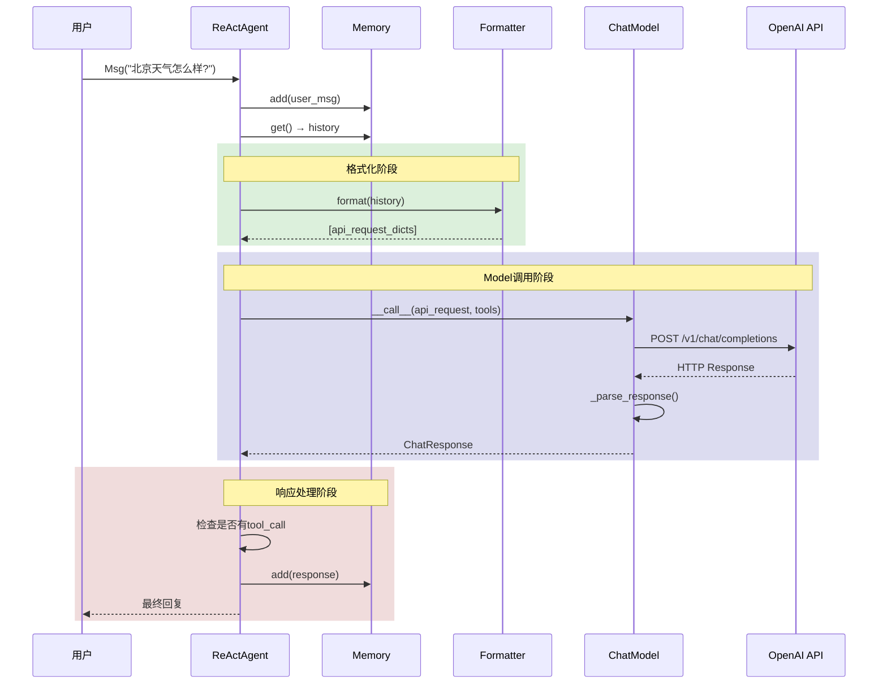

# 4-3 追踪模型调用链路

> **目标**：理解从Agent到Model到API的完整调用链路

---

## 学习目标

学完本章后，你能：
- 画出模型调用的完整流程
- 理解每一步的转换关系
- 调试模型调用问题
- 识别Token溢出、API Key等常见问题

---

## 背景问题

### 为什么需要理解完整调用链路？

当遇到以下问题时，需要追踪调用链路定位问题：
- API调用失败
- 返回内容不符合预期
- Token超出限制
- 模型行为异常

### 调用链全景

```
┌─────────────────────────────────────────────────────────────┐
│              Agent到API的完整调用链                        │
│                                                             │
│  1. Agent准备消息                                          │
│     user_input → Msg → 添加到Memory                        │
│                                                             │
│  2. Formatter格式化                                        │
│     [Msg(...), Msg(...)] → await formatter.format()       │
│                           → [dict(...), dict(...)]         │
│                                                             │
│  3. Model调用API                                           │
│     list[dict] → await model() → HTTP POST                │
│                                                             │
│  4. API返回响应                                            │
│     HTTP Response → Model解析 → ChatResponse               │
│                                                             │
│  5. Agent处理响应                                          │
│     ChatResponse → 存入Memory → 返回给用户                 │
└─────────────────────────────────────────────────────────────┘
```

---

## 源码入口

### 核心文件

| 文件路径 | 类/方法 | 说明 |
|---------|--------|------|
| `src/agentscope/agent/_react_agent.py` | `reply()` | Agent核心循环 |
| `src/agentscope/agent/_react_agent.py` | `_reasoning()` | 调用Model的入口 |
| `src/agentscope/agent/_react_agent_base.py` | `_call_model()` | Model调用封装 |
| `src/agentscope/formatter/_formatter_base.py` | `format()` | 格式化方法 |
| `src/agentscope/model/_openai_model.py` | `__call__()` | OpenAI API调用 |

### 调用链

```
Agent.reply(msg)
    │
    ├── memory.add(msg)                    # 保存用户消息
    │
    ├── for _ in range(max_iters):
    │       │
    │       ├── _reasoning()
    │       │       │
    │       │       ├── memory.get()       # 获取历史
    │       │       │
    │       │       ├── formatter.format() # 格式化消息
    │       │       │
    │       │       └── model(format_result) # 调用Model
    │       │
    │       └── _acting()
    │
    └── return final_msg
```

---

## 架构定位

### 各层职责

| 层级 | 组件 | 职责 |
|------|------|------|
| 应用层 | Agent | 管理对话、决定调用工具、生成回复 |
| 格式层 | Formatter | Msg → API请求格式 |
| 模型层 | ChatModel | API调用、响应解析 |
| 网络层 | HTTP Client | 实际HTTP请求 |

### 数据流向

```
用户输入
    │
    ▼
Msg对象 ──────────────────────────────┐
    │                                 │
    ▼                                 │
Formatter.format()                    │
    │                                 │
    ▼                                 │
API请求格式 (list[dict])              │
    │                                 │
    ▼                                 │
Model.__call__()                      │
    │                                 │
    ├── HTTP POST请求 ────────────────┼──► 第三方API
    │                                 │
    ▼                                 │
API响应格式 (dict)                    │
    │                                 │
    ▼                                 │
Model内部解析                         │
    │                                 │
    ▼                                 │
ChatResponse/Msg                      │
    │                                 │
    ▼                                 │
返回给Agent                           │
    │
    ▼
最终回复
```

---

## 核心源码分析

### 1. Agent调用Model的完整流程

**源码**：`src/agentscope/agent/_react_agent.py:540-580`

```python
async def _reasoning(self, *args: Any, **kwargs: Any) -> Msg:
    """推理阶段：获取历史、格式化、调用Model"""

    # Step 1: 获取历史消息
    history = await self.memory.get()

    # Step 2: 构建Prompt（包含sys_prompt和history）
    prompt = self._build_reasoning_prompt(history)

    # Step 3: 格式化消息（异步）
    formatted = await self.formatter.format(history)

    # Step 4: 调用Model
    response = await self.model(
        formatted,
        tools=self.toolkit.get_json_schemas() if self.toolkit else None,
        tool_choice=self.tool_choice,
    )

    return response
```

### 2. Formatter.format()实现

**源码**：`src/agentscope/formatter/_formatter_base.py`

```python
async def format(self, messages: list[Msg]) -> list[dict[str, Any]]:
    """将Msg列表转换为API请求格式

    Args:
        messages: Msg对象列表

    Returns:
        符合API要求的字典列表
    """
    formatted = []

    for msg in messages:
        # 提取消息内容（支持多模态）
        content = []
        for block in msg.get_content_blocks():
            if block.get("type") == "text":
                content.append({
                    "type": "text",
                    "text": block.get("text", "")
                })
            # ... 处理其他类型 ...

        formatted.append({
            "role": msg.role,
            "name": msg.name,
            "content": content
        })

    return formatted
```

**转换示例**：

```
输入:
[
    Msg(name="system", role="system", content="你是一个助手"),
    Msg(name="user", role="user", content="你好")
]

输出:
[
    {"role": "system", "name": "system", "content": [{"type": "text", "text": "你是一个助手"}]},
    {"role": "user", "name": "user", "content": [{"type": "text", "text": "你好"}]}
]
```

### 3. Model.__call__()实现

**源码**：`src/agentscope/model/_openai_model.py`

```python
async def __call__(
    self,
    prompt: list[dict],
    **kwargs: Any,
) -> ChatResponse:
    """调用OpenAI API"""

    # 1. 提取参数
    messages = prompt
    tools = kwargs.get("tools")
    tool_choice = kwargs.get("tool_choice", "auto")

    # 2. 调用OpenAI API
    response = await self.client.chat.completions.create(
        model=self.model_name,
        messages=messages,
        tools=tools,
        tool_choice=tool_choice,
        **self.generate_kwargs,
    )

    # 3. 解析响应（内部处理）
    return self._parse_response(response)
```

### 4. 响应解析

**源码**：`src/agentscope/model/_openai_model.py`

```python
def _parse_response(self, response: Any) -> ChatResponse:
    """解析API响应为ChatResponse"""
    # 从OpenAI响应中提取内容
    choice = response.choices[0]

    if choice.finish_reason == "tool_calls":
        # 工具调用响应
        return ChatResponse(
            role="assistant",
            content=choice.message.content,
            tool_calls=choice.message.tool_calls,
        )
    else:
        # 普通文本响应
        return ChatResponse(
            role="assistant",
            content=choice.message.content,
        )
```

---

## 可视化结构

### 完整时序图



### 数据转换图

```mermaid
flowchart LR
    subgraph 输入
        A1[用户输入]
        A2[Msg对象]
    end

    subgraph Formatter
        B1[format()异步方法]
    end

    subgraph API层
        C1[API请求JSON]
    end

    subgraph 网络
        D1[HTTP POST]
    end

    subgraph API层
        C2[API响应JSON]
    end

    subgraph Model
        E1[_parse_response()]
    end

    subgraph 输出
        F1[ChatResponse/Msg]
    end

    A1 --> A2
    A2 --> B1
    B1 --> C1
    C1 --> D1
    D1 --> C2
    C2 --> E1
    E1 --> F1
```

---

## 工程经验

### 设计原因

1. **为什么Formatter.format()是异步的？**
   - 可能需要从外部获取动态Schema
   - 保持与Model.__call__()接口一致

2. **为什么响应解析在Model内部而不是Formatter？**
   - 减少转换步骤
   - 每个Model有自己的响应格式

3. **为什么Tools通过kwargs传递而不是作为格式化的一部分？**
   - Tools是给LLM看的，不是给API格式看的
   - 保持Formatter职责单一

### 常见问题

#### 问题1：Token超出限制

**原因**：消息太长超出模型Token限制

**表现**：
```
Error: This model's maximum context length is 128000 tokens
```

**诊断**：
```python
# 检查消息总长度
history = await memory.get()
total_chars = sum(len(str(m)) for m in history)
print(f"总字符数: {total_chars}")
```

**解决**：
```python
# 方案1：使用滑动窗口Memory
agent = ReActAgent(
    memory=InMemoryMemory(window=10),  # 只保留最近10条
    ...
)

# 方案2：使用截断Formatter
agent = ReActAgent(
    formatter=TruncatedFormatter(max_tokens=100000),
    ...
)
```

#### 问题2：API Key泄露

**危险**：
```python
# 危险：硬编码
model = OpenAIChatModel(api_key="sk-xxx", ...)
```

**安全做法**：
```python
# 安全：环境变量
import os
model = OpenAIChatModel(
    api_key=os.environ.get("OPENAI_API_KEY"),
    ...
)

# 最佳：使用密钥管理服务
model = OpenAIChatModel(
    api_key=os.environ.get("AZURE_OPENAI_KEY"),
    ...
)
```

#### 问题3：API响应超时

**原因**：网络问题或API服务繁忙

**解决**：
```python
# 设置超时（如果支持）
model = OpenAIChatModel(
    api_key=os.environ.get("OPENAI_API_KEY"),
    timeout=30,  # 30秒超时
    ...
)

# 或使用重试机制
from tenacity import retry, stop_after_attempt

@retry(stop=stop_after_attempt(3))
async def call_with_retry(model, prompt):
    return await model(prompt)
```

#### 问题4：ToolCall格式错误

**原因**：Formatter输出的工具Schema格式不对

**诊断**：
```python
# 打印工具Schema
schemas = toolkit.get_json_schemas()
print(f"Schema: {schemas}")

# 检查是否符合OpenAI格式
# 应该是: {"type": "function", "function": {...}}
```

### 调试方法

**方法1：打印中间结果**

```python
async def debug_agent_call():
    # 1. 打印格式化前的消息
    messages = await memory.get()
    print(f"[Step 1] 原始消息: {messages}")

    # 2. 打印格式化后的请求
    formatted = await formatter.format(messages)
    print(f"[Step 2] 格式化请求: {formatted}")

    # 3. 打印API响应（需要mock或日志）
    response = await model(formatted)
    print(f"[Step 3] API响应: {response}")

    # 4. 打印最终结果
    print(f"[Step 4] 最终回复: {response.content}")
```

**方法2：使用Hook拦截**

```python
# 拦截pre_reasoning查看格式化后的请求
def log_pre_reasoning(agent, kwargs):
    print(f"调用Model，工具数: {len(kwargs.get('tools', []))}")
    return kwargs

agent.register_instance_hook("pre_reasoning", "log", log_pre_reasoning)
```

**方法3：使用tracing**

```python
# AgentScope内置tracing
from agentscope.tracing import trace

@trace("model_call")
async def call_model(model, prompt):
    return await model(prompt)
```

---

## Contributor指南

### 适合新手修改的文件

| 文件 | 原因 |
|------|------|
| `src/agentscope/agent/_react_agent.py` | 核心循环，调用链清晰 |
| `src/agentscope/formatter/_openai_formatter.py` | 最常用的Formatter |
| `src/agentscope/model/_openai_model.py` | 完整API调用示例 |

### 危险修改区域

**警告**：

1. **Model的__call__方法**
   - 处理HTTP请求和响应解析
   - 错误修改可能导致API调用失败或数据丢失

2. **Formatter的format方法**
   - 格式转换逻辑
   - 错误可能导致请求格式不正确

### 调试工具

**HTTP日志**：
```python
import httpx
httpx_log = logging.getLogger("httpx")
httpx_log.setLevel(logging.DEBUG)
```

**完整调用链追踪**：
```python
import agentscope
agentscope.init(
    project="DebugAgent",
    logging_level="DEBUG",
)
```

---

★ **Insight** ─────────────────────────────────────
- **Agent → Formatter → Model → API** 是单向调用链
- **format()是异步的**：必须用await
- **响应由Model内部解析**：Formatter只管请求格式化
- 调试时**逐层打印**中间结果，快速定位问题在哪一层
─────────────────────────────────────────────────
