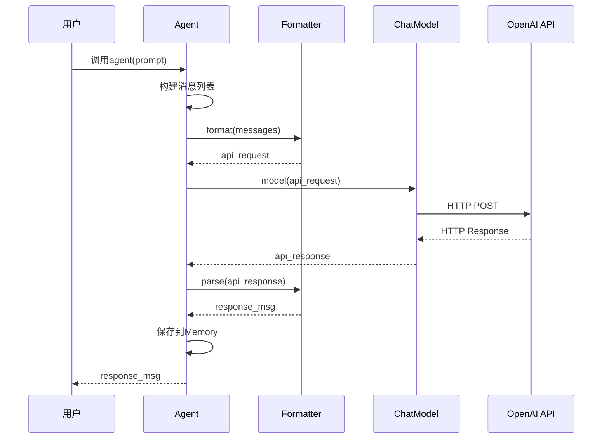

# 4-3 追踪一次模型调用

> **目标**：理解从Agent到Model到API的完整调用链路

---

## 🎯 这一章的目标

学完之后，你能：
- 画出模型调用的完整流程
- 理解每一步的转换关系
- 调试模型调用问题

---

## 🚀 模型调用完整流程

### 第一步：Agent准备消息

```
┌─────────────────────────────────────────────────────────────┐
│  Agent内部                                                 │
│                                                             │
│  1. 收集历史Msg                                            │
│  2. 添加sys_prompt作为system消息                           │
│  3. 构建消息列表                                            │
│                                                             │
│  messages = [                                              │
│      Msg(name="system", role="system", content="你是助手"), │
│      Msg(name="user", role="user", content="你好"),         │
│  ]                                                         │
└─────────────────────────────────────────────────────────────┘
                              │
                              ▼
```

### 第二步：Formatter转换

```
┌─────────────────────────────────────────────────────────────┐
│  OpenAIFormatter.format(messages)                         │
│                                                             │
│  输入: [Msg(name="system", ...), Msg(name="user", ...)]   │
│                                                             │
│  输出:                                                      │
│  {                                                         │
│      "model": "gpt-4",                                    │
│      "messages": [                                          │
│          {"role": "system", "content": "你是助手"},         │
│          {"role": "user", "content": "你好"}                 │
│      ]                                                      │
│  }                                                         │
└─────────────────────────────────────────────────────────────┘
                              │
                              ▼
```

### 第三步：ChatModel调用API

```
┌─────────────────────────────────────────────────────────────┐
│  OpenAIChatModel.__call__(formatted_request)              │
│                                                             │
│  1. HTTP POST 请求                                         │
│  2. 发送到 OpenAI API                                      │
│  3. 等待响应                                              │
│                                                             │
│  请求: POST https://api.openai.com/v1/chat/completions    │
│       Headers: Authorization: Bearer sk-xxx                  │
│       Body: {...formatted_request...}                        │
└─────────────────────────────────────────────────────────────┘
                              │
                              ▼
```

### 第四步：API返回响应

```
┌─────────────────────────────────────────────────────────────┐
│  OpenAI API响应                                            │
│                                                             │
│  {                                                         │
│      "id": "chatcmpl-xxx",                                │
│      "choices": [{                                         │
│          "message": {                                        │
│              "role": "assistant",                           │
│              "content": "你好！有什么可以帮助你的吗？"     │
│          }                                                  │
│      }]                                                     │
│  }                                                         │
└─────────────────────────────────────────────────────────────┘
                              │
                              ▼
```

### 第五步：Formatter解析响应

```
┌─────────────────────────────────────────────────────────────┐
│  OpenAIFormatter.parse(response)                           │
│                                                             │
│  输入: {..., "message": {...}}                           │
│                                                             │
│  输出: Msg(                                                 │
│      name="assistant",                                     │
│      content="你好！有什么可以帮助你的吗？",                 │
│      role="assistant"                                       │
│  )                                                         │
└─────────────────────────────────────────────────────────────┘
                              │
                              ▼
```

### 第六步：Agent返回Msg

```
┌─────────────────────────────────────────────────────────────┐
│  Agent得到Msg，返回给调用方                                  │
│                                                             │
│  response = Msg(                                            │
│      name="assistant",                                      │
│      content="你好！有什么可以帮助你的吗？",                 │
│      role="assistant"                                        │
│  )                                                         │
└─────────────────────────────────────────────────────────────┘
```

---

## 📊 完整时序图



---

## 🔬 关键代码段解析

### 代码段1：Agent是如何调用Model的？

```python showLineNumbers
# Agent调用Model的完整流程（简化版）
async def _call_model(self, messages: list[Msg]) -> Msg:
    # 1.Formatter格式化消息（异步）
    formatted = await self.formatter.format(messages)

    # 2.调用Model API（内部处理响应）
    response = await self.model(formatted)

    # 3.Model返回的已经是Msg对象
    return response
```

**思路说明**：

| 步骤 | 代码 | 输入 | 输出 |
|------|------|------|------|
| 格式化 | `await self.formatter.format(messages)` | `[Msg(...), ...]` | `list[dict]` (API请求格式) |
| 调用 | `await self.model(formatted)` | list[dict] | `Msg` (已解析的响应) |
| 无需解析 | Model内部处理 | API响应 | 直接返回Msg |

```
┌─────────────────────────────────────────────────────────────┐
│              Agent调用Model的完整流程                      │
│                                                             │
│   messages = [Msg("system", ...), Msg("user", "你好")]    │
│        │                                                   │
│        ▼ await formatter.format() (异步)                  │
│   api_request = [{"role": "system", ...}, {...}]          │
│        │                                                   │
│        ▼ await model()                                    │
│   response = Msg(name="assistant", content="你好！")       │
│   （Model内部已解析，直接返回Msg）                          │
└─────────────────────────────────────────────────────────────┘
```

**💡 设计思想**：Formatter负责**格式转换**（Msg → API格式），Model负责**网络通信和解析**（API响应 → Msg）。两者各司其职。

---

### 代码段2：ChatModel是怎么调用API的？

```python showLineNumbers
# OpenAIChatModel的实现（简化版）
class OpenAIChatModel:
    def __init__(self, api_key: str, model: str):
        self.api_key = api_key
        self.model = model
        self.client = OpenAI(api_key=api_key)

    async def __call__(self, request: dict) -> dict:
        # 从request中提取参数
        model = request.get("model", self.model)
        messages = request["messages"]

        # 调用OpenAI API
        response = self.client.chat.completions.create(
            model=model,
            messages=messages
        )

        # 返回原始响应
        return response.model_dump()
```

**思路说明**：

| 步骤 | 代码 | 说明 |
|------|------|------|
| 提取参数 | `request["messages"]` | 从格式化后的请求中获取 |
| 构造请求 | `client.chat.completions.create()` | 调用OpenAI SDK |
| 返回响应 | `response.model_dump()` | 返回字典格式 |

```
┌─────────────────────────────────────────────────────────────┐
│              OpenAIChatModel调用流程                       │
│                                                             │
│   request = {                                              │
│       "model": "gpt-4",                                   │
│       "messages": [{"role": "user", "content": "你好"}]  │
│   }                                                        │
│        │                                                   │
│        ▼                                                   │
│   client.chat.completions.create(                         │
│       model="gpt-4",                                     │
│       messages=[...]                                       │
│   )                                                        │
│        │                                                   │
│        ▼                                                   │
│   response = {                                             │
│       "id": "chatcmpl-xxx",                               │
│       "choices": [{"message": {"content": "你好！"}}]     │
│   }                                                        │
└─────────────────────────────────────────────────────────────┘
```

**💡 设计思想**：ChatModel是**适配器模式**——封装了不同API的调用细节，提供统一的`__call__`接口。

---

### 代码段3：Formatter是怎么实现格式转换的？

```python showLineNumbers
# OpenAIFormatter的实现
class OpenAIFormatter(FormatterBase):
    async def format(self, messages: list[Msg]) -> list[dict]:
        """Msg列表 → API请求格式（异步）"""
        formatted = []
        for msg in messages:
            # 处理消息内容（支持多模态）
            content = []
            for block in msg.get_content_blocks():
                if block.get("type") == "text":
                    content.append({"type": "text", "text": block.get("text", "")})
            formatted.append({
                "role": msg.role,
                "name": msg.name,
                "content": content
            })
        return formatted
```

**思路说明**：

| 方法 | 输入 | 输出 | 关键操作 |
|------|------|------|----------|
| format | `[Msg(...)]` | `list[dict]` | 提取role、name、content |

```
┌─────────────────────────────────────────────────────────────┐
│              Formatter格式转换示例                         │
│                                                             │
│   format (异步):                                           │
│   ┌─────────────────────────────────────────────────────┐  │
│   │  [Msg(role="user", content="你好")]                │  │
│   │       ↓ await formatter.format()                    │  │
│   │  [{"role": "user", "name": "user",               │  │
│   │    "content": [{"type": "text", "text": "你好"}]}] │  │
│   └─────────────────────────────────────────────────────┘  │
│                                                             │
│   响应由Model内部解析，直接返回Msg，无需Formatter处理      │
└─────────────────────────────────────────────────────────────┘
```

**💡 设计思想**：Formatter是**转换器**——把统一格式Msg转成API请求格式。响应由Model内部解析后返回Msg。

---

### 代码段4：如何调试模型调用问题？

```python showLineNumbers
# 调试模型调用的方法
async def debug_model_call():
    # 1. 打印格式化前的消息
    messages = [Msg(name="user", content="你好")]
    print(f"原始消息: {messages}")

    # 2. 打印格式化后的请求
    formatter = OpenAIChatFormatter()
    formatted = formatter.format(messages)
    print(f"格式化请求: {formatted}")

    # 3. 打印API响应
    model = OpenAIChatModel(api_key="sk-xxx", model="gpt-4")
    response = await model(formatted)
    print(f"API响应: {response}")

    # 4. 打印解析后的消息
    parsed = formatter.parse(response)
    print(f"解析结果: {parsed}")
```

**思路说明**：

| 调试点 | 打印内容 | 可以发现的问题 |
|--------|----------|---------------|
| format前 | `messages` | 消息内容是否正确 |
| format后 | `formatted` | 格式是否匹配API |
| response | API原始响应 | 是否有错误码 |
| parse后 | `Msg` | 解析是否正确 |

```
┌─────────────────────────────────────────────────────────────┐
│              模型调用调试检查点                            │
│                                                             │
│   messages ──► formatter.format() ──► formatted          │
│                                     │                      │
│                                     ▼                      │
│                              检查格式是否正确               │
│                                     │                      │
│                                     ▼                      │
│                              await model()                  │
│                                     │                      │
│                                     ▼                      │
│                              检查API响应                   │
│                                     │                      │
│                                     ▼                      │
│                              formatter.parse()              │
│                                     │                      │
│                                     ▼                      │
│                              检查解析结果                   │
└─────────────────────────────────────────────────────────────┘
```

**💡 设计思想**：调试模型调用要**逐层检查**——每一步的输入输出都打印出来，快速定位问题在哪一层。

---

## 💡 Java开发者注意

模型调用链路类似Java的**HTTP客户端调用**：

```java
// Java HTTP调用链
RestTemplate template = new RestTemplate();

// 1. 准备请求（类似Agent构建消息）
HttpEntity<Request> request = new HttpEntity<>(requestBody, headers);

// 2. 发送请求（类似ChatModel调用）
ResponseEntity<Response> response = template.postForEntity(
    url, request, Response.class
);

// 3. 处理响应（类似Formatter解析）
Result result = response.getBody();
```

| AgentScope | Java | 说明 |
|------------|------|------|
| Agent构建消息 | 构建请求体 | 准备数据 |
| Formatter.format() | ObjectMapper | 序列化 |
| ChatModel.call() | RestTemplate | HTTP调用 |
| Formatter.parse() | ObjectMapper | 反序列化 |
| Agent返回Msg | Controller返回 | 输出结果 |

---

## 🎯 思考题

<details>
<summary>点击查看答案</summary>

1. **如果API返回错误，流程会在哪里处理？**
   - ChatModel会捕获异常
   - 可能重试或返回错误Msg

2. **Formatter.parse()失败会怎样？**
   - 可能抛出解析异常
   - Agent会捕获并返回错误信息

3. **如何调试模型调用问题？**
   - 打印Formatter.format()的输入输出
   - 检查HTTP请求和响应
   - 查看API返回的错误信息

</details>

---

★ **Insight** ─────────────────────────────────────
- **Agent → Formatter → ChatModel → API** 是单向调用链
- **format()在调用前，parse()在调用后**
- 理解这个流程有助于调试问题
─────────────────────────────────────────────────
