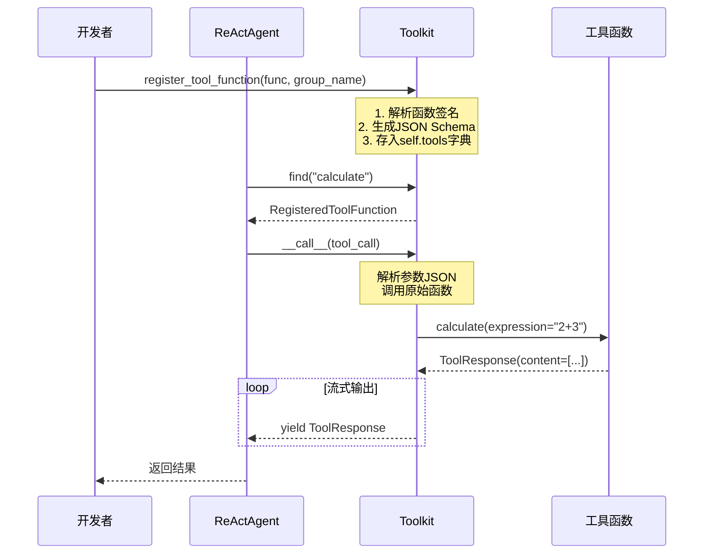
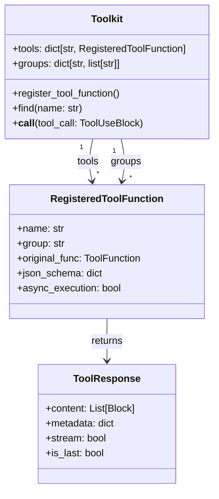

# 5-1 Toolkit工具系统

## 学习目标

学完本章后，你能：
- 创建自定义工具函数并注册到Toolkit
- 使用`register_tool_function()`管理工具分组
- 理解`ToolResponse`作为Agent与工具之间契约的设计思想
- 区分同步工具与异步工具的使用场景

## 背景问题

### 为什么需要Toolkit？

在Agent系统中，LLM需要调用外部工具来扩展能力。问题在于：
- LLM生成的参数是JSON格式，需要统一验证
- 不同工具的返回格式不同，需要统一抽象
- 工具需要按场景动态暴露或隐藏

Toolkit正是为了解决这些问题而设计的：它是一个**工具容器**，提供统一的工具注册、管理和调用接口。

### 为什么不直接传函数列表？

```python
# ❌ 不推荐：直接传函数列表
agent = ReActAgent(tools=[search_weather, calculate, send_email])

# ✅ 推荐：使用Toolkit
toolkit = Toolkit()
toolkit.register_tool_function(search_weather, group_name="info")
toolkit.register_tool_function(calculate, group_name="basic")
agent = ReActAgent(toolkit=toolkit)
```

Toolkit的优势：
1. **分组管理**：可以通过`group_name`控制暴露哪些工具
2. **统一接口**：`ToolResponse`提供一致的返回格式
3. **动态配置**：运行时可以添加/删除工具组

## 源码入口

### 核心文件

| 文件 | 职责 |
|------|------|
| `src/agentscope/tool/_toolkit.py` | Toolkit类，工具注册与调用核心逻辑 |
| `src/agentscope/tool/_response.py` | ToolResponse数据结构 |
| `src/agentscope/tool/_types.py` | RegisteredToolFunction、ToolGroup类型定义 |

### 关键类与方法

```python
# src/agentscope/tool/_toolkit.py

class Toolkit:
    def register_tool_function(
        self,
        func: Callable,           # 待注册的函数
        group_name: str = "basic", # 所属分组
        name: str | None = None,   # 暴露给LLM的名称
        description: str | None = None,  # 工具描述
        async_execution: bool = False,   # 是否异步执行
    ) -> None:
        """注册工具函数到Toolkit"""

    def find(self, name: str) -> RegisteredToolFunction:
        """根据名称查找已注册的工具"""

    async def __call__(self, tool_call: ToolUseBlock) -> AsyncGenerator[ToolResponse, None]:
        """执行工具调用"""
```

```python
# src/agentscope/tool/_response.py

@dataclass
class ToolResponse:
    content: List[TextBlock | ImageBlock | AudioBlock | VideoBlock]
    """工具执行输出内容"""
    metadata: Optional[dict] = None
    """内部访问用元数据，如错误信息"""
    stream: bool = False
    """是否流式输出"""
    is_last: bool = True
    """是否为最后一块输出"""
```

```python
# src/agentscope/tool/_types.py

@dataclass
class RegisteredToolFunction:
    name: str                    # 暴露给LLM的名称
    group: str | Literal["basic"]  # 所属分组
    source: Literal["function", "mcp_server", "function_group"]
    original_func: ToolFunction   # 原始函数
    json_schema: dict             # JSON Schema用于LLM参数验证
    async_execution: bool = False # 是否异步执行
```

## 架构定位

### 模块职责

Toolkit位于Agent与具体工具函数之间，是**适配层**：

```
┌─────────┐     ┌─────────┐     ┌──────────────────┐     ┌─────────────┐
│  Agent  │────▶│ Toolkit │────▶│ RegisteredTool   │────▶│ 工具函数    │
│         │◀────│         │◀────│ Function         │◀────│ (Python)    │
└─────────┘     └─────────┘     └──────────────────┘     └─────────────┘
```

### 生命周期

1. **创建阶段**：`Toolkit()`实例化
2. **注册阶段**：`register_tool_function()`注册工具
3. **使用阶段**：Agent通过`toolkit.find()`查找并调用工具
4. **销毁阶段**：Python GC自动回收

### 与其他模块关系

| 关系 | 模块 | 说明 |
|------|------|------|
| 被使用 | `agent/` | ReActAgent使用Toolkit管理工具 |
| 依赖 | `message/` | 使用TextBlock等构建响应 |
| 依赖 | `types.py` | ToolFunction类型定义 |
| 依赖 | `_utils/_common.py` | `_parse_tool_function`解析函数签名 |

## 核心源码分析

### 调用链：register_tool_function

```python
# src/agentscope/tool/_toolkit.py:274-350 (简化版)

def register_tool_function(
    self,
    func: Callable,
    group_name: str | None = None,
    description: str | None = None,
    name: str | None = None,
    async_execution: bool = False,
) -> None:
    # 1. 解析函数签名生成JSON Schema
    json_schema = _parse_tool_function(func, description)

    # 2. 构建RegisteredToolFunction对象
    registered = RegisteredToolFunction(
        name=name or func.__name__,
        group=group_name or "basic",
        source="function",
        original_func=func,
        json_schema=json_schema,
        async_execution=async_execution,
    )

    # 3. 存入字典：self.tools[name] = registered
    self.tools[registered.name] = registered

    # 4. 更新分组索引
    if registered.group not in self.groups:
        self.groups[registered.group] = []
    self.groups[registered.group].append(registered.name)
```

关键点：`_parse_tool_function()`从函数签名提取参数类型和文档字符串，生成LLM能理解的JSON Schema。

### 调用链：Tool执行

```python
# src/agentscope/tool/_toolkit.py:853 (简化版)

async def __call__(self, tool_call: ToolUseBlock) -> AsyncGenerator[ToolResponse, None]:
    # 1. 根据名称查找工具
    registered = self.find(tool_call.name)

    # 2. 解析LLM传入的参数
    kwargs = json.loads(tool_call.arguments) if isinstance(tool_call.arguments, str) else tool_call.arguments

    # 3. 调用原始函数
    if registered.async_execution:
        # 异步执行：返回AsyncGenerator
        result = registered.original_func(**kwargs)
        async for chunk in result:
            yield chunk
    else:
        # 同步执行：直接调用
        result = registered.original_func(**kwargs)
        yield result
```

### 为什么返回ToolResponse？

```python
# 工具函数示例
def search_weather(city: str) -> ToolResponse:
    weather_data = get_weather_from_api(city)  # 调用天气API
    return ToolResponse(
        content=[TextBlock(type="text", text=f"{city}: {weather_data}")]
    )
```

`ToolResponse`的设计优势：
1. **统一格式**：无论什么工具，Agent都能以相同方式解析
2. **流式支持**：通过`is_last`标识流式输出的结束
3. **元数据传递**：通过`metadata`传递内部信息（如错误详情）

## 可视化结构

### 工具注册与调用流程



### Toolkit内部结构



## 工程经验

### 设计原因

#### 1. 为什么不使用装饰器注册？

```python
# ❌ 装饰器方式（AgentScope不采用）
@toolkit.register
def calculate(expr: str) -> ToolResponse:
    ...

# ✅ 函数式注册（AgentScope采用）
toolkit.register_tool_function(calculate, group_name="basic")
```

函数式注册的优势：
- **无侵入**：不修改原函数，适合第三方工具
- **延迟注册**：可以在运行时动态决定注册哪些工具
- **条件注册**：可以根据环境变量等条件决定注册行为

#### 2. 为什么需要group_name？

```python
# 开发环境：暴露所有工具
toolkit.register_tool_function(dev_tool, group_name="dev")
toolkit.register_tool_function(search, group_name="info")

# 生产环境：只暴露安全工具
toolkit.register_tool_function(search, group_name="info")
# dev_tool未被注册，LLM无法看到
```

分组让工具管理更灵活，支持**按场景暴露不同工具**。

### 替代方案

#### 如果不用Toolkit？

```python
# 替代方案1：直接传函数字典
agent = ReActAgent(tools={"calculate": calculate})
# 问题：缺少JSON Schema生成、参数验证、分组管理

# 替代方案2：使用类封装
class MyTools:
    def calculate(self, expr): return ...
# 问题：需要实例化，增加复杂度
```

### 常见问题

#### 1. 工具函数参数必须可序列化

```python
# ✅ 支持的类型
def search(city: str) -> ToolResponse: ...
def process(nums: list[int]) -> ToolResponse: ...
def config(options: dict) -> ToolResponse: ...

# ❌ 不支持的类型
def bad_tool(conn: DatabaseConnection):  # 数据库连接不可序列化
def bad_tool(obj: CustomClass):        # 自定义对象不可序列化
```

**原因**：LLM生成的参数是JSON，必须能反序列化。

#### 2. 异步工具需要设置async_execution=True

```python
# 同步工具
def sync_search(query: str) -> ToolResponse:
    return ToolResponse(content=[TextBlock(text=do_search(query))])

toolkit.register_tool_function(sync_search, async_execution=False)

# 异步工具
async def async_search(query: str) -> ToolResponse:
    result = await search_api(query)
    return ToolResponse(content=[TextBlock(text=result)])

toolkit.register_tool_function(async_search, async_execution=True)
```

#### 3. Tool名称不匹配问题

```python
# 注册时使用别名
toolkit.register_tool_function(
    safe_calculate,           # 实际函数名
    name="calculate",         # 暴露给LLM的名称
    description="计算数学表达式"
)

# LLM会看到名为"calculate"的工具
# 实际调用safe_calculate函数
```

## Contributor指南

### 适合新手修改的文件

| 文件 | 原因 | 修改难度 |
|------|------|----------|
| `src/agentscope/tool/_response.py` | ToolResponse结构简单 | ★☆☆☆☆ |
| `src/agentscope/tool/_types.py` | 类型定义清晰 | ★★☆☆☆ |
| `src/agentscope/tool/_toolkit.py` | 核心逻辑较复杂 | ★★★☆☆ |

### 危险区域

#### ⚠️ register_tool_function的Schema生成

```python
# src/agentscope/tool/_toolkit.py:274
# 错误修改可能导致LLM无法正确调用工具
json_schema = _parse_tool_function(func, description)  # 依赖_common.py的解析逻辑
```

#### ⚠️ call_tool_function的异步处理

```python
# src/agentscope/tool/_toolkit.py:853
# 涉及异步执行和错误处理，错误可能导致工具调用挂起
async for chunk in result:
    yield chunk
```

### 添加内置工具步骤

**步骤1**：在`src/agentscope/tool/_text_file/`中创建工具文件：
```python
# _my_tool.py
from .._response import ToolResponse
from ..message import TextBlock

async def my_tool_function(arg: str) -> ToolResponse:
    """我的自定义工具"""
    result = do_something(arg)
    return ToolResponse(content=[TextBlock(type="text", text=str(result))])
```

**步骤2**：在`src/agentscope/tool/__init__.py`中导出

### 调试方法

```python
# 1. 打印已注册的工具
print(f"已注册工具: {list(toolkit.tools.keys())}")
print(f"工具分组: {toolkit.groups}")

# 2. 测试工具查找
tool = toolkit.find("search_weather")
print(f"工具Schema: {tool.json_schema}")

# 3. 直接测试工具执行
from agentscope.message import ToolUseBlock
test_call = ToolUseBlock(name="search_weather", arguments='{"city":"北京"}')
async for resp in toolkit(test_call):
    print(f"响应: {resp}")
```

## 思考题

<details>
<summary>点击查看答案</summary>

1. **Toolkit和Tool是什么关系？**
   - Toolkit是容器，Tool（RegisteredToolFunction）是容器内的具体工具

2. **为什么工具函数返回ToolResponse而不是普通值？**
   - 统一接口：Agent能以相同方式解析所有工具响应
   - 流式支持：ToolResponse.is_last标识流式结束
   - 元数据传递：通过metadata传递错误等信息

3. **group_name有什么用？**
   - 控制工具在何时暴露给LLM
   - 开发环境暴露所有工具，生产环境只暴露安全工具

</details>

★ **Insight** ─────────────────────────────────────
- **Toolkit = 工具箱**，管理Agent可用的所有工具
- **register_tool_function() = 注册**，将函数注册为可调用的工具
- **ToolResponse = 响应契约**，统一Agent与工具之间的接口
- **group_name = 分组**，控制工具在何时暴露给Agent
─────────────────────────────────────────────────
