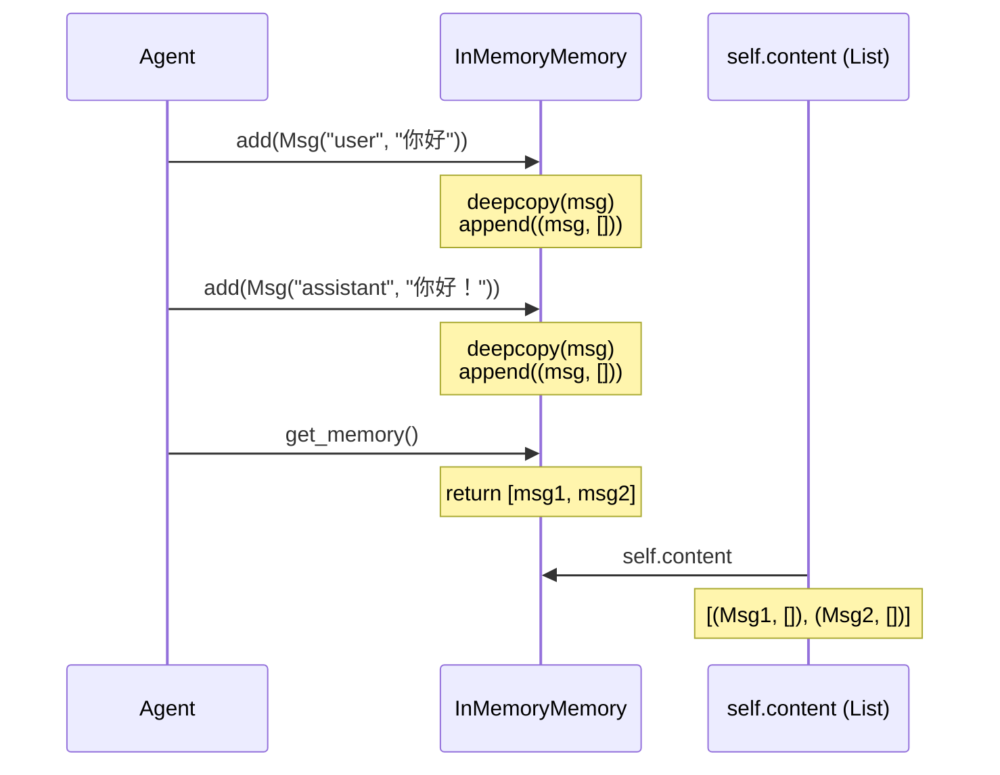
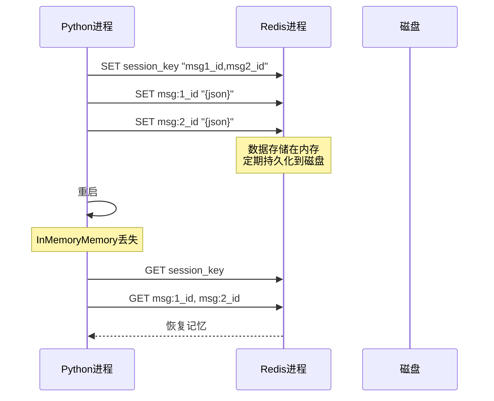
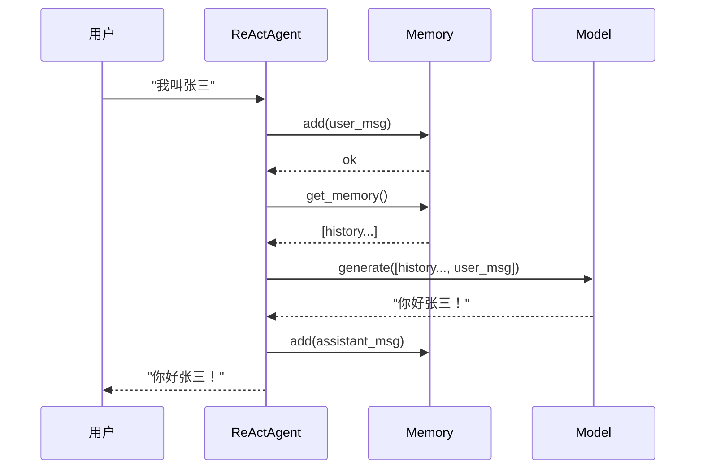

# 5-2 Memory内存系统

## 学习目标

学完本章后，你能：
- 理解短期记忆（InMemoryMemory）和长期记忆（RedisMemory）的区别
- 掌握在Agent中配置和使用不同Memory类型
- 了解Memory溢出时的处理策略
- 知道如何添加新的Memory类型

## 背景问题

### 为什么Agent需要Memory？

没有Memory的Agent，每次对话都是全新的：

```
用户: 你好
Agent: 你好！

用户: 我叫什么？
Agent: 对不起，我不知道
```

有Memory的Agent，能记住对话历史：

```
用户: 我叫张三
Agent: 你好张三！

用户: 我叫什么？
Agent: 你叫张三
```

Memory让Agent拥有**连续记忆**，实现上下文连贯的对话。

### 短期记忆 vs 长期记忆

| 类型 | 存储 | 持久性 | 性能 | 适用场景 |
|------|------|--------|------|----------|
| InMemoryMemory | 内存 | 进程结束丢失 | 快 | 单次对话 |
| RedisMemory | Redis | 持久保存 | 稍慢 | 跨会话 |

## 源码入口

### 核心文件

| 文件 | 职责 |
|------|------|
| `src/agentscope/memory/_working_memory/_base.py` | MemoryBase抽象基类 |
| `src/agentscope/memory/_working_memory/_in_memory_memory.py` | InMemoryMemory实现 |
| `src/agentscope/memory/_working_memory/_redis_memory.py` | RedisMemory实现 |
| `src/agentscope/memory/__init__.py` | 导出接口 |

### MemoryBase抽象基类

```python
# src/agentscope/memory/_working_memory/_base.py

class MemoryBase(StateModule):
    """Memory基类，定义所有Memory实现必须实现的方法"""

    @abstractmethod
    async def add(
        self,
        memories: Msg | list[Msg] | None,
        marks: str | list[str] | None = None,
        **kwargs: Any,
    ) -> None:
        """添加消息到记忆"""

    @abstractmethod
    async def get_memory(
        self,
        mark: str | None = None,
        exclude_mark: str | None = None,
        prepend_summary: bool = True,
        **kwargs: Any,
    ) -> list[Msg]:
        """获取记忆中的消息"""

    @abstractmethod
    async def clear(self) -> None:
        """清空记忆"""

    @abstractmethod
    async def size(self) -> int:
        """获取记忆中的消息数量"""
```

### InMemoryMemory实现

```python
# src/agentscope/memory/_working_memory/_in_memory_memory.py

class InMemoryMemory(MemoryBase):
    """基于内存的短期记忆实现"""

    def __init__(self) -> None:
        super().__init__()
        # 存储格式: list[tuple[Msg, list[str]]]  (消息, 标记列表)
        self.content: list[tuple[Msg, list[str]]] = []
        self.register_state("content")

    async def add(
        self,
        memories: Msg | list[Msg] | None,
        marks: str | list[str] | None = None,
        allow_duplicates: bool = False,
        **kwargs: Any,
    ) -> None:
        # 添加消息到self.content列表
        ...

    async def get_memory(
        self,
        mark: str | None = None,
        exclude_mark: str | None = None,
        prepend_summary: bool = True,
        **kwargs: Any,
    ) -> list[Msg]:
        # 返回[self._compressed_summary, ...messages]
        ...
```

### RedisMemory实现

```python
# src/agentscope/memory/_working_memory/_redis_memory.py

class RedisMemory(MemoryBase):
    """基于Redis的长期记忆实现"""

    def __init__(
        self,
        session_id: str = "default_session",
        user_id: str = "default_user",
        host: str = "localhost",
        port: int = 6379,
        key_prefix: str = "",
        key_ttl: int | None = None,
        **kwargs: Any,
    ) -> None:
        # 初始化Redis连接
        self._client = redis.Redis(host=host, port=port, ...)
        # Redis key模式:
        # - SESSION_KEY: user_id:{user_id}:session:{session_id}:messages
        # - MESSAGE_KEY: user_id:{user_id}:session:{session_id}:msg:{msg_id}
        # - MARKS_INDEX_KEY: user_id:{user_id}:session:{session_id}:marks_index

    async def add(self, memories: Msg | list[Msg], marks: ...) -> None:
        # 1. 序列化Msg为JSON
        # 2. 使用RPUSH添加到session列表
        # 3. 使用SET存储消息内容
        ...

    async def get_memory(self, mark: str | None = None, ...) -> list[Msg]:
        # 1. 从session列表获取消息ID
        # 2. 使用MGET批量获取消息内容
        # 3. 反序列化JSON为Msg对象
        ...
```

## 架构定位

### 模块职责

Memory在Agent系统中负责**对话历史的存储与检索**：

```
┌─────────────┐
│    User     │
└──────┬──────┘
       │
       ▼
┌─────────────┐     ┌─────────────┐     ┌─────────────┐
│    Agent    │────▶│   Memory    │────▶│    LLM      │
│             │◀────│             │◀────│             │
└─────────────┘     └─────────────┘     └─────────────┘
                           ▲
                           │
                    ┌──────┴──────┐
                    │             │
              InMemoryMemory   RedisMemory
```

### 与Agent的关系

```python
# Agent持有Memory引用
agent = ReActAgent(
    name="Assistant",
    model=model,
    memory=InMemoryMemory()  # 注入Memory
)

# Agent内部调用Memory
# 1. await agent() 被调用
# 2. memory.add(user_msg)       保存用户消息
# 3. memory.get_memory()         获取历史
# 4. LLM基于历史生成回复
# 5. memory.add(assistant_msg)  保存回复
```

## 核心源码分析

### InMemoryMemory的add方法

```python
# src/agentscope/memory/_working_memory/_in_memory_memory.py:75-120

async def add(
    self,
    memories: Msg | list[Msg] | None,
    marks: str | list[str] | None = None,
    allow_duplicates: bool = False,
    **kwargs: Any,
) -> None:
    if memories is None:
        return

    if isinstance(memories, Msg):
        memories = [memories]

    if marks is None:
        marks = []
    elif isinstance(marks, str):
        marks = [marks]

    # 过滤重复消息
    if not allow_duplicates:
        existing_ids = {msg.id for msg, _ in self.content}
        memories = [msg for msg in memories if msg.id not in existing_ids]

    # 添加到content列表
    for msg in memories:
        self.content.append((deepcopy(msg), deepcopy(marks)))
```

关键点：
- 使用`deepcopy`避免引用问题
- `content`是`list[tuple[Msg, list[str]]]`类型，支持标记功能

### RedisMemory的持久化机制

```python
# src/agentscope/memory/_working_memory/_redis_memory.py:300-350

async def add(
    self,
    memories: Msg | list[Msg] | None,
    marks: str | list[str] | None = None,
    skip_duplicated: bool = True,
    **kwargs: Any,
) -> None:
    # 1. 过滤重复消息
    if skip_duplicated:
        existing_msg_ids = await self._client.lrange(self._get_session_key(), 0, -1)
        existing_msg_ids_set = set(self._decode_list(existing_msg_ids))
        memories = [m for m in memories if m.id not in existing_msg_ids_set]

    # 2. 使用Pipeline批量操作
    pipe = self._client.pipeline()

    # 3. 添加到session列表
    await pipe.rpush(self._get_session_key(), *[m.id for m in memories])

    # 4. 存储消息内容
    for m in memories:
        await pipe.set(
            self._get_message_key(m.id),
            json.dumps(m.to_dict(), ensure_ascii=False),
        )

    # 5. 维护marks索引
    for mark in mark_list:
        await pipe.rpush(self._get_mark_key(mark), m.id)
        await pipe.sadd(self._get_marks_index_key(), mark)

    await pipe.execute()
```

关键点：
- 使用Redis Pipeline批量操作，保证原子性
- 消息ID存在列表中（有序），消息内容存在Hash中（便于查找）
- marks索引使用Set存储，支持快速查询某标记下的所有消息

## 可视化结构

### InMemoryMemory工作原理



### RedisMemory跨进程持久化



### Memory在Agent中的调用时序



## 工程经验

### 设计原因

#### 1. 为什么InMemoryMemory使用deepcopy？

```python
# 问题：直接存储引用会导致意外修改
msg1 = Msg(name="user", content="你好")
memory.add(msg1)
msg1.content = "被修改了"  # 如果memory直接存引用，这里会影响存储的值

# 解决：使用deepcopy
self.content.append((deepcopy(msg), deepcopy(marks)))
```

#### 2. 为什么RedisMemory用消息ID列表+消息内容分离存储？

```python
# session列表: [msg1_id, msg2_id, msg3_id]  # 有序，可重复
# message数据: msg:msg1_id -> "{json}"       # 无序，用于快速查找
# marks索引: mark:"important" -> [msg1_id, msg3_id]  # 快速查询

# 优势：
# 1. 保证消息顺序（通过列表）
# 2. 快速查找单条消息（通过Hash key）
# 3. 快速按标记查询（通过marks索引）
```

### 替代方案

#### 如果不用Memory？

```python
# ❌ 每次对话都是新对话
agent = ReActAgent(name="Assistant", model=model)
response = await agent("你好")
response = await agent("我叫张三")  # Agent不记得之前说了什么
response = await agent("我叫什么？")  # "对不起，我不知道"
```

#### 如果不用RedisMemory？

```python
# 替代方案1：定期保存到文件
with open("memory.json", "w") as f:
    json.dump([msg.to_dict() for msg in memory.get()], f)

# 替代方案2：使用SQLite
memory = SQLiteMemory(database="memory.db")

# 替代方案3：使用Mem0Memory（如果安装了mem0）
from agentscope.memory import Mem0Memory
memory = Mem0Memory()
```

### 常见问题

#### 1. InMemoryMemory进程结束丢失

```python
# 问题
memory = InMemoryMemory()
memory.add(Msg(name="user", content="我叫张三"))
# ... Python进程退出 ...
# 再次启动
memory.get()  # 返回空！记忆丢失

# 解决方案
# 1. 定期持久化
import json
with open("backup.json", "w") as f:
    json.dump([msg.to_dict() for msg in memory.get()], f)

# 2. 使用RedisMemory
memory = RedisMemory(session_id="user_123", host="localhost", port=6379)
```

#### 2. Redis连接失败

```python
# 问题
memory = RedisMemory(host="localhost", port=6379)
# redis.exceptions.ConnectionError: Error connecting to Redis

# 解决方案：降级处理
try:
    memory = RedisMemory(host="localhost", port=6379)
except ConnectionError:
    memory = InMemoryMemory()  # 降级到内存
```

#### 3. Memory溢出（对话太长）

```python
# 问题：对话历史无限增长
# - Token超出模型限制
# - 内存占用越来越大

# 解决方案1：使用滑动窗口（如果有实现）
# 参考InMemoryMemory的max_messages参数或window参数

# 解决方案2：手动清理
old_messages = await memory.get_memory()
if len(old_messages) > MAX_HISTORY:
    # 只保留最近的消息
    await memory.clear()
    for msg in old_messages[-MAX_HISTORY:]:
        await memory.add(msg)

# 解决方案3：使用压缩摘要
if len(old_messages) > SUMMARY_THRESHOLD:
    summary = await summarize(old_messages)
    await memory.update_compressed_summary(summary)
```

## Contributor指南

### 适合新手修改的文件

| 文件 | 原因 | 修改难度 |
|------|------|----------|
| `src/agentscope/memory/_working_memory/_in_memory_memory.py` | 结构简单，就是列表操作 | ★★☆☆☆ |
| `src/agentscope/memory/_working_memory/_base.py` | 抽象基类，接口清晰 | ★★☆☆☆ |
| `src/agentscope/memory/_working_memory/_redis_memory.py` | 涉及Redis协议，较复杂 | ★★★★☆ |

### 危险区域

#### ⚠️ InMemoryMemory的序列化/反序列化

```python
# src/agentscope/memory/_working_memory/_in_memory_memory.py
# state_dict和load_state_dict用于状态持久化
# 错误可能导致消息丢失或格式错误

def state_dict(self) -> dict:
    return {
        **super().state_dict(),
        "content": [[msg.to_dict(), marks] for msg, marks in self.content],
    }
```

#### ⚠️ RedisMemory的连接管理

```python
# src/agentscope/memory/_working_memory/_redis_memory.py
# 连接失败处理复杂，错误可能导致内存泄漏

async def close(self, close_connection_pool: bool | None = None) -> None:
    await self._client.aclose(close_connection_pool=close_connection_pool)
```

### 添加新的Memory类型步骤

**步骤1**：继承MemoryBase：

```python
# src/agentscope/memory/_working_memory/_my_memory.py
from ._base import MemoryBase
from ...message import Msg

class MyMemory(MemoryBase):
    async def add(
        self,
        memories: Msg | list[Msg] | None,
        marks: str | list[str] | None = None,
        **kwargs: Any,
    ) -> None:
        ...

    async def get_memory(
        self,
        mark: str | None = None,
        exclude_mark: str | None = None,
        prepend_summary: bool = True,
        **kwargs: Any,
    ) -> list[Msg]:
        ...

    async def clear(self) -> None:
        ...

    async def size(self) -> int:
        ...
```

**步骤2**：在`__init__.py`中导出

### 调试方法

```python
# 1. 打印Memory内容
memory = InMemoryMemory()
await memory.add(Msg(name="user", content="test"))
msgs = await memory.get_memory()
print(f"Memory size: {await memory.size()}")
print(f"Messages: {msgs}")

# 2. 检查Redis连接
memory = RedisMemory(host="localhost", port=6379)
client = memory.get_client()
await client.ping()  # 如果不抛异常则连接正常

# 3. 查看Redis中的key
keys = await client.keys("prefix:user_id:*")
print(f"Keys: {keys}")
```

## 思考题

<details>
<summary>点击查看答案</summary>

1. **什么时候用短期记忆，什么时候用长期记忆？**
   - 短期：单次对话，Agent重启不需保留历史
   - 长期：跨会话保留用户偏好或重要上下文

2. **InMemoryMemory和RedisMemory的核心区别？**
   - 存储位置：内存 vs Redis进程
   - 持久性：进程结束丢失 vs 独立于Python进程
   - 性能：内存更快（无网络开销），Redis稍慢但可靠

3. **Memory是怎么帮助Agent的？**
   - 保存对话历史：`add()`存储用户和Agent的消息
   - 提供上下文：`get_memory()`返回历史给LLM
   - 实现连续对话：Agent能知道"之前聊过什么"

</details>

★ **Insight** ─────────────────────────────────────
- **InMemoryMemory = 内存列表**，快但进程结束丢失
- **RedisMemory = Redis持久化**，稍慢但跨进程保留
- 选择依据：**是否需要跨会话记住**
─────────────────────────────────────────────────
