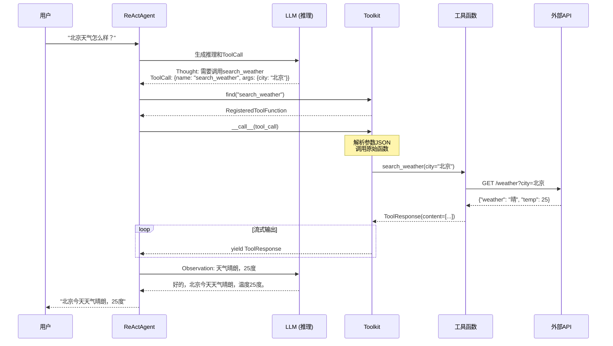
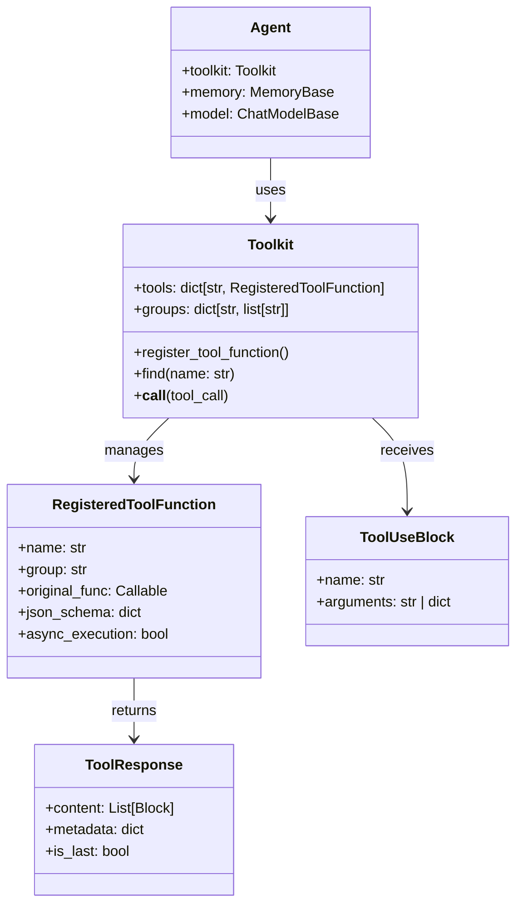
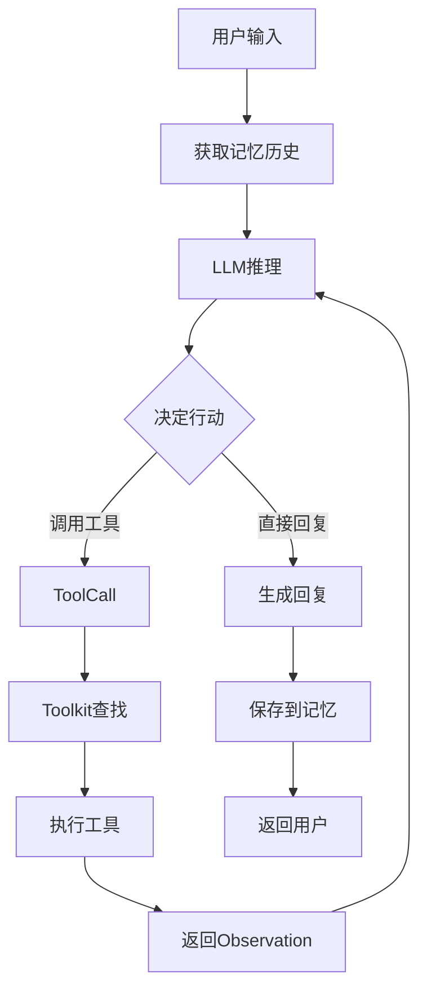

# 5-3 追踪Tool调用流程

## 学习目标

学完本章后，你能：
- 画出Tool从注册到调用的完整流程图
- 理解Toolkit内部如何存储和查找工具
- 掌握Tool执行失败时的调试方法
- 了解ReAct模式下Agent与Tool的协作机制

## 背景问题

### 为什么需要追踪Tool调用？

Tool调用涉及多个组件协作：
- Agent决定**何时**调用工具
- Toolkit负责**查找**正确的工具
- 工具函数执行**具体操作**
- 结果返回给Agent继续**推理**

理解这个流程，有助于：
- 调试"找不到工具"的问题
- 排查"参数类型错误"
- 优化"工具执行超时"

### Tool调用的5个阶段

```
注册 → 决定调用 → 查找工具 → 执行 → 返回结果
```

## 源码入口

### 核心文件

| 文件 | 职责 |
|------|------|
| `src/agentscope/tool/_toolkit.py` | Toolkit核心：register、find、__call__ |
| `src/agentscope/tool/_types.py` | RegisteredToolFunction类型定义 |
| `src/agentscope/tool/_response.py` | ToolResponse数据结构 |
| `src/agentscope/agent/` | Agent中Tool调用的入口 |

### 关键调用链

```python
# 1. 注册阶段
toolkit.register_tool_function(func, group_name, name)

# 2. 查找阶段
registered = toolkit.find("tool_name")

# 3. 调用阶段
result = await toolkit(tool_call_block)  # __call__方法
```

## 架构定位

### 模块职责

Toolkit在Agent与工具函数之间起**桥接**作用：

```
┌─────────┐    ┌─────────────┐    ┌───────────────────┐    ┌────────────┐
│  LLM    │───▶│   Agent    │───▶│     Toolkit       │───▶│ 工具函数   │
│(决策)   │◀───│  (ReAct)   │◀───│ (注册/查找/调用) │◀───│ (执行)     │
└─────────┘    └─────────────┘    └───────────────────┘    └────────────┘
```

### Agent中Tool调用的完整流程

```python
# src/agentscope/agent/ (ReActAgent内部伪代码)

async def step(self, msg: Msg) -> Msg:
    # 1. 获取历史上下文
    history = await self.memory.get_memory()

    # 2. 让Model思考下一步
    prompt = build_thought_prompt(history, msg)
    thought = await self.model(prompt)

    # 3. 如果Model决定调用Tool
    if thought.tool_calls:
        for tool_call in thought.tool_calls:
            # 3.1 查找工具
            registered = self.toolkit.find(tool_call.name)

            # 3.2 执行工具
            tool_result = await self.toolkit(tool_call)

            # 3.3 将结果作为Observation继续循环
            history.append(tool_result)

    # 4. Model生成最终回复
    return await self.model(history)
```

## 核心源码分析

### 阶段1：注册（register_tool_function）

```python
# src/agentscope/tool/_toolkit.py:274-350

def register_tool_function(
    self,
    func: Callable,
    group_name: str | None = None,
    description: str | None = None,
    name: str | None = None,
    async_execution: bool = False,
) -> None:
    # 1. 从函数签名生成JSON Schema
    json_schema = _parse_tool_function(func, description)

    # 2. 创建RegisteredToolFunction对象
    registered = RegisteredToolFunction(
        name=name or func.__name__,  # 暴露给LLM的名称
        group=group_name or "basic",
        source="function",
        original_func=func,
        json_schema=json_schema,
        async_execution=async_execution,
    )

    # 3. 存入self.tools字典
    self.tools[registered.name] = registered

    # 4. 更新self.groups索引
    if registered.group not in self.groups:
        self.groups[registered.group] = []
    self.groups[registered.group].append(registered.name)
```

**关键数据结构**：

```python
# 存储结构
self.tools = {
    "search_weather": RegisteredToolFunction(...),
    "calculate": RegisteredToolFunction(...),
}

self.groups = {
    "weather": ["search_weather"],
    "basic": ["calculate"],
}
```

### 阶段2：查找（find方法）

```python
# src/agentscope/tool/_toolkit.py (简化)

def find(self, name: str) -> RegisteredToolFunction:
    """根据名称查找已注册的工具"""
    if name not in self.tools:
        raise KeyError(f"Tool '{name}' not found in toolkit. "
                       f"Available tools: {list(self.tools.keys())}")
    return self.tools[name]
```

**异常处理**：

```python
# 如果找不到工具，会抛出有意义的错误
try:
    tool = toolkit.find("nonexistent_tool")
except KeyError as e:
    print(f"错误: {e}")
    # 提示LLM可用的工具列表
```

### 阶段3：执行（__call__方法）

```python
# src/agentscope/tool/_toolkit.py:853 (简化版)

async def __call__(
    self,
    tool_call: ToolUseBlock,
) -> AsyncGenerator[ToolResponse, None]:
    # 1. 解析参数
    kwargs = json.loads(tool_call.arguments) \
        if isinstance(tool_call.arguments, str) \
        else tool_call.arguments

    # 2. 查找工具
    registered = self.find(tool_call.name)

    # 3. 调用原始函数
    if registered.async_execution:
        # 异步执行：返回AsyncGenerator
        result = registered.original_func(**kwargs)
        async for chunk in result:
            yield chunk
    else:
        # 同步执行
        result = registered.original_func(**kwargs)
        yield result
```

### 阶段4：结果封装

```python
# 工具函数返回ToolResponse
def search_weather(city: str) -> ToolResponse:
    data = weather_api(city)
    return ToolResponse(
        content=[TextBlock(type="text", text=str(data))],
        metadata={"status": "success"}
    )
```

## 可视化结构

### Tool调用完整时序图



### 内部数据结构图



### ReAct推理循环



## 工程经验

### 设计原因

#### 1. 为什么要通过JSON Schema生成参数验证？

```python
# 注册时自动生成Schema
json_schema = {
    "type": "object",
    "properties": {
        "city": {
            "type": "string",
            "description": "城市名称"
        }
    },
    "required": ["city"]
}
```

**优势**：
- LLM知道需要传什么参数
- 可以做运行时参数验证
- 自文档化

#### 2. 为什么Tool执行结果要通过ToolResponse封装？

```python
# 统一格式让Agent处理更简单
result = ToolResponse(
    content=[TextBlock(type="text", text="结果")],
    metadata={"cost": 0.001},  # 内部用元数据
    is_last=True  # 流式标识
)
```

**优势**：
- 统一接口处理不同工具
- 支持流式输出的结束标识
- 元数据用于内部传递（如错误信息）

### 常见问题

#### 1. Tool名称不匹配

```python
# 注册时
toolkit.register_tool_function(
    safe_divide,        # 实际函数名
    name="divide"       # 暴露给LLM的名称
)

# LLM会看到名为"divide"的工具
# 如果LLM输出"调用safe_divide"，会找不到
```

**解决方案**：确保`name`参数与LLM可能输出的名称一致

#### 2. 参数类型不匹配

```python
# 函数签名
def calculate(a: int, b: int) -> ToolResponse: ...

# LLM生成的参数
{"a": "1", "b": "2"}  # 字符串而不是整数

# 执行时
calculate(a="1", b="2")  # 可能出错，取决于函数实现
```

**解决方案**：在工具函数内部做类型转换

#### 3. Tool执行超时

```python
# 外部API可能很慢
def slow_tool() -> ToolResponse:
    result = requests.get("https://slow-api.com", timeout=30)
    ...

# 解决方案1：设置超时
def safer_tool() -> ToolResponse:
    result = requests.get("https://api.com", timeout=10)
    ...

# 解决方案2：使用异步执行
async def async_tool() -> ToolResponse:
    async with aiohttp.ClientSession() as session:
        async with session.get("https://api.com", timeout=10) as resp:
            return await resp.json()
```

#### 4. Tool执行失败

```python
def fragile_tool(param: str) -> ToolResponse:
    try:
        result = risky_operation(param)
        return ToolResponse(content=[TextBlock(text=str(result))])
    except ValueError as e:
        # 通过metadata传递错误信息
        return ToolResponse(
            content=[TextBlock(text=f"操作失败: {e}")],
            metadata={"error": str(e), "error_type": "ValueError"}
        )
```

## Contributor指南

### 适合新手修改的文件

| 文件 | 原因 | 修改难度 |
|------|------|----------|
| `src/agentscope/tool/_response.py` | ToolResponse结构最简单 | ★☆☆☆☆ |
| `src/agentscope/tool/_toolkit.py` | 核心逻辑较复杂 | ★★★☆☆ |

### 危险区域

#### ⚠️ JSON Schema生成逻辑

```python
# src/agentscope/tool/_toolkit.py
# _parse_tool_function() 生成的Schema影响LLM调用
# 错误可能导致LLM生成错误的参数
json_schema = _parse_tool_function(func, description)
```

#### ⚠️ 异步执行处理

```python
# src/agentscope/tool/_toolkit.py:853
# 异步处理逻辑复杂，错误可能导致：
# - 工具调用挂起
# - 结果丢失
# - 内存泄漏
async for chunk in result:
    yield chunk
```

### 调试方法

```python
# 1. 打印已注册的工具
print(f"已注册工具: {list(toolkit.tools.keys())}")
print(f"工具分组: {toolkit.groups}")

# 2. 测试工具查找
try:
    tool = toolkit.find("tool_name")
    print(f"找到工具: {tool.name}")
    print(f"工具Schema: {tool.json_schema}")
except KeyError as e:
    print(f"找不到工具: {e}")

# 3. 直接测试工具执行
from agentscope.message import ToolUseBlock
test_call = ToolUseBlock(
    name="search_weather",
    arguments='{"city": "北京"}'
)
async for resp in toolkit(test_call):
    print(f"响应: {resp.content}")

# 4. 打印Agent的推理过程（如果支持）
agent.config(debug=True)
```

## 思考题

<details>
<summary>点击查看答案</summary>

1. **Toolkit.find()找不到会怎样？**
   - 抛出`KeyError`异常
   - 异常消息包含可用工具列表
   - Agent可能尝试其他方案

2. **Tool执行失败Agent会崩溃吗？**
   - 不会崩溃
   - 工具函数应返回带有错误信息的ToolResponse
   - Agent收到错误后可以重新决策

3. **如何调试Tool调用问题？**
   - 检查`toolkit.tools.keys()`确认工具已注册
   - 检查`toolkit.find(name)`是否能找到
   - 直接调用工具函数测试参数和返回值

</details>

★ **Insight** ─────────────────────────────────────
- **注册 → 查找 → 执行 → 返回** 是Tool调用的标准流程
- **toolkit.find()** 根据名称在字典中查找
- **ToolResponse** 统一封装执行结果和错误信息
─────────────────────────────────────────────────
