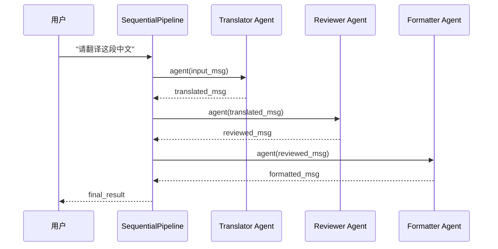
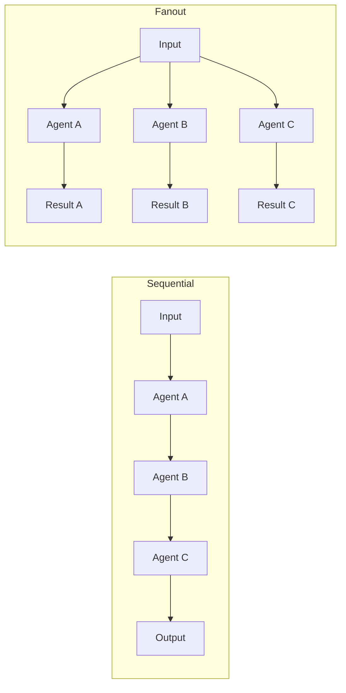

# 6-1 Pipeline多Agent协作管道

## 学习目标

学完本章后，你能：
- 理解SequentialPipeline顺序协作的适用场景
- 理解FanoutPipeline并行协作的适用场景
- 根据任务依赖关系选择合适的Pipeline类型
- 设计多Agent流水线式或广播式协作流程

## 背景问题

### 为什么需要Pipeline？

单个Agent能力有限，复杂任务需要多个Agent协作：

```
翻译任务：
1. 翻译员Agent → 2. 校对员Agent → 3. 格式化Agent

没有Pipeline：需要手动管理Agent之间的数据传递
有Pipeline：自动管理数据流
```

### SequentialPipeline vs FanoutPipeline

| 类型 | 数据流 | 输出 | 适用场景 |
|------|--------|------|----------|
| SequentialPipeline | A → B → C | 单个Msg | 有顺序依赖的流水线任务 |
| FanoutPipeline | input → [A, B, C] | Msg列表 | 多角度分析、头脑风暴 |

## 源码入口

### 核心文件

| 文件 | 职责 |
|------|------|
| `src/agentscope/pipeline/_class.py` | SequentialPipeline、FanoutPipeline类定义 |
| `src/agentscope/pipeline/_functional.py` | sequential_pipeline、fanout_pipeline函数实现 |
| `src/agentscope/pipeline/__init__.py` | 导出接口 |

### 关键类定义

```python
# src/agentscope/pipeline/_class.py

class SequentialPipeline:
    """顺序执行Pipeline，输出依次传递给下一个Agent"""

    def __init__(self, agents: list[AgentBase]) -> None:
        self.agents = agents

    async def __call__(self, msg: Msg | list[Msg] | None) -> Msg | list[Msg] | None:
        return await sequential_pipeline(self.agents, msg)


class FanoutPipeline:
    """并行分发Pipeline，同一输入同时发送给所有Agent"""

    def __init__(
        self,
        agents: list[AgentBase],
        enable_gather: bool = True,
    ) -> None:
        self.agents = agents
        self.enable_gather = enable_gather

    async def __call__(self, msg: Msg | list[Msg] | None, **kwargs) -> list[Msg]:
        return await fanout_pipeline(self.agents, msg, self.enable_gather, **kwargs)
```

### 函数实现

```python
# src/agentscope/pipeline/_functional.py

async def sequential_pipeline(
    agents: list[AgentBase],
    msg: Msg | list[Msg] | None = None,
) -> Msg | list[Msg] | None:
    """顺序执行：上一个Agent的输出作为下一个的输入"""
    for agent in agents:
        msg = await agent(msg)
    return msg


async def fanout_pipeline(
    agents: list[AgentBase],
    msg: Msg | list[Msg] | None = None,
    enable_gather: bool = True,
    **kwargs,
) -> list[Msg]:
    """并行执行：同一输入同时发送给所有Agent"""
    if enable_gather:
        tasks = [
            asyncio.create_task(agent(deepcopy(msg), **kwargs))
            for agent in agents
        ]
        return await asyncio.gather(*tasks)
    else:
        return [await agent(deepcopy(msg), **kwargs) for agent in agents]
```

## 架构定位

### 模块职责

Pipeline在多Agent系统中负责**协作编排**：

```
┌─────────────────────────────────────────────────────────────┐
│                      Pipeline                               │
│                                                             │
│   SequentialPipeline:                                      │
│   input ──► Agent A ──► Agent B ──► Agent C ──► output    │
│                                                             │
│   FanoutPipeline:                                          │
│                    ┌─► Agent A ──►                        │
│   input ───────────┼─► Agent B ──► results                │
│                    └─► Agent C ──►                        │
└─────────────────────────────────────────────────────────────┘
```

### 与Agent的关系

```python
# Pipeline持有Agent列表
pipeline = SequentialPipeline([agent_a, agent_b, agent_c])

# Pipeline调用Agent
result = await pipeline(input_msg)
# 等价于:
# result_a = await agent_a(input_msg)
# result_b = await agent_b(result_a)
# result_c = await agent_c(result_b)
```

## 核心源码分析

### SequentialPipeline执行逻辑

```python
# src/agentscope/pipeline/_functional.py:10-35

async def sequential_pipeline(
    agents: list[AgentBase],
    msg: Msg | list[Msg] | None = None,
) -> Msg | list[Msg] | None:
    """顺序执行的实现"""
    for agent in agents:
        # 每个Agent的输出作为下一个Agent的输入
        msg = await agent(msg)
    return msg
```

**关键点**：
- 使用`for`循环确保顺序执行
- 每次调用`await agent(msg)`等待完成
- 上一个Agent的返回值作为下一个Agent的输入

### FanoutPipeline并行逻辑

```python
# src/agentscope/pipeline/_functional.py:40-85

async def fanout_pipeline(
    agents: list[AgentBase],
    msg: Msg | list[Msg] | None = None,
    enable_gather: bool = True,
    **kwargs,
) -> list[Msg]:
    """并行分发的实现"""
    if enable_gather:
        # 使用asyncio.gather实现真正并行
        tasks = [
            asyncio.create_task(agent(deepcopy(msg), **kwargs))
            for agent in agents
        ]
        return await asyncio.gather(*tasks)
    else:
        # 顺序执行但返回列表
        return [await agent(deepcopy(msg), **kwargs) for agent in agents]
```

**关键点**：
- 使用`asyncio.create_task`创建并发任务
- `deepcopy(msg)`确保每个Agent收到独立的输入副本
- `asyncio.gather`等待所有任务完成

### sys_prompt与Agent角色

```python
# 每个Agent通过sys_prompt定义角色
translator = ReActAgent(
    name="Translator",
    model=model,
    sys_prompt="你是一个专业翻译员，擅长中英文互译"
)

reviewer = ReActAgent(
    name="Reviewer",
    model=model,
    sys_prompt="你是一个严谨的校对员，检查语法和用词"
)
```

## 可视化结构

### SequentialPipeline时序图



### FanoutPipeline时序图

```mermaid
sequenceDiagram
    participant User as 用户
    participant Pipe as FanoutPipeline
    participant Econ as 经济专家Agent
    participant Lawyer as 法律专家Agent
    participant Tech as 技术专家Agent

    User->>Pipe: "这个项目值得投资吗？"
    Pipe->>Econ: agent(input_msg)
    Pipe->>Lawyer: agent(input_msg)
    Pipe->>Tech: agent(input_msg)

    parallel
        Econ-->>Pipe: 经济分析
        Lawyer-->>Pipe: 法律分析
        Tech-->>Pipe: 技术分析
    end

    Pipe-->>User: [经济分析, 法律分析, 技术分析]
```

### 数据流对比



## 工程经验

### 设计原因

#### 1. 为什么FanoutPipeline用deepcopy？

```python
# 问题：不使用deepcopy会导致共享状态
msg = Msg(name="user", content="原始内容")
agents = [agent_a, agent_b, agent_c]

# 如果直接传同一个msg引用
results = await fanout_pipeline(agents, msg)
# agents可能修改msg的内容，导致不可预期结果

# 解决方案：deepcopy
tasks = [
    asyncio.create_task(agent(deepcopy(msg), **kwargs))  # 独立副本
    for agent in agents
]
```

#### 2. 为什么enable_gather参数存在？

```python
# enable_gather=True: 真正并行执行
results = await fanout_pipeline(agents, msg, enable_gather=True)
# asyncio.gather等待所有任务完成

# enable_gather=False: 顺序执行但返回列表
results = await fanout_pipeline(agents, msg, enable_gather=False)
# for循环顺序执行，但返回列表格式
```

### 常见问题

#### 1. SequentialPipeline中间Agent失败

```python
# 问题：一个Agent失败会导致整个Pipeline失败
try:
    result = await sequential_pipeline([a, b, c], msg)
except Exception as e:
    print(f"Pipeline失败: {e}")
    # a成功了，但b失败了，c不会执行

# 解决方案：添加错误处理
async def resilient_pipeline(agents, msg):
    for agent in agents:
        try:
            msg = await agent(msg)
        except Exception as e:
            msg = Msg(name="error", content=str(e), role="system")
            # 或者：return msg  # 提前退出
    return msg
```

#### 2. FanoutPipeline结果顺序不确定

```python
# 问题：asyncio.gather不保证结果顺序
results = await fanout_pipeline(agents, msg)
# results可能是 [C的结果, A的结果, B的结果]

# 解决方案：自己维护顺序
tasks = {agent.name: agent(deepcopy(msg)) for agent in agents}
results = [await tasks[agent.name] for agent in agents]
```

#### 3. Pipeline类型选择

```python
# 场景1：翻译流水线（有顺序依赖）
pipeline = SequentialPipeline([
    translator,
    reviewer,
    formatter
])
# 翻译→校对→格式化，必须按顺序

# 场景2：头脑风暴（无顺序依赖）
pipeline = FanoutPipeline([
    economist,
    lawyer,
    tech_expert
])
# 一个问题，多个专家同时回答
```

## Contributor指南

### 适合新手修改的文件

| 文件 | 原因 | 修改难度 |
|------|------|----------|
| `src/agentscope/pipeline/_class.py` | 类定义简单清晰 | ★★☆☆☆ |
| `src/agentscope/pipeline/_functional.py` | 函数实现直观 | ★★☆☆☆ |

### 危险区域

#### ⚠️ 顺序执行的异常处理

```python
# src/agentscope/pipeline/_functional.py:10-35
# 如果某个agent抛出异常，后续agent不会执行
for agent in agents:
    msg = await agent(msg)  # 异常会导致循环中断
```

#### ⚠️ 并行执行的资源竞争

```python
# src/agentscope/pipeline/_functional.py
# 多个agent同时修改共享状态可能导致竞态条件
# deepcopy可以缓解但不能完全解决
```

### 添加新Pipeline类型步骤

**步骤1**：定义新类：

```python
# src/agentscope/pipeline/_class.py
class MyPipeline:
    async def __call__(self, msg: Msg) -> Msg:
        # 自定义Pipeline逻辑
        ...
```

**步骤2**：在`__init__.py`中导出

**步骤3**：创建对应函数（可选）：

```python
# src/agentscope/pipeline/_functional.py
async def my_pipeline(agents, msg, **kwargs) -> Msg:
    ...
```

### 调试方法

```python
# 1. 打印Pipeline中的Agent
pipeline = SequentialPipeline([a, b, c])
print(f"Agents: {[agent.name for agent in pipeline.agents]}")

# 2. 分步执行调试
result_a = await agent_a(msg)
result_b = await agent_b(result_a)
result_c = await agent_c(result_b)

# 3. FanoutPipeline结果检查
results = await fanout_pipeline(agents, msg)
for i, result in enumerate(results):
    print(f"Agent {i}: {result.name} -> {result.content[:50]}")
```

## 思考题

<details>
<summary>点击查看答案</summary>

1. **什么时候用SequentialPipeline？**
   - 任务有严格顺序依赖
   - 例如：翻译→校对→发布
   - 第一个Agent的输出是第二个Agent的输入

2. **什么时候用FanoutPipeline？**
   - 任务相互独立，可以并行处理
   - 例如：头脑风暴、多角度分析、投票决策
   - 同一个输入同时发送给多个Agent

3. **FanoutPipeline的输出是什么格式？**
   - 返回`list[Msg]`，每个Agent一个Msg
   - 顺序可能与输入Agent列表不一致

4. **Pipeline和MsgHub的区别是什么？**
   - Pipeline：消息依次传递（Sequential）或同时分发（Fanout）
   - MsgHub：发布-订阅模式，消息广播给所有订阅者

</details>

★ **Insight** ─────────────────────────────────────
- **SequentialPipeline = 流水线**，A输出给B，B输出给C
- **FanoutPipeline = 并行分发**，同一输入同时给A、B、C
- 选择依据：**任务是否有顺序依赖**
─────────────────────────────────────────────────
