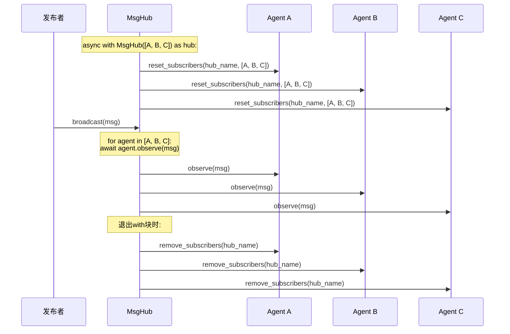
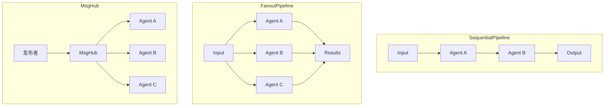

# 6-2 MsgHub多Agent消息中枢

## 学习目标

学完本章后，你能：
- 理解MsgHub的发布-订阅模式原理
- 使用`broadcast()`实现消息广播
- 掌握`enable_auto_broadcast`的使用场景
- 区分MsgHub与Pipeline的适用场景

## 背景问题

### 为什么需要MsgHub？

在多Agent系统中，有时需要：
- **广播通知**：一个事件同时通知所有相关Agent
- **松耦合通信**：发布者和订阅者不需要直接引用

MsgHub实现了**发布-订阅模式**，让消息发送方不需要知道谁在接收。

### 发布-订阅 vs Pipeline

| 模式 | 特点 | 适用场景 |
|------|------|----------|
| SequentialPipeline | 数据依次传递 | 流水线任务 |
| FanoutPipeline | 同一输入并行分发 | 多角度分析 |
| MsgHub | 发布-订阅广播 | 事件通知、松耦合 |

## 源码入口

### 核心文件

| 文件 | 职责 |
|------|------|
| `src/agentscope/pipeline/_msghub.py` | MsgHub核心实现 |
| `src/agentscope/pipeline/__init__.py` | 导出接口 |

### 关键类定义

```python
# src/agentscope/pipeline/_msghub.py

class MsgHub:
    """消息中枢，控制Agent的订阅关系"""

    def __init__(
        self,
        participants: Sequence[AgentBase],
        announcement: list[Msg] | Msg | None = None,
        enable_auto_broadcast: bool = True,
        name: str | None = None,
    ) -> None:
        """初始化MsgHub

        Args:
            participants: 参与者的Agent列表
            announcement: 进入Hub时自动广播的消息
            enable_auto_broadcast: 是否启用自动广播
            name: Hub名称，用于标识订阅关系
        """
        self.name = name or shortuuid.uuid()
        self.participants = list(participants)
        self.announcement = announcement
        self.enable_auto_broadcast = enable_auto_broadcast

    async def __aenter__(self) -> "MsgHub":
        """进入上下文时设置订阅关系"""
        self._reset_subscriber()
        if self.announcement is not None:
            await self.broadcast(msg=self.announcement)
        return self

    async def __aexit__(self, *args: Any, **kwargs: Any) -> None:
        """退出上下文时清除订阅关系"""
        if self.enable_auto_broadcast:
            for agent in self.participants:
                agent.remove_subscribers(self.name)

    def _reset_subscriber(self) -> None:
        """重置订阅关系"""
        if self.enable_auto_broadcast:
            for agent in self.participants:
                agent.reset_subscribers(self.name, self.participants)

    async def broadcast(self, msg: list[Msg] | Msg) -> None:
        """广播消息给所有参与者"""
        for agent in self.participants:
            await agent.observe(msg)

    def add(self, new_participant: list[AgentBase] | AgentBase) -> None:
        """动态添加参与者"""
        ...

    def delete(self, participant: list[AgentBase] | AgentBase) -> None:
        """删除参与者"""
        ...
```

## 架构定位

### 模块职责

MsgHub在多Agent系统中扮演**消息路由**角色：

```
┌─────────────────────────────────────────────────────────────┐
│                      MsgHub                                │
│                                                             │
│   ┌─────────┐     broadcast()     ┌─────────────────────┐  │
│   │ 发布者   │ ─────────────────▶│ Agent A.observe()  │  │
│   └─────────┘                    └─────────────────────┘  │
│                                     ┌─────────────────────┐  │
│                                     │ Agent B.observe()  │  │
│                                     └─────────────────────┘  │
│                                     ┌─────────────────────┐  │
│                                     │ Agent C.observe()  │  │
│                                     └─────────────────────┘  │
│                                                             │
│   发布者只管发，订阅者自动收到                               │
└─────────────────────────────────────────────────────────────┘
```

### 订阅机制

```python
# 进入with时自动订阅
async with MsgHub(participants=[a, b, c]) as hub:
    # 每个Agent通过reset_subscribers设置：
    # - Agent A订阅[A, B, C]的消息
    # - Agent B订阅[A, B, C]的消息
    # - Agent C订阅[A, B, C]的消息
```

## 核心源码分析

### 订阅关系设置（_reset_subscriber）

```python
# src/agentscope/pipeline/_msghub.py:89-95

def _reset_subscriber(self) -> None:
    """为每个参与者设置订阅关系"""
    if self.enable_auto_broadcast:
        for agent in self.participants:
            # 调用agent的reset_subscribers方法
            # agent内部记录：来自哪些Hub的消息应该转发给自己
            agent.reset_subscribers(self.name, self.participants)
```

**关键点**：
- 每个Agent维护自己的订阅者列表
- `reset_subscribers`让Agent知道"当收到消息时，应该转发给谁"

### 广播实现（broadcast）

```python
# src/agentscope/pipeline/_msghub.py:130-140

async def broadcast(self, msg: list[Msg] | Msg) -> None:
    """广播消息给所有参与者"""
    for agent in self.participants:
        # 调用每个参与者的observe方法
        await agent.observe(msg)
```

**关键点**：
- 遍历`self.participants`列表
- 对每个Agent调用`await agent.observe(msg)`
- 这是串行执行，不是并行

### 自动订阅的生命周期

```python
# src/agentscope/pipeline/_msghub.py:60-80

async def __aenter__(self) -> "MsgHub":
    """进入上下文：自动订阅"""
    self._reset_subscriber()

    # 如果有announcement，立即广播
    if self.announcement is not None:
        await self.broadcast(msg=self.announcement)

    return self


async def __aexit__(self, *args: Any, **kwargs: Any) -> None:
    """退出上下文：自动取消订阅"""
    if self.enable_auto_broadcast:
        for agent in self.participants:
            # 移除订阅关系
            agent.remove_subscribers(self.name)
```

**关键点**：
- `__aenter__`中调用`_reset_subscriber`设置订阅
- `__aexit__`中调用`remove_subscribers`清除订阅
- 借助Python的`with`语法自动管理生命周期

## 可视化结构

### MsgHub广播时序图



### MsgHub与Pipeline对比



## 工程经验

### 设计原因

#### 1. 为什么需要enable_auto_broadcast？

```python
# enable_auto_broadcast=True (默认)
# Agent回复后自动广播给其他参与者
# 风险：可能导致消息风暴

# enable_auto_broadcast=False
# Agent回复后不自动广播
# 需要手动调用hub.broadcast()
# 更安全，但需要手动管理
```

**使用建议**：
- 简单场景：默认开启
- 复杂场景：禁用，手动控制何时广播

#### 2. 为什么用with语法管理生命周期？

```python
# with语法确保订阅/取消订阅配对
async with MsgHub(participants=[a, b, c]) as hub:
    await hub.broadcast(msg)
# 退出with时自动调用remove_subscribers

# 不用with的写法（容易忘记取消订阅）
hub = MsgHub(participants=[a, b, c])
hub._reset_subscriber()
# ... 使用hub ...
hub.__aexit__()  # 容易忘记！
```

### 常见问题

#### 1. 消息风暴（auto_broadcast导致）

```python
# 问题：Agent回复触发自动广播，其他Agent回复又触发广播...
async with MsgHub(participants=[a, b]) as hub:
    await hub.broadcast(initial_msg)
    # a回复 -> 自动广播给b
    # b回复 -> 自动广播给a
    # a又回复 -> ...

# 解决方案：禁用auto_broadcast
async with MsgHub(
    participants=[a, b],
    enable_auto_broadcast=False  # 禁用自动广播
) as hub:
    await hub.broadcast(initial_msg)
    # 只有手动调用hub.broadcast()才会广播
```

#### 2. 订阅关系冲突

```python
# 问题：一个Agent在多个MsgHub中
async with MsgHub(participants=[a, b]) as hub1:
    async with MsgHub(participants=[a, c]) as hub2:
        # a同时在hub1和hub2中
        # hub1.broadcast()会发给a, b
        # hub2.broadcast()会发给a, c

# 解决方案：确保Hub之间互斥，或使用不同的Hub name
```

#### 3. broadcast顺序不确定

```python
# broadcast是串行执行，顺序取决于participants列表
for agent in self.participants:  # 遍历顺序
    await agent.observe(msg)

# 如果需要确定顺序，手动控制
await agent_a.observe(msg)
await agent_b.observe(msg)
await agent_c.observe(msg)
```

## Contributor指南

### 适合新手修改的文件

| 文件 | 原因 | 修改难度 |
|------|------|----------|
| `src/agentscope/pipeline/_msghub.py` | MsgHub核心实现 | ★★★☆☆ |

### 危险区域

#### ⚠️ _reset_subscriber逻辑

```python
# src/agentscope/pipeline/_msghub.py:89
# 控制订阅关系的核心逻辑
# 错误可能导致：
# - 消息无法送达
# - 消息被重复发送
agent.reset_subscribers(self.name, self.participants)
```

#### ⚠️ auto_broadcast的竞态条件

```python
# src/agentscope/pipeline/_msghub.py:130
# broadcast串行执行，如果Agent在observe中修改participants
# 可能导致问题
for agent in self.participants:
    await agent.observe(msg)
```

### 调试方法

```python
# 1. 打印参与者列表
print(f"参与者: {[a.name for a in hub.participants]}")
print(f"Hub名称: {hub.name}")
print(f"自动广播: {hub.enable_auto_broadcast}")

# 2. 检查Agent的订阅关系
# (如果Agent有get_subscribers方法)
print(f"Agent订阅关系: {agent.get_subscribers()}")

# 3. 手动广播测试
test_msg = Msg(name="test", content="test", role="system")
await hub.broadcast(test_msg)
```

## 思考题

<details>
<summary>点击查看答案</summary>

1. **MsgHub和Pipeline的核心区别？**
   - Pipeline：数据依次传递（A的输出给B）
   - MsgHub：消息广播（所有订阅者同时收到）

2. **enable_auto_broadcast什么时候应该关闭？**
   - 复杂多Agent交互场景
   - 防止消息风暴
   - 需要手动控制广播时机

3. **MsgHub适合什么场景？**
   - 事件通知（"任务完成"通知所有相关Agent）
   - 日志广播（所有日志同时发送给监控Agent）
   - 监控报警（异常事件触发多个Agent响应）

</details>

★ **Insight** ─────────────────────────────────────
- **MsgHub = 广播站**，发布者发消息，所有订阅者收到
- **enable_auto_broadcast** 控制Agent回复是否自动广播
- **with语法** 自动管理订阅/取消订阅生命周期
─────────────────────────────────────────────────
