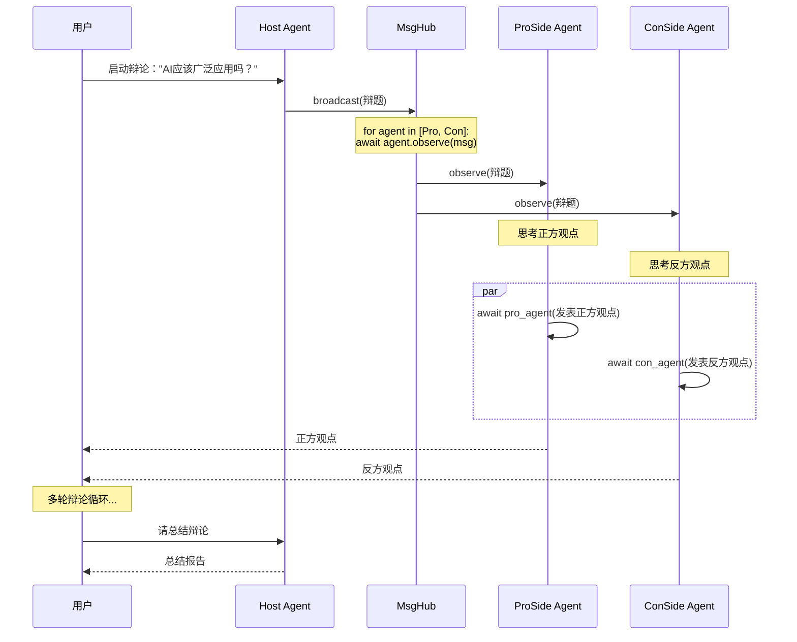
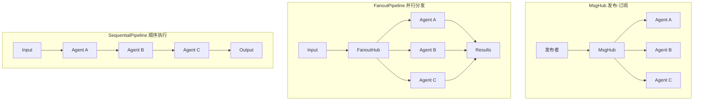
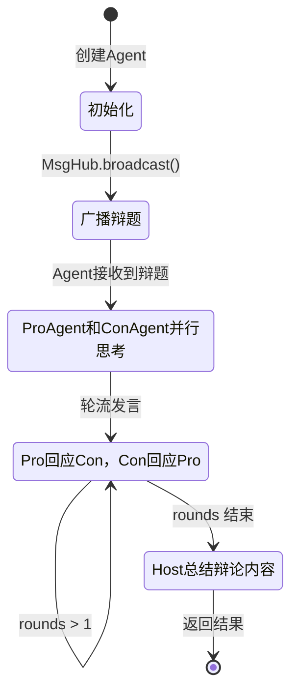

# 6-3 追踪多Agent协作流程

## 学习目标

学完本章后，你能：
- 绘制多Agent系统的消息流动图
- 理解MsgHub与Pipeline的协作机制
- 设计复杂的多Agent交互系统
- 调试多Agent系统中的问题

## 背景问题

### 多Agent系统的复杂性

多Agent协作涉及：
- **角色定义**：每个Agent有独特的sys_prompt
- **通信模式**：选择Pipeline还是MsgHub
- **消息路由**：消息如何从发送者到达接收者
- **状态管理**：Agent之间如何共享信息

### 追踪流程的重要性

当系统行为不符合预期时，追踪能帮助：
- 确定消息是否正确发送
- 检查Agent是否正确接收
- 分析协作逻辑是否正确

## 源码入口

### 核心文件

| 文件 | 职责 |
|------|------|
| `src/agentscope/pipeline/_msghub.py` | MsgHub发布-订阅实现 |
| `src/agentscope/pipeline/_functional.py` | FanoutPipeline并行分发 |
| `src/agentscope/pipeline/_class.py` | Pipeline类定义 |
| `src/agentscope/agent/` | Agent的observe和reply方法 |

### Agent相关方法

```python
# AgentBase中的订阅相关方法
class AgentBase:
    def reset_subscribers(self, hub_name: str, participants: list) -> None:
        """重置订阅关系"""

    def remove_subscribers(self, hub_name: str) -> None:
        """移除订阅关系"""

    async def observe(self, msg: Msg | list[Msg]) -> None:
        """接收消息并存储到观察队列"""

    async def reply(self) -> Msg | None:
        """根据观察队列中的消息生成回复"""
```

## 架构定位

### 多Agent系统的组件关系

```
┌─────────────────────────────────────────────────────────────┐
│                    多Agent协作系统                          │
│                                                             │
│   ┌─────────────────────────────────────────────────────┐  │
│   │                    MsgHub                           │  │
│   │  broadcast()  ──► [Agent A, Agent B, Agent C]     │  │
│   └─────────────────────────────────────────────────────┘  │
│                          │                                 │
│   ┌─────────────────────────────────────────────────────┐  │
│   │              FanoutPipeline                        │  │
│   │  input  ──► [Agent A, Agent B, Agent C]          │  │
│   └─────────────────────────────────────────────────────┘  │
│                          │                                 │
│   ┌─────────────────────────────────────────────────────┐  │
│   │            SequentialPipeline                       │  │
│   │  input ──► A ──► B ──► C ──► output              │  │
│   └─────────────────────────────────────────────────────┘  │
└─────────────────────────────────────────────────────────────┘
```

### 辩论系统的架构示例

```python
# 辩论系统架构
# - Host: 主持人，不参与辩论，只总结
# - ProAgent: 正方辩手
# - ConAgent: 反方辩手
# - MsgHub: 广播辩题给双方
```

## 核心源码分析

### MsgHub订阅机制

```python
# src/agentscope/pipeline/_msghub.py:89-95

def _reset_subscriber(self) -> None:
    """为每个Agent设置订阅关系"""
    if self.enable_auto_broadcast:
        for agent in self.participants:
            # Agent内部记录：这个Hub的消息应该转发给自己
            agent.reset_subscribers(self.name, self.participants)
```

**关键点**：
- 每个Agent维护自己的订阅者列表
- `reset_subscribers`让Agent知道消息来自哪个Hub
- `enable_auto_broadcast`控制Agent回复是否自动广播

### Agent的observe机制

```python
# Agent接收到消息后的处理
async def observe(self, msg: Msg | list[Msg]) -> None:
    """接收消息并存入观察队列"""
    if isinstance(msg, list):
        self._observed_messages.extend(msg)
    else:
        self._observed_messages.append(msg)
```

### FanoutPipeline并行执行

```python
# src/agentscope/pipeline/_functional.py:40-85

async def fanout_pipeline(
    agents: list[AgentBase],
    msg: Msg | list[Msg] | None = None,
    enable_gather: bool = True,
    **kwargs,
) -> list[Msg]:
    """并行分发同一输入给所有Agent"""
    if enable_gather:
        tasks = [
            asyncio.create_task(agent(deepcopy(msg), **kwargs))
            for agent in agents
        ]
        return await asyncio.gather(*tasks)
```

## 可视化结构

### 辩论系统完整时序图



### 多Agent协作模式对比图



### 辩论流程状态图



## 工程经验

### 设计原因

#### 1. 为什么辩论用MsgHub广播辩题？

```python
# MsgHub确保所有辩手同时收到辩题
async with MsgHub(participants=[pro_agent, con_agent]) as hub:
    await hub.broadcast(Msg(name="Host", content=f"辩题：{topic}"))

# 不需要手动逐个通知
# await pro_agent.observe(topic_msg)
# await con_agent.observe(topic_msg)
```

#### 2. 为什么辩论轮次用顺序执行？

```python
# 正方回应反方，然后反方回应正方
pro_response = await pro_agent(Msg(name="user", content=f"反方观点：{con_result.content}"))
con_response = await con_agent(Msg(name="user", content=f"正方观点：{pro_response.content}"))
```

### 常见问题

#### 1. 消息顺序不确定

```python
# 问题：FanoutPipeline不保证结果顺序
results = await fanout_pipeline(agents, msg)
# results = [C, A, B]  # 顺序不确定

# 解决方案：按Agent名称排序
results_dict = {r.name: r for r in results}
ordered = [results_dict[a.name] for a in agents]
```

#### 2. Agent间状态不共享

```python
# 问题：Agent不能直接访问其他Agent的状态
agent_a.private_state  # Agent B无法访问

# 解决方案：通过消息传递
await hub.broadcast(Msg(name="A", content=f"状态更新：{state}"))
# 其他Agent在observe中接收
```

#### 3. 循环等待死锁

```python
# 问题：Agent互相等待对方
# Agent A await agent_b()
# Agent B await agent_a()

# 解决方案：使用超时
try:
    async with asyncio.timeout(30):
        result = await agent(msg)
except asyncio.TimeoutError:
    print("Agent响应超时")
```

## Contributor指南

### 适合新手修改的文件

| 文件 | 原因 | 修改难度 |
|------|------|----------|
| `src/agentscope/pipeline/_msghub.py` | 订阅逻辑清晰 | ★★★☆☆ |
| `src/agentscope/pipeline/_functional.py` | 并行逻辑简单 | ★★☆☆☆ |

### 危险区域

#### ⚠️ 并行执行的竞态条件

```python
# src/agentscope/pipeline/_functional.py
# 多个Agent同时修改共享状态可能导致问题
tasks = [asyncio.create_task(agent(deepcopy(msg))) for agent in agents]
results = await asyncio.gather(*tasks)
```

#### ⚠️ 订阅关系管理

```python
# src/agentscope/pipeline/_msghub.py
# 一个Agent在多个Hub中时，订阅关系可能混乱
```

### 调试方法

#### 方法1：打印消息流

```python
async with MsgHub(participants=[a1, a2]) as hub:
    original_broadcast = hub.broadcast

    async def debug_broadcast(msg):
        print(f"广播: {msg.name} - {msg.content[:50]}")
        return await original_broadcast(msg)

    hub.broadcast = debug_broadcast
    await hub.broadcast(test_msg)
```

#### 方法2：检查Agent状态

```python
# 检查Agent的观察队列
print(f"Agent观察队列: {agent._observed_messages}")

# 检查Agent的订阅关系
print(f"Agent订阅者: {agent._subscribers}")
```

#### 方法3：逐步执行调试

```python
# 替代并行执行
result_a = await agent_a(msg)
result_b = await agent_b(msg)
result_c = await agent_c(msg)

# 打印中间结果
print(f"A: {result_a}")
print(f"B: {result_b}")
print(f"C: {result_c}")
```

## 思考题

<details>
<summary>点击查看答案</summary>

1. **MsgHub和Pipeline的核心区别？**
   - MsgHub：发布-订阅，消息广播给所有订阅者
   - Pipeline：数据流，上一个Agent的输出是下一个的输入

2. **为什么辩论系统需要MsgHub？**
   - 让所有辩手同时收到辩题
   - 实现松耦合通信

3. **FanoutPipeline为什么不保证结果顺序？**
   - 因为`asyncio.gather`不保证任务完成顺序
   - 取决于每个Agent的处理速度

4. **如何防止多Agent系统的死锁？**
   - 使用`asyncio.timeout`添加超时
   - 避免循环等待
   - 设计合理的Agent交互逻辑

</details>

★ **Insight** ─────────────────────────────────────
- **MsgHub = 广播站**，消息同时发给所有订阅者
- **FanoutPipeline = 并行分发**，同一输入多Agent同时处理
- **SequentialPipeline = 顺序管道**，A输出给B，B输出给C
- 多Agent协作关键：**选择合适的通信模式**
─────────────────────────────────────────────────
