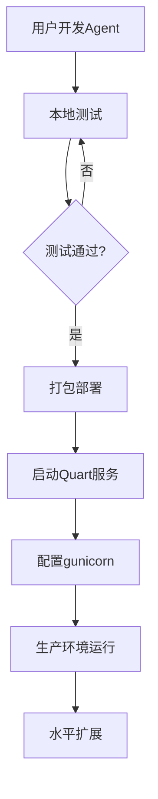
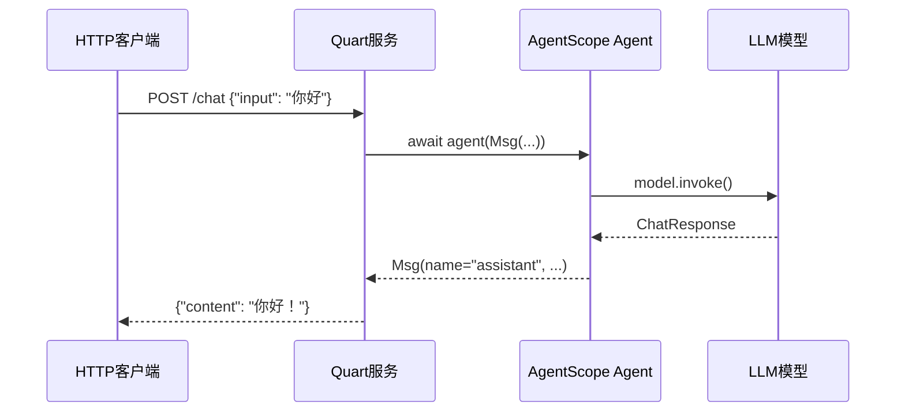
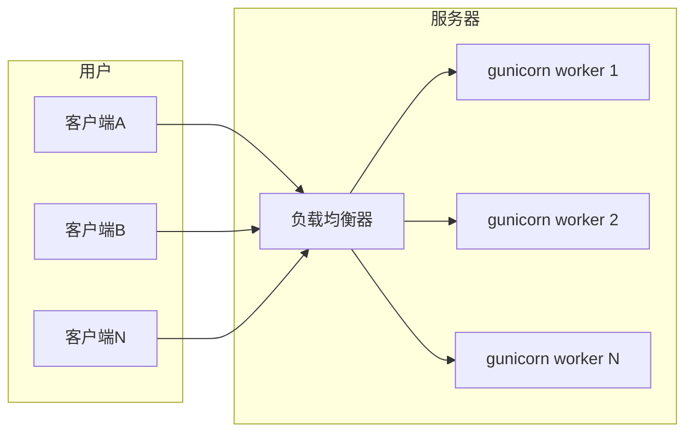

# 7-1 如何部署Agent服务

## 学习目标

学完之后，你能：
- 使用Quart框架将Agent部署为HTTP服务
- 理解本地运行和HTTP服务运行的区别
- 实现带流式响应的Agent服务
- 使用gunicorn在生产环境运行服务

## 背景问题

### 为什么需要HTTP服务部署？

本地运行（直接调用`agent(msg)`）只能处理单个请求，适合开发调试。但实际应用需要：
- 同时服务多个用户
- 7x24小时不间断运行
- 跨平台、跨语言调用
- 水平扩展能力

HTTP服务通过REST API暴露Agent能力，任何能发HTTP请求的客户端都能调用。

## 源码入口

**核心文件**：
- `/Users/nadav/IdeaProjects/agentscope/examples/deployment/planning_agent/main.py` - 部署示例入口

**关键类和函数**：
| 类/函数 | 路径 | 说明 |
|---------|------|------|
| `Quart` | `quart import Quart` | ASGI微框架 |
| `ReActAgent` | `src/agentscope/agent/_react_agent.py:143` | Agent实现 |
| `stream_printing_messages` | `src/agentscope/pipeline/_functional.py` | 流式输出支持 |
| `JSONSession` | `src/agentscope/session/_json.py` | 会话持久化 |

**调用入口**：
```python
app.run(port=5000, debug=True)  # 开发服务器
# 生产: gunicorn -w 4 -b 0.0.0.0:5000 main:app
```

## 架构定位

### 部署架构层次

```
┌─────────────────────────────────────────────────────────────┐
│                    部署架构层次                             │
│                                                             │
│  ┌─────────────────────────────────────────────────────┐  │
│  │              Quart HTTP服务层                         │  │
│  │  @app.route("/chat_endpoint")                       │  │
│  └─────────────────────────────────────────────────────┘  │
│                          │                                 │
│  ┌─────────────────────────────────────────────────────┐  │
│  │              AgentScope框架层                         │  │
│  │  ReActAgent + Pipeline/Memory                      │  │
│  └─────────────────────────────────────────────────────┘  │
│                          │                                 │
│  ┌─────────────────────────────────────────────────────┐  │
│  │              模型层（OpenAI/Claude）                  │  │
│  │  ChatModel + Formatter                             │  │
│  └─────────────────────────────────────────────────────┘  │
└─────────────────────────────────────────────────────────────┘
```

### 本地运行 vs HTTP服务

| 特性 | 本地运行 | HTTP服务运行 |
|------|---------|-------------|
| 适用场景 | 开发、调试 | 生产部署 |
| 并发能力 | 单请求 | 多用户同时 |
| 启动方式 | `python script.py` | `app.run(port=5000)` |
| 访问方式 | 只能本地 | HTTP API |

### Quart在架构中的位置

Quart是ASGI微框架，负责：
- HTTP请求路由 (`@app.route`)
- 异步请求处理 (`async def`)
- 响应格式化

AgentScope不直接处理HTTP，Quart负责将HTTP请求转换为Agent调用。

## 核心源码分析

### Quart应用创建

```python
# examples/deployment/planning_agent/main.py (简化)

from quart import Quart, request
from agentscope.agent import ReActAgent
from agentscope.model import OpenAIChatModel

# 创建Quart应用
app = Quart(__name__)

# 模块级别Agent（避免重复创建）
agent = ReActAgent(
    name="Assistant",
    model=OpenAIChatModel(api_key=..., model="gpt-4"),
    sys_prompt="你是一个助手",
)

@app.route("/chat", methods=["POST"])
async def chat():
    """处理聊天请求"""
    data = await request.get_json()
    user_input = data.get("user_input", "")
    
    # 调用Agent
    response = await agent(Msg(name="user", content=user_input, role="user"))
    return {"content": response.content}

if __name__ == "__main__":
    app.run(port=5000, debug=True)
```

**关键点**：
- `app = Quart(__name__)` 创建ASGI应用
- `@app.route()` 装饰器定义路由
- `async def` 处理异步请求
- `await request.get_json()` 获取请求数据

### Agent实例管理

```python
# 关键设计：Agent在模块级别创建

# ✅ 正确：模块级别创建，只创建一次
agent = ReActAgent(...)  # 应用启动时创建

@app.route("/chat")
async def chat():
    # 每次请求复用同一个Agent实例
    response = await agent(msg)
    return ...

# ❌ 错误：每次请求创建新实例
@app.route("/chat")
async def chat():
    agent = ReActAgent(...)  # 每次请求都创建，极慢！
    response = await agent(msg)
```

### 流式响应实现

```python
# 流式响应示例
from quart import Response

@app.route("/stream_chat", methods=["POST"])
async def stream_chat():
    async def generate():
        async for chunk in agent.stream_run(Msg(...)):
            yield f"data: {chunk}\n\n"
    
    return Response(generate(), mimetype='text/event-stream')
```

## 可视化结构

### 部署流程图



### HTTP请求处理流程



### 生产部署架构



## 工程经验

### 为什么用Quart而不是Flask？

**Quart的优势**：
- 原生异步支持 (`async/await`)
- 与AgentScope的异步架构完美匹配
- 性能优于Flask

**替代方案**：
| 框架 | 优点 | 缺点 |
|------|------|------|
| Quart | 异步、性能好 | 生态较小 |
| FastAPI | 异步、自动文档 | 学习曲线 |
| Flask | 生态丰富 | 同步，需扩展 |

### gunicorn生产配置

```bash
# 基本配置
gunicorn -w 4 -b 0.0.0.0:5000 main:app

# 生产推荐配置
gunicorn \
    -w 4 \                    # 4个worker进程
    -b 0.0.0.0:5000 \       # 绑定地址
    --timeout 120 \          # 超时时间
    --keep-alive 65 \        # 保持连接
    --access-logfile - \     # 访问日志
    main:app                  # 应用入口
```

### 常见问题

**问题1：debug模式的安全风险**
```python
# ❌ 生产环境禁用debug
app.run(debug=True)  # 泄露堆栈、允许代码重载

# ✅ 生产环境
app.run(debug=False, host='0.0.0.0')
```

**问题2：异步上下文中的Agent调用**
```python
# AgentScope内部使用asyncio，需要确保正确的异步上下文
async def chat():
    # ✅ 正确：在async函数中调用
    response = await agent(msg)
    
# ❌ 错误：在同步函数中调用
def chat():
    response = agent(msg)  # 缺少await！
```

## Contributor指南

### 适合新手修改的文件

| 文件 | 原因 |
|------|------|
| `examples/deployment/` | 部署示例，学习最佳实践 |
| `src/agentscope/runtime/` | Runtime核心实现 |

### 危险区域

**⚠️ Agent实例管理**：
- Agent必须在模块级别创建，不能在请求处理函数内创建
- 需要考虑线程安全和异步并发

**⚠️ 异步异常处理**：
```python
@app.route("/chat")
async def chat():
    try:
        response = await agent(msg)
        return {"content": response.content}
    except Exception as e:
        logger.error(f"Agent调用失败: {e}")
        return {"error": "处理失败"}, 500
```

### 调试方法

**1. 本地测试HTTP端点**：
```bash
curl -X POST http://localhost:5000/chat \
  -H "Content-Type: application/json" \
  -d '{"user_input": "你好"}'
```

**2. 查看Quart日志**：
```bash
# 启用详细日志
QUART_DEBUG=1 python run_agent.py
```

**3. 检查Agent状态**：
```python
# 在路由中添加状态检查
@app.route("/status")
async def status():
    return {
        "agent_ready": agent is not None,
        "model": str(agent.model)
    }
```
