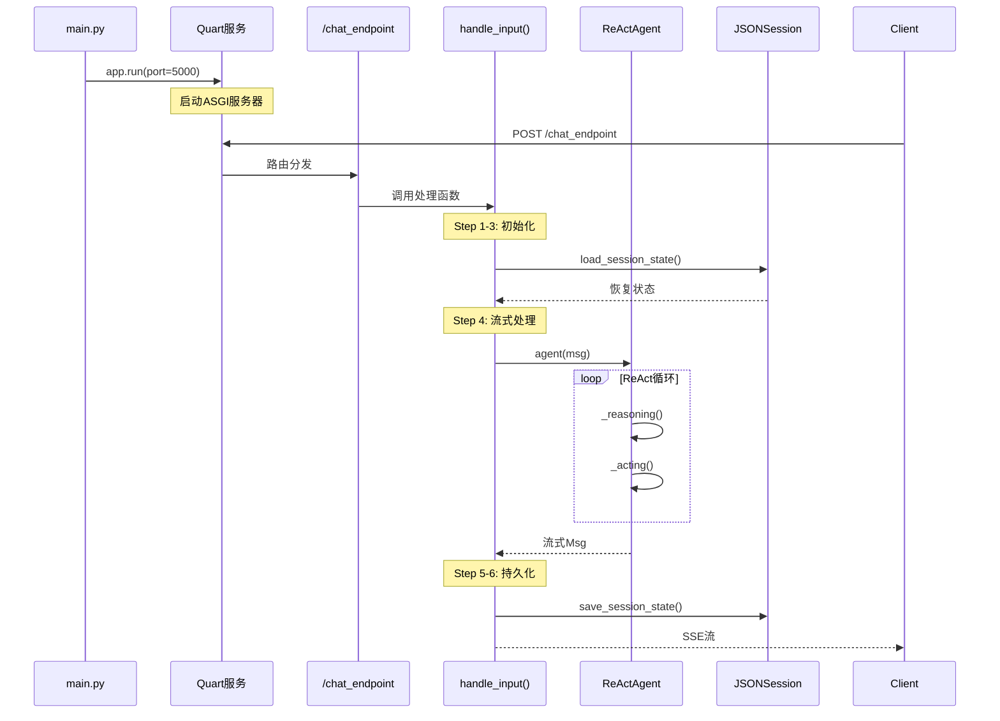
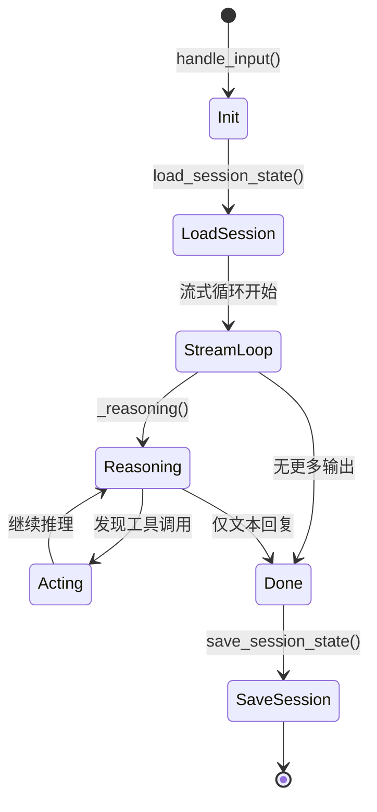

# 7-2 追踪HTTP服务的工作流程

## 学习目标

学完之后，你能：
- 理解从代码到服务的完整启动流程
- 绘制HTTP服务的完整调用链路图
- 使用logging和tracing调试服务问题
- 分析请求在各个组件间的流转

## 背景问题

**为什么需要理解服务流程？**

当服务出现问题时（如响应慢、报错、挂起），需要定位问题在哪一层：
- 是Quart路由层？
- 是Agent处理层？
- 是Model API调用？
- 是Tool执行？

只有理解完整调用链，才能快速定位问题。

## 源码入口

**核心文件**：
- `src/agentscope/_run_config.py` - 运行时配置（ConfigCls）
- `src/agentscope/pipeline/_functional.py` - `stream_printing_messages`实现
- `src/agentscope/agent/_react_agent.py` - `reply()`方法

**关键类**：

| 类 | 路径 | 说明 |
|----|------|------|
| `_ConfigCls` | `src/agentscope/_run_config.py:8` | 运行时配置管理 |
| `MsgHub` | `src/agentscope/pipeline/_msghub.py:27` | 消息中枢 |
| `ReActAgent` | `src/agentscope/agent/_react_agent.py:143` | Agent主体 |

**入口点**：
```
用户请求
    ↓
Quart路由 @app.route("/chat")
    ↓
chat_endpoint()
    ↓
handle_input()
    ↓
stream_printing_messages()
    ↓
agent.reply()
```

## 架构定位

```
┌─────────────────────────────────────────────────────────────┐
│                    HTTP服务完整架构                         │
│                                                             │
│  ┌─────────────────────────────────────────────────────┐  │
│  │                  Quart Server                       │  │
│  │  app.run() - ASGI服务器，监听端口                    │  │
│  └─────────────────────────────────────────────────────┘  │
│                         │                                  │
│                         ▼                                  │
│  ┌─────────────────────────────────────────────────────┐  │
│  │                  路由层                               │  │
│  │  @app.route() - 请求分发                             │  │
│  └─────────────────────────────────────────────────────┘  │
│                         │                                  │
│                         ▼                                  │
│  ┌─────────────────────────────────────────────────────┐  │
│  │                  处理函数                            │  │
│  │  chat_endpoint() - 参数解析、响应封装                 │  │
│  └─────────────────────────────────────────────────────┘  │
│                         │                                  │
│                         ▼                                  │
│  ┌─────────────────────────────────────────────────────┐  │
│  │                  Agent层                             │  │
│  │  reply() - ReAct推理循环                             │  │
│  └─────────────────────────────────────────────────────┘  │
│                         │                                  │
│                         ▼                                  │
│  ┌─────────────────────────────────────────────────────┐  │
│  │              Model/Tool层                            │  │
│  │  LLM调用 / 工具执行                                  │  │
│  └─────────────────────────────────────────────────────┘  │
└─────────────────────────────────────────────────────────────┘
```

**模块职责**：

| 模块 | 职责 | 关键文件 |
|------|------|----------|
| Quart | HTTP协议处理、路由 | quart框架 |
| ConfigCls | 运行ID、项目名、trace开关 | `_run_config.py` |
| Agent | 业务逻辑、ReAct循环 | `_react_agent.py` |
| Model | LLM API调用 | `model/` |
| Toolkit | 工具发现和执行 | `tool/_toolkit.py` |
| Session | 状态持久化 | `session/` |

## 核心源码分析

### 1. 运行时配置类

```python
# src/agentscope/_run_config.py:8-50
class _ConfigCls:
    """运行时配置管理类"""

    def __init__(
        self,
        run_id: ContextVar[str],
        project: ContextVar[str],
        name: ContextVar[str],
        created_at: ContextVar[str],
        trace_enabled: ContextVar[bool],
    ) -> None:
        # 使用ContextVar实现线程安全
        self._run_id = run_id
        self._project = project
        self._name = name
        self._trace_enabled = trace_enabled

    @property
    def trace_enabled(self) -> bool:
        """是否启用追踪"""
        return self._trace_enabled.get()
```

**设计要点**：
- 使用`ContextVar`实现异步上下文隔离
- 每个请求有独立的run_id
- 支持分布式追踪

### 2. 流式消息处理

```python
# src/agentscope/pipeline/_functional.py
async def stream_printing_messages(
    agents: Sequence[AgentBase],
    coroutine_task: Coroutine,
    role: str | None = None,
    **kwargs: Any,
) -> AsyncGenerator[tuple[Msg, bool], None]:
    """流式处理Agent消息"""
    from ..tracing import trace_reply

    async for msg in trace_reply(coroutine_task):
        # msg格式: (content, is_last)
        yield msg, msg.metadata.get("is_last", False)
```

### 3. 完整请求处理流程

```python
# examples/deployment/planning_agent/main.py
async def handle_input(
    msg: Msg,
    user_id: str,
    session_id: str,
) -> AsyncGenerator[str, None]:
    """处理输入并流式返回"""

    # Step 1: 创建工具
    toolkit = Toolkit()
    toolkit.register_tool_function(create_worker)

    # Step 2: 创建会话
    session = JSONSession(save_dir="./sessions")

    # Step 3: 创建Agent
    agent = ReActAgent(
        name="Friday",
        sys_prompt="""...""",
        model=DashScopeChatModel(...),
        formatter=DashScopeChatFormatter(),
        toolkit=toolkit,
    )

    # Step 4: 加载历史状态
    await session.load_session_state(
        session_id=f"{user_id}-{session_id}",
        agent=agent,
    )

    # Step 5: 流式处理
    async for msg, is_last in stream_printing_messages(
        agents=[agent],
        coroutine_task=agent(msg),
    ):
        # 转换为SSE格式
        data = json.dumps(msg.to_dict(), ensure_ascii=False)
        yield f"data: {data}\n\n"

    # Step 6: 保存状态
    await session.save_session_state(
        session_id=f"{user_id}-{session_id}",
        agent=agent,
    )
```

**关键调用链**：
```
handle_input()入口
    → toolkit.register_tool_function()  注册工具
    → JSONSession.load_session_state()  加载历史
    → stream_printing_messages()        流式处理
        → agent(msg)                   Agent处理
            → reply()                  核心循环
                → _reasoning()         推理
                → _acting()            行动
                → Model/Tool调用       外部交互
    → JSONSession.save_session_state()  保存状态
```

### 4. ReActAgent.reply()完整流程

```python
# src/agentscope/agent/_react_agent.py:377-475
async def reply(
    self,
    msg: Msg | list[Msg] | None = None,
    structured_model: Type[BaseModel] | None = None,
) -> Msg:
    # 1. 记录输入消息
    await self.memory.add(msg)

    # 2. 检索长时记忆（如启用）
    await self._retrieve_from_long_term_memory(msg)

    # 3. 检索知识库（如配置）
    await self._retrieve_from_knowledge(msg)

    # 4. ReAct循环
    for _ in range(self.max_iters):
        # 4a. 推理 - 调用LLM
        msg_reasoning = await self._reasoning(tool_choice)

        # 4b. 获取工具调用
        tool_calls = msg_reasoning.get_content_blocks("tool_use")

        # 4c. 执行工具
        if tool_calls:
            futures = [self._acting(tc) for tc in tool_calls]
            if self.parallel_tool_calls:
                await asyncio.gather(*futures)
            else:
                for f in futures:
                    await f

        # 4d. 检查是否需要继续
        if not msg_reasoning.has_content_blocks("tool_use"):
            break

    return msg_reasoning
```

## 可视化结构

### HTTP服务启动流程



### 请求生命周期



## 工程经验

### 设计原因

| 设计 | 原因 |
|------|------|
| ContextVar | 异步环境下每个请求有独立状态 |
| 流式输出 | 用户体验：先看到部分结果 |
| 会话持久化 | 支持多轮对话，不丢上下文 |
| 工具注册在请求内 | 动态工具，可按需加载 |

### 替代方案

**方案1：不用流式（同步响应）**
```python
# 等待所有处理完成才返回
response = await agent(msg)
return {"content": response.content}
```
缺点：用户等待时间长

**方案2：不持久化会话**
```python
# 每次请求都是新会话
agent = ReActAgent(...)  # 每次新建
```
缺点：无法记住对话历史

**方案3：外部Session管理**
```python
# Redis代替JSON文件
session = RedisSession(host="redis-host")
```
优点：支持分布式部署

### 可能出现的问题

**问题1：请求超时**
```python
# 原因：LLM调用慢或工具执行慢
# 解决：设置合理的超时时间
@app.route("/chat")
async def chat():
    try:
        async with asyncio.timeout(30):  # 30秒超时
            return await agent(msg)
    except asyncio.TimeoutError:
        return {"error": "Request timeout"}
```

**问题2：内存泄漏**
```python
# 原因：会话状态无限增长
# 解决：限制会话大小或TTL
session = JSONSession(save_dir="./sessions", max_size=1000)
```

**问题3：并发冲突**
```python
# 原因：同一session并发请求
# 解决：添加分布式锁
async with redis.lock(f"session:{session_id}"):
    await session.load_session_state(...)
```

**问题4：trace_enabled不影响日志**
```python
# ConfigCls.trace_enabled需要配合logging
import logging
logging.basicConfig(level=logging.DEBUG if config.trace_enabled else logging.INFO)
```

## Contributor指南

### 适合新手修改的文件

| 文件 | 原因 |
|------|------|
| `examples/deployment/planning_agent/main.py` | 完整示例，流程清晰 |
| `src/agentscope/_run_config.py` | 配置管理，简单易懂 |
| `src/agentscope/pipeline/_functional.py` | 流式处理逻辑 |

### 危险区域

**区域1：全局状态**
```python
# 危险：模块级可变状态
agent = ReActAgent(...)  # 全局单例

# 多worker环境下可能导致状态污染
```

**区域2：异步陷阱**
```python
# 危险：在async函数中忘记await
async def chat():
    result = some_async_func()  # 忘记await！
    return result  # 返回的是协程对象，不是结果

# 正确
result = await some_async_func()
```

### 调试方法

**方法1：启用详细日志**
```python
# 设置日志级别
import logging
logging.basicConfig(
    level=logging.DEBUG,
    format='%(asctime)s - %(name)s - %(levelname)s - %(message)s'
)

# Quart会输出所有请求详情
```

**方法2：打印中间状态**
```python
# 在handle_input中添加调试
async def handle_input(msg, user_id, session_id):
    print(f"[DEBUG] Request: user_id={user_id}, session_id={session_id}")

    await session.load_session_state(session_id, agent)
    print(f"[DEBUG] Loaded memory: {len(await agent.memory.get_memory())} msgs")

    async for msg_out in stream_printing_messages(...):
        print(f"[DEBUG] Output: {msg_out}")

    await session.save_session_state(session_id, agent)
    print(f"[DEBUG] Session saved")
```

**方法3：使用curl测试**
```bash
# 完整请求
curl -X POST http://localhost:5000/chat_endpoint \
  -H "Content-Type: application/json" \
  -d '{"user_id": "test", "session_id": "1", "user_input": "hello"}'

# 流式响应
curl -N http://localhost:5000/chat_endpoint \
  -d '{"user_id": "test", "session_id": "1", "user_input": "hi"}'
```

**方法4：检查Session文件**
```bash
# JSONSession保存的位置
ls ./sessions/
cat ./sessions/test-1.json
```

★ **Insight** ─────────────────────────────────────
- **服务流程 = 路由 → 初始化 → Agent处理 → 流式输出 → 持久化**
- `trace_enabled`控制是否记录详细日志
- 会话持久化通过JSONSession实现，支持恢复和继续对话
─────────────────────────────────────────────────
