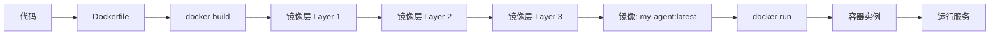
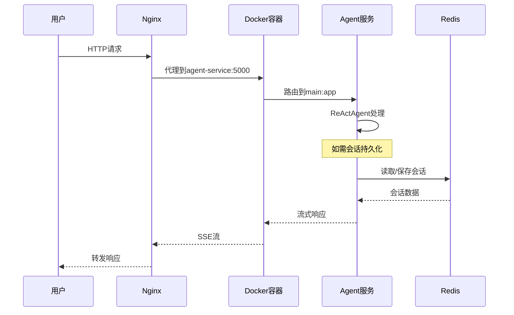
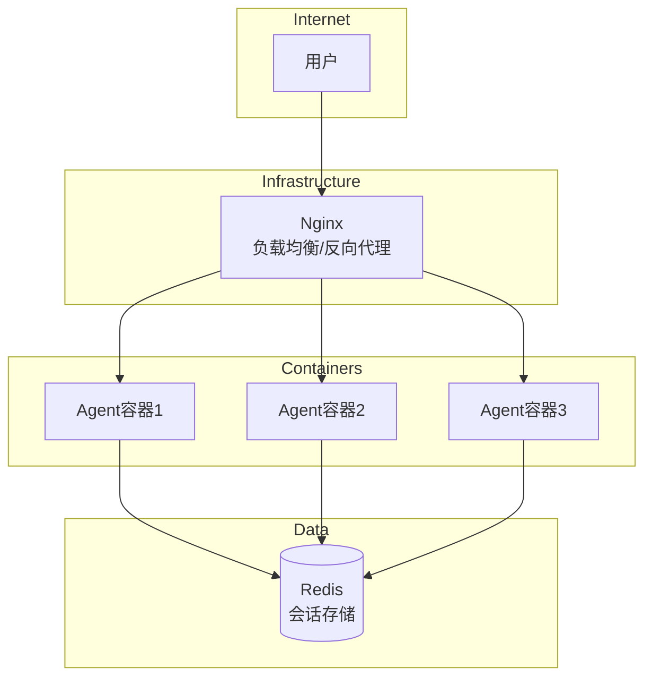

# 7-3 Docker容器化部署

## 学习目标

学完之后，你能：
- 创建Agent服务的Docker镜像
- 使用docker-compose编排多容器服务
- 理解镜像分层的原理和优化方法
- 掌握容器化环境下的环境变量配置

## 背景问题

**为什么需要Docker部署？**

直接部署（直接在服务器上运行Python进程）面临的问题：
- 环境不一致：开发环境和生产环境不同
- 依赖冲突：不同项目需要不同版本的包
- 扩缩容困难：无法快速复制和扩展
- 难以迁移：换个服务器要重新配置环境

Docker通过"集装箱化"解决这些问题：把应用和它的运行环境打包成镜像，实现"一处构建，到处运行"。

## 源码入口

**项目中的部署示例**：
- `/Users/nadav/IdeaProjects/agentscope/examples/deployment/planning_agent/main.py` - 部署入口
- `/Users/nadav/IdeaProjects/agentscope/examples/deployment/README.md` - 部署文档

**关键依赖**：
| 依赖 | 说明 |
|------|------|
| `quart` | ASGI微框架 |
| `gunicorn` | 生产级WSGI服务器 |
| `uvicorn` | ASGI服务器（配合gunicorn）|

**容器化需要的文件**：
- `Dockerfile` - 镜像构建配方
- `requirements.txt` - Python依赖
- `.dockerignore` - 忽略文件

## 架构定位

```
┌─────────────────────────────────────────────────────────────┐
│                    Docker部署架构                           │
│                                                             │
│  ┌─────────────────────────────────────────────────────┐  │
│  │                   宿主机                            │  │
│  │  ┌─────────────────────────────────────────────┐  │  │
│  │  │              Docker Engine                    │  │  │
│  │  │  ┌───────────────────────────────────────┐  │  │  │
│  │  │  │           Container                    │  │  │  │
│  │  │  │  ┌─────────────────────────────────┐  │  │  │  │
│  │  │  │  │  Python进程 (gunicorn)          │  │  │  │  │
│  │  │  │  │  └── Quart App → Agent → Model  │  │  │  │  │
│  │  │  │  └─────────────────────────────────┘  │  │  │  │
│  │  │  └───────────────────────────────────────┘  │  │  │  │
│  │  └─────────────────────────────────────────────┘  │  │  │
│  └─────────────────────────────────────────────────────┘  │
└─────────────────────────────────────────────────────────────┘
```

**构建流程**：
```
代码 → Dockerfile → 镜像 → 容器 → 服务
```

## 核心源码分析

### 1. 部署服务主文件

```python
# examples/deployment/planning_agent/main.py
from quart import Quart, Response, request
from agentscope.agent import ReActAgent
from agentscope.model import DashScopeChatModel
from agentscope.formatter import DashScopeChatFormatter

app = Quart(__name__)

@app.route("/chat_endpoint", methods=["POST"])
async def chat_endpoint() -> Response:
    data = await request.get_json()
    user_input = data.get("user_input")
    # ... 处理逻辑
    return Response(stream_generator(), mimetype="text/event-stream")

if __name__ == "__main__":
    app.run(port=5000, debug=True)  # 开发模式
```

### 2. 依赖文件

```text
# requirements.txt
quart>=0.19.0
gunicorn>=21.0.0
uvicorn>=0.24.0
agentscope>=0.1.0
dashscope>=1.14.0
```

### 3. Docker配置示例

```dockerfile
# Dockerfile
FROM python:3.10-slim

WORKDIR /app

# 安装依赖
COPY requirements.txt .
RUN pip install --no-cache-dir -r requirements.txt

# 复制代码
COPY . .

# 运行（生产模式用gunicorn）
CMD ["gunicorn", "-w", "4", "-k", "uvicorn.workers.UvicornWorker", "-b", "0.0.0.0:5000", "main:app"]
```

### 4. Docker Compose编排

```yaml
# docker-compose.yml
version: '3.8'

services:
  agent-service:
    build: .
    ports:
      - "5000:5000"
    environment:
      - DASHSCOPE_API_KEY=${DASHSCOPE_API_KEY}
      - LOG_LEVEL=INFO
    restart: unless-stopped
    healthcheck:
      test: ["CMD", "curl", "-f", "http://localhost:5000/health"]
      interval: 30s
      timeout: 10s
      retries: 3

  # 可选：Redis会话存储
  redis:
    image: redis:7-alpine
    ports:
      - "6379:6379"
    volumes:
      - redis_data:/data

volumes:
  redis_data:
```

### 5. 环境变量配置

```python
# 容器内读取环境变量
import os

api_key = os.environ.get("DASHSCOPE_API_KEY")
if not api_key:
    raise ValueError("DASHSCOPE_API_KEY environment variable is required")

model = DashScopeChatModel(
    model_name="qwen3-max",
    api_key=api_key,
)
```

## 可视化结构

### Docker构建流程



### 容器编排架构



### 多容器部署架构



## 工程经验

### 设计原因

| 设计 | 原因 |
|------|------|
| `python:3.10-slim` | 轻量基础镜像，减小镜像体积 |
| `pip install --no-cache-dir` | 减小镜像层大小 |
| gunicorn多worker | 利用多核CPU，提高并发 |
| uvicorn worker | 支持ASGI异步 |
| 环境变量配置密钥 | 避免密钥写入镜像 |

### 替代方案

**方案1：用uvicorn直接运行**
```bash
# 开发环境
uvicorn main:app --reload --port 5000

# 生产环境（单worker）
uvicorn main:app --workers 4 --port 5000
```

**方案2：多阶段构建**
```dockerfile
# 阶段1：构建
FROM python:3.10 AS builder
COPY requirements.txt .
RUN pip install --user -r requirements.txt

# 阶段2：运行
FROM python:3.10-slim
COPY --from=builder /root/.local /root/.local
COPY . .
CMD ["python", "main.py"]
```
优点：最终镜像更小（不含构建工具）

**方案3：使用预构建镜像**
```dockerfile
FROM agentscope/agentscope:latest
COPY main.py .
CMD ["python", "main.py"]
```

### 可能出现的问题

**问题1：端口冲突**
```bash
# 容器内端口被占用
# Error: OSError: [Errno 48] Address already in use

# 解决：确保宿主机端口唯一映射
docker run -p 5001:5000 my-agent
```

**问题2：API Key泄露**
```dockerfile
# 危险！密钥会写入镜像层
ENV API_KEY="sk-xxx"

# 正确：通过运行时传入
docker run -e API_KEY="sk-xxx" my-agent

# 或使用Docker secrets（Swarm模式）
```

**问题3：镜像体积过大**
```dockerfile
# 危险：包含所有依赖
FROM python:3.10
COPY . .
RUN pip install -r requirements.txt

# 优化：使用多阶段构建 + .dockerignore
# .dockerignore内容：
# __pycache__
# *.pyc
# .git
# .venv
# tests/
```

**问题4：中文编码问题**
```dockerfile
# 解决：设置环境变量
ENV LANG=C.UTF-8
ENV PYTHONIOENCODING=utf-8
```

**问题5：健康检查失败**
```yaml
# docker-compose.yml
healthcheck:
  test: ["CMD", "curl", "-f", "http://localhost:5000/health"]
  interval: 30s
  timeout: 10s
  retries: 3
  start_period: 40s

# 需要在代码中添加健康检查端点
@app.route("/health")
async def health():
    return {"status": "healthy"}
```

## Contributor指南

### 适合新手修改的文件

| 文件 | 原因 |
|------|------|
| `examples/deployment/planning_agent/main.py` | 部署入口，参考实现 |
| `requirements.txt` | 依赖管理 |
| `docker-compose.yml` | 容器编排 |

### 危险区域

**区域1：密钥管理**
```dockerfile
# 危险：密钥在镜像中可见
docker history my-agent | grep API_KEY

# 解决：使用运行时环境变量或密钥管理服务
```

**区域2：镜像层缓存**
```dockerfile
# 危险：依赖层未利用缓存
COPY . .          # 代码先变
RUN pip install   # 每次都重新安装

# 正确：先复制依赖，再复制代码
COPY requirements.txt .
RUN pip install
COPY . .          # 代码变化时，依赖层有缓存
```

### 调试方法

**方法1：进入容器bash**
```bash
docker run -it my-agent /bin/bash
```

**方法2：查看容器日志**
```bash
# 实时日志
docker logs -f <container_id>

# 最近100行
docker logs --tail 100 <container_id>
```

**方法3：复制文件到容器**
```bash
docker cp local_file.txt <container_id>:/app/file.txt
```

**方法4：检查镜像层**
```bash
# 查看镜像构建历史
docker history my-agent:latest

# 查看具体层大小
docker history --no-trunc my-agent
```

**方法5：使用docker exec**
```bash
# 在运行中的容器内执行命令
docker exec -it <container_id> python -c "import agentscope; print(agentscope.__version__)"
```

★ **Insight** ─────────────────────────────────────
- **Docker = 集装箱化**，把应用+环境打包在一起
- 构建用`docker build`，运行用`docker run`
- 生产用gunicorn多worker + uvicorn worker
- 密钥通过环境变量传入，永不写入镜像
─────────────────────────────────────────────────
