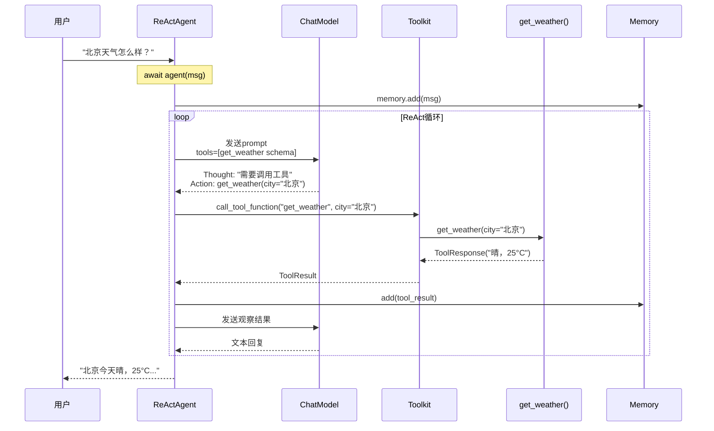
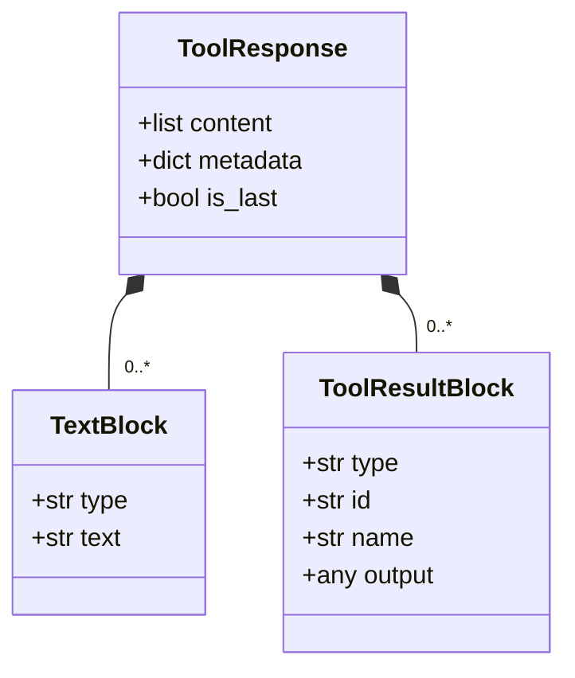

# P8-1 天气查询Agent

## 学习目标

学完之后，你能：
- 创建带工具（Tool）的ReActAgent
- 使用Toolkit注册和管理工具函数
- 理解ReActAgent的自动工具调用机制
- 实现天气查询功能并集成到Agent

## 背景问题

**为什么需要工具调用？**

LLM本身只能生成文本，无法：
- 实时查询天气数据
- 搜索网络获取最新信息
- 执行代码或计算
- 访问数据库或API

通过Tool机制，Agent可以"调用外部工具"来扩展能力，完成真实任务。

**天气Agent解决什么问题？**
- 用户问"北京天气"→ Agent调用天气API → 返回真实数据
- 而不是LLM凭"记忆"猜测答案

## 源码入口

**核心文件**：
- `src/agentscope/tool/_toolkit.py:274` - `register_tool_function()`方法
- `src/agentscope/tool/_response.py` - `ToolResponse`定义
- `src/agentscope/agent/_react_agent.py:143` - `ReActAgent`类

**关键类/函数**：

| 类/函数 | 路径 | 说明 |
|---------|------|------|
| `Toolkit` | `src/agentscope/tool/_toolkit.py` | 工具管理器 |
| `ToolResponse` | `src/agentscope/tool/_response.py` | 工具返回值 |
| `register_tool_function` | `src/agentscope/tool/_toolkit.py:274` | 注册工具函数 |
| `ReActAgent` | `src/agentscope/agent/_react_agent.py:143` | Agent实现 |
| `TextBlock` | `src/agentscope/message/_block.py` | 文本消息块 |

**示例项目**：
```
teaching/book/practice/station8_projects/P8-1_weather_agent.md
```

## 架构定位

```
┌─────────────────────────────────────────────────────────────┐
│                    天气Agent架构                            │
│                                                             │
│  用户: "北京天气怎么样？"                                   │
│         │                                                 │
│         ▼                                                 │
│  ┌─────────────────────────────────────────────────────┐  │
│  │                   ReActAgent                         │  │
│  │  ┌─────────────────────────────────────────────┐    │  │
│  │  │              ReAct循环                      │    │  │
│  │  │  Thought → Action → Observation → ...      │    │  │
│  │  └─────────────────────────────────────────────┘    │  │
│  └─────────────────────────────────────────────────────┘  │
│         │                                                 │
│         ▼                                                 │
│  ┌─────────────────────────────────────────────────────┐  │
│  │                   Toolkit                            │  │
│  │  register_tool_function(get_weather)                │  │
│  └─────────────────────────────────────────────────────┘  │
│         │                                                 │
│         ▼                                                 │
│  ┌─────────────────────────────────────────────────────┐  │
│  │                   工具函数                           │  │
│  │  get_weather(city="北京") → ToolResponse          │  │
│  └─────────────────────────────────────────────────────┘  │
└─────────────────────────────────────────────────────────────┘
```

**Agent内部组件关系**：
```
ReActAgent
├── model: ChatModelBase      # LLM大脑
├── formatter: FormatterBase   # 消息格式化
├── toolkit: Toolkit          # 工具集合
├── memory: MemoryBase         # 对话历史
└── knowledge: KnowledgeBase[] # 知识库（可选）
```

## 核心源码分析

### 1. 工具函数定义

```python
# P8-1_weather_agent.py
from agentscope.tool import ToolResponse
from agentscope.message import TextBlock

def get_weather(city: str) -> ToolResponse:
    """查询城市天气

    Args:
        city: 城市名称，如"北京"、"上海"

    Returns:
        ToolResponse: 包含天气信息的响应
    """
    # 模拟天气数据（实际项目中调用真实API）
    weather_data = {
        "北京": "晴，25°C，适宜外出",
        "上海": "多云，28°C，略有闷热",
        "广州": "大雨，26°C，建议带伞",
    }
    result = weather_data.get(city, "抱歉，暂不支持该城市")
    return ToolResponse(content=[TextBlock(type="text", text=result)])
```

**关键点**：
- 函数签名定义输入参数（`city: str`）
- 返回类型必须是`ToolResponse`
- `content`字段是`TextBlock`列表

### 2. Toolkit注册

```python
# src/agentscope/tool/_toolkit.py:274-310
def register_tool_function(
    self,
    func: Callable,
    group_name: str | None = None,
    description: str | None = None,
    name: str | None = None,
) -> None:
    """注册工具函数到工具箱

    Args:
        func: 要注册的函数
        group_name: 工具分组名称
        description: 工具描述（默认从docstring获取）
        name: 工具名称（默认使用函数名）
    """
    # 从docstring提取描述
    if description is None and func.__doc__:
        description = func.__doc__.strip()

    # 构建工具schema
    tool_schema = {
        "name": name or func.__name__,
        "description": description,
        "parameters": self._extract_parameters(func),
    }

    # 存储工具
    self.tools[tool_schema["name"]] = func
    self.tool_schemas[tool_schema["name"]] = tool_schema

    # 如有分组，加入分组
    if group_name:
        if group_name not in self.tool_groups:
            self.tool_groups[group_name] = []
        self.tool_groups[group_name].append(tool_schema["name"])
```

### 3. ReActAgent配置

```python
# P8-1_weather_agent.py
from agentscope.agent import ReActAgent
from agentscope.model import OpenAIChatModel
from agentscope.formatter import OpenAIChatFormatter
from agentscope.tool import Toolkit

# 创建工具箱并注册工具
toolkit = Toolkit()
toolkit.register_tool_function(get_weather, group_name="weather")

# 创建Agent
agent = ReActAgent(
    name="WeatherAssistant",
    model=OpenAIChatModel(
        api_key=os.environ.get("OPENAI_API_KEY"),
        model="gpt-4"
    ),
    sys_prompt="你是一个友好的天气预报助手。请根据用户询问的城市，使用天气查询工具获取信息并回答。",
    formatter=OpenAIChatFormatter(),
    toolkit=toolkit
)
```

### 4. ReAct循环中的工具调用

```python
# src/agentscope/agent/_react_agent.py:470-530
async def _acting(self, tool_call: ToolUseBlock) -> dict | None:
    """执行工具调用"""

    tool_res_msg = Msg(
        "system",
        [ToolResultBlock(...)],
        "system"
    )

    try:
        # 调用工具函数
        tool_res = await self.toolkit.call_tool_function(tool_call)

        # 处理异步生成器
        async for chunk in tool_res:
            tool_res_msg.content[0]["output"] = chunk.content
            await self.print(tool_res_msg, chunk.is_last)

            # 检查是否是finish函数调用
            if tool_call["name"] == self.finish_function_name:
                return chunk.metadata.get("structured_output")

        return None

    finally:
        await self.memory.add(tool_res_msg)
```

### 5. 异步调用Agent

```python
# P8-1_weather_agent.py
import asyncio
from agentscope.message import Msg

async def main():
    response = await agent(Msg(
        name="user",
        content="北京今天天气怎么样？",
        role="user"
    ))
    print(f"Agent回复: {response.content}")

asyncio.run(main())
```

## 可视化结构

### 工具调用完整流程



### ToolResponse数据结构



## 工程经验

### 设计原因

| 设计 | 原因 |
|------|------|
| ToolResponse包装 | 统一工具返回值格式，支持元数据 |
| TextBlock而非字符串 | 支持多模态内容（文本+音频+图片） |
| group_name分组 | 按功能组织工具，方便管理 |
| 函数docstring作为描述 | 自描述，减少重复配置 |

### 替代方案

**方案1：不使用Toolkit，直接传函数列表**
```python
# 不推荐：失去分组、描述等功能
agent = ReActAgent(..., tools=[get_weather, search_news])
```

**方案2：使用装饰器注册**
```python
# 可选的另一种风格（目前未采用）
@toolkit.register(group_name="weather")
def get_weather(city: str) -> ToolResponse:
    ...
```

**方案3：动态工具注册**
```python
# 根据用户权限动态注册工具
if user.is_premium:
    toolkit.register_tool_function(get_weather_premium, group_name="weather")
else:
    toolkit.register_tool_function(get_weather_basic, group_name="weather")
```

### 可能出现的问题

**问题1：Agent不调用工具**
```python
# 原因：sys_prompt不够清晰
# 解决：明确要求使用工具
sys_prompt="你是一个天气预报助手。收到用户询问城市时，必须调用get_weather工具获取天气信息。"
```

**问题2：Tool返回格式错误**
```python
# 错误：返回了字符串而非ToolResponse
def get_weather(city):
    return "晴，25°C"  # 错误！

# 正确：返回ToolResponse
def get_weather(city):
    return ToolResponse(content=[TextBlock(type="text", text="晴，25°C")])
```

**问题3：工具参数提取失败**
```python
# 原因：LLM生成的参数与函数签名不匹配
# 解决：确保docstring清晰，或使用Pydantic模型
def get_weather(city: str) -> ToolResponse:
    """查询天气

    Args:
        city (str): 城市名称，必须是中文，如"北京"、"上海"
    """
```

**问题4：API Key硬编码**
```python
# 危险！
model = OpenAIChatModel(api_key="sk-xxx")

# 安全
model = OpenAIChatModel(api_key=os.environ.get("OPENAI_API_KEY"))
```

## Contributor指南

### 适合新手修改的文件

| 文件 | 原因 |
|------|------|
| `src/agentscope/tool/_toolkit.py` | 工具注册核心逻辑 |
| `src/agentscope/tool/_response.py` | ToolResponse定义 |
| `src/agentscope/message/_block.py` | 消息块类型定义 |

### 危险区域

**区域1：工具函数签名变更**
```python
# 危险：修改已注册工具的签名会导致运行时错误
# 原因：工具schema在注册时已固定

# 如果需要变更：
# 1. 重新注册工具
# 2. 确保兼容已有调用
def get_weather(city: str, unit: str = "celsius") -> ToolResponse:
    # 添加可选参数保持向后兼容
    ...
```

**区域2：异步工具返回值**
```python
# 危险：异步工具必须返回AsyncGenerator
async def async_tool() -> ToolResponse:  # 错误！

# 正确
async def async_tool() -> AsyncGenerator[ToolResponse, None]:
    for i in range(3):
        yield ToolResponse(content=[TextBlock(text=f"step {i}")])
```

### 调试方法

**方法1：启用调试日志**
```python
import logging
logging.basicConfig(level=logging.DEBUG)

# 会输出：
# DEBUG: Agent思考: 需要调用get_weather工具
# DEBUG: 调用工具: get_weather(city="北京")
# DEBUG: 工具返回: ToolResponse(...)
```

**方法2：打印Agent内部状态**
```python
# 查看已注册的工具
print(f"已注册工具: {agent.toolkit.tools}")
print(f"工具分组: {agent.toolkit.tool_groups}")

# 查看工具schemas
print(f"工具描述: {agent.toolkit.tool_schemas}")
```

**方法3：直接调用工具函数**
```python
# 独立测试工具函数
result = get_weather("北京")
print(f"工具直接调用: {result}")
```

**方法4：检查LLM输出**
```python
# 在_reasoning中打印原始LLM输出
msg = await self._reasoning(tool_choice)
print(f"LLM原始输出: {msg.content}")
```

★ **Insight** ─────────────────────────────────────
- **Tool = Agent的"手和脚"**，让Agent能操作外部世界
- **Toolkit = 工具管理器**，统一注册、发现、调用
- ReAct循环：Thought → Action → Observation → ...
- 工具函数必须返回`ToolResponse`，不能用普通返回值
─────────────────────────────────────────────────
