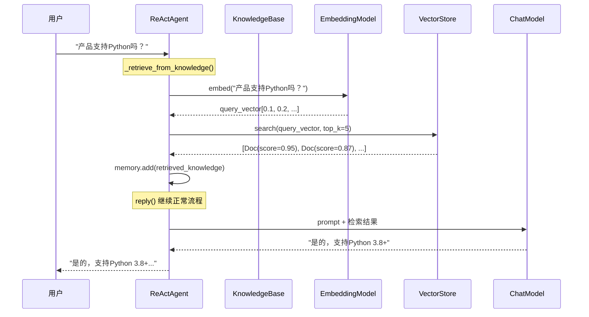

# P8-2 智能客服机器人

## 学习目标

学完之后，你能：
- 构建知识库（KnowledgeBase）并集成到Agent
- 实现RAG（检索增强生成）流程
- 理解Embedding和向量存储的工作原理
- 设计适合客服场景的文档处理流程

## 背景问题

**为什么需要RAG？**

LLM的局限性：
- 知识有截止日期，无法回答最新问题
- 可能产生"幻觉"（虚构答案）
- 无法访问私有知识（如内部文档）

RAG解决方案：
1. 将知识库文档向量化存储
2. 用户提问时，检索相关文档
3. 将检索结果注入Prompt，让LLM基于真实内容回答

**客服场景的价值**：
- 基于真实产品文档回答，确保准确性
- 支持私有知识，不需要微调模型
- 可随时更新知识库，无需重新训练

## 源码入口

**核心文件**：
- `src/agentscope/rag/` - RAG组件目录
- `src/agentscope/rag/_knowledge.py` - `SimpleKnowledge`实现
- `src/agentscope/rag/_retriever.py` - 检索器实现
- `src/agentscope/embedding/` - Embedding模型目录

**关键类**：

| 类 | 路径 | 说明 |
|----|------|------|
| `SimpleKnowledge` | `src/agentscope/rag/_knowledge.py` | 知识库封装 |
| `QdrantStore` | `src/agentscope/rag/_qdrant.py` | Qdrant向量存储 |
| `TextReader` | `src/agentscope/rag/_reader.py` | 文本读取器 |
| `EmbeddingBase` | `src/agentscope/embedding/_base.py` | Embedding基类 |

**相关源码**：
```python
# src/agentscope/agent/_react_agent.py:620-680
# _retrieve_from_knowledge() 方法
```

## 架构定位

```
┌─────────────────────────────────────────────────────────────┐
│                    RAG客服架构                             │
│                                                             │
│  ┌─────────────────────────────────────────────────────┐  │
│  │                   用户问题                            │  │
│  │              "产品支持Python吗？"                    │  │
│  └─────────────────────────────────────────────────────┘  │
│                         │                                  │
│                         ▼                                  │
│  ┌─────────────────────────────────────────────────────┐  │
│  │                   检索阶段                           │  │
│  │  Query → Embedding → 向量相似度搜索 → 文档片段     │  │
│  └─────────────────────────────────────────────────────┘  │
│                         │                                  │
│                         ▼                                  │
│  ┌─────────────────────────────────────────────────────┐  │
│  │                   生成阶段                           │  │
│  │  Prompt + 检索结果 → LLM → 回答                     │  │
│  └─────────────────────────────────────────────────────┘  │
│                         │                                  │
│                         ▼                                  │
│              "是的，支持Python 3.8+"                       │
└─────────────────────────────────────────────────────────────┘
```

**RAG组件关系**：
```
SimpleKnowledge
├── embedding_model: EmbeddingBase    # 向量化模型
├── embedding_store: VectorStoreBase  # 向量数据库
└── documents: list[Document]        # 文档存储

ReActAgent
├── knowledge: list[KnowledgeBase]   # 绑定知识库
└── _retrieve_from_knowledge()       # 自动检索
```

## 核心源码分析

### 1. 知识库构建

```python
# P8-2_customer_service.py
from agentscope.rag import SimpleKnowledge, QdrantStore, TextReader
from agentscope.embedding import DashScopeTextEmbedding

# 创建Embedding模型
embedding_model = DashScopeTextEmbedding(
    model="text-embedding-v3",
    api_key=os.environ.get("DASHSCOPE_API_KEY")
)

# 创建向量存储
embedding_store = QdrantStore(
    location=":memory:",  # 开发测试用
    collection_name="faq_collection",
    dimensions=1024,  # 必须与Embedding模型维度匹配
)

# 创建知识库
kb = SimpleKnowledge(
    embedding_store=embedding_store,
    embedding_model=embedding_model,
)

# 使用TextReader读取文档
reader = TextReader(chunk_size=100, split_by="char")

# 文档内容
documents = await reader("""
我们的产品支持Python 3.8+，Java 11+，Node.js 16+。
技术支持邮箱：support@example.com。
产品版本：v2.1.0，发布日期：2024-01-15。
""")

# 添加到知识库
await kb.add_documents(documents)
```

### 2. SimpleKnowledge实现

```python
# src/agentscope/rag/_knowledge.py
class SimpleKnowledge(KnowledgeBase):
    """简单知识库实现"""

    def __init__(
        self,
        embedding_store: VectorStoreBase,
        embedding_model: EmbeddingBase,
    ) -> None:
        self.embedding_store = embedding_store
        self.embedding_model = embedding_model
        self._documents: list[Document] = []

    async def add_documents(self, documents: list[Document]) -> None:
        """添加文档到知识库"""
        # 1. 向量化文档内容
        embeddings = await self.embedding_model.embed(
            [doc.content for doc in documents]
        )

        # 2. 存储向量和文档
        for doc, embedding in zip(documents, embeddings):
            await self.embedding_store.add(
                id=doc.id,
                vector=embedding,
                payload=doc.metadata,
            )
            self._documents.append(doc)

    async def retrieve(self, query: str, top_k: int = 5) -> list[Document]:
        """检索相关文档"""
        # 1. 向量化查询
        query_embedding = await self.embedding_model.embed([query])

        # 2. 向量相似度搜索
        results = await self.embedding_store.search(
            vector=query_embedding,
            top_k=top_k,
        )

        # 3. 返回原始文档
        return [self._documents[result.id] for result in results]
```

### 3. Agent集成知识库

```python
# P8-2_customer_service.py
from agentscope.agent import ReActAgent
from agentscope.model import OpenAIChatModel
from agentscope.formatter import OpenAIChatFormatter

# 创建客服Agent，绑定知识库
agent = ReActAgent(
    name="CustomerService",
    model=OpenAIChatModel(
        api_key=os.environ.get("OPENAI_API_KEY"),
        model="gpt-4"
    ),
    sys_prompt="你是一个智能客服。请根据知识库中的信息回答用户问题。",
    formatter=OpenAIChatFormatter(),
    knowledge=kb  # 绑定知识库
)

# 运行
response = await agent(Msg(
    name="user",
    content="你们的产品支持Python吗？",
    role="user"
))
```

### 4. Agent中的知识检索

```python
# src/agentscope/agent/_react_agent.py:620-680
async def _retrieve_from_knowledge(
    self,
    msg: Msg | list[Msg] | None,
) -> None:
    """从知识库检索并注入到内存"""

    if not self.knowledge or not msg:
        return

    # 1. 提取查询文本
    query = self._extract_query(msg)

    # 2. 遍历所有知识库检索
    docs: list[Document] = []
    for kb in self.knowledge:
        retrieved = await kb.retrieve(query=query)
        docs.extend(retrieved)

    # 3. 按相关性排序
    docs = sorted(docs, key=lambda d: d.score or 0.0, reverse=True)

    # 4. 构建检索结果消息
    if docs:
        retrieved_msg = Msg(
            name="user",
            content=[
                TextBlock(type="text", text="<retrieved_knowledge>"),
                *[TextBlock(type="text", text=d.content) for d in docs],
                TextBlock(type="text", text="</retrieved_knowledge>"),
            ],
            role="user",
        )
        await self.memory.add(retrieved_msg)
```

### 5. RAG检索流程

```python
# src/agentscope/rag/_qdrant.py
class QdrantStore(VectorStoreBase):
    """Qdrant向量存储实现"""

    async def search(
        self,
        vector: list[float],
        top_k: int = 5,
    ) -> list[SearchResult]:
        """向量相似度搜索"""
        # 使用Qdrant客户端搜索
        results = await self.client.search(
            collection_name=self.collection_name,
            query_vector=vector,
            limit=top_k,
        )
        return [
            SearchResult(id=r.id, score=r.score, payload=r.payload)
            for r in results
        ]
```

## 可视化结构

### RAG完整流程



### Embedding和检索原理

```mermaid
flowchart LR
    subgraph 索引阶段
        D1[文档1] --> E1[Embedding模型]
        D2[文档2] --> E2[Embedding模型]
        D3[文档3] --> E3[Embedding模型]
        E1 --> V1[(向量1)]
        E2 --> V2[(向量2)]
        E3 --> V3[(向量3)]
    end

    subgraph 查询阶段
        Q[查询"Python支持"] --> EQ[Embedding模型]
        EQ --> QV[(查询向量)]
        QV --> S[相似度计算]
        V1 --> S
        V2 --> S
        V3 --> S
        S --> R[返回Top-K相关文档]
    end
```

## 工程经验

### 设计原因

| 设计 | 原因 |
|------|------|
| 向量存储分离 | 支持多种向量库（Qdrant/Milvus/Chroma） |
| Embedding模型抽象 | 支持多种Embedding服务 |
| 文档分块 | 控制单次检索的信息量，提高相关性 |
| 相似度分数 | 过滤低相关性结果 |

### 替代方案

**方案1：不用RAG，直接用LLM**
```python
# 简单但不可靠，可能产生幻觉
agent = ReActAgent(sys_prompt="根据以下信息回答...")  # 信息可能在prompt中过时
```

**方案2：使用不同向量存储**
```python
# Chroma（本地）
from agentscope.rag import ChromaStore
embedding_store = ChromaStore(collection_name="faq")

# Milvus（分布式）
from agentscope.rag import MilvusStore
embedding_store = MilvusStore(host="milvus:19530", collection_name="faq")
```

**方案3：混合检索**
```python
# 关键词 + 向量混合
from agentscope.rag import HybridRetriever
retriever = HybridRetriever(
    vector_store=kb,
    keyword_weight=0.3,  # BM25权重
    vector_weight=0.7,   # 向量相似度权重
)
```

### 可能出现的问题

**问题1：知识库为空时回答不准确**
```python
# 原因：没有检索到相关内容，LLM凭"记忆"回答
# 解决：添加"未找到相关答案"的处理

kb = SimpleKnowledge(...)
docs = await kb.retrieve(query)

if not docs:
    # 返回友好提示
    return "抱歉，知识库中未找到相关信息..."
```

**问题2：Embedding维度不匹配**
```python
# 错误：维度不一致
QdrantStore(collection_name="faq", dimensions=1024)  # 模型实际是1536维

# 正确：匹配模型实际维度
QdrantStore(collection_name="faq", dimensions=1536)
```

**问题3：:memory:模式数据丢失**
```python
# 危险：重启后数据丢失
embedding_store = QdrantStore(location=":memory:", ...)

# 生产环境使用持久化
embedding_store = QdrantStore(location="localhost:6333", ...)
```

**问题4：检索结果重复**
```python
# 原因：文档有重复内容
# 解决：去重处理
seen = set()
unique_docs = []
for doc in docs:
    if doc.content not in seen:
        seen.add(doc.content)
        unique_docs.append(doc)
```

## Contributor指南

### 适合新手修改的文件

| 文件 | 原因 |
|------|------|
| `src/agentscope/rag/_knowledge.py` | 知识库核心逻辑 |
| `src/agentscope/rag/_reader.py` | 文档读取器 |
| `src/agentscope/embedding/` | Embedding模型实现 |

### 危险区域

**区域1：向量维度硬编码**
```python
# 危险：维度写死可能不匹配
dimensions = 1024  # 不同模型不同维度

# 正确：从模型动态获取
dimensions = embedding_model.dimensions
```

**区域2：大文档未分块**
```python
# 危险：整篇文档一起嵌入，信息密度不均
# 解决：适当分块
reader = TextReader(chunk_size=500, overlap=50)
```

### 调试方法

**方法1：直接测试检索**
```python
# 测试知识库检索
kb = SimpleKnowledge(...)
await kb.add_documents(docs)

# 查询测试
results = await kb.retrieve("Python支持")
for doc in results:
    print(f"Score: {doc.score}, Content: {doc.content[:100]}")
```

**方法2：打印检索到的文档**
```python
# 在Agent中启用hint打印
agent = ReActAgent(
    ...,
    knowledge=kb,
    print_hint_msg=True,  # 打印检索到的知识
)
```

**方法3：检查Embedding服务**
```python
# 测试Embedding模型
embedding_model = DashScopeTextEmbedding(...)
result = await embedding_model.embed(["测试文本"])
print(f"Embedding维度: {len(result[0])}")
```

★ **Insight** ─────────────────────────────────────
- **RAG = 检索 + 生成**，先用向量搜索找相关文档，再让LLM基于文档回答
- **Embedding = 语义向量化**，把文本变成向量才能做相似度计算
- **知识库 = 向量存储 + 文档存储**，检索时返回原始文档内容
- Agent自动调用`_retrieve_from_knowledge()`，无需手动触发
─────────────────────────────────────────────────
