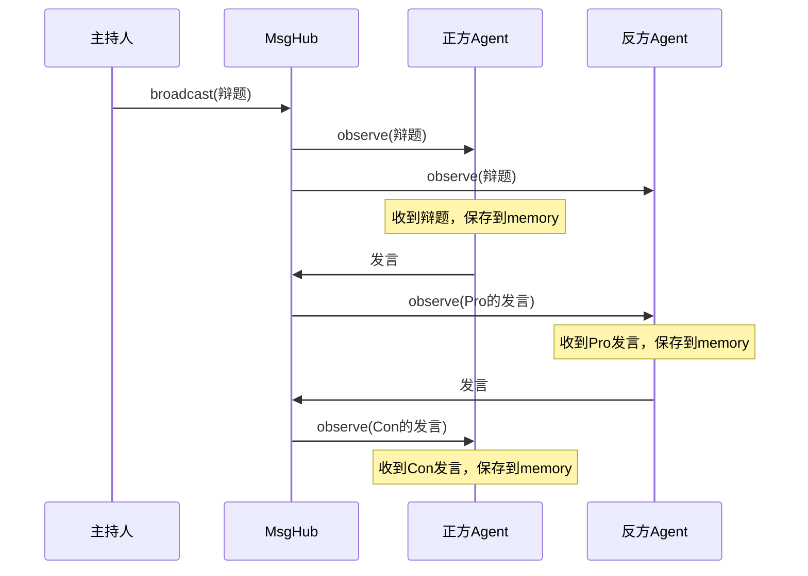
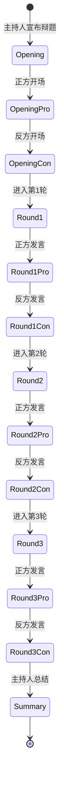
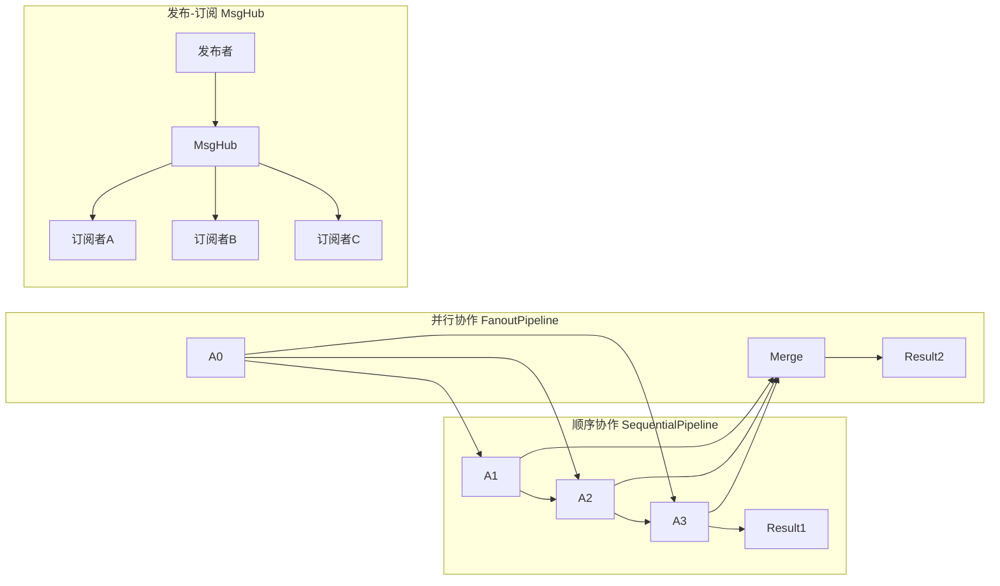

# P8-3 多Agent辩论系统

## 学习目标

学完之后，你能：
- 使用MsgHub协调多个Agent的协作
- 实现发布-订阅模式的多Agent通信
- 设计复杂的多Agent协作流程
- 理解Agent间的消息广播机制

## 背景问题

**为什么需要MsgHub？**

单个Agent只能独立思考。多Agent系统需要：
- 消息共享：一个Agent的输出成为另一个的输入
- 协调控制：决定谁先说话、谁后说话
- 状态同步：保持多个Agent间的信息一致性

**MsgHub解决什么问题？**
- 不用手动管理Agent间的订阅关系
- 广播消息自动分发给所有参与者
- 支持发布-订阅模式的解耦通信

## 源码入口

**核心文件**：
- `src/agentscope/pipeline/_msghub.py:27` - `MsgHub`类
- `src/agentscope/agent/_agent_base.py` - `AgentBase`基类

**关键类/方法**：

| 类/方法 | 路径 | 说明 |
|---------|------|------|
| `MsgHub` | `src/agentscope/pipeline/_msghub.py:27` | 消息中枢 |
| `broadcast()` | `src/agentscope/pipeline/_msghub.py:130` | 广播消息 |
| `observe()` | `src/agentscope/agent/_agent_base.py` | Agent接收消息 |
| `reset_subscribers()` | `src/agentscope/agent/_agent_base.py` | 重置订阅关系 |

**示例项目**：
```
examples/workflows/multiagent_debate/main.py
```

## 架构定位

```
┌─────────────────────────────────────────────────────────────┐
│                    多Agent辩论架构                           │
│                                                             │
│  ┌─────────────────────────────────────────────────────┐  │
│  │                      MsgHub                          │  │
│  │              (消息中枢/发布订阅)                      │  │
│  │  ┌─────────────────────────────────────────────┐   │  │
│  │  │  participants: [pro_agent, con_agent]       │   │  │
│  │  │  enable_auto_broadcast: True                │   │  │
│  │  └─────────────────────────────────────────────┘   │  │
│  └─────────────────────────────────────────────────────┘  │
│                         │                                  │
│          ┌─────────────┼─────────────┐                   │
│          ▼             ▼             ▼                    │
│    ┌──────────┐ ┌──────────┐ ┌──────────┐              │
│    │ 正方Agent │ │ 反方Agent │ │ 主持人    │              │
│    └──────────┘ └──────────┘ └──────────┘              │
└─────────────────────────────────────────────────────────────┘
```

**MsgHub设计模式**：
```
传统方式（手动管理）：
  agent1() → x1
  agent2.observe(x1) → agent2收到x1

使用MsgHub（自动管理）：
  async with MsgHub([agent1, agent2]):
      x1 = await agent1()  → 自动广播给agent2
```

## 核心源码分析

### 1. MsgHub初始化

```python
# src/agentscope/pipeline/_msghub.py:27-70
class MsgHub:
    """消息中枢，实现多Agent发布-订阅"""

    def __init__(
        self,
        participants: Sequence[AgentBase],
        announcement: list[Msg] | Msg | None = None,
        enable_auto_broadcast: bool = True,
        name: str | None = None,
    ) -> None:
        """初始化MsgHub

        Args:
            participants: 参与MsgHub的Agent序列
            announcement: 进入时广播的消息
            enable_auto_broadcast: 是否启用自动广播
            name: MsgHub名称
        """
        self.name = name or shortuuid.uuid()
        self.participants = list(participants)
        self.announcement = announcement
        self.enable_auto_broadcast = enable_auto_broadcast
```

### 2. 自动订阅机制

```python
# src/agentscope/pipeline/_msghub.py:80-90
def _reset_subscriber(self) -> None:
    """重置订阅关系"""
    if self.enable_auto_broadcast:
        for agent in self.participants:
            # 每个Agent订阅其他所有Agent的消息
            agent.reset_subscribers(self.name, self.participants)
```

```python
# src/agentscope/agent/_agent_base.py
def reset_subscribers(
    self,
    hub_name: str,
    participants: list["AgentBase"],
) -> None:
    """重置订阅者列表"""
    # 订阅该hub中的所有其他Agent
    self._subscribers[hub_name] = [
        p for p in participants if p != self
    ]
```

### 3. 消息广播

```python
# src/agentscope/pipeline/_msghub.py:130-145
async def broadcast(self, msg: list[Msg] | Msg) -> None:
    """广播消息给所有参与者"""
    for agent in self.participants:
        await agent.observe(msg)
```

### 4. Agent的observe方法

```python
# src/agentscope/agent/_react_agent.py:580-595
async def observe(self, msg: Msg | list[Msg] | None) -> None:
    """接收观察消息，不生成回复

    Args:
        msg: 要观察的消息
    """
    await self.memory.add(msg)
```

### 5. 辩论系统完整实现

```python
# P8-3_multi_agent_debate.py
import asyncio
from agentscope import agentscope
from agentscope.message import Msg
from agentscope.agent import ReActAgent
from agentscope.model import OpenAIChatModel
from agentscope.formatter import OpenAIChatFormatter
from agentscope.pipeline import MsgHub

# 初始化
agentscope.init(project="DebateSystem")

# 创建模型
model = OpenAIChatModel(api_key="your-key", model="gpt-4")

# 创建正方Agent
pro_agent = ReActAgent(
    name="ProSide",
    model=model,
    sys_prompt="你是一个正方辩手，坚持AI发展利大于弊...",
    formatter=OpenAIChatFormatter()
)

# 创建反方Agent
con_agent = ReActAgent(
    name="ConSide",
    model=model,
    sys_prompt="你是一个反方辩手，坚持AI发展需要更多限制...",
    formatter=OpenAIChatFormatter()
)

# 创建主持人
host = ReActAgent(
    name="Host",
    model=model,
    sys_prompt="你是一个辩论主持人，负责总结...",
    formatter=OpenAIChatFormatter()
)

async def run_debate(topic: str, rounds: int = 3):
    """运行辩论"""

    # 使用MsgHub协调多Agent
    async with MsgHub(participants=[pro_agent, con_agent]) as msghub:
        # 广播辩题给所有参与者
        await msghub.broadcast(Msg(
            name="Host",
            content=f"辩题：{topic}",
            role="system"
        ))

    # 第一轮：开场陈述
    pro_opening = await pro_agent(Msg(
        name="user",
        content=f"请就'{topic}'发表正方开场陈述",
        role="user"
    ))

    con_opening = await con_agent(Msg(
        name="user",
        content=f"请就'{topic}'发表反方开场陈述",
        role="user"
    ))

    # 多轮辩论
    pro_view = pro_opening.content
    con_view = con_opening.content

    for i in range(2, rounds + 1):
        # 正方回应反方
        pro_rebuttal = await pro_agent(Msg(
            name="user",
            content=f"反方观点：{con_view}\n\n请针对反驳...",
            role="user"
        ))

        # 反方回应正方
        con_rebuttal = await con_agent(Msg(
            name="user",
            content=f"正方观点：{pro_view}\n\n请针对反驳...",
            role="user"
        ))

        pro_view = pro_rebuttal.content
        con_view = con_rebuttal.content

    # 主持人总结（不在MsgHub中）
    summary = await host(Msg(
        name="user",
        content=f"总结辩论：正方={pro_view}，反方={con_view}",
        role="user"
    ))

    return {"topic": topic, "summary": summary.content}
```

## 可视化结构

### MsgHub广播机制



### 辩论流程状态图



### 多Agent协作模式对比



## 工程经验

### 设计原因

| 设计 | 原因 |
|------|------|
| async with上下文管理器 | 确保资源正确清理 |
| enable_auto_broadcast | 可选：仅广播或完全自动化 |
| announcement进入时广播 | 初始化状态同步 |
| 主持人独立于MsgHub | 主持人只总结，不参与辩论 |

### 替代方案

**方案1：手动管理订阅（不用MsgHub）**
```python
# 传统方式：手动调用observe
x1 = await agent1()
await agent2.observe(x1)
await agent3.observe(x1)

x2 = await agent2()
await agent1.observe(x2)
await agent3.observe(x2)
# 繁琐且容易出错
```

**方案2：FanoutPipeline并行**
```python
# 同时让多个Agent处理同一任务
from agentscope.pipeline import FanoutPipeline

pipeline = FanoutPipeline(pipelines=[agent1, agent2, agent3])
results = await pipeline(initial_msg)
# 适用于需要并行处理的场景
```

### 可能出现的问题

**问题1：Agent回复太长**
```python
# 原因：没有在prompt中限制长度
# 解决：明确要求简短回复
sys_prompt="请用100字以内回答..."
```

**问题2：辩论陷入死循环**
```python
# 原因：双方无限互相反驳
# 解决：设置最大轮次
# 源码依据：src/agentscope/agent/_react_agent.py:376
# max_iters: int = 10  # 默认最多10次循环

for round in range(max_rounds):  # 外部限制总轮次
    pro_response = await pro_agent(msg, max_iters=3)
```

**问题3：消息顺序不确定**
```python
# 原因：异步执行顺序不确定
# 解决：显式控制顺序
await pro_agent(first_msg)
await con_agent(second_msg)  # 等待正方完成再让反方发言
```

**问题4：状态不共享**
```python
# 危险：Agent间不能直接共享变量
agent1.shared_data = {"count": 0}  # agent2访问不到！

# 正确：通过消息传递
await msghub.broadcast(Msg(name="system", content="state_update:count=1"))
```

## Contributor指南

### 适合新手修改的文件

| 文件 | 原因 |
|------|------|
| `src/agentscope/pipeline/_msghub.py` | MsgHub核心实现 |
| `src/agentscope/pipeline/_chat_room.py` | 聊天室实现 |
| `examples/workflows/multiagent_debate/main.py` | 辩论示例 |

### 危险区域

**区域1：循环引用**
```python
# 危险：Agent A观察B，B观察A，可能导致循环
async with MsgHub([agent_a, agent_b]):
    # 谨慎处理循环依赖
    pass
```

**区域2：内存泄漏**
```python
# 危险：大量消息堆积在memory中
# 解决：定期清理或设置上限
agent.memory = InMemoryMemory(max_size=1000)
```

### 调试方法

**方法1：打印消息流**
```python
# 在broadcast时打印
async def broadcast(self, msg):
    print(f"[Broadcast] {self.name} -> {[p.name for p in self.participants]}")
    for agent in self.participants:
        await agent.observe(msg)
```

**方法2：检查Agent的memory**
```python
# 打印Agent收到的所有消息
memory = await agent.memory.get_memory()
for msg in memory:
    print(f"{msg.name}: {msg.content[:50]}...")
```

**方法3：禁用自动广播调试**
```python
# 手动控制消息分发
async with MsgHub(
    participants=[agent1, agent2],
    enable_auto_broadcast=False
) as msghub:
    # 手动广播，更容易追踪
    await msghub.broadcast(msg)
```

★ **Insight** ─────────────────────────────────────
- **MsgHub = 多Agent的"消息中枢"**，自动管理发布-订阅
- **broadcast() = 广播消息**给所有参与者
- **observe() = Agent接收消息**并存储到memory
- 主持人放在MsgHub外，因为主持人只总结不参与
─────────────────────────────────────────────────
