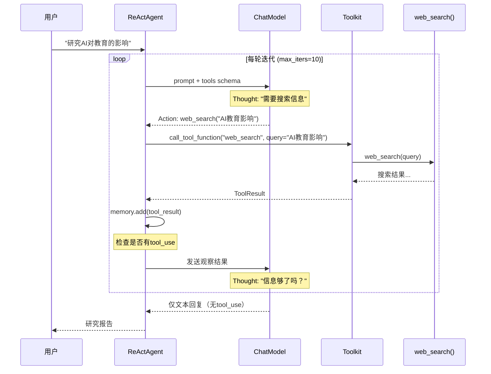
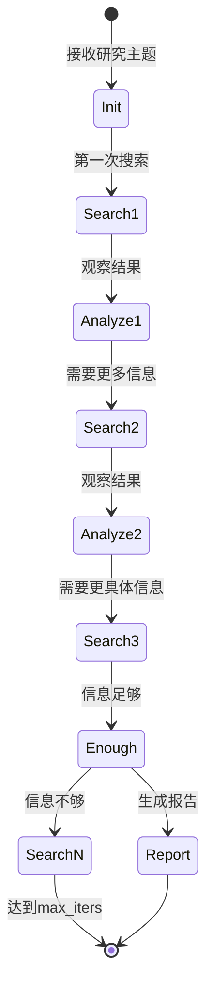

# P8-4 深度研究助手

## 学习目标

学完之后，你能：
- 构建研究Agent实现多步骤信息收集
- 集成WebSearch工具进行网络搜索
- 设计迭代式的研究流程
- 生成结构化研究报告

## 背景问题

**为什么需要深度研究Agent？**

单一LLM的局限：
- 知识有截止日期，无法获取最新信息
- 缺乏主动搜索能力
- 不知道如何设计研究策略

深度研究Agent的能力：
- 接收研究主题
- 自动规划搜索策略
- 迭代收集信息
- 综合成结构化报告

**核心思想**：让Agent像研究员一样工作，不是一次性获取答案，而是通过多轮"搜索-分析-再搜索"逐步深入。

## 源码入口

**核心文件**：
- `src/agentscope/agent/_react_agent.py:143` - `ReActAgent`类
- `src/agentscope/agent/_react_agent.py:376` - `max_iters`参数
- `examples/agent/deep_research_agent/` - 深度研究示例

**关键方法**：

| 方法 | 路径 | 说明 |
|------|------|------|
| `reply()` | `_react_agent.py:377` | Agent处理入口 |
| `_reasoning()` | `_react_agent.py:497` | 推理阶段 |
| `_acting()` | `_react_agent.py:570` | 行动阶段（工具调用） |

**示例项目**：
```
examples/agent/deep_research_agent/main.py
examples/agent/deep_research_agent/deep_research_agent.py
```

## 架构定位

```
┌─────────────────────────────────────────────────────────────┐
│                    深度研究Agent架构                         │
│                                                             │
│  ┌─────────────────────────────────────────────────────┐  │
│  │                   ReActAgent                         │  │
│  │  ┌─────────────────────────────────────────────┐   │  │
│  │  │          ReAct研究循环                       │   │  │
│  │  │                                             │   │  │
│  │  │  Thought: "需要搜索AI对教育的影响"           │   │  │
│  │  │  Action: web_search("AI 教育 影响")         │   │  │
│  │  │  Observation: "找到100条结果..."            │   │  │
│  │  │                                             │   │  │
│  │  │  Thought: "需要更具体案例"                  │   │  │
│  │  │  Action: web_search("AI教育 成功案例")      │   │  │
│  │  │  ...                                       │   │  │
│  │  └─────────────────────────────────────────────┘   │  │
│  └─────────────────────────────────────────────────────┘  │
│                         │                                  │
│                         ▼                                  │
│  ┌─────────────────────────────────────────────────────┐  │
│  │                   Toolkit                            │  │
│  │  web_search() - 网络搜索                           │  │
│  │  read_webpage() - 读取网页内容                     │  │
│  │  translate() - 翻译工具                            │  │
│  └─────────────────────────────────────────────────────┘  │
└─────────────────────────────────────────────────────────────┘
```

**ReAct研究循环**：
```
用户输入: "研究AI对教育行业的影响"

迭代 1:
  Thought → Action: web_search("AI 教育 影响")
  Observation → 发现AI教育的概述信息

迭代 2:
  Thought → Action: web_search("AI教育 案例 成功")
  Observation → 发现具体案例

迭代 N:
  Thought → "信息足够，生成报告"
  Action: generate_response() [结构化输出]
  Observation → 研究报告
```

## 核心源码分析

### 1. 搜索工具定义

```python
# P8-4_deep_research.py
from agentscope.tool import Toolkit, ToolResponse
from agentscope.message import TextBlock

def web_search(query: str) -> ToolResponse:
    """搜索网络获取相关信息

    Args:
        query: 搜索关键词

    Returns:
        ToolResponse: 搜索结果
    """
    # 实际项目中调用真实搜索API
    # 如：Google Search API、Bing Search API、DuckDuckGo等
    result = f"关于'{query}'的搜索结果..."

    return ToolResponse(content=[TextBlock(type="text", text=result)])
```

### 2. 研究Agent配置

```python
# P8-4_deep_research.py
from agentscope.agent import ReActAgent
from agentscope.model import OpenAIChatModel
from agentscope.formatter import OpenAIChatFormatter

# 创建工具箱
toolkit = Toolkit()
toolkit.register_tool_function(web_search, group_name="search")

# 创建研究Agent
agent = ReActAgent(
    name="Researcher",
    model=OpenAIChatModel(
        api_key=os.environ.get("OPENAI_API_KEY"),
        model="gpt-4"
    ),
    sys_prompt="""你是一个专业的研究助手。
收到研究主题后：
1. 搜索相关信息
2. 分析整理
3. 输出结构化报告""",
    formatter=OpenAIChatFormatter(),
    toolkit=toolkit,
    max_iters=10  # 最多10次搜索迭代
)
```

### 3. ReActAgent的reply方法（关键部分）

```python
# src/agentscope/agent/_react_agent.py:377-475
async def reply(
    self,
    msg: Msg | list[Msg] | None = None,
    structured_model: Type[BaseModel] | None = None,
) -> Msg:
    # 1. 记录输入消息
    await self.memory.add(msg)

    # 2. 检索长时记忆和知识库
    await self._retrieve_from_long_term_memory(msg)
    await self._retrieve_from_knowledge(msg)

    # 3. ReAct循环（关键！）
    for _ in range(self.max_iters):
        # 推理：让LLM决定下一步
        msg_reasoning = await self._reasoning(tool_choice)

        # 获取工具调用
        tool_calls = msg_reasoning.get_content_blocks("tool_use")

        # 执行工具
        if tool_calls:
            futures = [self._acting(tc) for tc in tool_calls]
            if self.parallel_tool_calls:
                await asyncio.gather(*futures)
            else:
                for f in futures:
                    await f

        # 检查是否需要继续
        if not msg_reasoning.has_content_blocks("tool_use"):
            break

    return msg_reasoning
```

### 4. _reasoning方法（LLM调用）

```python
# src/agentscope/agent/_react_agent.py:497-570
async def _reasoning(
    self,
    tool_choice: Literal["auto", "none", "required"] | None = None,
) -> Msg:
    """执行推理步骤"""

    # 构建prompt（包含system prompt + memory）
    prompt = await self.formatter.format([
        Msg("system", self.sys_prompt, "system"),
        *await self.memory.get_memory(...),
    ])

    # 调用LLM
    res = await self.model(
        prompt,
        tools=self.toolkit.get_json_schemas(),  # 传入工具描述
        tool_choice=tool_choice,
    )

    # 解析响应
    msg = Msg(name=self.name, content=list(res.content), role="assistant")
    return msg
```

### 5. _acting方法（工具执行）

```python
# src/agentscope/agent/_react_agent.py:570-620
async def _acting(self, tool_call: ToolUseBlock) -> dict | None:
    """执行工具调用"""

    tool_res_msg = Msg("system", [...], "system")

    try:
        # 调用工具
        tool_res = await self.toolkit.call_tool_function(tool_call)

        # 处理异步结果
        async for chunk in tool_res:
            tool_res_msg.content[0]["output"] = chunk.content
            await self.print(tool_res_msg, chunk.is_last)

        return None

    finally:
        await self.memory.add(tool_res_msg)
```

## 可视化结构

### ReAct研究循环



### 研究Agent状态机



## 工程经验

### 设计原因

| 设计 | 原因 |
|------|------|
| max_iters限制 | 防止无限循环 |
| 工具注册到toolkit | 解耦工具和Agent |
| 记忆累积 | 每轮迭代保留历史信息 |
| structured_model | 支持结构化报告输出 |

### 替代方案

**方案1：一次性搜索**
```python
# 简单但不深入
result = web_search(user_query)
return summarize(result)
```

**方案2：PlanNotebook分解任务**
```python
# 使用计划笔记本
from agentscope.plan import PlanNotebook

agent = ReActAgent(
    ...,
    plan_notebook=PlanNotebook([
        "搜索背景信息",
        "搜索具体案例",
        "搜索数据统计",
        "综合分析"
    ])
)
```

**方案3：多Agent协作研究**
```python
# 不同Agent负责不同方面
search_agent = ReActAgent(name="Searcher", toolkit=search_toolkit)
analyze_agent = ReActAgent(name="Analyzer", toolkit=analyze_toolkit)
# 协作完成研究
```

### 可能出现的问题

**问题1：Agent陷入无限搜索**
```python
# 原因：LLM一直决定搜索而不结束
# 解决：设置合理的max_iters
agent = ReActAgent(..., max_iters=5)  # 最多5次搜索

# 源码依据：_react_agent.py:376
# max_iters: int = 10  # 默认值
```

**问题2：搜索API成本高**
```python
# 原因：每次搜索都是API调用
# 解决：使用缓存
import functools

@functools.lru_cache(maxsize=100)
def web_search_cached(query: str) -> ToolResponse:
    return web_search(query)

# 或使用Redis缓存
_cache = redis.Redis(decode_responses=True)
def web_search(query: str) -> ToolResponse:
    cached = _cache.get(f"search:{query}")
    if cached:
        return ToolResponse(content=[TextBlock(text=cached)])
    result = call_search_api(query)
    _cache.setex(f"search:{query}", 3600, result)
    return ToolResponse(content=[TextBlock(text=result)])
```

**问题3：研究结果不一致**
```python
# 原因：多次搜索可能返回不同结果
# 解决：明确要求Agent综合分析
sys_prompt="""你是一个专业研究员...
重要：你需要综合多轮搜索结果，给出一致的结论。
如果不同搜索结果有冲突，明确指出并分析原因。"""
```

**问题4：报告格式不统一**
```python
# 解决：使用structured_model
from pydantic import BaseModel

class ResearchReport(BaseModel):
    summary: str  # 摘要
    key_findings: list[str]  # 主要发现
    evidence: list[str]  # 证据
    conclusion: str  # 结论

response = await agent(msg, structured_model=ResearchReport)
```

## Contributor指南

### 适合新手修改的文件

| 文件 | 原因 |
|------|------|
| `src/agentscope/agent/_react_agent.py` | ReAct循环核心 |
| `examples/agent/deep_research_agent/` | 研究Agent示例 |
| `src/agentscope/tool/_toolkit.py` | 工具注册 |

### 危险区域

**区域1：max_iters设置不当**
```python
# 危险：太大导致成本过高
agent = ReActAgent(..., max_iters=100)  # 可能搜索100次！

# 危险：太小导致研究不充分
agent = ReActAgent(..., max_iters=2)  # 可能只搜索2次
```

**区域2：工具函数副作用**
```python
# 危险：工具函数有副作用（如修改数据库）
def research_tool(query: str) -> ToolResponse:
    save_to_database(query)  # 不要在工具中产生副作用！
    return ToolResponse(content=[...])
```

### 调试方法

**方法1：打印ReAct循环**
```python
# 在每次迭代打印状态
for i in range(self.max_iters):
    print(f"[迭代 {i+1}]")
    msg_reasoning = await self._reasoning(...)
    print(f"Thought: {msg_reasoning.get('text', '')[:100]}")

    if not msg_reasoning.has_content_blocks("tool_use"):
        print("结束迭代")
        break
```

**方法2：检查memory内容**
```python
# 打印Agent的完整记忆
memory = await agent.memory.get_memory()
for msg in memory:
    print(f"{msg.name}: {msg.content[:100]}")
```

**方法3：限制工具调用**
```python
# 只允许特定工具
allowed_tools = ["web_search", "read_webpage"]
schemas = [s for s in self.toolkit.get_json_schemas()
           if s["name"] in allowed_tools]
res = await self.model(prompt, tools=schemas)
```

★ **Insight** ─────────────────────────────────────
- **深度研究 = ReAct循环 + 搜索工具**
- **max_iters = 研究深度上限**，平衡深度和成本
- **记忆累积 = 每轮迭代保留中间结果**，最终综合
- structured_model可以约束输出格式
─────────────────────────────────────────────────
