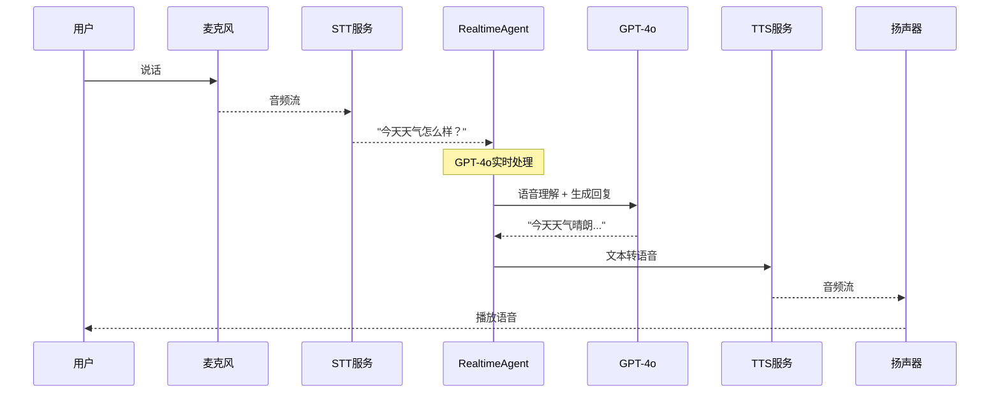
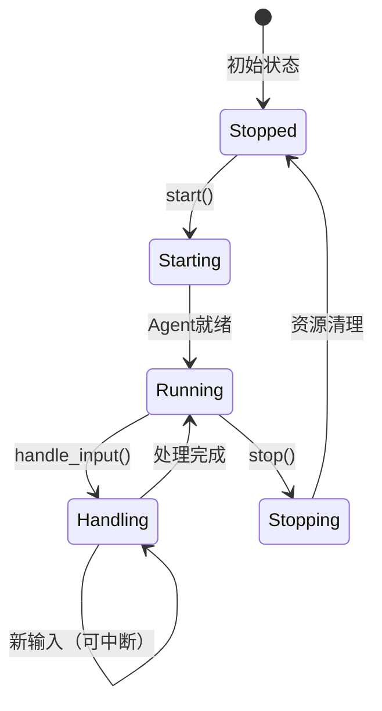

# P8-5 语音对话助手

## 学习目标

学完之后，你能：
- 使用RealtimeAgent实现实时语音交互
- 理解STT→Agent→TTS的完整语音流程
- 设计适合语音播报的prompt
- 实现语音助手的中断处理机制

## 背景问题

**为什么需要专门的语音Agent？**

文本Agent（ReActAgent）和语音Agent的区别：

| 特性 | ReActAgent | RealtimeAgent |
|------|------------|---------------|
| 输入 | 文本Msg | 音频流 |
| 输出 | 文本 | 音频流 |
| 交互模式 | 请求-响应 | 实时双向 |
| 延迟要求 | 秒级可接受 | 毫秒级 |
| 适用场景 | 客服、问答 | 语音助手 |

**语音助手解决什么问题？**
- 比打字更自然的交互方式
- 适合 hands-free 场景
- 更快的反馈速度

## 源码入口

**核心文件**：
- `src/agentscope/agent/_realtime_agent.py` - `RealtimeAgent`类
- `src/agentscope/realtime/` - 实时语音模型目录
- `examples/agent/realtime_voice_agent/run_server.py` - 语音助手示例

**关键类**：

| 类 | 路径 | 说明 |
|----|------|------|
| `RealtimeAgent` | `src/agentscope/agent/_realtime_agent.py` | 实时语音Agent |
| `OpenAIRealtimeModel` | `src/agentscope/realtime/_openai.py` | OpenAI实时模型 |
| `ClientEvents` | `src/agentscope/realtime/_events.py` | 客户端事件类型 |

## 架构定位

```
┌─────────────────────────────────────────────────────────────┐
│                    语音助手架构                              │
│                                                             │
│  ┌─────────┐    ┌─────────┐    ┌─────────┐    ┌─────────┐ │
│  │  麦克风  │───►│   STT   │───►│  Agent  │───►│   TTS   │ │
│  │ (用户说话)│    │(语音→文本)│    │(思考回复)│    │(文本→语音)│ │
│  └─────────┘    └─────────┘    └─────────┘    └─────────┘ │
│                                            │                │
│                                            ▼                │
│                                      ┌─────────┐           │
│                                      │  扬声器  │           │
│                                      │(播放语音)│           │
│                                      └─────────┘           │
└─────────────────────────────────────────────────────────────┘
```

**AgentScope语音组件**：
```
RealtimeAgent
├── model: OpenAIRealtimeModel  # 语音模型（GPT-4o）
├── sys_prompt: str             # 系统提示
└── start/stop lifecycle       # 生命周期管理
```

**与ReActAgent的区别**：
```
ReActAgent:
  msg → [推理+行动] → text response

RealtimeAgent:
  audio stream → [STT→推理→TTS] → audio stream
```

## 核心源码分析

### 1. RealtimeAgent定义

```python
# src/agentscope/agent/_realtime_agent.py
class RealtimeAgent(AgentBase):
    """专为实时语音交互设计的Agent"""

    def __init__(
        self,
        name: str,
        model: "RealtimeModelBase",
        sys_prompt: str | None = None,
    ) -> None:
        self.name = name
        self.model = model
        self.sys_prompt = sys_prompt
```

### 2. 语音助手完整代码

```python
# P8-5_voice_assistant.py
import asyncio
from agentscope.agent import RealtimeAgent
from agentscope.realtime import OpenAIRealtimeModel, ClientEvents
from agentscope.message import Msg

# 1. 初始化
agentscope.init(project="VoiceAssistant")

# 2. 创建语音模型
voice_model = OpenAIRealtimeModel(
    api_key="your-api-key",
    model="gpt-4o-realtime-preview",
    voice="alloy"  # 可选: alloy, echo, fable, onyx, nova, shimmer
)

# 3. 创建语音助手Agent
assistant = RealtimeAgent(
    name="VoiceAssistant",
    sys_prompt="""你是一个友好的语音助手，名叫小秘。
你的特点是：
1. 回答简洁明了，适合语音播报
2. 语气亲切友好
3. 遇到不懂的问题会承认并建议用户查阅资料

请用口语化的方式回复，不要使用列表或复杂格式。""",
    model=voice_model
)

# 4. 运行语音对话
async def run_voice_assistant():
    """运行语音助手"""
    # 创建队列用于处理输出
    output_queue = asyncio.Queue()

    # 启动Agent
    await assistant.start(output_queue)

    print("语音助手已启动，按 Ctrl+C 退出")

    try:
        # 在后台任务中处理输出
        async def process_output():
            while True:
                msg = await output_queue.get()
                print(f"助手: {msg}")

        output_task = asyncio.create_task(process_output())

        # 主循环：模拟用户输入
        user_inputs = ["你好，你叫什么名字？", "今天天气怎么样？", "再见"]

        for user_input in user_inputs:
            print(f"\n用户: {user_input}")
            # 发送输入到Agent
            client_event = ClientEvents.ClientTextInputEvent(text=user_input)
            await assistant.handle_input(client_event)

            if "再见" in user_input:
                break

        output_task.cancel()

    finally:
        await assistant.stop()
        print("\n对话结束")
```

### 3. RealtimeAgent生命周期

```python
# 生命周期管理
async def example():
    output_queue = asyncio.Queue()

    # 启动
    await agent.start(output_queue)

    # 处理输入
    await agent.handle_input(ClientEvents.ClientTextInputEvent(text="你好"))

    # 停止
    await agent.stop()
```

### 4. 语音Prompt设计要点

```python
# 语音友好的prompt特点
sys_prompt="""你是一个友好的语音助手，名叫小秘。

设计要点：
1. 简洁口语化 - TTS播报时更自然
2. 避免列表格式 - 口语不适合念"第一点、第二点"
3. 明确身份和风格 - 用户知道在和谁对话
4. 处理特殊内容 - 遇到无法语音化的内容要有替代方案

好的回复示例：
"今天天气很不错，大部分地区都是晴天，气温在二十度左右。"

不好的回复示例：
"今天天气预报：
1. 北京：晴，25度
2. 上海：多云，28度
3. 广州：雨，26度"
"""
```

### 5. RealtimeAgent vs ReActAgent

```python
# ReActAgent - 文本Agent
from agentscope.agent import ReActAgent
from agentscope.model import OpenAIChatModel

text_agent = ReActAgent(
    name="TextAssistant",
    model=OpenAIChatModel(...),
    sys_prompt="你是一个助手"
)

# 调用方式
response = await text_agent(Msg(name="user", content="你好", role="user"))


# RealtimeAgent - 语音Agent
from agentscope.agent import RealtimeAgent
from agentscope.realtime import OpenAIRealtimeModel

voice_agent = RealtimeAgent(
    name="VoiceAssistant",
    model=OpenAIRealtimeModel(...),  # 语音模型
    sys_prompt="你是一个语音助手"
)

# 调用方式
await voice_agent.start(output_queue)
await voice_agent.handle_input(ClientEvents.ClientTextInputEvent(text="你好"))
```

## 可视化结构

### STT → Agent → TTS 完整流程



### RealtimeAgent生命周期



## 工程经验

### 设计原因

| 设计 | 原因 |
|------|------|
| start/stop生命周期 | 显式管理音频连接和资源 |
| output_queue | 异步处理Agent输出，不阻塞主循环 |
| ClientEvents封装 | 统一处理不同类型的输入事件 |
| 语音友好prompt | 语音输出有特殊限制（不能有列表、代码等） |

### 替代方案

**方案1：使用ReActAgent + 外部STT/TTS**
```python
# 架构分离
# STT → ReActAgent → TTS

# 缺点：延迟高，不如原生实时体验
```

**方案2：WebRTC实时通信**
```python
# 更低的延迟和更好的回声消除
# 但需要额外的信令服务器
```

### 可能出现的问题

**问题1：RealtimeModel API权限**
```python
# 错误：API Key没有语音权限
# openai.AuthenticationError: "The model 'gpt-4o-realtime-preview' is not available"

# 解决：确认API Key支持语音预览
voice_model = OpenAIRealtimeModel(
    api_key="your-api-key",  # 需要有语音API权限的Key
    model="gpt-4o-realtime-preview"
)
```

**问题2：中文发音不自然**
```python
# 解决1：选择支持中文的语音
voice_model = OpenAIRealtimeModel(
    model="gpt-4o-realtime-preview",
    voice="nova"  # nova对多语言支持更好
)

# 解决2：在prompt中指导发音
sys_prompt="""
注意：
- "API"读作"A-P-I"
- "SDK"读作"S-D-K"
- 数字逐个读，如"123"读作"一二三"
"""
```

**问题3：用户打断处理**
```python
# 需要实现中断检测
async def check_for_interrupt():
    while True:
        audio_level = get_microphone_level()
        if audio_level > INTERRUPT_THRESHOLD:
            # 检测到用户说话，中断当前TTS
            await tts.stop()
            # 处理用户新输入
            new_input = await stt.recognize()
            await handle_user_input(new_input)
```

**问题4：流式输出的处理**
```python
# RealtimeAgent输出是流式的
async def process_output():
    while True:
        msg = await output_queue.get()
        # msg可能是部分内容，需要累积
        print(f"收到: {msg}")
```

## Contributor指南

### 适合新手修改的文件

| 文件 | 原因 |
|------|------|
| `src/agentscope/agent/_realtime_agent.py` | RealtimeAgent核心实现 |
| `src/agentscope/realtime/` | 实时语音模型实现 |
| `examples/agent/realtime_voice_agent/run_server.py` | 语音助手示例 |

### 危险区域

**区域1：资源泄漏**
```python
# 危险：忘记调用stop()
await agent.start(output_queue)
# ... 使用 ...
# 忘记 stop()

# 正确：用try/finally确保清理
try:
    await agent.start(output_queue)
    # ...
finally:
    await agent.stop()
```

**区域2：队列阻塞**
```python
# 危险：output_queue.get()阻塞主循环
# 解决：设置超时
try:
    msg = await asyncio.wait_for(output_queue.get(), timeout=1.0)
except asyncio.TimeoutError:
    continue
```

### 调试方法

**方法1：文本模式测试**
```python
# 先用文本模式测试业务逻辑
text_agent = ReActAgent(
    name="Test",
    model=OpenAIChatModel(...),  # 用文本模型测试
    sys_prompt="..."
)

# 测试通过后再切换到语音模式
```

**方法2：打印队列内容**
```python
async def process_output():
    while True:
        try:
            msg = await asyncio.wait_for(output_queue.get(), timeout=1.0)
            print(f"[DEBUG] 收到: {msg}")
        except asyncio.TimeoutError:
            continue
```

**方法3：检查模型配置**
```python
# 验证模型是否正确配置
print(f"模型: {voice_model.model}")
print(f"语音: {voice_model.voice}")
print(f"API Key: {'*' * 20}{voice_model.api_key[-4:]}")
```

★ **Insight** ─────────────────────────────────────
- **RealtimeAgent = 专用于语音的Agent**，处理STT→推理→TTS流程
- **start/stop = 显式生命周期**，需要配对调用
- **语音prompt需要特别设计**：口语化、简洁、无列表
- 与ReActAgent的核心区别：输入输出都是音频流，而非文本
─────────────────────────────────────────────────
