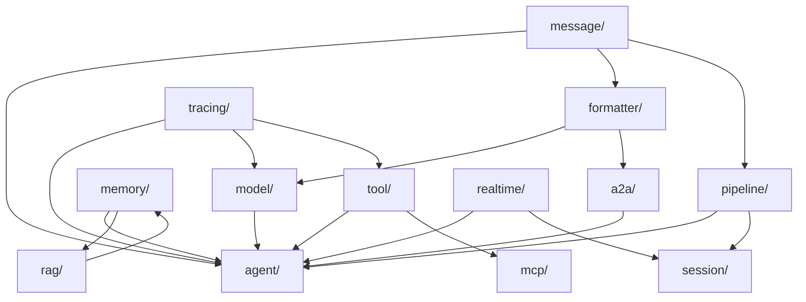
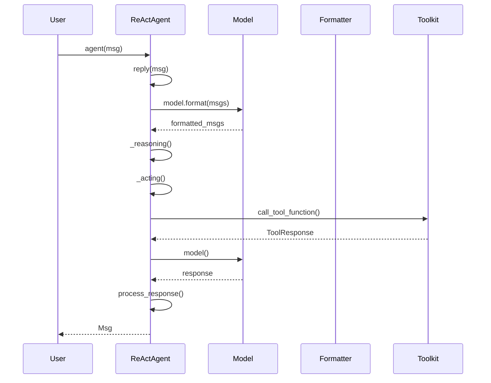

# AgentScope 仓库结构地图

> **Level**: 0 (前置基础)
> **目标**: 理解 AgentScope 源码目录结构和模块职责

---

## 1. 仓库概览

```
agentscope/
├── src/agentscope/              # 主源码
│   ├── agent/                  # Agent 实现
│   ├── model/                  # LLM 模型适配
│   ├── formatter/              # 消息格式转换
│   ├── tool/                   # 工具系统
│   ├── memory/                 # 记忆系统
│   ├── pipeline/               # 编排系统
│   ├── rag/                    # RAG 组件
│   ├── session/                # 会话管理
│   ├── embedding/              # 向量化模型
│   ├── token/                  # Token 计算
│   ├── a2a/                    # Agent-to-Agent 协议
│   ├── realtime/               # 实时代理
│   ├── mcp/                    # Model Context Protocol
│   ├── tracing/                # 链路追踪
│   ├── evaluate/               # 评估系统
│   ├── tuner/                  # 模型调优
│   └── message/                # 消息类型
│
├── examples/                   # 示例代码
├── tests/                      # 测试套件
├── teaching/book/              # 教学文档
└── docs/                       # 官方文档
```

---

## 2. 模块职责矩阵

| 目录 | 核心职责 | 关键类 | 行数范围 |
|------|----------|--------|----------|
| `agent/` | Agent 实现 | `AgentBase`, `ReActAgent`, `UserAgent`, `A2AAgent`, `RealtimeAgent` | ~2800 |
| `model/` | LLM 适配 | `ChatModelBase`, `OpenAIChatModel`, `AnthropicChatModel` | ~2500 |
| `formatter/` | 格式转换 | `FormatterBase`, `OpenAIChatFormatter`, `AnthropicChatFormatter` | ~1200 |
| `tool/` | 工具系统 | `Toolkit`, `ToolResponse`, `register_tool_function` | ~1700 |
| `memory/` | 记忆存储 | `MemoryBase`, `InMemoryMemory`, `RedisMemory` | ~3000 |
| `pipeline/` | 编排 | `SequentialPipeline`, `FanoutPipeline`, `MsgHub` | ~1200 |
| `message/` | 消息类型 | `Msg`, `TextBlock`, `ToolUseBlock`, `ToolResultBlock` | ~800 |
| `rag/` | RAG | `KnowledgeBase`, `VDBStore`, `SimpleKnowledge` | ~1500 |
| `a2a/` | A2A 协议 | `AgentCard`, `A2AAgent`, `AgentCardResolver` | ~1000 |
| `mcp/` | MCP 客户端 | `MCPClientBase`, `StdIOStatefulClient`, `HTTPStatefulClient` | ~1500 |
| `tracing/` | 链路追踪 | `setup_tracing`, `trace_reply`, `trace_llm` | ~800 |
| `session/` | 会话管理 | `SessionManager`, `AgentSession` | ~1000 |
| `realtime/` | 实时代理 | `RealtimeAgent`, `TTSEngine`, `STTEngine` | ~1500 |
| `tuner/` | 模型调优 | `TunerBase`, `LLMTuner` | ~1000 |
| `evaluate/` | 评估 | `EvaluateEngine`, `Metrics` | ~800 |

---

## 3. 目录依赖关系图



---

## 4. 模块文件清单

### 4.1 agent/

| 文件 | 类/函数 | 职责 |
|------|---------|------|
| `_agent_base.py` | `AgentBase` | Agent 基类，定义 `reply()`, `observe()`, `__call__()` |
| `_agent_meta.py` | `AgentMeta` | Agent 元信息 |
| `_react_agent_base.py` | `ReActAgentBase` | ReAct 推理循环基类 |
| `_react_agent.py` | `ReActAgent` | 主要 Agent 实现 |
| `_user_agent.py` | `UserAgent` | 用户交互 Agent |
| `_user_input.py` | `UserInputBase`, `TerminalUserInput` | 用户输入抽象 |
| `_a2a_agent.py` | `A2AAgent` | A2A 协议 Agent |
| `_realtime_agent.py` | `RealtimeAgent` | 实时代理 |
| `_utils.py` | 工具函数 | Agent 相关工具 |

### 4.2 model/

| 文件 | 类/函数 | 职责 |
|------|---------|------|
| `_model_base.py` | `ChatModelBase` | 模型基类 |
| `_openai_model.py` | `OpenAIChatModel` | OpenAI 适配 |
| `_anthropic_model.py` | `AnthropicChatModel` | Anthropic 适配 |
| `_dashscope_model.py` | `DashScopeChatModel` | 阿里云 DashScope 适配 |
| `_ollama_model.py` | `OllamaChatModel` | Ollama 本地模型 |
| `_gemini_model.py` | `GeminiChatModel` | Google Gemini 适配 |

### 4.3 formatter/

| 文件 | 类/函数 | 职责 |
|------|---------|------|
| `_formatter_base.py` | `FormatterBase` | 格式化器基类 |
| `_openai_formatter.py` | `OpenAIChatFormatter` | OpenAI 消息格式 |
| `_anthropic_formatter.py` | `AnthropicChatFormatter` | Anthropic 消息格式 |
| `_dashscope_formatter.py` | `DashScopeChatFormatter` | DashScope 消息格式 |
| `_a2a_formatter.py` | `A2AChatFormatter` | A2A 消息格式 |

### 4.4 tool/

| 文件 | 类/函数 | 职责 |
|------|---------|------|
| `_toolkit.py` | `Toolkit` | 工具注册与调用核心 |
| `_response.py` | `ToolResponse` | 工具响应结构 |
| `_types.py` | 工具类型定义 | Block 类型等 |
| `_async_wrapper.py` | `async_wrapper` | 同步函数异步包装 |
| `_mcp_function.py` | MCP 工具函数 | MCP 协议工具 |

### 4.5 memory/

| 文件 | 类/函数 | 职责 |
|------|---------|------|
| `_memory_base.py` | `MemoryBase` | 记忆基类 |
| `_working_memory/` | 工作记忆 | InMemory, Redis, SQLAlchemy |
| `_long_term_memory/` | 长期记忆 | Mem0, ReMe |

### 4.6 pipeline/

| 文件 | 类/函数 | 职责 |
|------|---------|------|
| `_class.py` | `SequentialPipeline`, `FanoutPipeline` | Pipeline 类 |
| `_msghub.py` | `MsgHub` | 消息广播订阅 |
| `_functional.py` | `sequential_pipeline`, `fanout_pipeline` | 函数式 Pipeline |

---

## 5. 入口点分析

### 5.1 用户级入口

```python
# 主要导入
from agentscope import init
from agentscope.agent import ReActAgent
from agentscope.model import OpenAIChatModel
from agentscope.message import Msg
from agentscope.formatter import OpenAIChatFormatter
from agentscope.tool import Toolkit
from agentscope.memory import InMemoryMemory
```

### 5.2 核心初始化链

```python
# init() 函数
src/agentscope/__init__.py:init()

# ↓

# Agent 创建
src/agentscope/agent/__init__.py

# ↓

# Model 创建
src/agentscope/model/__init__.py
```

### 5.3 Agent 循环入口



---

## 6. 关键文件速查表

| 功能 | 文件:行号 |
|------|----------|
| AgentBase 定义 | `agent/_agent_base.py:30` |
| ReActAgent 主循环 | `agent/_react_agent.py:376` |
| Toolkit 注册工具 | `tool/_toolkit.py:274` |
| Toolkit 调用工具 | `tool/_toolkit.py:853` |
| Msg 定义 | `message/_message_base.py:21` |
| TextBlock 定义 | `message/_message_block.py:9` |
| MsgHub 广播 | `pipeline/_msghub.py:130` |
| SequentialPipeline | `pipeline/_class.py:10` |
| FanoutPipeline | `pipeline/_class.py:43` |

---

