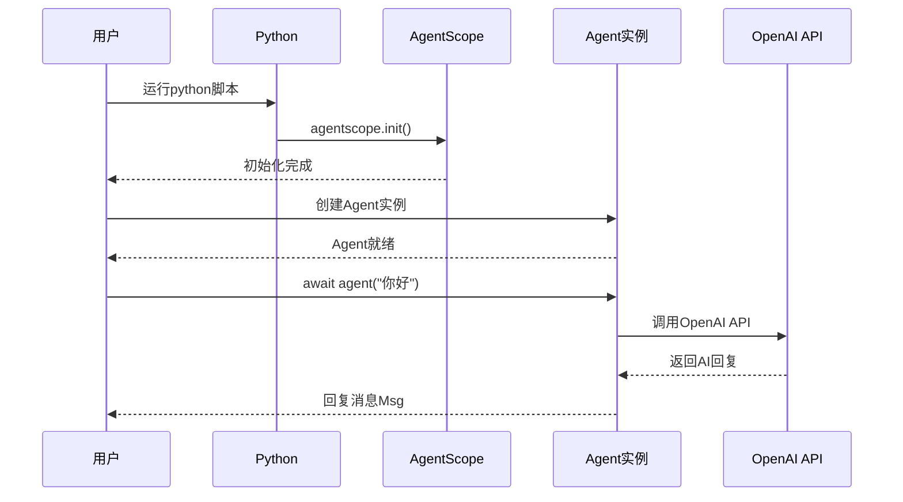

# 1-1 环境搭建 so easy

> **目标**：20分钟内完成所有环境准备，跑起你的第一个Agent

---

## 🎯 这一章的目标

学完之后，你能：
- 安装Python和pip
- 安装AgentScope库
- 配置好IDE（VSCode/PyCharm）
- 运行第一个简单的Agent代码

---

## 🚀 先跑起来

### Step 1：安装Python

**Windows用户**：
1. 打开 https://www.python.org/downloads/
2. 下载Python 3.10或更高版本
3. 运行安装程序
4. ⚠️ **记得勾选** "Add Python to PATH"

**macOS用户**：
```bash
# 使用Homebrew安装
brew install python3
```

**Linux用户**：
```bash
# Ubuntu/Debian
sudo apt update
sudo apt install python3 python3-pip
```

**验证安装**：
```bash
python3 --version
# 应该显示 Python 3.10.x 或更高
```

### Step 2：安装AgentScope

```bash
# 一行命令安装
pip install agentscope

# 或者使用国内镜像（更快）
pip install agentscope -i https://mirrors.aliyun.com/pypi/simple/
```

**验证安装**：
```python showLineNumbers
# 在命令行输入 python3，然后输入：
import agentscope
print(agentscope.__version__)
```

### Step 3：配置IDE

**推荐VSCode**（免费轻量）：
1. 下载 https://code.visualstudio.com/
2. 安装Python扩展：
   - 打开VSCode
   - 按 `Ctrl+P`（Mac: `Cmd+P`）
   - 输入 `ext install python`
   - 安装Microsoft的Python扩展

**推荐PyCharm**（功能强大）：
1. 下载 https://www.jetbrains.com/pycharm/
2. Community版免费足够用
3. 新建项目时选择Python解释器

### Step 4：你的第一个Agent

```python showLineNumbers
# 01_hello_agent.py
# 你的第一个Agent程序！

import agentscope
from agentscope.agent import ReActAgent
from agentscope.model import OpenAIChatModel

# 1. 初始化 - 就像Spring的@PostConstruct
agentscope.init(
    project="HelloAgent",
    name="MyFirstAgent"
)

# 2. 创建Agent
agent = ReActAgent(
    name="Alice",
    model=OpenAIChatModel(
        api_key="your-api-key",  # 替换成你的API Key
        model="gpt-4"
    ),
    sys_prompt="你是一个友好的AI助手。"
)

# 3. 运行Agent
import asyncio

async def main():
    response = await agent("你好！请介绍一下你自己。")
    print(f"Agent回复: {response.content}")

asyncio.run(main())
```

💡 **Java开发者注意**：这个代码和Java的初始化流程类似：
- `agentscope.init()` 类似于 Spring的 `@PostConstruct`
- `ReActAgent` 类似于 Spring的 `@Component`
- `await agent()` 是异步调用，类似于 `CompletableFuture.supplyAsync()`

---

## 🔍 追踪代码执行流程



---

## ⚠️ 坑预警：常见安装问题

### 问题1：pip不是内部或外部命令

**原因**：Python没加入PATH环境变量

**解决方案**：
```bash
# Windows重新安装Python，勾选"Add Python to PATH"
# 或者手动添加到PATH
```

### 问题2：安装慢（国内）

**原因**：默认源在国外

**解决方案**：
```bash
# 使用国内镜像
pip install agentscope -i https://mirrors.aliyun.com/pypi/simple/

# 永久设置
pip config set global.index-url https://mirrors.aliyun.com/pypi/simple/
```

### 问题3：API Key配置错误

**原因**：没设置环境变量或Key格式不对

**解决方案**：
```bash
# 设置环境变量（临时）
export OPENAI_API_KEY="sk-xxxxx"  # Mac/Linux
set OPENAI_API_KEY="sk-xxxxx"    # Windows

# 或者在代码中直接传入（不推荐，生产环境用环境变量）
model=OpenAIChatModel(api_key="sk-xxxxx", ...)
```

---

## 💡 Java开发者注意

| Python | Java | 说明 |
|--------|------|------|
| `pip install` | Maven/Gradle | 依赖管理 |
| `import agentscope` | `import com.xxx` | 导入包 |
| `agentscope.init()` | `@PostConstruct` | 初始化 |
| `await agent()` | `CompletableFuture` | 异步调用 |
| `api_key="..."` | `@Value("${api.key}")` | 配置注入 |

---

## 🎯 思考题

<details>
<summary>点击查看答案</summary>

1. **为什么需要`agentscope.init()`？**
   - 它初始化了全局配置、日志系统、追踪系统
   - 类似于Spring的`ApplicationRunner`或`@PostConstruct`
   - 确保在使用Agent之前，所有基础设施都已就绪

2. **`await`和Java的`CompletableFuture`有什么相似？**
   - `await agent()` 等待异步结果，类似 `future.get()`
   - 但`await`是语法糖，更简洁；`get()`会阻塞线程
   - Python的`asyncio`类似Java的`CompletableFuture`

3. **为什么API Key要放在环境变量而不是代码里？**
   - 安全：代码可能被提交到Git，Key泄露
   - 环境隔离：开发环境、测试环境、生产环境用不同的Key
   - 配置管理：不需要改代码就能切换环境

</details>

---

★ **Insight** ─────────────────────────────────────
- `agentscope.init()` 是**全局初始化**，类似Spring Boot的启动
- `await` 是Python的**异步等待**，类似Java的`CompletableFuture.get()`
- API Key等**敏感配置**要用环境变量，不要写死在代码里
─────────────────────────────────────────────────
