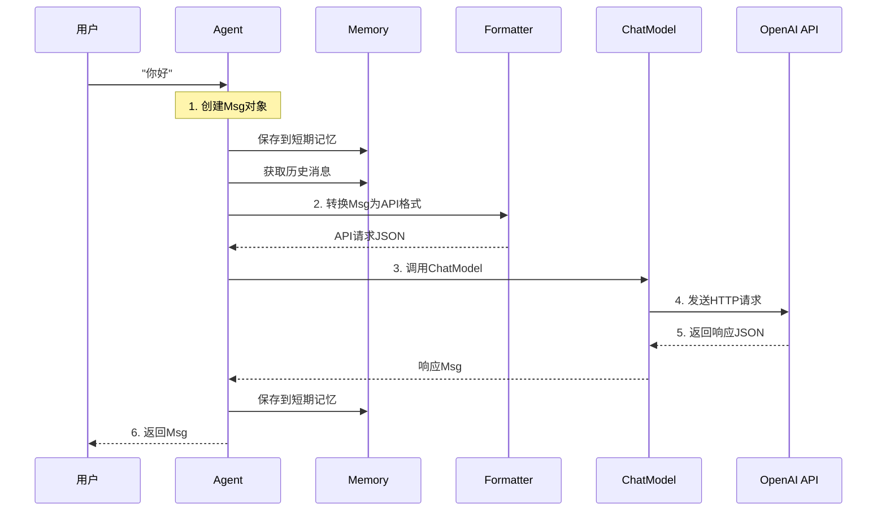

# 1-2 追踪"你好"的旅程

> **目标**：理解从用户输入"你好"到Agent回复的完整流程

---

## 🎯 这一章的目标

学完之后，你能：
- 画出Agent处理请求的完整流程图
- 理解Agent/Model/Formatter/Toolkit的关系
- 说出每一步数据是怎么传递的

---

## 🚀 先跑起来

```python showLineNumbers
# 02_trace_your_first_agent.py
# 追踪"你好"的旅程

import agentscope
from agentscope.agent import ReActAgent
from agentscope.model import OpenAIChatModel

# 初始化
agentscope.init(project="TraceDemo")

# 创建Agent
agent = ReActAgent(
    name="Tracer",
    model=OpenAIChatModel(
        api_key="your-api-key",
        model="gpt-4"
    ),
    sys_prompt="你是一个友好的AI助手。"
)

# 运行 - 追踪这个过程！
import asyncio

async def main():
    # ========== 追踪开始 ==========
    print("1. 用户输入: 你好")

    response = await agent("你好")

    print(f"2. Agent回复: {response.content}")
    # ========== 追踪结束 ==========

asyncio.run(main())
```

---

## 🔍 追踪"你好"的完整旅程

### 第一站：用户输入

```
┌─────────────────────────────────────────────────────────────┐
│  用户在终端输入 "你好"                                        │
│                                                             │
│  你好 ─────────────────────────────────────────────────────►│
└─────────────────────────────────────────────────────────────┘
```

### 第二站：Agent接收

```
┌─────────────────────────────────────────────────────────────┐
│  Agent收到消息                                              │
│                                                             │
│  Agent内部：                                                │
│  1. 创建Msg对象 (name="user", content="你好", role="user") │
│  2. 保存到短期记忆                                          │
│  3. 准备调用Model                                          │
└─────────────────────────────────────────────────────────────┘
```

💡 **Java开发者注意**：Msg就像Java的一个POJO：
```python
# Python的Msg
Msg(name="user", content="你好", role="user")

// Java的等价值
public class Msg {
    private String name;
    private String content;
    private String role;
    // getters, setters
}
```

### 第三站：Formatter转换

```
┌─────────────────────────────────────────────────────────────┐
│  Formatter将Msg转换为API格式                                  │
│                                                             │
│  Msg对象 ────────────Formatter─────────────► API请求JSON     │
│                                                             │
│  输入: Msg(name="user", content="你好", role="user")       │
│  输出: {"role": "user", "content": [{"type": "text", ...}]}│
└─────────────────────────────────────────────────────────────┘
```

💡 **Java开发者注意**：Formatter就像Java的**对象映射器**（ObjectMapper/ModelMapper）：
- 把统一的Msg对象，转换成各个API能认识的格式
- OpenAI用一种格式，Claude用另一种格式

### 第四站：Model调用

```
┌─────────────────────────────────────────────────────────────┐
│  Model调用远程API                                            │
│                                                             │
│  Formatter ───────ChatModelBase─────────► OpenAI API        │
│                                                             │
│  Model就像一个"万能插头"，不管后面是什么API，调用方式都一样   │
└─────────────────────────────────────────────────────────────┘
```

### 第五站：API返回

```
┌─────────────────────────────────────────────────────────────┐
│  OpenAI API返回响应                                          │
│                                                             │
│  OpenAI API ───────ChatModelBase──────────► 返回JSON         │
│                                                             │
│  {"choices": [{"message": {"role": "assistant",           │
│                "content": "你好！很高兴认识你。"}}]}        │
└─────────────────────────────────────────────────────────────┘
```

### 第六站：Formatter解析

```
┌─────────────────────────────────────────────────────────────┐
│  Formatter将API响应转换为Msg                                  │
│                                                             │
│  API响应JSON ─────Formatter───────────────► Msg对象            │
│                                                             │
│  输入: {"choices": [{"message": {...}}]}                     │
│  输出: Msg(name="assistant", content="你好！...", role="assistant")│
└─────────────────────────────────────────────────────────────┘
```

### 第七站：Agent返回

```
┌─────────────────────────────────────────────────────────────┐
│  Agent返回Msg给用户                                           │
│                                                             │
│  Msg对象 ────────────────────────────────────────────────► 用户│
│                                                             │
│  你好！很高兴认识你。                                         │
└─────────────────────────────────────────────────────────────┘
```

---

## 📊 完整流程图



---

## 💡 Java开发者注意：整个流程类似Java的分层架构

| AgentScope | Java | 说明 |
|------------|------|------|
| Agent | Controller | 接收请求，协调处理 |
| Formatter | ObjectMapper | 格式转换 |
| ChatModel | HTTP Client | 远程调用 |
| Memory | Session/Redis | 存储状态 |
| Msg | POJO/DTO | 数据传输对象 |

---

## 🎯 思考题

<details>
<summary>点击查看答案</summary>

1. **为什么需要Formatter而不是直接发Msg？**
   - 不同API（OpenAI/Claude）接受的格式不同
   - Formatter像适配器，屏蔽底层差异
   - 让Agent代码不用改，就能切换模型

2. **如果API返回错误，Agent会怎么处理？**
   - ChatModel会抛出异常
   - Agent的try-catch会捕获
   - 可能重试，或者返回错误信息给用户

3. **Memory在这里起什么作用？**
   - 保存对话历史（短期记忆）
   - 让Agent知道之前聊过什么
   - 类比Java的HttpSession

</details>

---

★ **Insight** ─────────────────────────────────────
- **Formatter是适配器**：把统一的Msg转换成各API认识的格式
- **ChatModel是网关**：不管什么API，调用方式都一样
- **Memory是记忆**：让Agent知道"我们之前聊过什么"
─────────────────────────────────────────────────

---

## 🔬 关键代码段解析

### 代码段1：初始化 —— 为什么需要init？

```python showLineNumbers
# 这是第22-27行
import agentscope
from agentscope.agent import ReActAgent
from agentscope.model import OpenAIChatModel

# 初始化
agentscope.init(project="TraceDemo")
```

**思路说明**：

| 问题 | 答案 |
|------|------|
| 为什么要`init`？ | `init`是全局初始化，设置项目名称、日志、追踪系统 |
| 为什么用`project="TraceDemo"`？ | 类似Java的Spring Boot项目名，用于在AgentScope Studio中区分不同项目 |
| 不写会怎样？ | 会用默认值"UnnamedProject"，日志和追踪会混在一起 |

**💡 设计思想**：AgentScope采用"先初始化，后使用"的模式，类似Spring Boot的启动流程。`init`确保所有组件（日志、追踪、配置）在使用前都已就绪。

---

### 代码段2：Agent创建 —— 为什么这样组织？

```python showLineNumbers
# 这是第30-37行
agent = ReActAgent(
    name="Tracer",                    # ① Agent的名字
    model=OpenAIChatModel(            # ② 使用的模型
        api_key="your-api-key",       # API密钥（生产环境用环境变量）
        model="gpt-4"                 # 模型名称
    ),
    sys_prompt="你是一个友好的AI助手。"  # ③ 系统提示词
)
```

**思路说明**：

```
┌─────────────────────────────────────────────────────────────┐
│                  ReActAgent 的三要素                        │
│                                                             │
│   ① name（名字）    ② model（大脑）    ③ sys_prompt（性格）  │
│        │                  │                  │              │
│        ▼                  ▼                  ▼              │
│   "Tracer"         OpenAI gpt-4      "你是一个友好的..."    │
│                                                             │
│   就像给一个员工分配：工号 + 大脑（AI模型）+ 工作职责         │
└─────────────────────────────────────────────────────────────┘
```

| 参数 | 思考 | 为什么这样设计 |
|------|------|----------------|
| `name` | Agent叫什么？ | 用于日志和追踪中标识 |
| `model` | 用什么AI？ | 决定Agent的"聪明程度" |
| `sys_prompt` | Agent是什么角色？ | 决定Agent的行为风格 |

**💡 设计思想**：这三个要素（名字、模型、提示词）构成了Agent的基本配置。分离这些参数让Agent可以灵活配置，就像Java的依赖注入。

---

### 代码段3：异步调用 —— 为什么需要async/await？

```python showLineNumbers
# 这是第42-51行
async def main():
    print("1. 用户输入: 你好")
    response = await agent("你好")  # 关键：await等待异步结果
    print(f"2. Agent回复: {response.content}")

asyncio.run(main())
```

**思路说明**：

```
┌─────────────────────────────────────────────────────────────┐
│              同步 vs 异步：为什么需要await？                │
│                                                             │
│  同步方式（会卡住）：              异步方式（不卡）：          │
│  ─────────────────              ──────────────              │
│  result = agent("你好")          response = await agent()   │
│  print(result)    ← 等API返回才执行  print(response)        │
│                                                             │
│  时间线：                          时间线：                   │
│  ├─发请求─├─等API─├─返回─┤       ├─发请求─┤               │
│  (用户看到卡顿)                       ├─等API─┤            │
│                                       ├─返回─┤              │
│                                       (用户可以干别的)        │
└─────────────────────────────────────────────────────────────┘
```

| 问题 | 答案 |
|------|------|
| 为什么要`async def`？ | Python的`async`用于声明异步函数 |
| 为什么要`await`？ | `await`等待异步操作完成，类似Java的`Future.get()` |
| 为什么要`asyncio.run()`？ | 运行异步函数的入口，类似Java的`main`方法 |

**💡 设计思想**：Agent调用LLM API是网络IO操作，可能耗时几百毫秒到几秒。异步让程序在等待时可以干别的，提高整体效率。

---

## 📋 核心关系图

```
┌─────────────────────────────────────────────────────────────┐
│                        用户输入                             │
│                         "你好"                              │
└──────────────────────────┬──────────────────────────────────┘
                           ▼
┌─────────────────────────────────────────────────────────────┐
│                      Agent（协调者）                         │
│  ┌──────────────────────────────────────────────────────┐  │
│  │ 1. 创建Msg  2. 保存Memory  3. 调用Model  4. 返回Msg   │  │
│  └──────────────────────────────────────────────────────┘  │
└──────────────────────────┬──────────────────────────────────┘
                           ▼
┌─────────────────────────────────────────────────────────────┐
│                    Formatter（格式转换）                     │
│         Msg ───────────────────────────► API JSON          │
└──────────────────────────┬──────────────────────────────────┘
                           ▼
┌─────────────────────────────────────────────────────────────┐
│                    ChatModel（模型接口）                     │
│         API JSON ───────────────────────────► 响应JSON     │
└──────────────────────────┬──────────────────────────────────┘
                           ▼
┌─────────────────────────────────────────────────────────────┐
│                   OpenAI API（远程服务）                     │
└──────────────────────────┬──────────────────────────────────┘
                           ▼
                     返回回复给用户
```
