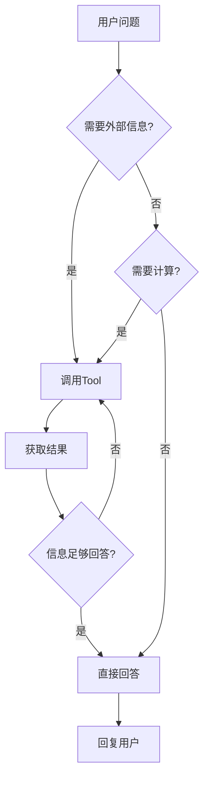

# 3-1 ReActAgent是怎么工作的

> **目标**：理解ReActAgent的Thought-Action-Observation循环

---

## 🎯 这一章的目标

学完之后，你能：
- 理解ReAct的三个步骤
- 画出Agent思考的循环图
- 说出什么时候Agent会调用Tool

---

## 🚀 先跑起来

```python showLineNumbers
import agentscope
from agentscope import ReActAgent
from agentscope.model import OpenAIChatModel

# 初始化
agentscope.init(project="ReActDemo")

# 创建ReActAgent
agent = ReActAgent(
    name="Assistant",
    model=OpenAIChatModel(api_key="...", model="gpt-4"),
    sys_prompt="你是一个有帮助的AI助手，可以使用工具来完成任务。",
    tools=[search_weather, calculate]  # 绑定工具
)

# 运行 - Agent会自动决定是否调用工具
import asyncio

async def main():
    response = await agent("北京今天天气怎么样？")
    print(response)

asyncio.run(main())
```

---

## 🔍 ReAct工作原理

### ReAct = **Re**ason + **Act**

```
┌─────────────────────────────────────────────────────────────┐
│                    ReAct 循环                              │
│                                                             │
│         ┌─────────────────────────────────────────┐       │
│         │                                         │       │
│         │    ┌─────────┐                         │       │
│         │    │ Thought │ 思考：我需要查天气         │       │
│         │    └────┬────┘                         │       │
│         │         │                               │       │
│         │         ▼                               │       │
│         │    ┌─────────┐                         │       │
│         │    │ Action  │ 行动：调用天气API        │       │
│         │    └────┬────┘                         │       │
│         │         │                               │       │
│         │         ▼                               │       │
│         │    ┌─────────┐                         │       │
│         │    │Observation│ 观察：API返回"晴，25度"│       │
│         │    └────┬────┘                         │       │
│         │         │                               │       │
│         │         └───────────┬───────────────────┘       │
│         │                     │                           │
│         │              继续循环？                          │
│         │                     │                           │
│         │              Yes ───┴──── No                    │
│         │                     │                           │
│         │                     ▼                           │
│         │               ┌─────────┐                       │
│         │               │ 回复用户 │                       │
│         └──────────────┴─────────┴───────────────────────┘│
└─────────────────────────────────────────────────────────────┘
```

### 具体例子

**用户问**："北京今天天气怎么样？"

```
Thought（思考）
───────────────────────────────────────────────────────────
Agent: "用户问天气，我需要调用天气API来获取信息。
       我还没有北京天气的数据，所以我应该调用天气工具。"

Action（行动）
───────────────────────────────────────────────────────────
Agent: 调用 search_weather(city="北京")

Observation（观察）
───────────────────────────────────────────────────────────
API返回: {"city": "北京", "weather": "晴", "temperature": 25}

Thought（再次思考）
───────────────────────────────────────────────────────────
Agent: "我得到了天气信息：北京今天是晴天，温度25度。
       这足够回答用户的问题了，不需要再调用其他工具。"

回复用户
───────────────────────────────────────────────────────────
Agent: "北京今天天气晴朗，温度25度，非常适合外出！"
```

---

## 🔍 什么时候调用Tool



**Agent决定调用Tool的场景**：
1. 需要获取实时信息（天气、股票、新闻）
2. 需要执行计算（数学计算、代码执行）
3. 需要访问外部服务（搜索、数据库）

---

## 💡 Java开发者注意

ReAct循环类似Java的**状态机**或**命令模式**：

```java
// Java 状态机
public Response handle(Request request) {
    while (true) {
        State currentState = analyze(request);
        
        if (currentState == State.THINK) {
            Thought thought = think(request);
            request.setThought(thought);
        } else if (currentState == State.ACT) {
            ActionResult result = act(request);
            request.setObservation(result);
        } else if (currentState == State.DONE) {
            return respond(request);
        }
    }
}
```

| ReAct概念 | Java对照 | 说明 |
|-----------|----------|------|
| Thought | 分析 | 决定下一步做什么 |
| Action | 执行 | 调用工具/方法 |
| Observation | 结果 | 获取执行结果 |
| 循环 | while/switch | 直到完成 |

---

## 🎯 思考题

<details>
<summary>点击查看答案</summary>

1. **Agent什么时候会停止ReAct循环？**
   - 模型判断"信息足够回答问题了"
   - 或者达到最大循环次数（防止死循环）

2. **如果Tool返回错误会怎样？**
   - Agent会收到错误信息
   - 可能在Thought中决定重试
   - 或者告诉用户无法完成

3. **ReAct和普通LLM调用的区别？**
   - 普通LLM：直接返回回复
   - ReAct：思考→行动→观察→回复，更像人类解决问题的方式

</details>

---

★ **Insight** ─────────────────────────────────────
- **ReAct = Thought + Action + Observation**，模仿人类的思考方式
- Agent会**循环思考直到有足够信息**回答问题
- Tool是Agent的**手脚**，让它能获取外部信息
─────────────────────────────────────────────────
