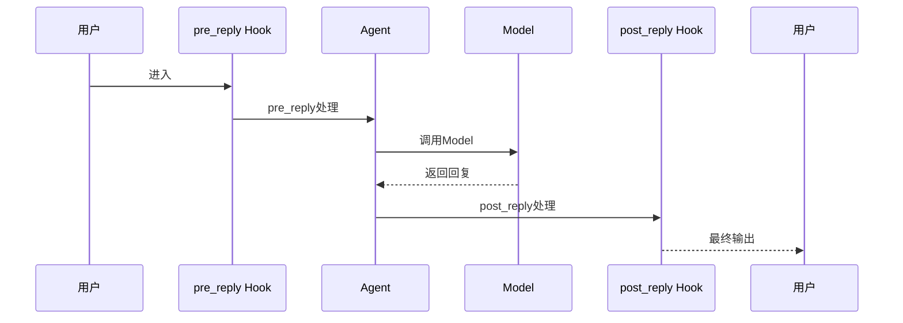

# 3-2 Hook是什么

> **目标**：理解Hook拦截器模式以及如何自定义Hook

---

## 🎯 这一章的目标

学完之后，你能：
- 理解Hook的6种类型
- 创建自定义Hook
- 使用Hook做日志、监控、拦截

---

## 🚀 先跑起来

```python showLineNumbers
from agentscope.hooks import Hook

# 创建自定义Hook
class MyHook(Hook):
    def pre_reply(self, agent, message):
        """回复前拦截 - 打印日志"""
        print(f"Agent {agent.name} 即将回复: {message.content[:50]}...")
        return message  # 返回原始消息，或者修改后的消息

    def post_reply(self, agent, response, message):
        """回复后拦截 - 记录度量"""
        print(f"Agent {agent.name} 已回复: {message.content[:50]}...")
        return response

# 创建Agent后，通过register_instance_hook注册Hook
agent = ReActAgent(
    name="MyAgent",
    model=model,
    sys_prompt="你是一个有帮助的助手",
    formatter=formatter,
)
agent.register_instance_hook("pre_reply", "my_pre_hook", MyHook().pre_reply)
agent.register_instance_hook("post_reply", "my_post_hook", MyHook().post_reply)
```

---

## 🔍 Hook的6种类型

```
┌─────────────────────────────────────────────────────────────┐
│                      Hook类型                              │
│                                                             │
│   pre_reply ──► Agent处理 ──► post_reply                   │
│        │                                        │           │
│        │                                        │           │
│        ▼                                        ▼           │
│   pre_observe ◄─────────────── observe ──────────────────►│
│                                                             │
│   pre_print ──► 打印 ──► post_print                        │
└─────────────────────────────────────────────────────────────┘
```

| Hook类型 | 触发时机 | 典型用途 |
|----------|----------|----------|
| `pre_reply` | 回复前 | 日志、修改消息 |
| `post_reply` | 回复后 | 监控、统计 |
| `pre_observe` | 观察Tool结果前 | 过滤结果 |
| `observe` | 观察Tool结果后 | 记录日志 |
| `pre_print` | 打印前 | 格式化输出 |
| `post_print` | 打印后 | 记录日志 |

---

## 🔍 追踪Hook的执行



---

## 🔬 关键代码段解析

### 代码段1：Hook的拦截原理

```python showLineNumbers
class MyHook(Hook):
    def pre_reply(self, agent, message):
        """回复前拦截"""
        print(f"Agent {agent.name} 即将回复: {message.content[:50]}...")
        return message  # 返回原始消息，或者修改后的消息

    def post_reply(self, agent, response, message):
        """回复后拦截"""
        print(f"Agent {agent.name} 已回复: {message.content[:50]}...")
        return response
```

**思路说明**：

| 问题 | 答案 |
|------|------|
| Hook为什么能拦截？ | Agent执行时会调用Hook的回调方法 |
| `return message`有什么用？ | 可以返回修改后的消息 |
| Hook和Decorator模式有什么关系？ | Hook本质上是AOP拦截器，类似Decorator但不改变原对象 |

```
┌─────────────────────────────────────────────────────────────┐
│                 Hook拦截原理                               │
│                                                             │
│   用户请求                                                  │
│       │                                                    │
│       ▼                                                    │
│   ┌─────────────────────────────────────────────────────┐  │
│   │  pre_reply Hook                                     │  │
│   │  - 可以修改消息                                     │  │
│   │  - 可以记录日志                                     │  │
│   │  - 返回修改后的消息                                 │  │
│   └─────────────────────────────────────────────────────┘  │
│       │                                                    │
│       ▼                                                    │
│   ┌─────────────────────────────────────────────────────┐  │
│   │  Agent 核心逻辑（不改变）                            │  │
│   └─────────────────────────────────────────────────────┘  │
│       │                                                    │
│       ▼                                                    │
│   ┌─────────────────────────────────────────────────────┐  │
│   │  post_reply Hook                                    │  │
│   │  - 可以记录响应                                     │  │
│   │  - 可以监控性能                                     │  │
│   │  - 可以修改返回（可选）                             │  │
│   └─────────────────────────────────────────────────────┘  │
│       │                                                    │
│       ▼                                                    │
│   返回给用户                                              │
└─────────────────────────────────────────────────────────────┘
```

**💡 设计思想**：Hook是**观察者模式**的应用。在不改变核心逻辑的情况下，插入额外的处理逻辑。

---

### 代码段2：Hook的使用方式

```python showLineNumbers
# 创建Agent后注册Hook
agent = ReActAgent(
    name="MyAgent",
    model=model,
    sys_prompt="你是一个有帮助的助手",
    formatter=formatter,
)

# 注册实例级Hook（仅对当前Agent实例生效）
agent.register_instance_hook("pre_reply", "my_pre_hook", MyHook().pre_reply)
agent.register_instance_hook("post_reply", "my_post_hook", MyHook().post_reply)

# 或者注册类级别Hook（对所有该类的Agent实例生效）
# ReActAgent.register_class_hook("pre_reply", "global_hook", global_pre_hook)
```

**思路说明**：

| 问题 | 答案 |
|------|------|
| 如何注册Hook？ | 使用`register_instance_hook()`方法 |
| 实例级和类级Hook区别？ | 实例级只对当前Agent，类级对所有该类Agent |
| 可以同时用多个Hook吗？ | 可以，按注册顺序执行 |

```
┌─────────────────────────────────────────────────────────────┐
│                 多个Hook的执行顺序                          │
│                                                             │
│   pre_reply_Hook1 ──► pre_reply_Hook2 ──► Agent ──►       │
│       │                                                    │
│       ▼                                                    │
│   post_reply_Hook1 ◄── post_reply_Hook2 ◄──             │
│                                                             │
│   按注册顺序执行（先进先出）                              │
└─────────────────────────────────────────────────────────────┘
```

**💡 设计思想**：多个Hook按注册顺序执行，每个Hook都可以在`pre`和`post`阶段进行处理。

---

### 代码段3：Hook的典型应用场景

```python showLineNumbers
# 场景1：日志记录
class LoggingHook(Hook):
    def pre_reply(self, agent, message):
        logger.info(f"{agent.name} 收到消息: {message.content[:100]}")
        return message

    def post_reply(self, agent, response, message):
        logger.info(f"{agent.name} 回复: {response.content[:100]}")
        return response

# 场景2：敏感词过滤
class ContentFilterHook(Hook):
    def pre_reply(self, agent, message):
        # 过滤敏感词
        message.content = filter_sensitive_words(message.content)
        return message

# 场景3：性能监控
class MetricsHook(Hook):
    def pre_reply(self, agent, message):
        self.start_time = time.time()
        return message

    def post_reply(self, agent, response, message):
        elapsed = time.time() - self.start_time
        metrics.record(f"{agent.name}.latency", elapsed)
        return response
```

**思路说明**：

| 场景 | Hook类型 | 用途 |
|------|----------|------|
| 日志记录 | pre_reply + post_reply | 记录所有交互 |
| 敏感词过滤 | pre_reply | 在发送前过滤内容 |
| 性能监控 | pre_reply + post_reply | 测量延迟 |
| 访问控制 | pre_reply | 拦截未授权请求 |

---

## 💡 Java开发者注意

Hook类似Java的**AOP拦截器**或**Servlet Filter**：

```java
// Java Servlet Filter
public class MyFilter implements Filter {
    @Override
    public void doFilter(ServletRequest req, ServletResponse res, FilterChain chain) {
        // pre_process
        preProcess(req);

        chain.doFilter(req, res);  // 执行实际逻辑

        // post_process
        postProcess(res);
    }
}

// Python Hook
class MyHook(Hook):
    def pre_reply(self, agent, message):
        pre_process(message)
        return message

    def post_reply(self, agent, response, message):
        post_process(response)
        return response
```

| Hook | Java AOP | 说明 |
|------|----------|------|
| pre_reply | @Before | 方法执行前拦截 |
| post_reply | @AfterReturning | 方法执行后拦截 |
| observe | @After | 无论成功失败都执行 |
| pre_print | 拦截打印 | 控制输出格式 |

---

## 🎯 思考题

<details>
<summary>点击查看答案</summary>

1. **Hook和Tool有什么区别？**
   - Hook：拦截处理流程，做日志、监控
   - Tool：被Agent调用，完成具体任务
   - Hook不改变Agent的决策，只是"观察"

2. **Hook能修改Agent的回复吗？**
   - pre_reply可以返回修改后的消息
   - post_reply可以记录但不能修改已发送的

3. **什么场景下用Hook？**
   - 日志记录
   - 性能监控
   - 敏感词过滤
   - 输出格式化

</details>

---

★ **Insight** ─────────────────────────────────────
- **Hook是拦截器**：在不改变核心逻辑的情况下，增加处理
- **6种类型**覆盖了Agent处理的各个阶段
- 类似Java的AOP拦截器或Servlet Filter
─────────────────────────────────────────────────
