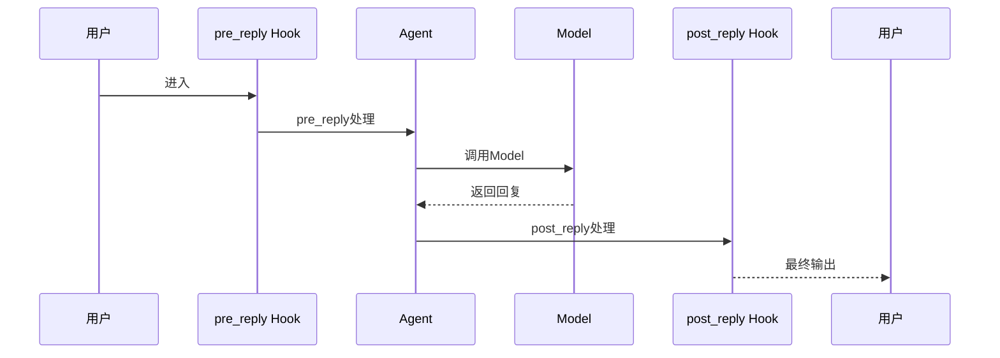

# 3-2 Hook是什么

> **目标**：理解Hook拦截器模式以及如何自定义Hook

---

## 🎯 这一章的目标

学完之后，你能：
- 理解Hook的6种类型
- 创建自定义Hook
- 使用Hook做日志、监控、拦截

---

## 🚀 先跑起来

```python showLineNumbers
from agentscope.hooks import Hook

# 创建自定义Hook
class MyHook(Hook):
    def pre_reply(self, agent, message):
        """回复前拦截 - 打印日志"""
        print(f"Agent {agent.name} 即将回复: {message.content[:50]}...")
        return message  # 返回原始消息，或者修改后的消息
    
    def post_reply(self, agent, response, message):
        """回复后拦截 - 记录度量"""
        print(f"Agent {agent.name} 已回复: {message.content[:50]}...")
        return response

# 使用Hook
agent = ReActAgent(
    name="MyAgent",
    model=model,
    hooks=[MyHook()]  # 注入Hook
)
```

---

## 🔍 Hook的6种类型

```
┌─────────────────────────────────────────────────────────────┐
│                      Hook类型                              │
│                                                             │
│   pre_reply ──► Agent处理 ──► post_reply                   │
│        │                                        │           │
│        │                                        │           │
│        ▼                                        ▼           │
│   pre_observe ◄─────────────── observe ──────────────────►│
│                                                             │
│   pre_print ──► 打印 ──► post_print                        │
└─────────────────────────────────────────────────────────────┘
```

| Hook类型 | 触发时机 | 典型用途 |
|----------|----------|----------|
| `pre_reply` | 回复前 | 日志、修改消息 |
| `post_reply` | 回复后 | 监控、统计 |
| `pre_observe` | 观察Tool结果前 | 过滤结果 |
| `observe` | 观察Tool结果后 | 记录日志 |
| `pre_print` | 打印前 | 格式化输出 |
| `post_print` | 打印后 | 记录日志 |

---

## 🔍 追踪Hook的执行



---

## 💡 Java开发者注意

Hook类似Java的**AOP拦截器**或**Servlet Filter**：

```java
// Java Servlet Filter
public class MyFilter implements Filter {
    @Override
    public void doFilter(ServletRequest req, ServletResponse res, FilterChain chain) {
        // pre_process
        preProcess(req);
        
        chain.doFilter(req, res);  // 执行实际逻辑
        
        // post_process
        postProcess(res);
    }
}

// Python Hook
class MyHook(Hook):
    def pre_reply(self, agent, message):
        pre_process(message)
        return message
    
    def post_reply(self, agent, response, message):
        post_process(response)
        return response
```

| Hook | Java AOP | 说明 |
|------|----------|------|
| pre_reply | @Before | 方法执行前拦截 |
| post_reply | @AfterReturning | 方法执行后拦截 |
| observe | @After | 无论成功失败都执行 |
| pre_print | 拦截打印 | 控制输出格式 |

---

## 🎯 思考题

<details>
<summary>点击查看答案</summary>

1. **Hook和Tool有什么区别？**
   - Hook：拦截处理流程，做日志、监控
   - Tool：被Agent调用，完成具体任务
   - Hook不改变Agent的决策，只是"观察"

2. **Hook能修改Agent的回复吗？**
   - pre_reply可以返回修改后的消息
   - post_reply可以记录但不能修改已发送的

3. **什么场景下用Hook？**
   - 日志记录
   - 性能监控
   - 敏感词过滤
   - 输出格式化

</details>

---

★ **Insight** ─────────────────────────────────────
- **Hook是拦截器**：在不改变核心逻辑的情况下，增加处理
- **6种类型**覆盖了Agent处理的各个阶段
- 类似Java的AOP拦截器或Servlet Filter
─────────────────────────────────────────────────
