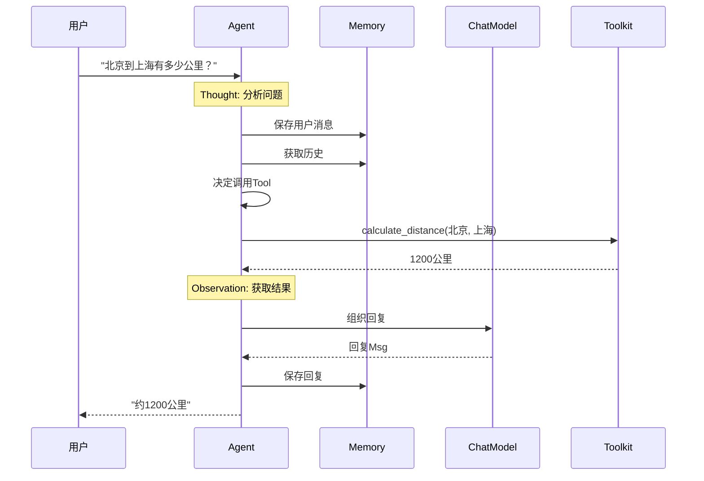

# 3-3 追踪Agent的思考过程

> **目标**：通过一个具体例子，理解Agent是如何一步一步思考的

---

## 🎯 这一章的目标

学完之后，你能：
- 理解Agent思考的内部过程
- 画出完整的问题解决流程图
- 调试Agent的思考逻辑

---

## 🚀 具体例子：计算"北京到上海的距离"

**用户问**："北京到上海有多少公里？"

---

## 🔍 Agent的完整思考过程

### 第一步：接收消息

```
┌─────────────────────────────────────────────────────────────┐
│  收到用户消息                                              │
│                                                             │
│  Msg(name="user",                                           │
│      content="北京到上海有多少公里？",                     │
│      role="user")                                           │
└─────────────────────────────────────────────────────────────┘
                              │
                              ▼
```

### 第二步：思考（Thought）

```
┌─────────────────────────────────────────────────────────────┐
│  Thought: 我应该怎么回答？                                  │
│                                                             │
│  分析：用户问的是地理距离                                    │
│                                                             │
│  选项1：直接回答（约1200公里）                              │
│  选项2：调用计算器精确计算                                   │
│  选项3：调用搜索API获取精确数据                              │
│                                                             │
│  决定：我知道大概距离，不需要精确计算，                       │
│       可以直接回答，或者调用搜索验证                         │
└─────────────────────────────────────────────────────────────┘
                              │
                              ▼
```

### 第三步：行动（Action）

```
┌─────────────────────────────────────────────────────────────┐
│  Action: 调用 Tool - calculate_distance                      │
│                                                             │
│  输入: {"from": "北京", "to": "上海"}                      │
│                                                             │
│  等待结果...                                                │
└─────────────────────────────────────────────────────────────┘
                              │
                              ▼
```

### 第四步：观察（Observation）

```
┌─────────────────────────────────────────────────────────────┐
│  Observation: 计算结果                                      │
│                                                             │
│  工具返回: 1200 公里（直线距离约1088公里）                   │
│                                                             │
│  这个信息足够回答用户了                                      │
└─────────────────────────────────────────────────────────────┘
                              │
                              ▼
```

### 第五步：再次思考

```
┌─────────────────────────────────────────────────────────────┐
│  Thought: 信息足够回答用户了吗？                            │
│                                                             │
│  信息：1200公里                                             │
│  问题：北京到上海的距离                                      │
│  答案：约1200公里                                          │
│                                                             │
│  判断：足够了，不需要更多计算                                 │
│                                                             │
│  准备回复用户                                               │
└─────────────────────────────────────────────────────────────┘
                              │
                              ▼
```

### 第六步：回复

```
┌─────────────────────────────────────────────────────────────┐
│  回复用户                                                  │
│                                                             │
│  "北京到上海的距离约为1200公里（高速公路里程）。              │
│   直线距离约为1088公里。"                                  │
└─────────────────────────────────────────────────────────────┘
```

---

## 📊 完整时序图



---

## 🔍 复杂案例：多轮Tool调用

**用户问**："帮我查一下北京今天的天气，然后告诉我应该穿什么衣服"

```
┌─────────────────────────────────────────────────────────────┐
│  第一轮循环                                                │
│                                                             │
│  Thought: 用户问了两个问题：天气+穿衣建议                   │
│  Action: 先查天气                                          │
│  Observation: 天气API返回"晴，25度"                       │
│                                                             │
│  判断：信息不足，需要先穿衣建议再回答                        │
└─────────────────────────────────────────────────────────────┘
                              │
                              ▼
┌─────────────────────────────────────────────────────────────┐
│  第二轮循环                                                │
│                                                             │
│  Thought: 我需要穿衣建议Tool                                │
│  Action: 调用 clothing_advice(25度, 晴)                   │
│  Observation: 穿衣建议API返回"建议穿薄外套+T恤"            │
│                                                             │
│  判断：信息足够了                                           │
└─────────────────────────────────────────────────────────────┘
                              │
                              ▼
┌─────────────────────────────────────────────────────────────┐
│  回复                                                      │
│                                                             │
│  "今天北京天气晴朗，温度25度。建议穿薄外套配T恤，          │
│   早晚温差较大，可以带件备用外套。"                         │
└─────────────────────────────────────────────────────────────┘
```

---

## 🔬 关键代码段解析

### 代码段1：Agent的思考循环是如何实现的？

```python showLineNumbers
# ReActAgent的思考循环（伪代码）
async def think(self, prompt):
    # 1. 思考：让Model分析问题
    thought = await self.model.think(prompt)

    # 2. 决定行动：根据思考结果决定调用哪个Tool
    if "calculate_distance" in thought:
        action = "calculate_distance"
        args = {"from": "北京", "to": "上海"}
    else:
        action = "direct_answer"

    # 3. 执行行动
    if action == "calculate_distance":
        result = await self.toolkit.find("calculate_distance").execute(**args)
        # 4. 观察：将结果加入上下文
        observation = f"距离是{result}"
        return await self.think(observation)  # 继续循环
    else:
        # 5. 回复用户
        return Msg(name="assistant", content=thought)
```

**思路说明**：

| 步骤 | 代码 | 说明 |
|------|------|------|
| 思考 | `self.model.think(prompt)` | 让Model分析问题 |
| 决定 | `if "calculate_distance" in thought` | 解析Model输出 |
| 执行 | `self.toolkit.find().execute()` | 调用Tool |
| 观察 | `return await self.think(observation)` | 递归继续 |

```
┌─────────────────────────────────────────────────────────────┐
│              ReAct思考循环的实现                           │
│                                                             │
│   think(prompt)                                            │
│        │                                                   │
│        ▼                                                   │
│   ┌─────────────────────────────────────────────────────┐  │
│   │ 1. model.think() → 分析问题                        │  │
│   └─────────────────────────────────────────────────────┘  │
│        │                                                   │
│        ▼                                                   │
│   ┌─────────────────────────────────────────────────────┐  │
│   │ 2. 解析输出 → 决定调用哪个Tool或直接回答          │  │
│   └─────────────────────────────────────────────────────┘  │
│        │                                                   │
│        ├──► 调用Tool ─► execute() ─► 观察结果 ──►递归│  │
│        │                                                   │
│        └──► 直接回答 ─► 返回Msg                        │
│                                                             │
│   循环直到有足够信息回答用户                           │
└─────────────────────────────────────────────────────────────┘
```

**💡 设计思想**：ReAct循环的本质是**递归**或**循环**——每次调用Tool后，如果信息不够，就继续思考直到可以回答。

---

### 代码段2：多轮Tool调用是如何工作的？

```python showLineNumbers
# 多轮Tool调用的典型场景
async def multi_turn_demo():
    # 第一轮
    user_input = "帮我查北京天气，然后告诉我穿什么"
    result1 = await agent(user_input)
    # Agent决定先查天气，返回一个需要继续的状态

    # 第二轮 - Agent自动继续
    # 内部：observation = 天气结果
    # 内部：再次调用 model.think(observation)
    # 内部：决定调用穿衣建议Tool
    result2 = await agent("继续")
    # Agent内部记住了之前的天气信息
```

**思路说明**：

| 问题 | 答案 |
|------|------|
| 多轮是怎么记忆的？ | 通过Memory保存之前的消息 |
| 为什么能连续调用？ | 每次Tool返回后，Observation作为新输入 |
| 什么时候停止？ | Model判断信息足够时，直接回复 |

```
┌─────────────────────────────────────────────────────────────┐
│              多轮Tool调用流程                              │
│                                                             │
│   用户: "查天气+穿衣建议"                                 │
│        │                                                   │
│        ▼                                                   │
│   ┌─────────────────────────────────────────────────────┐  │
│   │ 第一轮:                                              │  │
│   │   Thought: "需要先查天气"                           │  │
│   │   Action: search_weather("北京")                    │  │
│   │   Observation: "晴，25度"                          │  │
│   └─────────────────────────────────────────────────────┘  │
│        │                                                   │
│        ▼                                                   │
│   ┌─────────────────────────────────────────────────────┐  │
│   │ 第二轮 (自动):                                       │  │
│   │   Thought: "现在可以给穿衣建议了"                   │  │
│   │   Action: clothing_advice("25度", "晴")             │  │
│   │   Observation: "建议薄外套+T恤"                      │  │
│   └─────────────────────────────────────────────────────┘  │
│        │                                                   │
│        ▼                                                   │
│   回复: "今天北京晴，25度，建议穿薄外套配T恤"          │
└─────────────────────────────────────────────────────────────┘
```

**💡 设计思想**：多轮Tool调用的关键是**Memory**——每次Tool返回的Observation都存入Memory，下一轮思考时自动获取上下文。

---

### 代码段3：如何调试Agent的思考过程？

```python showLineNumbers
# 开启调试模式
agent = ReActAgent(
    name="DebugAgent",
    model=model,
    verbose=True  # 打印思考过程
)

# 或者手动打印
async def debug_agent():
    thought = await model.think("北京到上海多远")
    print(f"Model思考: {thought}")

    # 打印Tool调用
    tool = toolkit.find("calculate_distance")
    result = await tool.execute(from_="北京", to="上海")
    print(f"Tool返回: {result}")

    # 打印最终回复
    response = await agent("北京到上海多远")
    print(f"最终回复: {response.content}")
```

**思路说明**：

| 调试方法 | 作用 |
|----------|------|
| `verbose=True` | 自动打印所有思考步骤 |
| `print(thought)` | 查看Model在想什么 |
| `print(result)` | 检查Tool返回值 |
| `memory.get()` | 查看完整对话历史 |

```
┌─────────────────────────────────────────────────────────────┐
│              调试Agent思考的方法                           │
│                                                             │
│   1. verbose模式                                            │
│      agent = ReActAgent(..., verbose=True)                │
│      输出:                                                   │
│      [Thought] 分析问题...                                 │
│      [Action] 调用 calculate_distance                       │
│      [Observation] 1200公里                                │
│                                                             │
│   2. 手动打印                                              │
│      thought = await model.think(prompt)                  │
│      print(thought)  // 查看Model在想什么                   │
│                                                             │
│   3. 检查Memory                                            │
│      history = memory.get()                                │
│      for msg in history:                                   │
│          print(f"{msg.name}: {msg.content[:50]}...")      │
└─────────────────────────────────────────────────────────────┘
```

**💡 设计思想**：调试Agent需要跟踪**消息流**——从用户输入到Model思考到Tool调用到最终回复，每一步都可以检查。

---

## 💡 Java开发者注意

Agent的思考过程类似Java的**命令模式+责任链**：

```java
public Response handle(Request request) {
    // 1. 保存上下文
    context.save(request);
    
    // 2. 分析
    Analysis analysis = analyzer.analyze(request);
    
    // 3. 决定行动
    while (!analysis.isComplete()) {
        Action action = planner.decide(analysis);
        Result result = executor.execute(action);
        analysis.update(result);
    }
    
    // 4. 返回结果
    return responder.respond(analysis);
}
```

---

## 🎯 思考题

<details>
<summary>点击查看答案</summary>

1. **Agent是怎么决定调用哪个Tool的？**
   - 根据用户问题分析
   - 从可用的Tool列表中选择
   - 通过模型推理决定

2. **如果Tool返回的结果不够怎么办？**
   - Agent会继续循环
   - 调用更多Tool获取信息
   - 直到信息足够回答

3. **如何调试Agent的思考过程？**
   - 开启verbose模式查看思考日志
   - 打印每个Tool的调用和返回
   - 查看Memory中的历史消息

</details>

---

★ **Insight** ─────────────────────────────────────
- Agent通过**Thought-Action-Observation循环**解决问题
- **Tool是Agent的手**，让它能获取外部信息
- Agent会**一直循环直到有足够信息**回答问题
─────────────────────────────────────────────────
