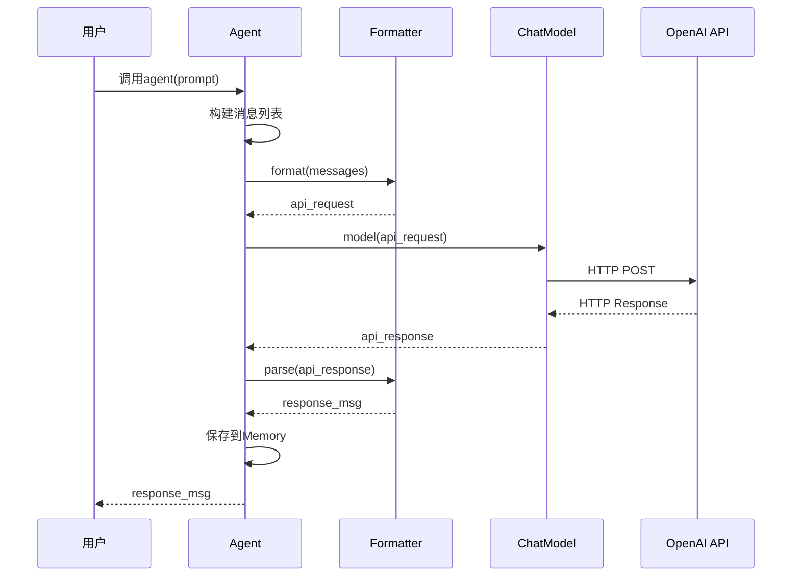

# 4-3 追踪一次模型调用

> **目标**：理解从Agent到Model到API的完整调用链路

---

## 🎯 这一章的目标

学完之后，你能：
- 画出模型调用的完整流程
- 理解每一步的转换关系
- 调试模型调用问题

---

## 🚀 模型调用完整流程

### 第一步：Agent准备消息

```
┌─────────────────────────────────────────────────────────────┐
│  Agent内部                                                 │
│                                                             │
│  1. 收集历史Msg                                            │
│  2. 添加sys_prompt作为system消息                           │
│  3. 构建消息列表                                            │
│                                                             │
│  messages = [                                              │
│      Msg(name="system", role="system", content="你是助手"), │
│      Msg(name="user", role="user", content="你好"),         │
│  ]                                                         │
└─────────────────────────────────────────────────────────────┘
                              │
                              ▼
```

### 第二步：Formatter转换

```
┌─────────────────────────────────────────────────────────────┐
│  OpenAIFormatter.format(messages)                         │
│                                                             │
│  输入: [Msg(name="system", ...), Msg(name="user", ...)]   │
│                                                             │
│  输出:                                                      │
│  {                                                         │
│      "model": "gpt-4",                                    │
│      "messages": [                                          │
│          {"role": "system", "content": "你是助手"},         │
│          {"role": "user", "content": "你好"}                 │
│      ]                                                      │
│  }                                                         │
└─────────────────────────────────────────────────────────────┘
                              │
                              ▼
```

### 第三步：ChatModel调用API

```
┌─────────────────────────────────────────────────────────────┐
│  OpenAIChatModel.__call__(formatted_request)              │
│                                                             │
│  1. HTTP POST 请求                                         │
│  2. 发送到 OpenAI API                                      │
│  3. 等待响应                                              │
│                                                             │
│  请求: POST https://api.openai.com/v1/chat/completions    │
│       Headers: Authorization: Bearer sk-xxx                  │
│       Body: {...formatted_request...}                        │
└─────────────────────────────────────────────────────────────┘
                              │
                              ▼
```

### 第四步：API返回响应

```
┌─────────────────────────────────────────────────────────────┐
│  OpenAI API响应                                            │
│                                                             │
│  {                                                         │
│      "id": "chatcmpl-xxx",                                │
│      "choices": [{                                         │
│          "message": {                                        │
│              "role": "assistant",                           │
│              "content": "你好！有什么可以帮助你的吗？"     │
│          }                                                  │
│      }]                                                     │
│  }                                                         │
└─────────────────────────────────────────────────────────────┘
                              │
                              ▼
```

### 第五步：Formatter解析响应

```
┌─────────────────────────────────────────────────────────────┐
│  OpenAIFormatter.parse(response)                           │
│                                                             │
│  输入: {..., "message": {...}}                           │
│                                                             │
│  输出: Msg(                                                 │
│      name="assistant",                                     │
│      content="你好！有什么可以帮助你的吗？",                 │
│      role="assistant"                                       │
│  )                                                         │
└─────────────────────────────────────────────────────────────┘
                              │
                              ▼
```

### 第六步：Agent返回Msg

```
┌─────────────────────────────────────────────────────────────┐
│  Agent得到Msg，返回给调用方                                  │
│                                                             │
│  response = Msg(                                            │
│      name="assistant",                                      │
│      content="你好！有什么可以帮助你的吗？",                 │
│      role="assistant"                                        │
│  )                                                         │
└─────────────────────────────────────────────────────────────┘
```

---

## 📊 完整时序图



---

## 💡 Java开发者注意

模型调用链路类似Java的**HTTP客户端调用**：

```java
// Java HTTP调用链
RestTemplate template = new RestTemplate();

// 1. 准备请求（类似Agent构建消息）
HttpEntity<Request> request = new HttpEntity<>(requestBody, headers);

// 2. 发送请求（类似ChatModel调用）
ResponseEntity<Response> response = template.postForEntity(
    url, request, Response.class
);

// 3. 处理响应（类似Formatter解析）
Result result = response.getBody();
```

| AgentScope | Java | 说明 |
|------------|------|------|
| Agent构建消息 | 构建请求体 | 准备数据 |
| Formatter.format() | ObjectMapper | 序列化 |
| ChatModel.call() | RestTemplate | HTTP调用 |
| Formatter.parse() | ObjectMapper | 反序列化 |
| Agent返回Msg | Controller返回 | 输出结果 |

---

## 🎯 思考题

<details>
<summary>点击查看答案</summary>

1. **如果API返回错误，流程会在哪里处理？**
   - ChatModel会捕获异常
   - 可能重试或返回错误Msg

2. **Formatter.parse()失败会怎样？**
   - 可能抛出解析异常
   - Agent会捕获并返回错误信息

3. **如何调试模型调用问题？**
   - 打印Formatter.format()的输入输出
   - 检查HTTP请求和响应
   - 查看API返回的错误信息

</details>

---

★ **Insight** ─────────────────────────────────────
- **Agent → Formatter → ChatModel → API** 是单向调用链
- **format()在调用前，parse()在调用后**
- 理解这个流程有助于调试问题
─────────────────────────────────────────────────
