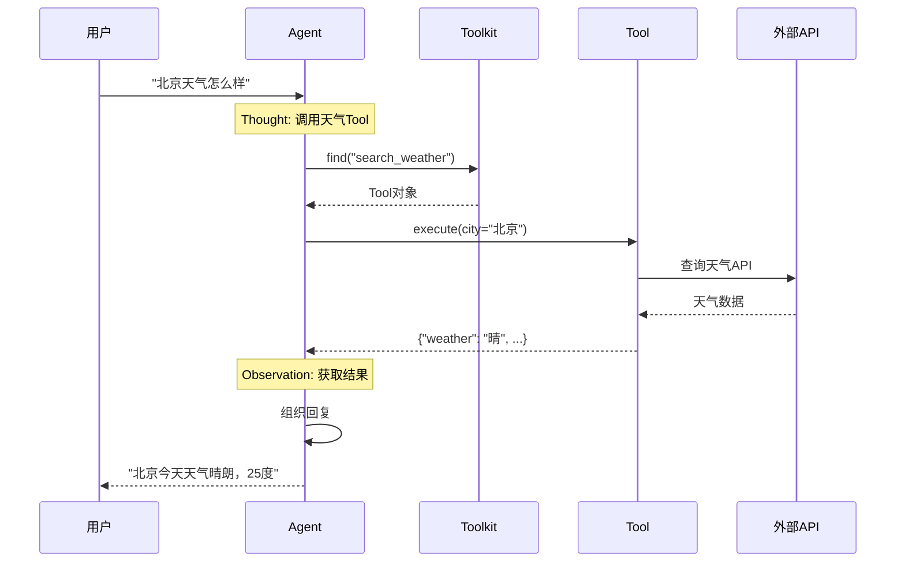

# 5-3 追踪一次Tool调用

> **目标**：理解Tool从注册到调用的完整流程

---

## 🎯 这一章的目标

学完之后，你能：
- 画出Tool调用的完整流程
- 理解Toolkit如何找到和执行Tool
- 调试Tool调用问题

---

## 🔍 Tool调用的完整流程

### 第一步：Tool注册

```
┌─────────────────────────────────────────────────────────────┐
│  创建Agent时注册Tool                                        │
│                                                             │
│  toolkit = Toolkit()                                        │
│  toolkit.register_tool_function(calculate, group_name="basic")
│  toolkit.register_tool_function(search_weather, group_name="weather")
│  toolkit.register_tool_function(send_email, group_name="email")
│                                                             │
│  agent = ReActAgent(                                        │
│      name="Assistant",                                      │
│      model=model,                                           │
│      toolkit=toolkit                                        │
│  )                                                          │
└─────────────────────────────────────────────────────────────┘
```

### 第二步：Agent决定调用Tool

```
┌─────────────────────────────────────────────────────────────┐
│  Agent思考: "用户问天气，我应该调用search_weather"          │
│                                                             │
│  ToolCall = {                                               │
│      name: "search_weather",                                │
│      arguments: {"city": "北京"}                            │
│  }                                                          │
└─────────────────────────────────────────────────────────────┘
```

### 第三步：Toolkit查找Tool

```
┌─────────────────────────────────────────────────────────────┐
│  Toolkit根据name找到对应的Tool                               │
│                                                             │
│  toolkit.find("search_weather")                             │
│       │                                                     │
│       ▼                                                     │
│  Tool(                                                      │
│      name: "search_weather",                                │
│      description: "查询城市天气",                           │
│      func: <function>                                        │
│  )                                                          │
└─────────────────────────────────────────────────────────────┘
```

### 第四步：Tool执行

```
┌─────────────────────────────────────────────────────────────┐
│  Tool执行函数                                                │
│                                                             │
│  result = search_weather(city="北京")                       │
│       │                                                     │
│       ▼                                                     │
│  {"city": "北京", "weather": "晴", "temperature": 25}     │
└─────────────────────────────────────────────────────────────┘
```

### 第五步：返回结果给Agent

```
┌─────────────────────────────────────────────────────────────┐
│  Tool执行结果作为Observation返回                             │
│                                                             │
│  Observation: {"city": "北京", "weather": "晴", "temp": 25}│
│                                                             │
│  Agent继续思考: "我得到天气信息了，可以回复用户了"           │
└─────────────────────────────────────────────────────────────┘
```

---

## 📊 完整时序图



---

## 💡 Java开发者注意

Tool调用类似Java的**反射+动态代理**：

```java
// Java 动态代理
public Object invoke(Object proxy, Method method, Object[] args) {
    if (method.getName().equals("calculate")) {
        return calculate((String) args[0]);
    }
}

// AgentScope Tool调用
toolkit.find("calculate")  // 查找
tool.execute(**kwargs)       // 执行
```

---

## 🎯 思考题

<details>
<summary>点击查看答案</summary>

1. **Toolkit.find()找不到会怎样？**
   - 抛出异常
   - Agent会收到错误
   - 可能尝试其他Tool

2. **Tool执行失败怎么办？**
   - 抛出异常
   - Agent捕获异常
   - 可能在思考中决定重试或告知用户

3. **如何调试Tool调用？**
   - 打印Agent的思考过程
   - 检查Toolkit.find()是否找到
   - 检查Tool执行的参数和返回值

</details>

---

★ **Insight** ─────────────────────────────────────
- **注册→查找→执行→返回** 是Tool调用的标准流程
- **Toolkit.find()** 根据name找到Tool
- 理解这个流程有助于调试Tool相关问题
─────────────────────────────────────────────────
