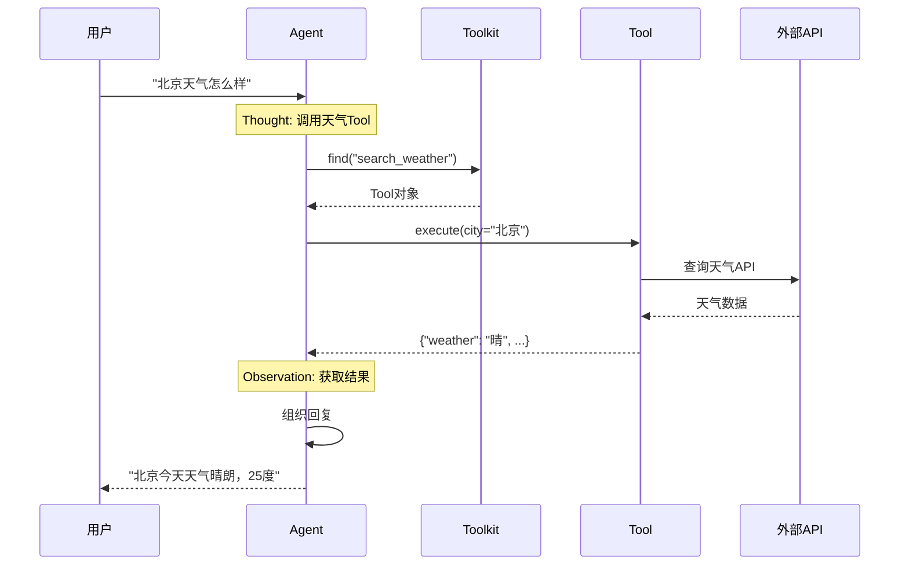

# 5-3 追踪一次Tool调用

> **目标**：理解Tool从注册到调用的完整流程

---

## 🎯 这一章的目标

学完之后，你能：
- 画出Tool调用的完整流程
- 理解Toolkit如何找到和执行Tool
- 调试Tool调用问题

---

## 🔍 Tool调用的完整流程

### 第一步：Tool注册

```
┌─────────────────────────────────────────────────────────────┐
│  创建Agent时注册Tool                                        │
│                                                             │
│  toolkit = Toolkit()                                        │
│  toolkit.register_tool_function(calculate, group_name="basic")
│  toolkit.register_tool_function(search_weather, group_name="weather")
│  toolkit.register_tool_function(send_email, group_name="email")
│                                                             │
│  agent = ReActAgent(                                        │
│      name="Assistant",                                      │
│      model=model,                                           │
│      toolkit=toolkit                                        │
│  )                                                          │
└─────────────────────────────────────────────────────────────┘
```

### 第二步：Agent决定调用Tool

```
┌─────────────────────────────────────────────────────────────┐
│  Agent思考: "用户问天气，我应该调用search_weather"          │
│                                                             │
│  ToolCall = {                                               │
│      name: "search_weather",                                │
│      arguments: {"city": "北京"}                            │
│  }                                                          │
└─────────────────────────────────────────────────────────────┘
```

### 第三步：Toolkit查找Tool

```
┌─────────────────────────────────────────────────────────────┐
│  Toolkit根据name找到对应的Tool                               │
│                                                             │
│  toolkit.find("search_weather")                             │
│       │                                                     │
│       ▼                                                     │
│  Tool(                                                      │
│      name: "search_weather",                                │
│      description: "查询城市天气",                           │
│      func: <function>                                        │
│  )                                                          │
└─────────────────────────────────────────────────────────────┘
```

### 第四步：Tool执行

```
┌─────────────────────────────────────────────────────────────┐
│  Tool执行函数                                                │
│                                                             │
│  result = search_weather(city="北京")                       │
│       │                                                     │
│       ▼                                                     │
│  {"city": "北京", "weather": "晴", "temperature": 25}     │
└─────────────────────────────────────────────────────────────┘
```

### 第五步：返回结果给Agent

```
┌─────────────────────────────────────────────────────────────┐
│  Tool执行结果作为Observation返回                             │
│                                                             │
│  Observation: {"city": "北京", "weather": "晴", "temp": 25}│
│                                                             │
│  Agent继续思考: "我得到天气信息了，可以回复用户了"           │
└─────────────────────────────────────────────────────────────┘
```

---

## 📊 完整时序图



---

## 🔬 关键代码段解析

### 代码段1：Tool注册的本质是什么？

```python showLineNumbers
toolkit = Toolkit()
toolkit.register_tool_function(search_weather, group_name="weather")
```

**思路说明**：

| 问题 | 答案 |
|------|------|
| 注册做了什么？ | 把函数名和函数本身存入字典 |
| 存在哪？ | `toolkit.tools` 字典 |
| 为什么要分组？ | 可以按组名选择暴露哪些工具 |

```
┌─────────────────────────────────────────────────────────────┐
│              Tool 注册的本质                              │
│                                                             │
│   toolkit.tools = {                                     │
│       "search_weather": <function>,                     │
│       "calculate": <function>,                          │
│       "send_email": <function>                          │
│   }                                                    │
│                                                             │
│   toolkit.groups = {                                    │
│       "weather": ["search_weather"],                   │
│       "basic": ["calculate"],                          │
│       "email": ["send_email"]                         │
│   }                                                    │
└─────────────────────────────────────────────────────────────┘
```

**💡 设计思想**：Tool注册就是**字典存储**。注册时用函数名做key，函数本身做value，便于后续查找。

---

### 代码段2：Agent如何决定调用哪个Tool？

```python showLineNumbers
# Agent内部逻辑（伪代码）
async def think():
    # 让Model思考下一步做什么
    thought = await self.model(think_prompt)

    # 解析Model的输出
    if "search_weather" in thought:
        # 决定调用天气工具
        tool_name = "search_weather"
        args = parse_arguments(thought)

        # 查找工具
        tool = self.toolkit.find(tool_name)

        # 执行工具
        result = await tool.execute(**args)

        # 把结果作为Observation继续循环
        return Observation(result)
```

**思路说明**：

```
┌─────────────────────────────────────────────────────────────┐
│              Agent决定调用Tool的流程                      │
│                                                             │
│   Model思考输出：                                          │
│   ┌─────────────────────────────────────────────────────┐  │
│   │ "我需要调用search_weather工具，参数是city='北京'" │  │
│   └─────────────────────────────────────────────────────┘  │
│                          │                                 │
│                          ▼                                 │
│   解析出工具名：search_weather                          │
│                          │                                 │
│                          ▼                                 │
│   解析出参数：{"city": "北京"}                         │
│                          │                                 │
│                          ▼                                 │
│   toolkit.find("search_weather")  ──► 找到工具函数       │
│                          │                                 │
│                          ▼                                 │
│   执行工具函数  ──► 返回结果                           │
└─────────────────────────────────────────────────────────────┘
```

**💡 设计思想**：Agent依赖Model的**推理能力**决定调用哪个Tool。Model根据上下文自动决定，这是ReAct的核心。

---

### 代码段3：Tool执行失败会怎样？

```python showLineNumbers
# 工具执行可能失败的场景
def search_weather(city: str) -> ToolResponse:
    try:
        result = weather_api(city)
        return ToolResponse(result=result)
    except NetworkError as e:
        return ToolResponse(error=f"网络错误: {e}")
    except NotFoundError as e:
        return ToolResponse(error=f"城市不存在: {e}")
```

**思路说明**：

| 阶段 | 失败情况 | Agent如何处理 |
|------|----------|---------------|
| 查找Tool | 工具不存在 | 抛出异常，可能尝试其他 |
| 执行Tool | 网络超时 | 返回错误，Agent可能重试 |
| 执行Tool | 业务错误 | 返回错误，Agent告知用户 |

```
┌─────────────────────────────────────────────────────────────┐
│              Tool执行失败的处理                          │
│                                                             │
│   Tool执行失败                                            │
│        │                                                  │
│        ▼                                                  │
│   返回 ToolResponse(error="错误信息")                  │
│        │                                                  │
│        ▼                                                  │
│   Agent收到错误结果                                       │
│        │                                                  │
│        ▼                                                  │
│   ┌─────────────────────────────────────────────────────┐  │
│   │ Agent重新思考：                                    │  │
│   │ "工具出错了，我可以：                             │  │
│   │  1. 重试一次                                     │  │
│   │  2. 换一个工具                                   │  │
│   │  3. 告诉用户无法完成"                             │  │
│   └─────────────────────────────────────────────────────┘  │
└─────────────────────────────────────────────────────────────┘
```

**💡 设计思想**：Tool执行失败不是灾难。Agent收到错误后可以**重新决策**，决定是重试、换方案还是放弃。

---

## 💡 Java开发者注意

Tool调用类似Java的**反射+动态代理**：

```java
// Java 动态代理
public Object invoke(Object proxy, Method method, Object[] args) {
    if (method.getName().equals("calculate")) {
        return calculate((String) args[0]);
    }
}

// AgentScope Tool调用
toolkit.find("calculate")  // 查找
tool.execute(**kwargs)       // 执行
```

---

## 🎯 思考题

<details>
<summary>点击查看答案</summary>

1. **Toolkit.find()找不到会怎样？**
   - 抛出异常
   - Agent会收到错误
   - 可能尝试其他Tool

2. **Tool执行失败怎么办？**
   - 抛出异常
   - Agent捕获异常
   - 可能在思考中决定重试或告知用户

3. **如何调试Tool调用？**
   - 打印Agent的思考过程
   - 检查Toolkit.find()是否找到
   - 检查Tool执行的参数和返回值

</details>

---

★ **Insight** ─────────────────────────────────────
- **注册→查找→执行→返回** 是Tool调用的标准流程
- **Toolkit.find()** 根据name找到Tool
- 理解这个流程有助于调试Tool相关问题
─────────────────────────────────────────────────
