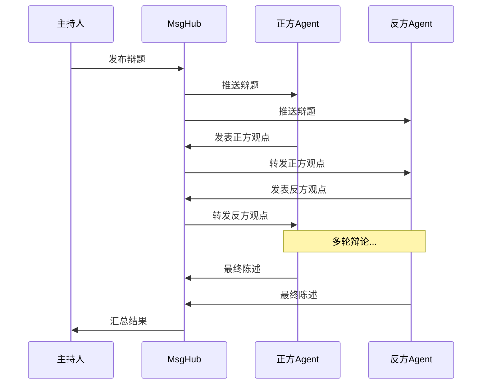

# 6-3 追踪多Agent协作

> **目标**：通过辩论系统理解多Agent的协作模式

---

## 🎯 这一章的目标

学完之后，你能：
- 设计多Agent辩论系统
- 理解Agent之间的消息流转
- 实现复杂的多Agent协作

---

## 🚀 多Agent辩论系统示例

```python showLineNumbers
import agentscope
from agentscope.pipeline import MsgHub, FanoutPipeline
from agentscope import Agent

# 创建主持人
host = Agent(name="Host", ...)

# 创建正方和反方
pro_agent = Agent(name="ProSide", sys_prompt="你是正方辩手")
con_agent = Agent(name="ConSide", sys_prompt="你是反方辩手")

# 创建消息中枢
hub = MsgHub()

# 订阅
hub.subscribe(pro_agent)
hub.subscribe(con_agent)

# 主持人发布问题
async def debate(question: str):
    await hub.publish(Msg(name="host", content=question, role="system"))
    
    # 收集辩论结果
    pro_result = await pro_agent()
    con_result = await con_agent()
    
    return {"pro": pro_result, "con": con_result}
```

---

## 🔍 辩论流程



---

## 📊 多Agent协作模式总结

| 模式 | 说明 | 适用场景 |
|------|------|----------|
| SequentialPipeline | 顺序处理 | 流水线任务 |
| FanoutPipeline | 并行处理 | 多角度分析 |
| MsgHub | 发布订阅 | 事件通知、松耦合 |

---

## 🎯 思考题

<details>
<summary>点击查看答案</summary>

1. **辩论系统用的是什么模式？**
   - MsgHub发布订阅
   - Agent订阅后自动收到消息

2. **如何实现多轮辩论？**
   - Agent回复后再次发布
   - 循环直到达成结论

</details>

---

★ **Insight** ─────────────────────────────────────
- 多Agent协作有**Pipeline**和**MsgHub**两种模式
- Pipeline适合**有流程**的任务
- MsgHub适合**事件驱动**的任务
─────────────────────────────────────────────────
