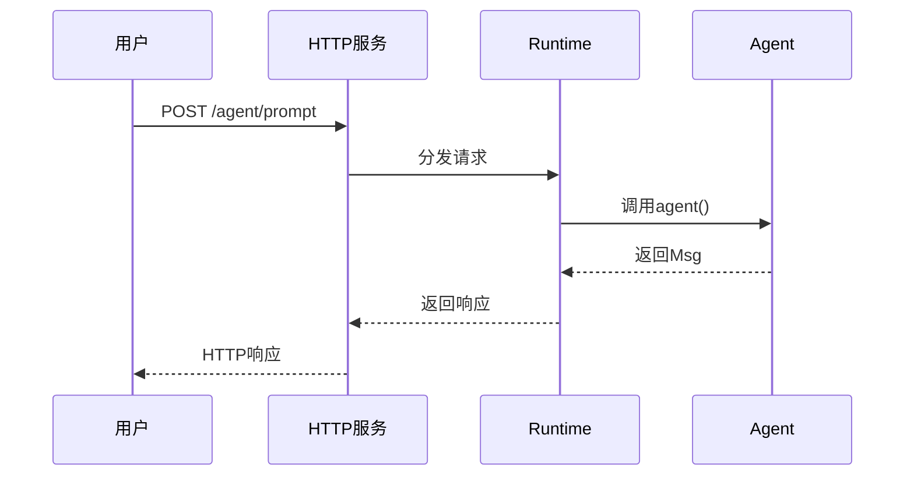

# 7-2 追踪Runtime的工作流程

> **目标**：理解从代码到服务的完整流程

---

## 🎯 这一章的目标

学完之后，你能：
- 理解Runtime的启动流程
- 画出从代码到服务的完整链路
- 调试Runtime相关问题

---

## 🔍 Runtime启动流程

### 第一步：定义Agent

```
┌─────────────────────────────────────────────────────────────┐
│  Python代码                                                │
│                                                             │
│  agent = ReActAgent(                                        │
│      name="Assistant",                                      │
│      model=OpenAIChatModel(...)                             │
│  )                                                          │
└─────────────────────────────────────────────────────────────┘
```

### 第二步：创建Runtime

```
┌─────────────────────────────────────────────────────────────┐
│  Runtime打包                                                │
│                                                             │
│  runtime = AgentScopeRuntime(                                │
│      agents=[agent],                                        │
│      host="0.0.0.0",                                      │
│      port=5000                                              │
│  )                                                          │
└─────────────────────────────────────────────────────────────┘
```

### 第三步：启动服务

```
┌─────────────────────────────────────────────────────────────┐
│  启动HTTP服务                                               │
│                                                             │
│  runtime.start()                                            │
│                                                             │
│  服务就绪: http://localhost:5000                           │
└─────────────────────────────────────────────────────────────┘
```

### 第四步：接收请求

```
┌─────────────────────────────────────────────────────────────┐
│  HTTP请求                                                   │
│                                                             │
│  POST /agent/Assistant                                      │
│  Body: {"prompt": "你好"}                                 │
│                                                             │
│  → Runtime接收请求                                          │
│  → 分发给对应的Agent                                        │
│  → 返回结果                                                  │
└─────────────────────────────────────────────────────────────┘
```

---

## 📊 完整链路图



---

## 🎯 思考题

<details>
<summary>点击查看答案</summary>

1. **Runtime启动后发生了什么？**
   - 启动HTTP服务器
   - 注册路由
   - 等待请求

2. **请求是怎么分发给Agent的？**
   - 根据URL路径
   - Runtime路由到对应Agent

</details>

---

★ **Insight** ─────────────────────────────────────
- **Runtime = HTTP服务器**，接收请求并分发给Agent
- 请求→Runtime→Agent→返回，是完整链路
─────────────────────────────────────────────────
