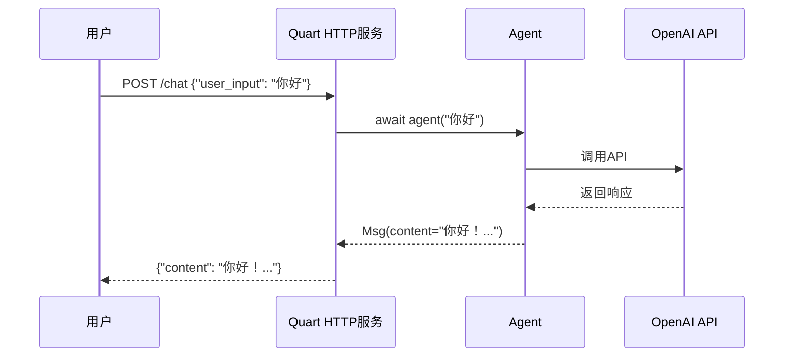

# 7-2 追踪HTTP服务的工作流程

> **目标**：理解从代码到服务的完整流程

---

## 🎯 这一章的目标

学完之后，你能：
- 理解HTTP服务的启动流程
- 画出从代码到服务的完整链路
- 调试HTTP服务相关问题

---

## 🔍 HTTP服务启动流程

### 第一步：定义Agent

```
┌─────────────────────────────────────────────────────────────┐
│  Python代码                                                │
│                                                             │
│  agent = ReActAgent(                                        │
│      name="Assistant",                                      │
│      model=OpenAIChatModel(...)                             │
│  )                                                          │
└─────────────────────────────────────────────────────────────┘
```

### 第二步：创建Quart应用

```
┌─────────────────────────────────────────────────────────────┐
│  Quart应用                                                  │
│                                                             │
│  app = Quart(__name__)                                     │
│                                                             │
│  @app.route("/chat", methods=["POST"])                    │
│  async def chat():                                          │
│      ...                                                    │
└─────────────────────────────────────────────────────────────┘
```

### 第三步：启动服务

```
┌─────────────────────────────────────────────────────────────┐
│  启动HTTP服务                                               │
│                                                             │
│  app.run(port=5000, debug=True)                           │
│                                                             │
│  服务就绪: http://localhost:5000                           │
└─────────────────────────────────────────────────────────────┘
```

### 第四步：接收请求

```
┌─────────────────────────────────────────────────────────────┐
│  HTTP请求                                                   │
│                                                             │
│  POST /chat                                                │
│  Body: {"user_input": "你好"}                            │
│                                                             │
│  → Quart接收请求                                           │
│  → 分发给对应的Agent                                        │
│  → 返回结果                                                  │
└─────────────────────────────────────────────────────────────┘
```

---

## 📊 完整链路图



---

## 🔬 关键代码段解析

### 代码段1：完整HTTP服务代码

```python showLineNumbers
# run_agent.py
import os
from quart import Quart, Response, request

from agentscope.agent import ReActAgent
from agentscope.model import OpenAIChatModel
from agentscope.formatter import OpenAIChatFormatter

app = Quart(__name__)

# 模块级Agent（只创建一次）
agent = ReActAgent(
    name="Assistant",
    model=OpenAIChatModel(
        api_key=os.environ.get("OPENAI_API_KEY"),
        model="gpt-4"
    ),
    sys_prompt="你是一个友好的AI助手。",
    formatter=OpenAIChatFormatter()
)

@app.route("/chat", methods=["POST"])
async def chat():
    # 1. 获取用户输入
    data = await request.get_json()
    user_input = data.get("user_input", "")

    # 2. 调用Agent处理
    response = await agent(user_input)

    # 3. 返回响应
    return {"content": response.content}

if __name__ == "__main__":
    app.run(port=5000, debug=True)
```

**流程说明**：

| 步骤 | 代码 | 说明 |
|------|------|------|
| 1 | `await request.get_json()` | 获取POST请求的JSON数据 |
| 2 | `await agent(user_input)` | 调用Agent处理消息 |
| 3 | `return {"content": ...}` | 返回JSON响应 |

---

### 代码段2：调试技巧

```python
# 开启debug模式，查看详细日志
app.run(port=5000, debug=True)

# 查看请求日志
# 127.0.0.1 - - [08/May/2026 10:00:00] "POST /chat HTTP/1.1" 200 -
```

---

## 🎯 思考题

<details>
<summary>点击查看答案</summary>

1. **HTTP服务启动后发生了什么？**
   - 启动HTTP服务器
   - 注册路由
   - 等待请求

2. **请求是怎么分发给Agent的？**
   - 根据URL路径
   - Quart路由到对应处理函数

</details>

---

★ **Insight** ─────────────────────────────────────
- **Quart = HTTP服务器**，接收请求并分发给Agent
- 请求→Quart→Agent→返回，是完整链路
─────────────────────────────────────────────────
